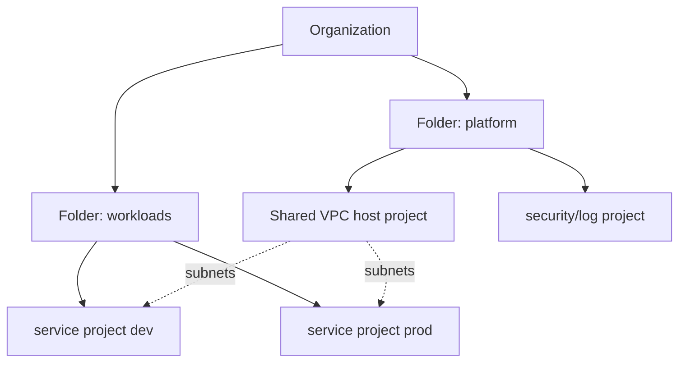

# Google Cloud Platform

<!-- child-topic-toc:start -->
## Table of contents and deeper notes

This parent note explains how the child topics work together. Follow each child link for the deeper mechanism, real commands/configuration, hands-on practice, authoritative documentation, and its local interview bank.

- [GCP compute and containers](gcp-compute-and-containers/README.md) — [questions and answers](gcp-compute-and-containers/questions-and-answers.md)
- [GCP foundations and governance](gcp-foundations-and-governance/README.md) — [questions and answers](gcp-foundations-and-governance/questions-and-answers.md)
- [GCP load balancing](gcp-load-balancing/README.md) — [questions and answers](gcp-load-balancing/questions-and-answers.md)
- [GCP messaging and data processing](gcp-messaging-and-data-processing/README.md) — [questions and answers](gcp-messaging-and-data-processing/questions-and-answers.md)
- [GCP networking](gcp-networking/README.md) — [questions and answers](gcp-networking/questions-and-answers.md)
- [GCP operations, security and cost](gcp-operations-security-and-cost/README.md) — [questions and answers](gcp-operations-security-and-cost/questions-and-answers.md)
- [GCP storage and databases](gcp-storage-and-databases/README.md) — [questions and answers](gcp-storage-and-databases/questions-and-answers.md)
- [Vertex AI and GCP AI platform](vertex-ai-and-gcp-ai-platform/README.md) — [questions and answers](vertex-ai-and-gcp-ai-platform/questions-and-answers.md)
<!-- child-topic-toc:end -->
## Resource and identity mental model

Organization → folders → projects → resources. Policies inherit downward; projects are practical API/quota/billing/isolation boundaries. IAM binds principals to roles on resources; service accounts are workload identities, not human groups. Prefer user federation and Workload Identity Federation/managed workload identity over service-account keys. Organization policies constrain capabilities; VPC Service Controls add data-exfiltration perimeters for supported services but do not replace IAM.



```bash
gcloud auth list
gcloud config configurations list
gcloud config set project PROJECT_ID
gcloud projects describe PROJECT_ID
gcloud resource-manager org-policies list --project=PROJECT_ID
gcloud projects get-iam-policy PROJECT_ID --format=json | jq
gcloud asset search-all-resources --scope=projects/PROJECT_NUMBER
gcloud services list --enabled
```

## Networking and load balancing

VPCs are global; subnets are regional. Routes and hierarchical/VPC firewall rules govern paths. Shared VPC centralizes networks while service projects own workloads. Cloud NAT supplies managed outbound translation; Private Google Access reaches Google APIs from private addresses; Private Service Connect exposes managed/published services privately. VPC peering exchanges routes non-transitively; Network Connectivity Center, Cloud VPN and Interconnect handle hub/hybrid patterns. Cloud DNS and forwarding policies implement naming.

```bash
gcloud compute networks describe NETWORK
gcloud compute networks subnets list --network=NETWORK
gcloud compute routes list --filter='network:NETWORK'
gcloud compute firewall-rules list --filter='network:NETWORK'
gcloud compute routers nats describe NAT --router=ROUTER --region=REGION
gcloud compute network-endpoint-groups list
gcloud compute backend-services get-health BACKEND --global
gcloud compute forwarding-rules list
```

Google Cloud load balancing is built from forwarding rule/IP → target proxy/URL map (proxy L7/L4 products) → backend service → instance/endpoint groups → health check. Product names distinguish global/regional, external/internal, application/proxy/passthrough. Select by protocol, client/source IP, global anycast, TLS, backend type and locality; verify current product feature matrix.

Cloud Armor protects supported L7 services, Cloud CDN caches through external Application Load Balancing, and managed certificates automate supported TLS. Diagnose DNS → forwarding rule → proxy/certificate/URL map → backend service/health → NEG/instance → firewall/route → app.

## Compute, containers and serverless

Compute Engine machine series differ by CPU/memory/accelerator/local SSD/network. Instance templates plus Managed Instance Groups deliver autoscaling, autohealing and rolling/canary update. Spot VMs can be preempted; reservations address capacity. Shielded/confidential features and OS Login/managed instance access reduce host risk.

```bash
gcloud compute instances describe VM --zone=ZONE
gcloud compute instance-groups managed describe MIG --zone=ZONE
gcloud compute instance-groups managed list-errors MIG --zone=ZONE
gcloud compute reservations list
gcloud compute accelerator-types list --filter='zone:ZONE'
```

GKE Standard exposes nodes/control choices; Autopilot manages more node operations under constraints. Use Workload Identity Federation for GKE, release channels, private clusters, authorized networks where relevant, Binary Authorization/policy, node auto-provisioning/ComputeClasses, gateway/ingress, CSI and managed observability. Artifact Registry stores OCI/packages with IAM, scanning, cleanup and regional strategy. Cloud Run handles request/event containers with concurrency, min/max instances, revision traffic and identity.

```bash
gcloud container clusters describe CLUSTER --region=REGION
gcloud container operations list --location=REGION
gcloud container node-pools list --cluster=CLUSTER --region=REGION
gcloud artifacts docker images list REGION-docker.pkg.dev/PROJECT/REPO --include-tags
gcloud run services describe SERVICE --region=REGION
gcloud run services update-traffic SERVICE --to-revisions REVISION=10 --region=REGION
```

## Storage and databases

Cloud Storage is object storage with classes, lifecycle, versioning, retention/holds, IAM and replication/location choices. Persistent Disk/Hyperdisk are block devices with different performance/provisioning; Local SSD is ephemeral. Filestore provides NFS tiers. Cloud SQL manages relational engines; AlloyDB targets PostgreSQL-compatible performance/availability; Spanner is distributed relational with horizontal scale/strong consistency; Firestore is document; Bigtable wide-column; BigQuery analytical warehouse; Memorystore cache.

Select from transaction/query/key model and operational needs, not “managed” alone. Design connections/pooling, backups/PITR/export, multi-zone/region failover, replication lag, schema/index migration, quotas and cost. Prove restore.

```bash
gcloud storage buckets describe gs://BUCKET
gcloud storage ls -a gs://BUCKET/PREFIX
gcloud sql instances describe INSTANCE
gcloud spanner instances describe INSTANCE
gcloud bigtable instances describe INSTANCE
bq show --format=prettyjson PROJECT:DATASET
```

## Messaging, operations, security and cost

Pub/Sub provides at-least-once messaging by default with subscriptions, ack deadlines, retention, ordering keys and dead-letter policy; consumers remain idempotent. Dataflow processes batch/stream, Dataproc manages Spark/Hadoop, Composer manages Airflow, Eventarc routes events and Workflows orchestrates APIs.

Cloud Monitoring/Logging/Trace/Profiler and Audit Logs provide signals; Security Command Center aggregates findings; Secret Manager/KMS control secrets/keys; Binary Authorization gates artifacts; Policy Controller enforces Kubernetes policy. Billing exports to BigQuery support allocation; budgets alert but are not always hard stops; Recommender suggestions need SLO/context review.

```bash
gcloud pubsub subscriptions describe SUB
gcloud pubsub subscriptions seek SUB --time=TIMESTAMP
gcloud logging read 'resource.type="k8s_container" severity>=ERROR' --limit=50 --format=json
gcloud monitoring policies list
gcloud secrets versions access latest --secret=NAME
gcloud kms keys list --keyring=RING --location=LOCATION
gcloud billing budgets list --billing-account=ACCOUNT
```

## Common traps and revision

- A role binding grants permissions; a service-account key is a credential and usually avoidable.
- Shared VPC centralizes network ownership; it does not make service projects one security domain.
- Global VPC does not mean every subnet/resource is global.
- Health check source ranges/firewalls and backend readiness are frequent LB failures.
- Budget alerts do not guarantee spend prevention; combine quotas/policies/platform controls.
- GKE Autopilot/managed services reduce, not eliminate, workload/security/reliability responsibility.

<!-- generated-topic-index:start -->
## Deep topic branches

- [GCP foundations and governance](gcp-foundations-and-governance/README.md) — [Q&A](gcp-foundations-and-governance/questions-and-answers.md)
- [GCP networking](gcp-networking/README.md) — [Q&A](gcp-networking/questions-and-answers.md)
- [GCP load balancing](gcp-load-balancing/README.md) — [Q&A](gcp-load-balancing/questions-and-answers.md)
- [GCP compute and containers](gcp-compute-and-containers/README.md) — [Q&A](gcp-compute-and-containers/questions-and-answers.md)
- [GCP storage and databases](gcp-storage-and-databases/README.md) — [Q&A](gcp-storage-and-databases/questions-and-answers.md)
- [GCP messaging and data processing](gcp-messaging-and-data-processing/README.md) — [Q&A](gcp-messaging-and-data-processing/questions-and-answers.md)
- [Vertex AI and GCP AI platform](vertex-ai-and-gcp-ai-platform/README.md) — [Q&A](vertex-ai-and-gcp-ai-platform/questions-and-answers.md)
- [GCP operations, security and cost](gcp-operations-security-and-cost/README.md) — [Q&A](gcp-operations-security-and-cost/questions-and-answers.md)
<!-- generated-topic-index:end -->
