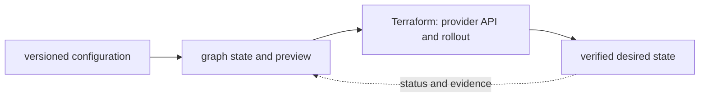

# Terraform

<!-- chapter-guide:start -->
> **Step 179 of 373 — 09.01**
>
> **Builds on:** [Infrastructure as Code and delivery](../README.md)
>
> **Now:** Learn **Terraform** from its mental model through production ownership.
>
> **Then:** Rehearse the linked questions and continue to [Terraform fundamentals](01-terraform-fundamentals/README.md).
<!-- chapter-guide:end -->

> [Interview questions and answers](questions-and-answers.md) · [Master curriculum](../../curriculum/master-curriculum.txt) · Official starting point: <https://developer.hashicorp.com/terraform/docs>

## Explanation

### What it is and why it exists

**Terraform** is easiest to understand as one part of a larger path. The subject turns version-controlled intent into a reviewed state transition. A tool parses configuration, resolves dependencies, compares desired and recorded/remote state, proposes a change set and calls provider APIs after approval.

The chapter focuses on Terraform state mapping, configuration-to-resource identity and module composition, HCL, Providers, Resources. These are connected mechanisms, not vocabulary to memorize. Integrate every part of Terraform into one secure, reliable, observable, supportable and cost-aware production capability The explanations below first build the simple model, then add the exact system behavior and production consequences.

### History and evolution

Infrastructure automation evolved from shell scripts and host configuration tools into declarative resource graphs, remote state and reviewed delivery pipelines. Terraform popularized provider-based declarative provisioning from 2014, while later tools and GitOps connected infrastructure changes to normal software review, testing and promotion practices.

In this chapter, **Terraform** is the next layer of that evolution. Its modern purpose is to integrate every part of Terraform into one secure, reliable, observable, supportable and cost-aware production capability. The exact product surface may change by version, but the underlying state, request path and failure boundaries remain the durable ideas to learn.

### How it works: the end-to-end path



The path begins with a concrete input: a user request, configuration revision, packet, job, model request or operational symptom. The relevant subsystem validates that input, reads current state, performs or schedules work and exposes a result. Some transitions complete before the caller receives a response; others acknowledge the request and converge later. That difference determines whether a timeout means "nothing happened," "the operation failed," or "the final result is still unknown."

For **Terraform**, the important stages are Terraform state mapping, configuration-to-resource identity and module composition, HCL, Providers, Resources, Data sources, Variables, Local values, Outputs, Expressions, Functions, Dependency graph, Initialization, Provider installation, Refresh, Plan, Apply, Destroy, Saved plans, Exit codes, Plan review, State purpose, Resource addressing, Remote state, Backends, State locking, Encryption, Sensitive state, State recovery, State migration, State corruption, Create, Update, Replace, Destroy, create_before_destroy, prevent_destroy, ignore_changes, replace_triggered_by, Tainted resources, Forced replacement, Root modules, Child modules, Inputs and outputs, Module composition, Module versioning, Module registries, Module boundaries, Opinionated versus flexible modules, count, for_each, Dynamic blocks, for expressions, Conditional expressions, Type constraints, Optional attributes, Validation, Preconditions, Postconditions, Import blocks, terraform import, Moved blocks, Removed blocks, Resource renaming, Module extraction, State movement, Zero-downtime refactoring, Separate state files, Directory-based environments, Workspaces, Account and project separation, Environment promotion, Variable management, terraform validate, terraform test, Unit-style module tests, Integration tests, Policy testing, Terratest, Static analysis, Security scanning, Formatting, Validation, Plan generation, Plan review, Approval, Apply, OIDC authentication, Drift detection, Scheduled plans, Failure recovery, Credential handling, Secret values, State protection, Provider verification, Module supply chain, Policy as code, Least-privilege deployment roles. Their boundaries explain where identity is checked, where state becomes durable, where capacity is consumed, how failures propagate and which signal can distinguish one layer from another. A production explanation should follow the actual path rather than treating each term as an isolated definition.


### Core concepts explained in detail

#### Terraform state mapping, configuration-to-resource identity and module composition

**What it is.** The term Terraform state mapping, configuration-to-resource identity and module composition is a trust-control mechanism that identifies an actor or protected asset and enforces which action is allowed under explicit context, with audit, rotation, revocation and recovery behavior within Terraform.

**Junior mental model.** Think of this as a badge plus a checkpoint: identity says who or what is acting, while policy decides whether that actor may perform this exact action on this exact target under the current conditions.

**How it works.** At runtime a caller presents or derives an identity, the enforcement point gathers identity, resource and request context, and applicable rules produce allow or deny. The effective decision is the intersection of all guardrails; encryption protects bytes but does not replace authorization, and audit records explain which decision was made.

**What it looks like in production.** Healthy evidence includes a short-lived attributable identity, narrowly scoped access and an audit event for the intended resource. Failures commonly come from expired credentials, mismatched trust, an overriding deny, wrong resource scope or key/certificate lifecycle problems; widening access may hide the cause while creating a breach path.

#### HCL

**What it is.** The term HCL refers to a configuration, state or promotion mechanism that moves a reviewed revision toward effective runtime state within Terraform.

**Junior mental model.** Treat delivery like a controlled assembly line: reviewed source becomes an immutable artifact, the artifact is promoted without being rebuilt, and each environment records exactly which revision is effective.

**How it works.** The lifecycle begins with versioned intent, validates syntax and policy, resolves dependencies, builds or selects immutable inputs, produces a diff or release plan, changes the target in bounded waves, and records status. Reconciliation keeps desired and observed state aligned; rollback is another tested state transition, not merely a command name.

**What it looks like in production.** Healthy evidence links source revision, review, test, artifact digest, signer/provenance, deployment target and user-facing verification. Mutable tags, environment-specific rebuilds, unpinned dependencies, non-idempotent migrations and controllers fighting emergency changes are recurring failure modes.

#### Providers

**What it is.** The term Providers refers to a configuration, state or promotion mechanism that moves a reviewed revision toward effective runtime state within Terraform.

**Junior mental model.** Treat delivery like a controlled assembly line: reviewed source becomes an immutable artifact, the artifact is promoted without being rebuilt, and each environment records exactly which revision is effective.

**How it works.** The lifecycle begins with versioned intent, validates syntax and policy, resolves dependencies, builds or selects immutable inputs, produces a diff or release plan, changes the target in bounded waves, and records status. Reconciliation keeps desired and observed state aligned; rollback is another tested state transition, not merely a command name.

**What it looks like in production.** Healthy evidence links source revision, review, test, artifact digest, signer/provenance, deployment target and user-facing verification. Mutable tags, environment-specific rebuilds, unpinned dependencies, non-idempotent migrations and controllers fighting emergency changes are recurring failure modes.

#### Resources

**What it is.** The term Resources refers to a configuration, state or promotion mechanism that moves a reviewed revision toward effective runtime state within Terraform.

**Junior mental model.** Treat delivery like a controlled assembly line: reviewed source becomes an immutable artifact, the artifact is promoted without being rebuilt, and each environment records exactly which revision is effective.

**How it works.** The lifecycle begins with versioned intent, validates syntax and policy, resolves dependencies, builds or selects immutable inputs, produces a diff or release plan, changes the target in bounded waves, and records status. Reconciliation keeps desired and observed state aligned; rollback is another tested state transition, not merely a command name.

**What it looks like in production.** Healthy evidence links source revision, review, test, artifact digest, signer/provenance, deployment target and user-facing verification. Mutable tags, environment-specific rebuilds, unpinned dependencies, non-idempotent migrations and controllers fighting emergency changes are recurring failure modes.

#### Data sources

**What it is.** The term Data sources refers to a configuration, state or promotion mechanism that moves a reviewed revision toward effective runtime state within Terraform.

**Junior mental model.** Treat delivery like a controlled assembly line: reviewed source becomes an immutable artifact, the artifact is promoted without being rebuilt, and each environment records exactly which revision is effective.

**How it works.** The lifecycle begins with versioned intent, validates syntax and policy, resolves dependencies, builds or selects immutable inputs, produces a diff or release plan, changes the target in bounded waves, and records status. Reconciliation keeps desired and observed state aligned; rollback is another tested state transition, not merely a command name.

**What it looks like in production.** Healthy evidence links source revision, review, test, artifact digest, signer/provenance, deployment target and user-facing verification. Mutable tags, environment-specific rebuilds, unpinned dependencies, non-idempotent migrations and controllers fighting emergency changes are recurring failure modes.

#### Variables

**What it is.** The term Variables refers to a configuration, state or promotion mechanism that moves a reviewed revision toward effective runtime state within Terraform.

**Junior mental model.** Treat delivery like a controlled assembly line: reviewed source becomes an immutable artifact, the artifact is promoted without being rebuilt, and each environment records exactly which revision is effective.

**How it works.** The lifecycle begins with versioned intent, validates syntax and policy, resolves dependencies, builds or selects immutable inputs, produces a diff or release plan, changes the target in bounded waves, and records status. Reconciliation keeps desired and observed state aligned; rollback is another tested state transition, not merely a command name.

**What it looks like in production.** Healthy evidence links source revision, review, test, artifact digest, signer/provenance, deployment target and user-facing verification. Mutable tags, environment-specific rebuilds, unpinned dependencies, non-idempotent migrations and controllers fighting emergency changes are recurring failure modes.

#### Local values

**What it is.** The term Local values refers to a configuration, state or promotion mechanism that moves a reviewed revision toward effective runtime state within Terraform.

**Junior mental model.** Treat delivery like a controlled assembly line: reviewed source becomes an immutable artifact, the artifact is promoted without being rebuilt, and each environment records exactly which revision is effective.

**How it works.** The lifecycle begins with versioned intent, validates syntax and policy, resolves dependencies, builds or selects immutable inputs, produces a diff or release plan, changes the target in bounded waves, and records status. Reconciliation keeps desired and observed state aligned; rollback is another tested state transition, not merely a command name.

**What it looks like in production.** Healthy evidence links source revision, review, test, artifact digest, signer/provenance, deployment target and user-facing verification. Mutable tags, environment-specific rebuilds, unpinned dependencies, non-idempotent migrations and controllers fighting emergency changes are recurring failure modes.

#### Outputs

**What it is.** The term Outputs refers to a configuration, state or promotion mechanism that moves a reviewed revision toward effective runtime state within Terraform.

**Junior mental model.** Treat delivery like a controlled assembly line: reviewed source becomes an immutable artifact, the artifact is promoted without being rebuilt, and each environment records exactly which revision is effective.

**How it works.** The lifecycle begins with versioned intent, validates syntax and policy, resolves dependencies, builds or selects immutable inputs, produces a diff or release plan, changes the target in bounded waves, and records status. Reconciliation keeps desired and observed state aligned; rollback is another tested state transition, not merely a command name.

**What it looks like in production.** Healthy evidence links source revision, review, test, artifact digest, signer/provenance, deployment target and user-facing verification. Mutable tags, environment-specific rebuilds, unpinned dependencies, non-idempotent migrations and controllers fighting emergency changes are recurring failure modes.

#### Expressions

**What it is.** The term Expressions refers to a configuration, state or promotion mechanism that moves a reviewed revision toward effective runtime state within Terraform.

**Junior mental model.** Treat delivery like a controlled assembly line: reviewed source becomes an immutable artifact, the artifact is promoted without being rebuilt, and each environment records exactly which revision is effective.

**How it works.** The lifecycle begins with versioned intent, validates syntax and policy, resolves dependencies, builds or selects immutable inputs, produces a diff or release plan, changes the target in bounded waves, and records status. Reconciliation keeps desired and observed state aligned; rollback is another tested state transition, not merely a command name.

**What it looks like in production.** Healthy evidence links source revision, review, test, artifact digest, signer/provenance, deployment target and user-facing verification. Mutable tags, environment-specific rebuilds, unpinned dependencies, non-idempotent migrations and controllers fighting emergency changes are recurring failure modes.

#### Functions

**What it is.** The term Functions refers to a configuration, state or promotion mechanism that moves a reviewed revision toward effective runtime state within Terraform.

**Junior mental model.** Treat delivery like a controlled assembly line: reviewed source becomes an immutable artifact, the artifact is promoted without being rebuilt, and each environment records exactly which revision is effective.

**How it works.** The lifecycle begins with versioned intent, validates syntax and policy, resolves dependencies, builds or selects immutable inputs, produces a diff or release plan, changes the target in bounded waves, and records status. Reconciliation keeps desired and observed state aligned; rollback is another tested state transition, not merely a command name.

**What it looks like in production.** Healthy evidence links source revision, review, test, artifact digest, signer/provenance, deployment target and user-facing verification. Mutable tags, environment-specific rebuilds, unpinned dependencies, non-idempotent migrations and controllers fighting emergency changes are recurring failure modes.

#### Dependency graph

**What it is.** The term Dependency graph refers to a configuration, state or promotion mechanism that moves a reviewed revision toward effective runtime state within Terraform.

**Junior mental model.** Treat delivery like a controlled assembly line: reviewed source becomes an immutable artifact, the artifact is promoted without being rebuilt, and each environment records exactly which revision is effective.

**How it works.** The lifecycle begins with versioned intent, validates syntax and policy, resolves dependencies, builds or selects immutable inputs, produces a diff or release plan, changes the target in bounded waves, and records status. Reconciliation keeps desired and observed state aligned; rollback is another tested state transition, not merely a command name.

**What it looks like in production.** Healthy evidence links source revision, review, test, artifact digest, signer/provenance, deployment target and user-facing verification. Mutable tags, environment-specific rebuilds, unpinned dependencies, non-idempotent migrations and controllers fighting emergency changes are recurring failure modes.

#### Initialization

**What it is.** The term Initialization refers to a configuration, state or promotion mechanism that moves a reviewed revision toward effective runtime state within Terraform.

**Junior mental model.** Treat delivery like a controlled assembly line: reviewed source becomes an immutable artifact, the artifact is promoted without being rebuilt, and each environment records exactly which revision is effective.

**How it works.** The lifecycle begins with versioned intent, validates syntax and policy, resolves dependencies, builds or selects immutable inputs, produces a diff or release plan, changes the target in bounded waves, and records status. Reconciliation keeps desired and observed state aligned; rollback is another tested state transition, not merely a command name.

**What it looks like in production.** Healthy evidence links source revision, review, test, artifact digest, signer/provenance, deployment target and user-facing verification. Mutable tags, environment-specific rebuilds, unpinned dependencies, non-idempotent migrations and controllers fighting emergency changes are recurring failure modes.

#### Provider installation

**What it is.** The term Provider installation refers to a configuration, state or promotion mechanism that moves a reviewed revision toward effective runtime state within Terraform.

**Junior mental model.** Treat delivery like a controlled assembly line: reviewed source becomes an immutable artifact, the artifact is promoted without being rebuilt, and each environment records exactly which revision is effective.

**How it works.** The lifecycle begins with versioned intent, validates syntax and policy, resolves dependencies, builds or selects immutable inputs, produces a diff or release plan, changes the target in bounded waves, and records status. Reconciliation keeps desired and observed state aligned; rollback is another tested state transition, not merely a command name.

**What it looks like in production.** Healthy evidence links source revision, review, test, artifact digest, signer/provenance, deployment target and user-facing verification. Mutable tags, environment-specific rebuilds, unpinned dependencies, non-idempotent migrations and controllers fighting emergency changes are recurring failure modes.

#### Refresh

**What it is.** The term Refresh refers to a configuration, state or promotion mechanism that moves a reviewed revision toward effective runtime state within Terraform.

**Junior mental model.** Treat delivery like a controlled assembly line: reviewed source becomes an immutable artifact, the artifact is promoted without being rebuilt, and each environment records exactly which revision is effective.

**How it works.** The lifecycle begins with versioned intent, validates syntax and policy, resolves dependencies, builds or selects immutable inputs, produces a diff or release plan, changes the target in bounded waves, and records status. Reconciliation keeps desired and observed state aligned; rollback is another tested state transition, not merely a command name.

**What it looks like in production.** Healthy evidence links source revision, review, test, artifact digest, signer/provenance, deployment target and user-facing verification. Mutable tags, environment-specific rebuilds, unpinned dependencies, non-idempotent migrations and controllers fighting emergency changes are recurring failure modes.

#### Plan

**What it is.** The term Plan refers to a configuration, state or promotion mechanism that moves a reviewed revision toward effective runtime state within Terraform.

**Junior mental model.** Treat delivery like a controlled assembly line: reviewed source becomes an immutable artifact, the artifact is promoted without being rebuilt, and each environment records exactly which revision is effective.

**How it works.** The lifecycle begins with versioned intent, validates syntax and policy, resolves dependencies, builds or selects immutable inputs, produces a diff or release plan, changes the target in bounded waves, and records status. Reconciliation keeps desired and observed state aligned; rollback is another tested state transition, not merely a command name.

**What it looks like in production.** Healthy evidence links source revision, review, test, artifact digest, signer/provenance, deployment target and user-facing verification. Mutable tags, environment-specific rebuilds, unpinned dependencies, non-idempotent migrations and controllers fighting emergency changes are recurring failure modes.

#### Apply

**What it is.** The term Apply refers to a configuration, state or promotion mechanism that moves a reviewed revision toward effective runtime state within Terraform.

**Junior mental model.** Treat delivery like a controlled assembly line: reviewed source becomes an immutable artifact, the artifact is promoted without being rebuilt, and each environment records exactly which revision is effective.

**How it works.** The lifecycle begins with versioned intent, validates syntax and policy, resolves dependencies, builds or selects immutable inputs, produces a diff or release plan, changes the target in bounded waves, and records status. Reconciliation keeps desired and observed state aligned; rollback is another tested state transition, not merely a command name.

**What it looks like in production.** Healthy evidence links source revision, review, test, artifact digest, signer/provenance, deployment target and user-facing verification. Mutable tags, environment-specific rebuilds, unpinned dependencies, non-idempotent migrations and controllers fighting emergency changes are recurring failure modes.

#### Destroy

**What it is.** The term Destroy refers to a configuration, state or promotion mechanism that moves a reviewed revision toward effective runtime state within Terraform.

**Junior mental model.** Treat delivery like a controlled assembly line: reviewed source becomes an immutable artifact, the artifact is promoted without being rebuilt, and each environment records exactly which revision is effective.

**How it works.** The lifecycle begins with versioned intent, validates syntax and policy, resolves dependencies, builds or selects immutable inputs, produces a diff or release plan, changes the target in bounded waves, and records status. Reconciliation keeps desired and observed state aligned; rollback is another tested state transition, not merely a command name.

**What it looks like in production.** Healthy evidence links source revision, review, test, artifact digest, signer/provenance, deployment target and user-facing verification. Mutable tags, environment-specific rebuilds, unpinned dependencies, non-idempotent migrations and controllers fighting emergency changes are recurring failure modes.

#### Saved plans

**What it is.** The term Saved plans refers to a configuration, state or promotion mechanism that moves a reviewed revision toward effective runtime state within Terraform.

**Junior mental model.** Treat delivery like a controlled assembly line: reviewed source becomes an immutable artifact, the artifact is promoted without being rebuilt, and each environment records exactly which revision is effective.

**How it works.** The lifecycle begins with versioned intent, validates syntax and policy, resolves dependencies, builds or selects immutable inputs, produces a diff or release plan, changes the target in bounded waves, and records status. Reconciliation keeps desired and observed state aligned; rollback is another tested state transition, not merely a command name.

**What it looks like in production.** Healthy evidence links source revision, review, test, artifact digest, signer/provenance, deployment target and user-facing verification. Mutable tags, environment-specific rebuilds, unpinned dependencies, non-idempotent migrations and controllers fighting emergency changes are recurring failure modes.

#### Exit codes

**What it is.** The term Exit codes refers to a configuration, state or promotion mechanism that moves a reviewed revision toward effective runtime state within Terraform.

**Junior mental model.** Treat delivery like a controlled assembly line: reviewed source becomes an immutable artifact, the artifact is promoted without being rebuilt, and each environment records exactly which revision is effective.

**How it works.** The lifecycle begins with versioned intent, validates syntax and policy, resolves dependencies, builds or selects immutable inputs, produces a diff or release plan, changes the target in bounded waves, and records status. Reconciliation keeps desired and observed state aligned; rollback is another tested state transition, not merely a command name.

**What it looks like in production.** Healthy evidence links source revision, review, test, artifact digest, signer/provenance, deployment target and user-facing verification. Mutable tags, environment-specific rebuilds, unpinned dependencies, non-idempotent migrations and controllers fighting emergency changes are recurring failure modes.

#### Plan review

**What it is.** The term Plan review refers to a configuration, state or promotion mechanism that moves a reviewed revision toward effective runtime state within Terraform.

**Junior mental model.** Treat delivery like a controlled assembly line: reviewed source becomes an immutable artifact, the artifact is promoted without being rebuilt, and each environment records exactly which revision is effective.

**How it works.** The lifecycle begins with versioned intent, validates syntax and policy, resolves dependencies, builds or selects immutable inputs, produces a diff or release plan, changes the target in bounded waves, and records status. Reconciliation keeps desired and observed state aligned; rollback is another tested state transition, not merely a command name.

**What it looks like in production.** Healthy evidence links source revision, review, test, artifact digest, signer/provenance, deployment target and user-facing verification. Mutable tags, environment-specific rebuilds, unpinned dependencies, non-idempotent migrations and controllers fighting emergency changes are recurring failure modes.

#### State purpose

**What it is.** The term State purpose refers to a configuration, state or promotion mechanism that moves a reviewed revision toward effective runtime state within Terraform.

**Junior mental model.** Think of this as a library catalog plus shelves: metadata says what should exist and where, while physical or remote storage holds the bytes. A successful write is not necessarily durable, replicated, backed up or restorable under the same contract.

**How it works.** A write normally passes validation and authorization, enters a buffer or transaction, reaches a durable medium, and may then replicate or become visible to readers. Caches and indexes accelerate access but introduce freshness and eviction behavior; snapshots preserve a point-in-time representation but application consistency depends on write ordering.

**What it looks like in production.** Healthy evidence combines capacity, latency, error, replication and integrity signals with a tested read or restore. Typical failures include exhausted bytes or inodes, throttling, stale replicas, corrupt metadata, topology mismatch, lost encryption keys and backups that exist but cannot reconstruct the application within RPO/RTO.

#### Resource addressing

**What it is.** The term Resource addressing refers to a configuration, state or promotion mechanism that moves a reviewed revision toward effective runtime state within Terraform.

**Junior mental model.** Treat delivery like a controlled assembly line: reviewed source becomes an immutable artifact, the artifact is promoted without being rebuilt, and each environment records exactly which revision is effective.

**How it works.** The lifecycle begins with versioned intent, validates syntax and policy, resolves dependencies, builds or selects immutable inputs, produces a diff or release plan, changes the target in bounded waves, and records status. Reconciliation keeps desired and observed state aligned; rollback is another tested state transition, not merely a command name.

**What it looks like in production.** Healthy evidence links source revision, review, test, artifact digest, signer/provenance, deployment target and user-facing verification. Mutable tags, environment-specific rebuilds, unpinned dependencies, non-idempotent migrations and controllers fighting emergency changes are recurring failure modes.

#### Remote state

**What it is.** The term Remote state refers to a configuration, state or promotion mechanism that moves a reviewed revision toward effective runtime state within Terraform.

**Junior mental model.** Think of this as a library catalog plus shelves: metadata says what should exist and where, while physical or remote storage holds the bytes. A successful write is not necessarily durable, replicated, backed up or restorable under the same contract.

**How it works.** A write normally passes validation and authorization, enters a buffer or transaction, reaches a durable medium, and may then replicate or become visible to readers. Caches and indexes accelerate access but introduce freshness and eviction behavior; snapshots preserve a point-in-time representation but application consistency depends on write ordering.

**What it looks like in production.** Healthy evidence combines capacity, latency, error, replication and integrity signals with a tested read or restore. Typical failures include exhausted bytes or inodes, throttling, stale replicas, corrupt metadata, topology mismatch, lost encryption keys and backups that exist but cannot reconstruct the application within RPO/RTO.

#### Backends

**What it is.** The term Backends refers to a configuration, state or promotion mechanism that moves a reviewed revision toward effective runtime state within Terraform.

**Junior mental model.** Treat delivery like a controlled assembly line: reviewed source becomes an immutable artifact, the artifact is promoted without being rebuilt, and each environment records exactly which revision is effective.

**How it works.** The lifecycle begins with versioned intent, validates syntax and policy, resolves dependencies, builds or selects immutable inputs, produces a diff or release plan, changes the target in bounded waves, and records status. Reconciliation keeps desired and observed state aligned; rollback is another tested state transition, not merely a command name.

**What it looks like in production.** Healthy evidence links source revision, review, test, artifact digest, signer/provenance, deployment target and user-facing verification. Mutable tags, environment-specific rebuilds, unpinned dependencies, non-idempotent migrations and controllers fighting emergency changes are recurring failure modes.

#### State locking

**What it is.** The term State locking refers to a configuration, state or promotion mechanism that moves a reviewed revision toward effective runtime state within Terraform.

**Junior mental model.** Think of this as a library catalog plus shelves: metadata says what should exist and where, while physical or remote storage holds the bytes. A successful write is not necessarily durable, replicated, backed up or restorable under the same contract.

**How it works.** A write normally passes validation and authorization, enters a buffer or transaction, reaches a durable medium, and may then replicate or become visible to readers. Caches and indexes accelerate access but introduce freshness and eviction behavior; snapshots preserve a point-in-time representation but application consistency depends on write ordering.

**What it looks like in production.** Healthy evidence combines capacity, latency, error, replication and integrity signals with a tested read or restore. Typical failures include exhausted bytes or inodes, throttling, stale replicas, corrupt metadata, topology mismatch, lost encryption keys and backups that exist but cannot reconstruct the application within RPO/RTO.

#### Encryption

**What it is.** The term Encryption refers to a configuration, state or promotion mechanism that moves a reviewed revision toward effective runtime state within Terraform.

**Junior mental model.** Think of this as a badge plus a checkpoint: identity says who or what is acting, while policy decides whether that actor may perform this exact action on this exact target under the current conditions.

**How it works.** At runtime a caller presents or derives an identity, the enforcement point gathers identity, resource and request context, and applicable rules produce allow or deny. The effective decision is the intersection of all guardrails; encryption protects bytes but does not replace authorization, and audit records explain which decision was made.

**What it looks like in production.** Healthy evidence includes a short-lived attributable identity, narrowly scoped access and an audit event for the intended resource. Failures commonly come from expired credentials, mismatched trust, an overriding deny, wrong resource scope or key/certificate lifecycle problems; widening access may hide the cause while creating a breach path.

#### Sensitive state

**What it is.** The term Sensitive state refers to a configuration, state or promotion mechanism that moves a reviewed revision toward effective runtime state within Terraform.

**Junior mental model.** Think of this as a library catalog plus shelves: metadata says what should exist and where, while physical or remote storage holds the bytes. A successful write is not necessarily durable, replicated, backed up or restorable under the same contract.

**How it works.** A write normally passes validation and authorization, enters a buffer or transaction, reaches a durable medium, and may then replicate or become visible to readers. Caches and indexes accelerate access but introduce freshness and eviction behavior; snapshots preserve a point-in-time representation but application consistency depends on write ordering.

**What it looks like in production.** Healthy evidence combines capacity, latency, error, replication and integrity signals with a tested read or restore. Typical failures include exhausted bytes or inodes, throttling, stale replicas, corrupt metadata, topology mismatch, lost encryption keys and backups that exist but cannot reconstruct the application within RPO/RTO.

#### State recovery

**What it is.** Is a controlled state transition requiring inventory, compatibility, protected state, rehearsal, rollback/abort criteria, integrity checks and measured user-facing RPO/RTO or completion.

**Junior mental model.** Failure controls are traffic rules for unhealthy conditions: they bound how long work waits, how often it retries, how much enters the system and what reduced service remains possible.

**How it works.** A caller assigns a deadline and attempt budget, classifies an error, applies bounded backoff with jitter only when retry is safe, and propagates capacity limits upstream. Circuit breakers, bulkheads and load shedding prevent one dependency from consuming every worker; recovery probes and gradual traffic return avoid a second overload.

**What it looks like in production.** Healthy evidence shows bounded queues, stable retry ratios and recovery within an objective. Unbounded retries, identical timeouts at every layer, non-idempotent replays, shared resource pools and failover to an unqualified target commonly turn a small fault into an outage.

#### State migration

**What it is.** Is a controlled state transition requiring inventory, compatibility, protected state, rehearsal, rollback/abort criteria, integrity checks and measured user-facing RPO/RTO or completion.

**Junior mental model.** Treat delivery like a controlled assembly line: reviewed source becomes an immutable artifact, the artifact is promoted without being rebuilt, and each environment records exactly which revision is effective.

**How it works.** The lifecycle begins with versioned intent, validates syntax and policy, resolves dependencies, builds or selects immutable inputs, produces a diff or release plan, changes the target in bounded waves, and records status. Reconciliation keeps desired and observed state aligned; rollback is another tested state transition, not merely a command name.

**What it looks like in production.** Healthy evidence links source revision, review, test, artifact digest, signer/provenance, deployment target and user-facing verification. Mutable tags, environment-specific rebuilds, unpinned dependencies, non-idempotent migrations and controllers fighting emergency changes are recurring failure modes.

#### State corruption

**What it is.** The term State corruption refers to a configuration, state or promotion mechanism that moves a reviewed revision toward effective runtime state within Terraform.

**Junior mental model.** Think of this as a library catalog plus shelves: metadata says what should exist and where, while physical or remote storage holds the bytes. A successful write is not necessarily durable, replicated, backed up or restorable under the same contract.

**How it works.** A write normally passes validation and authorization, enters a buffer or transaction, reaches a durable medium, and may then replicate or become visible to readers. Caches and indexes accelerate access but introduce freshness and eviction behavior; snapshots preserve a point-in-time representation but application consistency depends on write ordering.

**What it looks like in production.** Healthy evidence combines capacity, latency, error, replication and integrity signals with a tested read or restore. Typical failures include exhausted bytes or inodes, throttling, stale replicas, corrupt metadata, topology mismatch, lost encryption keys and backups that exist but cannot reconstruct the application within RPO/RTO.

#### Create

**What it is.** The term Create refers to a configuration, state or promotion mechanism that moves a reviewed revision toward effective runtime state within Terraform.

**Junior mental model.** Treat delivery like a controlled assembly line: reviewed source becomes an immutable artifact, the artifact is promoted without being rebuilt, and each environment records exactly which revision is effective.

**How it works.** The lifecycle begins with versioned intent, validates syntax and policy, resolves dependencies, builds or selects immutable inputs, produces a diff or release plan, changes the target in bounded waves, and records status. Reconciliation keeps desired and observed state aligned; rollback is another tested state transition, not merely a command name.

**What it looks like in production.** Healthy evidence links source revision, review, test, artifact digest, signer/provenance, deployment target and user-facing verification. Mutable tags, environment-specific rebuilds, unpinned dependencies, non-idempotent migrations and controllers fighting emergency changes are recurring failure modes.

#### Update

**What it is.** The term Update refers to a configuration, state or promotion mechanism that moves a reviewed revision toward effective runtime state within Terraform.

**Junior mental model.** Treat delivery like a controlled assembly line: reviewed source becomes an immutable artifact, the artifact is promoted without being rebuilt, and each environment records exactly which revision is effective.

**How it works.** The lifecycle begins with versioned intent, validates syntax and policy, resolves dependencies, builds or selects immutable inputs, produces a diff or release plan, changes the target in bounded waves, and records status. Reconciliation keeps desired and observed state aligned; rollback is another tested state transition, not merely a command name.

**What it looks like in production.** Healthy evidence links source revision, review, test, artifact digest, signer/provenance, deployment target and user-facing verification. Mutable tags, environment-specific rebuilds, unpinned dependencies, non-idempotent migrations and controllers fighting emergency changes are recurring failure modes.

#### Replace

**What it is.** The term Replace refers to a configuration, state or promotion mechanism that moves a reviewed revision toward effective runtime state within Terraform.

**Junior mental model.** Treat delivery like a controlled assembly line: reviewed source becomes an immutable artifact, the artifact is promoted without being rebuilt, and each environment records exactly which revision is effective.

**How it works.** The lifecycle begins with versioned intent, validates syntax and policy, resolves dependencies, builds or selects immutable inputs, produces a diff or release plan, changes the target in bounded waves, and records status. Reconciliation keeps desired and observed state aligned; rollback is another tested state transition, not merely a command name.

**What it looks like in production.** Healthy evidence links source revision, review, test, artifact digest, signer/provenance, deployment target and user-facing verification. Mutable tags, environment-specific rebuilds, unpinned dependencies, non-idempotent migrations and controllers fighting emergency changes are recurring failure modes.

#### Destroy

**What it is.** The term Destroy refers to a configuration, state or promotion mechanism that moves a reviewed revision toward effective runtime state within Terraform.

**Junior mental model.** Treat delivery like a controlled assembly line: reviewed source becomes an immutable artifact, the artifact is promoted without being rebuilt, and each environment records exactly which revision is effective.

**How it works.** The lifecycle begins with versioned intent, validates syntax and policy, resolves dependencies, builds or selects immutable inputs, produces a diff or release plan, changes the target in bounded waves, and records status. Reconciliation keeps desired and observed state aligned; rollback is another tested state transition, not merely a command name.

**What it looks like in production.** Healthy evidence links source revision, review, test, artifact digest, signer/provenance, deployment target and user-facing verification. Mutable tags, environment-specific rebuilds, unpinned dependencies, non-idempotent migrations and controllers fighting emergency changes are recurring failure modes.

#### create_before_destroy

**What it is.** The term create_before_destroy refers to a configuration, state or promotion mechanism that moves a reviewed revision toward effective runtime state within Terraform.

**Junior mental model.** Treat delivery like a controlled assembly line: reviewed source becomes an immutable artifact, the artifact is promoted without being rebuilt, and each environment records exactly which revision is effective.

**How it works.** The lifecycle begins with versioned intent, validates syntax and policy, resolves dependencies, builds or selects immutable inputs, produces a diff or release plan, changes the target in bounded waves, and records status. Reconciliation keeps desired and observed state aligned; rollback is another tested state transition, not merely a command name.

**What it looks like in production.** Healthy evidence links source revision, review, test, artifact digest, signer/provenance, deployment target and user-facing verification. Mutable tags, environment-specific rebuilds, unpinned dependencies, non-idempotent migrations and controllers fighting emergency changes are recurring failure modes.

#### prevent_destroy

**What it is.** The term prevent_destroy is an asynchronous hand-off mechanism that decouples producers from consumers and therefore must define ordering, retention, delivery, acknowledgement, retry and backlog behavior within Terraform.

**Junior mental model.** Telemetry is the instrument panel, not the system itself. Metrics summarize trends, logs preserve discrete context, traces connect work across boundaries, profiles attribute resource use, and audit events record security-relevant actions.

**How it works.** Instrumentation observes a defined event or state, attaches bounded context, transports the signal, stores it under retention rules and makes it queryable. A useful signal has documented semantics and can distinguish at least two competing explanations; correlation identifiers belong in logs or traces rather than unbounded metric labels.

**What it looks like in production.** Healthy evidence includes coverage of the user journey, known collection delay and actionable SLO or saturation views. Missing telemetry, sampling bias, cardinality explosions, sensitive payload capture and alert thresholds disconnected from user impact are failures of the observability system itself.

#### ignore_changes

**What it is.** The term ignore_changes refers to a configuration, state or promotion mechanism that moves a reviewed revision toward effective runtime state within Terraform.

**Junior mental model.** Treat delivery like a controlled assembly line: reviewed source becomes an immutable artifact, the artifact is promoted without being rebuilt, and each environment records exactly which revision is effective.

**How it works.** The lifecycle begins with versioned intent, validates syntax and policy, resolves dependencies, builds or selects immutable inputs, produces a diff or release plan, changes the target in bounded waves, and records status. Reconciliation keeps desired and observed state aligned; rollback is another tested state transition, not merely a command name.

**What it looks like in production.** Healthy evidence links source revision, review, test, artifact digest, signer/provenance, deployment target and user-facing verification. Mutable tags, environment-specific rebuilds, unpinned dependencies, non-idempotent migrations and controllers fighting emergency changes are recurring failure modes.

#### replace_triggered_by

**What it is.** The term replace_triggered_by refers to a configuration, state or promotion mechanism that moves a reviewed revision toward effective runtime state within Terraform.

**Junior mental model.** Treat delivery like a controlled assembly line: reviewed source becomes an immutable artifact, the artifact is promoted without being rebuilt, and each environment records exactly which revision is effective.

**How it works.** The lifecycle begins with versioned intent, validates syntax and policy, resolves dependencies, builds or selects immutable inputs, produces a diff or release plan, changes the target in bounded waves, and records status. Reconciliation keeps desired and observed state aligned; rollback is another tested state transition, not merely a command name.

**What it looks like in production.** Healthy evidence links source revision, review, test, artifact digest, signer/provenance, deployment target and user-facing verification. Mutable tags, environment-specific rebuilds, unpinned dependencies, non-idempotent migrations and controllers fighting emergency changes are recurring failure modes.

#### Tainted resources

**What it is.** The term Tainted resources refers to a configuration, state or promotion mechanism that moves a reviewed revision toward effective runtime state within Terraform.

**Junior mental model.** Treat delivery like a controlled assembly line: reviewed source becomes an immutable artifact, the artifact is promoted without being rebuilt, and each environment records exactly which revision is effective.

**How it works.** The lifecycle begins with versioned intent, validates syntax and policy, resolves dependencies, builds or selects immutable inputs, produces a diff or release plan, changes the target in bounded waves, and records status. Reconciliation keeps desired and observed state aligned; rollback is another tested state transition, not merely a command name.

**What it looks like in production.** Healthy evidence links source revision, review, test, artifact digest, signer/provenance, deployment target and user-facing verification. Mutable tags, environment-specific rebuilds, unpinned dependencies, non-idempotent migrations and controllers fighting emergency changes are recurring failure modes.

#### Forced replacement

**What it is.** The term Forced replacement refers to a configuration, state or promotion mechanism that moves a reviewed revision toward effective runtime state within Terraform.

**Junior mental model.** Think of a scheduler as allocating seats and time slots: a request states what it needs, available workers advertise capacity, and policy chooses a placement. Requested capacity, usable capacity and completed useful work are different quantities.

**How it works.** Work enters a runnable or pending state, eligibility filters remove incompatible placements, scoring or queue policy selects a worker, and a runtime creates the process and accounts for CPU, memory, devices and time. Autoscaling observes demand, requests more replicas or machines, and waits through provisioning and warm-up before capacity becomes useful.

**What it looks like in production.** Healthy evidence connects queue delay, placement, utilization, throttling, memory/device pressure, runtime readiness and successful work. Fragmentation, inaccurate requests, quota, topology, cold starts and a saturated downstream service can leave capacity apparently free while latency and pending work grow.

#### Root modules

**What it is.** The term Root modules refers to a configuration, state or promotion mechanism that moves a reviewed revision toward effective runtime state within Terraform.

**Junior mental model.** Treat delivery like a controlled assembly line: reviewed source becomes an immutable artifact, the artifact is promoted without being rebuilt, and each environment records exactly which revision is effective.

**How it works.** The lifecycle begins with versioned intent, validates syntax and policy, resolves dependencies, builds or selects immutable inputs, produces a diff or release plan, changes the target in bounded waves, and records status. Reconciliation keeps desired and observed state aligned; rollback is another tested state transition, not merely a command name.

**What it looks like in production.** Healthy evidence links source revision, review, test, artifact digest, signer/provenance, deployment target and user-facing verification. Mutable tags, environment-specific rebuilds, unpinned dependencies, non-idempotent migrations and controllers fighting emergency changes are recurring failure modes.

#### Child modules

**What it is.** The term Child modules refers to a configuration, state or promotion mechanism that moves a reviewed revision toward effective runtime state within Terraform.

**Junior mental model.** Treat delivery like a controlled assembly line: reviewed source becomes an immutable artifact, the artifact is promoted without being rebuilt, and each environment records exactly which revision is effective.

**How it works.** The lifecycle begins with versioned intent, validates syntax and policy, resolves dependencies, builds or selects immutable inputs, produces a diff or release plan, changes the target in bounded waves, and records status. Reconciliation keeps desired and observed state aligned; rollback is another tested state transition, not merely a command name.

**What it looks like in production.** Healthy evidence links source revision, review, test, artifact digest, signer/provenance, deployment target and user-facing verification. Mutable tags, environment-specific rebuilds, unpinned dependencies, non-idempotent migrations and controllers fighting emergency changes are recurring failure modes.

#### Inputs and outputs

**What it is.** The term Inputs and outputs refers to a configuration, state or promotion mechanism that moves a reviewed revision toward effective runtime state within Terraform.

**Junior mental model.** Treat delivery like a controlled assembly line: reviewed source becomes an immutable artifact, the artifact is promoted without being rebuilt, and each environment records exactly which revision is effective.

**How it works.** The lifecycle begins with versioned intent, validates syntax and policy, resolves dependencies, builds or selects immutable inputs, produces a diff or release plan, changes the target in bounded waves, and records status. Reconciliation keeps desired and observed state aligned; rollback is another tested state transition, not merely a command name.

**What it looks like in production.** Healthy evidence links source revision, review, test, artifact digest, signer/provenance, deployment target and user-facing verification. Mutable tags, environment-specific rebuilds, unpinned dependencies, non-idempotent migrations and controllers fighting emergency changes are recurring failure modes.

#### Module composition

**What it is.** The term Module composition refers to a configuration, state or promotion mechanism that moves a reviewed revision toward effective runtime state within Terraform.

**Junior mental model.** Treat delivery like a controlled assembly line: reviewed source becomes an immutable artifact, the artifact is promoted without being rebuilt, and each environment records exactly which revision is effective.

**How it works.** The lifecycle begins with versioned intent, validates syntax and policy, resolves dependencies, builds or selects immutable inputs, produces a diff or release plan, changes the target in bounded waves, and records status. Reconciliation keeps desired and observed state aligned; rollback is another tested state transition, not merely a command name.

**What it looks like in production.** Healthy evidence links source revision, review, test, artifact digest, signer/provenance, deployment target and user-facing verification. Mutable tags, environment-specific rebuilds, unpinned dependencies, non-idempotent migrations and controllers fighting emergency changes are recurring failure modes.

#### Module versioning

**What it is.** The term Module versioning is a delivery mechanism that binds reviewed source to an immutable revision and moves that revision through validation and bounded rollout toward verified runtime state within Terraform.

**Junior mental model.** Treat delivery like a controlled assembly line: reviewed source becomes an immutable artifact, the artifact is promoted without being rebuilt, and each environment records exactly which revision is effective.

**How it works.** The lifecycle begins with versioned intent, validates syntax and policy, resolves dependencies, builds or selects immutable inputs, produces a diff or release plan, changes the target in bounded waves, and records status. Reconciliation keeps desired and observed state aligned; rollback is another tested state transition, not merely a command name.

**What it looks like in production.** Healthy evidence links source revision, review, test, artifact digest, signer/provenance, deployment target and user-facing verification. Mutable tags, environment-specific rebuilds, unpinned dependencies, non-idempotent migrations and controllers fighting emergency changes are recurring failure modes.

#### Module registries

**What it is.** The term Module registries refers to a configuration, state or promotion mechanism that moves a reviewed revision toward effective runtime state within Terraform.

**Junior mental model.** Treat delivery like a controlled assembly line: reviewed source becomes an immutable artifact, the artifact is promoted without being rebuilt, and each environment records exactly which revision is effective.

**How it works.** The lifecycle begins with versioned intent, validates syntax and policy, resolves dependencies, builds or selects immutable inputs, produces a diff or release plan, changes the target in bounded waves, and records status. Reconciliation keeps desired and observed state aligned; rollback is another tested state transition, not merely a command name.

**What it looks like in production.** Healthy evidence links source revision, review, test, artifact digest, signer/provenance, deployment target and user-facing verification. Mutable tags, environment-specific rebuilds, unpinned dependencies, non-idempotent migrations and controllers fighting emergency changes are recurring failure modes.

#### Module boundaries

**What it is.** The term Module boundaries refers to a configuration, state or promotion mechanism that moves a reviewed revision toward effective runtime state within Terraform.

**Junior mental model.** Treat delivery like a controlled assembly line: reviewed source becomes an immutable artifact, the artifact is promoted without being rebuilt, and each environment records exactly which revision is effective.

**How it works.** The lifecycle begins with versioned intent, validates syntax and policy, resolves dependencies, builds or selects immutable inputs, produces a diff or release plan, changes the target in bounded waves, and records status. Reconciliation keeps desired and observed state aligned; rollback is another tested state transition, not merely a command name.

**What it looks like in production.** Healthy evidence links source revision, review, test, artifact digest, signer/provenance, deployment target and user-facing verification. Mutable tags, environment-specific rebuilds, unpinned dependencies, non-idempotent migrations and controllers fighting emergency changes are recurring failure modes.

#### Opinionated versus flexible modules

**What it is.** Is a design comparison: define both sides, contrast mechanism and guarantees, then select using workload, failure, security, ownership and cost evidence rather than preference.

**Junior mental model.** A useful analogy is a parcel journey: the name identifies the destination, routing selects each next hop, policy decides whether the parcel may pass, transport tracks delivery, and the application decides what the contents mean.

**How it works.** A real request crosses several independent states: name resolution returns an address, the source selects a route and source address, link or overlay forwarding reaches the next hop, stateful or stateless policy evaluates the flow, transport establishes communication, and TLS/application protocols negotiate their own contract. The return path must also work.

**What it looks like in production.** Healthy evidence progresses layer by layer: correct name/address, expected route, permitted flow, listening endpoint, successful handshake and valid application response. Timeouts, refusals, resets and protocol errors mean different layers; packet loss, MTU, asymmetric paths, connection-state exhaustion and proxy timeout mismatch are common production failures.

#### count

**What it is.** The term count refers to a configuration, state or promotion mechanism that moves a reviewed revision toward effective runtime state within Terraform.

**Junior mental model.** Treat delivery like a controlled assembly line: reviewed source becomes an immutable artifact, the artifact is promoted without being rebuilt, and each environment records exactly which revision is effective.

**How it works.** The lifecycle begins with versioned intent, validates syntax and policy, resolves dependencies, builds or selects immutable inputs, produces a diff or release plan, changes the target in bounded waves, and records status. Reconciliation keeps desired and observed state aligned; rollback is another tested state transition, not merely a command name.

**What it looks like in production.** Healthy evidence links source revision, review, test, artifact digest, signer/provenance, deployment target and user-facing verification. Mutable tags, environment-specific rebuilds, unpinned dependencies, non-idempotent migrations and controllers fighting emergency changes are recurring failure modes.

#### for_each

**What it is.** The term for_each refers to a configuration, state or promotion mechanism that moves a reviewed revision toward effective runtime state within Terraform.

**Junior mental model.** Treat delivery like a controlled assembly line: reviewed source becomes an immutable artifact, the artifact is promoted without being rebuilt, and each environment records exactly which revision is effective.

**How it works.** The lifecycle begins with versioned intent, validates syntax and policy, resolves dependencies, builds or selects immutable inputs, produces a diff or release plan, changes the target in bounded waves, and records status. Reconciliation keeps desired and observed state aligned; rollback is another tested state transition, not merely a command name.

**What it looks like in production.** Healthy evidence links source revision, review, test, artifact digest, signer/provenance, deployment target and user-facing verification. Mutable tags, environment-specific rebuilds, unpinned dependencies, non-idempotent migrations and controllers fighting emergency changes are recurring failure modes.

#### Dynamic blocks

**What it is.** The term Dynamic blocks refers to a configuration, state or promotion mechanism that moves a reviewed revision toward effective runtime state within Terraform.

**Junior mental model.** Treat delivery like a controlled assembly line: reviewed source becomes an immutable artifact, the artifact is promoted without being rebuilt, and each environment records exactly which revision is effective.

**How it works.** The lifecycle begins with versioned intent, validates syntax and policy, resolves dependencies, builds or selects immutable inputs, produces a diff or release plan, changes the target in bounded waves, and records status. Reconciliation keeps desired and observed state aligned; rollback is another tested state transition, not merely a command name.

**What it looks like in production.** Healthy evidence links source revision, review, test, artifact digest, signer/provenance, deployment target and user-facing verification. Mutable tags, environment-specific rebuilds, unpinned dependencies, non-idempotent migrations and controllers fighting emergency changes are recurring failure modes.

#### for expressions

**What it is.** The term for expressions refers to a configuration, state or promotion mechanism that moves a reviewed revision toward effective runtime state within Terraform.

**Junior mental model.** Treat delivery like a controlled assembly line: reviewed source becomes an immutable artifact, the artifact is promoted without being rebuilt, and each environment records exactly which revision is effective.

**How it works.** The lifecycle begins with versioned intent, validates syntax and policy, resolves dependencies, builds or selects immutable inputs, produces a diff or release plan, changes the target in bounded waves, and records status. Reconciliation keeps desired and observed state aligned; rollback is another tested state transition, not merely a command name.

**What it looks like in production.** Healthy evidence links source revision, review, test, artifact digest, signer/provenance, deployment target and user-facing verification. Mutable tags, environment-specific rebuilds, unpinned dependencies, non-idempotent migrations and controllers fighting emergency changes are recurring failure modes.

#### Conditional expressions

**What it is.** The term Conditional expressions refers to a configuration, state or promotion mechanism that moves a reviewed revision toward effective runtime state within Terraform.

**Junior mental model.** Treat delivery like a controlled assembly line: reviewed source becomes an immutable artifact, the artifact is promoted without being rebuilt, and each environment records exactly which revision is effective.

**How it works.** The lifecycle begins with versioned intent, validates syntax and policy, resolves dependencies, builds or selects immutable inputs, produces a diff or release plan, changes the target in bounded waves, and records status. Reconciliation keeps desired and observed state aligned; rollback is another tested state transition, not merely a command name.

**What it looks like in production.** Healthy evidence links source revision, review, test, artifact digest, signer/provenance, deployment target and user-facing verification. Mutable tags, environment-specific rebuilds, unpinned dependencies, non-idempotent migrations and controllers fighting emergency changes are recurring failure modes.

#### Type constraints

**What it is.** The term Type constraints refers to a configuration, state or promotion mechanism that moves a reviewed revision toward effective runtime state within Terraform.

**Junior mental model.** Treat delivery like a controlled assembly line: reviewed source becomes an immutable artifact, the artifact is promoted without being rebuilt, and each environment records exactly which revision is effective.

**How it works.** The lifecycle begins with versioned intent, validates syntax and policy, resolves dependencies, builds or selects immutable inputs, produces a diff or release plan, changes the target in bounded waves, and records status. Reconciliation keeps desired and observed state aligned; rollback is another tested state transition, not merely a command name.

**What it looks like in production.** Healthy evidence links source revision, review, test, artifact digest, signer/provenance, deployment target and user-facing verification. Mutable tags, environment-specific rebuilds, unpinned dependencies, non-idempotent migrations and controllers fighting emergency changes are recurring failure modes.

#### Optional attributes

**What it is.** The term Optional attributes refers to a configuration, state or promotion mechanism that moves a reviewed revision toward effective runtime state within Terraform.

**Junior mental model.** Treat delivery like a controlled assembly line: reviewed source becomes an immutable artifact, the artifact is promoted without being rebuilt, and each environment records exactly which revision is effective.

**How it works.** The lifecycle begins with versioned intent, validates syntax and policy, resolves dependencies, builds or selects immutable inputs, produces a diff or release plan, changes the target in bounded waves, and records status. Reconciliation keeps desired and observed state aligned; rollback is another tested state transition, not merely a command name.

**What it looks like in production.** Healthy evidence links source revision, review, test, artifact digest, signer/provenance, deployment target and user-facing verification. Mutable tags, environment-specific rebuilds, unpinned dependencies, non-idempotent migrations and controllers fighting emergency changes are recurring failure modes.

#### Validation

**What it is.** The term Validation is a repeatable comparison between defined input, expected or baseline behavior and an acceptance threshold, with recorded environment and artifact revisions so the result can support a release decision within Terraform.

**Junior mental model.** Treat delivery like a controlled assembly line: reviewed source becomes an immutable artifact, the artifact is promoted without being rebuilt, and each environment records exactly which revision is effective.

**How it works.** The lifecycle begins with versioned intent, validates syntax and policy, resolves dependencies, builds or selects immutable inputs, produces a diff or release plan, changes the target in bounded waves, and records status. Reconciliation keeps desired and observed state aligned; rollback is another tested state transition, not merely a command name.

**What it looks like in production.** Healthy evidence links source revision, review, test, artifact digest, signer/provenance, deployment target and user-facing verification. Mutable tags, environment-specific rebuilds, unpinned dependencies, non-idempotent migrations and controllers fighting emergency changes are recurring failure modes.

#### Preconditions

**What it is.** The term Preconditions refers to a configuration, state or promotion mechanism that moves a reviewed revision toward effective runtime state within Terraform.

**Junior mental model.** Treat delivery like a controlled assembly line: reviewed source becomes an immutable artifact, the artifact is promoted without being rebuilt, and each environment records exactly which revision is effective.

**How it works.** The lifecycle begins with versioned intent, validates syntax and policy, resolves dependencies, builds or selects immutable inputs, produces a diff or release plan, changes the target in bounded waves, and records status. Reconciliation keeps desired and observed state aligned; rollback is another tested state transition, not merely a command name.

**What it looks like in production.** Healthy evidence links source revision, review, test, artifact digest, signer/provenance, deployment target and user-facing verification. Mutable tags, environment-specific rebuilds, unpinned dependencies, non-idempotent migrations and controllers fighting emergency changes are recurring failure modes.

#### Postconditions

**What it is.** The term Postconditions refers to a configuration, state or promotion mechanism that moves a reviewed revision toward effective runtime state within Terraform.

**Junior mental model.** Treat delivery like a controlled assembly line: reviewed source becomes an immutable artifact, the artifact is promoted without being rebuilt, and each environment records exactly which revision is effective.

**How it works.** The lifecycle begins with versioned intent, validates syntax and policy, resolves dependencies, builds or selects immutable inputs, produces a diff or release plan, changes the target in bounded waves, and records status. Reconciliation keeps desired and observed state aligned; rollback is another tested state transition, not merely a command name.

**What it looks like in production.** Healthy evidence links source revision, review, test, artifact digest, signer/provenance, deployment target and user-facing verification. Mutable tags, environment-specific rebuilds, unpinned dependencies, non-idempotent migrations and controllers fighting emergency changes are recurring failure modes.

#### Import blocks

**What it is.** The term Import blocks refers to a configuration, state or promotion mechanism that moves a reviewed revision toward effective runtime state within Terraform.

**Junior mental model.** A useful analogy is a parcel journey: the name identifies the destination, routing selects each next hop, policy decides whether the parcel may pass, transport tracks delivery, and the application decides what the contents mean.

**How it works.** A real request crosses several independent states: name resolution returns an address, the source selects a route and source address, link or overlay forwarding reaches the next hop, stateful or stateless policy evaluates the flow, transport establishes communication, and TLS/application protocols negotiate their own contract. The return path must also work.

**What it looks like in production.** Healthy evidence progresses layer by layer: correct name/address, expected route, permitted flow, listening endpoint, successful handshake and valid application response. Timeouts, refusals, resets and protocol errors mean different layers; packet loss, MTU, asymmetric paths, connection-state exhaustion and proxy timeout mismatch are common production failures.

#### terraform import

**What it is.** The term terraform import refers to a configuration, state or promotion mechanism that moves a reviewed revision toward effective runtime state within Terraform.

**Junior mental model.** A useful analogy is a parcel journey: the name identifies the destination, routing selects each next hop, policy decides whether the parcel may pass, transport tracks delivery, and the application decides what the contents mean.

**How it works.** A real request crosses several independent states: name resolution returns an address, the source selects a route and source address, link or overlay forwarding reaches the next hop, stateful or stateless policy evaluates the flow, transport establishes communication, and TLS/application protocols negotiate their own contract. The return path must also work.

**What it looks like in production.** Healthy evidence progresses layer by layer: correct name/address, expected route, permitted flow, listening endpoint, successful handshake and valid application response. Timeouts, refusals, resets and protocol errors mean different layers; packet loss, MTU, asymmetric paths, connection-state exhaustion and proxy timeout mismatch are common production failures.

#### Moved blocks

**What it is.** The term Moved blocks refers to a configuration, state or promotion mechanism that moves a reviewed revision toward effective runtime state within Terraform.

**Junior mental model.** Treat delivery like a controlled assembly line: reviewed source becomes an immutable artifact, the artifact is promoted without being rebuilt, and each environment records exactly which revision is effective.

**How it works.** The lifecycle begins with versioned intent, validates syntax and policy, resolves dependencies, builds or selects immutable inputs, produces a diff or release plan, changes the target in bounded waves, and records status. Reconciliation keeps desired and observed state aligned; rollback is another tested state transition, not merely a command name.

**What it looks like in production.** Healthy evidence links source revision, review, test, artifact digest, signer/provenance, deployment target and user-facing verification. Mutable tags, environment-specific rebuilds, unpinned dependencies, non-idempotent migrations and controllers fighting emergency changes are recurring failure modes.

#### Removed blocks

**What it is.** The term Removed blocks refers to a configuration, state or promotion mechanism that moves a reviewed revision toward effective runtime state within Terraform.

**Junior mental model.** Treat delivery like a controlled assembly line: reviewed source becomes an immutable artifact, the artifact is promoted without being rebuilt, and each environment records exactly which revision is effective.

**How it works.** The lifecycle begins with versioned intent, validates syntax and policy, resolves dependencies, builds or selects immutable inputs, produces a diff or release plan, changes the target in bounded waves, and records status. Reconciliation keeps desired and observed state aligned; rollback is another tested state transition, not merely a command name.

**What it looks like in production.** Healthy evidence links source revision, review, test, artifact digest, signer/provenance, deployment target and user-facing verification. Mutable tags, environment-specific rebuilds, unpinned dependencies, non-idempotent migrations and controllers fighting emergency changes are recurring failure modes.

#### Resource renaming

**What it is.** The term Resource renaming refers to a configuration, state or promotion mechanism that moves a reviewed revision toward effective runtime state within Terraform.

**Junior mental model.** Treat delivery like a controlled assembly line: reviewed source becomes an immutable artifact, the artifact is promoted without being rebuilt, and each environment records exactly which revision is effective.

**How it works.** The lifecycle begins with versioned intent, validates syntax and policy, resolves dependencies, builds or selects immutable inputs, produces a diff or release plan, changes the target in bounded waves, and records status. Reconciliation keeps desired and observed state aligned; rollback is another tested state transition, not merely a command name.

**What it looks like in production.** Healthy evidence links source revision, review, test, artifact digest, signer/provenance, deployment target and user-facing verification. Mutable tags, environment-specific rebuilds, unpinned dependencies, non-idempotent migrations and controllers fighting emergency changes are recurring failure modes.

#### Module extraction

**What it is.** The term Module extraction refers to a configuration, state or promotion mechanism that moves a reviewed revision toward effective runtime state within Terraform.

**Junior mental model.** Treat delivery like a controlled assembly line: reviewed source becomes an immutable artifact, the artifact is promoted without being rebuilt, and each environment records exactly which revision is effective.

**How it works.** The lifecycle begins with versioned intent, validates syntax and policy, resolves dependencies, builds or selects immutable inputs, produces a diff or release plan, changes the target in bounded waves, and records status. Reconciliation keeps desired and observed state aligned; rollback is another tested state transition, not merely a command name.

**What it looks like in production.** Healthy evidence links source revision, review, test, artifact digest, signer/provenance, deployment target and user-facing verification. Mutable tags, environment-specific rebuilds, unpinned dependencies, non-idempotent migrations and controllers fighting emergency changes are recurring failure modes.

#### State movement

**What it is.** The term State movement refers to a configuration, state or promotion mechanism that moves a reviewed revision toward effective runtime state within Terraform.

**Junior mental model.** Think of this as a library catalog plus shelves: metadata says what should exist and where, while physical or remote storage holds the bytes. A successful write is not necessarily durable, replicated, backed up or restorable under the same contract.

**How it works.** A write normally passes validation and authorization, enters a buffer or transaction, reaches a durable medium, and may then replicate or become visible to readers. Caches and indexes accelerate access but introduce freshness and eviction behavior; snapshots preserve a point-in-time representation but application consistency depends on write ordering.

**What it looks like in production.** Healthy evidence combines capacity, latency, error, replication and integrity signals with a tested read or restore. Typical failures include exhausted bytes or inodes, throttling, stale replicas, corrupt metadata, topology mismatch, lost encryption keys and backups that exist but cannot reconstruct the application within RPO/RTO.

#### Zero-downtime refactoring

**What it is.** The term Zero-downtime refactoring refers to a configuration, state or promotion mechanism that moves a reviewed revision toward effective runtime state within Terraform.

**Junior mental model.** Treat delivery like a controlled assembly line: reviewed source becomes an immutable artifact, the artifact is promoted without being rebuilt, and each environment records exactly which revision is effective.

**How it works.** The lifecycle begins with versioned intent, validates syntax and policy, resolves dependencies, builds or selects immutable inputs, produces a diff or release plan, changes the target in bounded waves, and records status. Reconciliation keeps desired and observed state aligned; rollback is another tested state transition, not merely a command name.

**What it looks like in production.** Healthy evidence links source revision, review, test, artifact digest, signer/provenance, deployment target and user-facing verification. Mutable tags, environment-specific rebuilds, unpinned dependencies, non-idempotent migrations and controllers fighting emergency changes are recurring failure modes.

#### Separate state files

**What it is.** The term Separate state files refers to a configuration, state or promotion mechanism that moves a reviewed revision toward effective runtime state within Terraform.

**Junior mental model.** Think of this as a library catalog plus shelves: metadata says what should exist and where, while physical or remote storage holds the bytes. A successful write is not necessarily durable, replicated, backed up or restorable under the same contract.

**How it works.** A write normally passes validation and authorization, enters a buffer or transaction, reaches a durable medium, and may then replicate or become visible to readers. Caches and indexes accelerate access but introduce freshness and eviction behavior; snapshots preserve a point-in-time representation but application consistency depends on write ordering.

**What it looks like in production.** Healthy evidence combines capacity, latency, error, replication and integrity signals with a tested read or restore. Typical failures include exhausted bytes or inodes, throttling, stale replicas, corrupt metadata, topology mismatch, lost encryption keys and backups that exist but cannot reconstruct the application within RPO/RTO.

#### Directory-based environments

**What it is.** The term Directory-based environments refers to a configuration, state or promotion mechanism that moves a reviewed revision toward effective runtime state within Terraform.

**Junior mental model.** Treat delivery like a controlled assembly line: reviewed source becomes an immutable artifact, the artifact is promoted without being rebuilt, and each environment records exactly which revision is effective.

**How it works.** The lifecycle begins with versioned intent, validates syntax and policy, resolves dependencies, builds or selects immutable inputs, produces a diff or release plan, changes the target in bounded waves, and records status. Reconciliation keeps desired and observed state aligned; rollback is another tested state transition, not merely a command name.

**What it looks like in production.** Healthy evidence links source revision, review, test, artifact digest, signer/provenance, deployment target and user-facing verification. Mutable tags, environment-specific rebuilds, unpinned dependencies, non-idempotent migrations and controllers fighting emergency changes are recurring failure modes.

#### Workspaces

**What it is.** The term Workspaces refers to a configuration, state or promotion mechanism that moves a reviewed revision toward effective runtime state within Terraform.

**Junior mental model.** Treat delivery like a controlled assembly line: reviewed source becomes an immutable artifact, the artifact is promoted without being rebuilt, and each environment records exactly which revision is effective.

**How it works.** The lifecycle begins with versioned intent, validates syntax and policy, resolves dependencies, builds or selects immutable inputs, produces a diff or release plan, changes the target in bounded waves, and records status. Reconciliation keeps desired and observed state aligned; rollback is another tested state transition, not merely a command name.

**What it looks like in production.** Healthy evidence links source revision, review, test, artifact digest, signer/provenance, deployment target and user-facing verification. Mutable tags, environment-specific rebuilds, unpinned dependencies, non-idempotent migrations and controllers fighting emergency changes are recurring failure modes.

#### Account and project separation

**What it is.** The term Account and project separation refers to a configuration, state or promotion mechanism that moves a reviewed revision toward effective runtime state within Terraform.

**Junior mental model.** Treat delivery like a controlled assembly line: reviewed source becomes an immutable artifact, the artifact is promoted without being rebuilt, and each environment records exactly which revision is effective.

**How it works.** The lifecycle begins with versioned intent, validates syntax and policy, resolves dependencies, builds or selects immutable inputs, produces a diff or release plan, changes the target in bounded waves, and records status. Reconciliation keeps desired and observed state aligned; rollback is another tested state transition, not merely a command name.

**What it looks like in production.** Healthy evidence links source revision, review, test, artifact digest, signer/provenance, deployment target and user-facing verification. Mutable tags, environment-specific rebuilds, unpinned dependencies, non-idempotent migrations and controllers fighting emergency changes are recurring failure modes.

#### Environment promotion

**What it is.** The term Environment promotion is a delivery mechanism that binds reviewed source to an immutable revision and moves that revision through validation and bounded rollout toward verified runtime state within Terraform.

**Junior mental model.** Treat delivery like a controlled assembly line: reviewed source becomes an immutable artifact, the artifact is promoted without being rebuilt, and each environment records exactly which revision is effective.

**How it works.** The lifecycle begins with versioned intent, validates syntax and policy, resolves dependencies, builds or selects immutable inputs, produces a diff or release plan, changes the target in bounded waves, and records status. Reconciliation keeps desired and observed state aligned; rollback is another tested state transition, not merely a command name.

**What it looks like in production.** Healthy evidence links source revision, review, test, artifact digest, signer/provenance, deployment target and user-facing verification. Mutable tags, environment-specific rebuilds, unpinned dependencies, non-idempotent migrations and controllers fighting emergency changes are recurring failure modes.

#### Variable management

**What it is.** The term Variable management refers to a configuration, state or promotion mechanism that moves a reviewed revision toward effective runtime state within Terraform.

**Junior mental model.** Treat delivery like a controlled assembly line: reviewed source becomes an immutable artifact, the artifact is promoted without being rebuilt, and each environment records exactly which revision is effective.

**How it works.** The lifecycle begins with versioned intent, validates syntax and policy, resolves dependencies, builds or selects immutable inputs, produces a diff or release plan, changes the target in bounded waves, and records status. Reconciliation keeps desired and observed state aligned; rollback is another tested state transition, not merely a command name.

**What it looks like in production.** Healthy evidence links source revision, review, test, artifact digest, signer/provenance, deployment target and user-facing verification. Mutable tags, environment-specific rebuilds, unpinned dependencies, non-idempotent migrations and controllers fighting emergency changes are recurring failure modes.

#### terraform validate

**What it is.** The term terraform validate refers to a configuration, state or promotion mechanism that moves a reviewed revision toward effective runtime state within Terraform.

**Junior mental model.** Treat delivery like a controlled assembly line: reviewed source becomes an immutable artifact, the artifact is promoted without being rebuilt, and each environment records exactly which revision is effective.

**How it works.** The lifecycle begins with versioned intent, validates syntax and policy, resolves dependencies, builds or selects immutable inputs, produces a diff or release plan, changes the target in bounded waves, and records status. Reconciliation keeps desired and observed state aligned; rollback is another tested state transition, not merely a command name.

**What it looks like in production.** Healthy evidence links source revision, review, test, artifact digest, signer/provenance, deployment target and user-facing verification. Mutable tags, environment-specific rebuilds, unpinned dependencies, non-idempotent migrations and controllers fighting emergency changes are recurring failure modes.

#### terraform test

**What it is.** The term terraform test is a repeatable comparison between defined input, expected or baseline behavior and an acceptance threshold, with recorded environment and artifact revisions so the result can support a release decision within Terraform.

**Junior mental model.** Treat delivery like a controlled assembly line: reviewed source becomes an immutable artifact, the artifact is promoted without being rebuilt, and each environment records exactly which revision is effective.

**How it works.** The lifecycle begins with versioned intent, validates syntax and policy, resolves dependencies, builds or selects immutable inputs, produces a diff or release plan, changes the target in bounded waves, and records status. Reconciliation keeps desired and observed state aligned; rollback is another tested state transition, not merely a command name.

**What it looks like in production.** Healthy evidence links source revision, review, test, artifact digest, signer/provenance, deployment target and user-facing verification. Mutable tags, environment-specific rebuilds, unpinned dependencies, non-idempotent migrations and controllers fighting emergency changes are recurring failure modes.

#### Unit-style module tests

**What it is.** The term Unit-style module tests is a repeatable comparison between defined input, expected or baseline behavior and an acceptance threshold, with recorded environment and artifact revisions so the result can support a release decision within Terraform.

**Junior mental model.** Treat delivery like a controlled assembly line: reviewed source becomes an immutable artifact, the artifact is promoted without being rebuilt, and each environment records exactly which revision is effective.

**How it works.** The lifecycle begins with versioned intent, validates syntax and policy, resolves dependencies, builds or selects immutable inputs, produces a diff or release plan, changes the target in bounded waves, and records status. Reconciliation keeps desired and observed state aligned; rollback is another tested state transition, not merely a command name.

**What it looks like in production.** Healthy evidence links source revision, review, test, artifact digest, signer/provenance, deployment target and user-facing verification. Mutable tags, environment-specific rebuilds, unpinned dependencies, non-idempotent migrations and controllers fighting emergency changes are recurring failure modes.

#### Integration tests

**What it is.** The term Integration tests is a repeatable comparison between defined input, expected or baseline behavior and an acceptance threshold, with recorded environment and artifact revisions so the result can support a release decision within Terraform.

**Junior mental model.** Treat delivery like a controlled assembly line: reviewed source becomes an immutable artifact, the artifact is promoted without being rebuilt, and each environment records exactly which revision is effective.

**How it works.** The lifecycle begins with versioned intent, validates syntax and policy, resolves dependencies, builds or selects immutable inputs, produces a diff or release plan, changes the target in bounded waves, and records status. Reconciliation keeps desired and observed state aligned; rollback is another tested state transition, not merely a command name.

**What it looks like in production.** Healthy evidence links source revision, review, test, artifact digest, signer/provenance, deployment target and user-facing verification. Mutable tags, environment-specific rebuilds, unpinned dependencies, non-idempotent migrations and controllers fighting emergency changes are recurring failure modes.

#### Policy testing

**What it is.** Defines a trust/control boundary: identify actor, protected asset, decision/enforcement point, least privilege, bypass path, audit evidence, rotation/revocation and recovery.

**Junior mental model.** Think of this as a badge plus a checkpoint: identity says who or what is acting, while policy decides whether that actor may perform this exact action on this exact target under the current conditions.

**How it works.** At runtime a caller presents or derives an identity, the enforcement point gathers identity, resource and request context, and applicable rules produce allow or deny. The effective decision is the intersection of all guardrails; encryption protects bytes but does not replace authorization, and audit records explain which decision was made.

**What it looks like in production.** Healthy evidence includes a short-lived attributable identity, narrowly scoped access and an audit event for the intended resource. Failures commonly come from expired credentials, mismatched trust, an overriding deny, wrong resource scope or key/certificate lifecycle problems; widening access may hide the cause while creating a breach path.

#### Terratest

**What it is.** The term Terratest is a repeatable comparison between defined input, expected or baseline behavior and an acceptance threshold, with recorded environment and artifact revisions so the result can support a release decision within Terraform.

**Junior mental model.** Treat delivery like a controlled assembly line: reviewed source becomes an immutable artifact, the artifact is promoted without being rebuilt, and each environment records exactly which revision is effective.

**How it works.** The lifecycle begins with versioned intent, validates syntax and policy, resolves dependencies, builds or selects immutable inputs, produces a diff or release plan, changes the target in bounded waves, and records status. Reconciliation keeps desired and observed state aligned; rollback is another tested state transition, not merely a command name.

**What it looks like in production.** Healthy evidence links source revision, review, test, artifact digest, signer/provenance, deployment target and user-facing verification. Mutable tags, environment-specific rebuilds, unpinned dependencies, non-idempotent migrations and controllers fighting emergency changes are recurring failure modes.

#### Static analysis

**What it is.** The term Static analysis refers to a configuration, state or promotion mechanism that moves a reviewed revision toward effective runtime state within Terraform.

**Junior mental model.** Treat delivery like a controlled assembly line: reviewed source becomes an immutable artifact, the artifact is promoted without being rebuilt, and each environment records exactly which revision is effective.

**How it works.** The lifecycle begins with versioned intent, validates syntax and policy, resolves dependencies, builds or selects immutable inputs, produces a diff or release plan, changes the target in bounded waves, and records status. Reconciliation keeps desired and observed state aligned; rollback is another tested state transition, not merely a command name.

**What it looks like in production.** Healthy evidence links source revision, review, test, artifact digest, signer/provenance, deployment target and user-facing verification. Mutable tags, environment-specific rebuilds, unpinned dependencies, non-idempotent migrations and controllers fighting emergency changes are recurring failure modes.

#### Security scanning

**What it is.** Defines a trust/control boundary: identify actor, protected asset, decision/enforcement point, least privilege, bypass path, audit evidence, rotation/revocation and recovery.

**Junior mental model.** Think of this as a badge plus a checkpoint: identity says who or what is acting, while policy decides whether that actor may perform this exact action on this exact target under the current conditions.

**How it works.** At runtime a caller presents or derives an identity, the enforcement point gathers identity, resource and request context, and applicable rules produce allow or deny. The effective decision is the intersection of all guardrails; encryption protects bytes but does not replace authorization, and audit records explain which decision was made.

**What it looks like in production.** Healthy evidence includes a short-lived attributable identity, narrowly scoped access and an audit event for the intended resource. Failures commonly come from expired credentials, mismatched trust, an overriding deny, wrong resource scope or key/certificate lifecycle problems; widening access may hide the cause while creating a breach path.

#### Formatting

**What it is.** The term Formatting refers to a configuration, state or promotion mechanism that moves a reviewed revision toward effective runtime state within Terraform.

**Junior mental model.** Treat delivery like a controlled assembly line: reviewed source becomes an immutable artifact, the artifact is promoted without being rebuilt, and each environment records exactly which revision is effective.

**How it works.** The lifecycle begins with versioned intent, validates syntax and policy, resolves dependencies, builds or selects immutable inputs, produces a diff or release plan, changes the target in bounded waves, and records status. Reconciliation keeps desired and observed state aligned; rollback is another tested state transition, not merely a command name.

**What it looks like in production.** Healthy evidence links source revision, review, test, artifact digest, signer/provenance, deployment target and user-facing verification. Mutable tags, environment-specific rebuilds, unpinned dependencies, non-idempotent migrations and controllers fighting emergency changes are recurring failure modes.

#### Validation

**What it is.** The term Validation is a repeatable comparison between defined input, expected or baseline behavior and an acceptance threshold, with recorded environment and artifact revisions so the result can support a release decision within Terraform.

**Junior mental model.** Treat delivery like a controlled assembly line: reviewed source becomes an immutable artifact, the artifact is promoted without being rebuilt, and each environment records exactly which revision is effective.

**How it works.** The lifecycle begins with versioned intent, validates syntax and policy, resolves dependencies, builds or selects immutable inputs, produces a diff or release plan, changes the target in bounded waves, and records status. Reconciliation keeps desired and observed state aligned; rollback is another tested state transition, not merely a command name.

**What it looks like in production.** Healthy evidence links source revision, review, test, artifact digest, signer/provenance, deployment target and user-facing verification. Mutable tags, environment-specific rebuilds, unpinned dependencies, non-idempotent migrations and controllers fighting emergency changes are recurring failure modes.

#### Plan generation

**What it is.** The term Plan generation refers to a configuration, state or promotion mechanism that moves a reviewed revision toward effective runtime state within Terraform.

**Junior mental model.** Treat delivery like a controlled assembly line: reviewed source becomes an immutable artifact, the artifact is promoted without being rebuilt, and each environment records exactly which revision is effective.

**How it works.** The lifecycle begins with versioned intent, validates syntax and policy, resolves dependencies, builds or selects immutable inputs, produces a diff or release plan, changes the target in bounded waves, and records status. Reconciliation keeps desired and observed state aligned; rollback is another tested state transition, not merely a command name.

**What it looks like in production.** Healthy evidence links source revision, review, test, artifact digest, signer/provenance, deployment target and user-facing verification. Mutable tags, environment-specific rebuilds, unpinned dependencies, non-idempotent migrations and controllers fighting emergency changes are recurring failure modes.

#### Plan review

**What it is.** The term Plan review refers to a configuration, state or promotion mechanism that moves a reviewed revision toward effective runtime state within Terraform.

**Junior mental model.** Treat delivery like a controlled assembly line: reviewed source becomes an immutable artifact, the artifact is promoted without being rebuilt, and each environment records exactly which revision is effective.

**How it works.** The lifecycle begins with versioned intent, validates syntax and policy, resolves dependencies, builds or selects immutable inputs, produces a diff or release plan, changes the target in bounded waves, and records status. Reconciliation keeps desired and observed state aligned; rollback is another tested state transition, not merely a command name.

**What it looks like in production.** Healthy evidence links source revision, review, test, artifact digest, signer/provenance, deployment target and user-facing verification. Mutable tags, environment-specific rebuilds, unpinned dependencies, non-idempotent migrations and controllers fighting emergency changes are recurring failure modes.

#### Approval

**What it is.** The term Approval turns organizational requirements into named owners, enforceable controls, evidence, exceptions with expiry and lifecycle decisions that can be audited and repeated within Terraform.

**Junior mental model.** Treat delivery like a controlled assembly line: reviewed source becomes an immutable artifact, the artifact is promoted without being rebuilt, and each environment records exactly which revision is effective.

**How it works.** The lifecycle begins with versioned intent, validates syntax and policy, resolves dependencies, builds or selects immutable inputs, produces a diff or release plan, changes the target in bounded waves, and records status. Reconciliation keeps desired and observed state aligned; rollback is another tested state transition, not merely a command name.

**What it looks like in production.** Healthy evidence links source revision, review, test, artifact digest, signer/provenance, deployment target and user-facing verification. Mutable tags, environment-specific rebuilds, unpinned dependencies, non-idempotent migrations and controllers fighting emergency changes are recurring failure modes.

#### Apply

**What it is.** The term Apply refers to a configuration, state or promotion mechanism that moves a reviewed revision toward effective runtime state within Terraform.

**Junior mental model.** Treat delivery like a controlled assembly line: reviewed source becomes an immutable artifact, the artifact is promoted without being rebuilt, and each environment records exactly which revision is effective.

**How it works.** The lifecycle begins with versioned intent, validates syntax and policy, resolves dependencies, builds or selects immutable inputs, produces a diff or release plan, changes the target in bounded waves, and records status. Reconciliation keeps desired and observed state aligned; rollback is another tested state transition, not merely a command name.

**What it looks like in production.** Healthy evidence links source revision, review, test, artifact digest, signer/provenance, deployment target and user-facing verification. Mutable tags, environment-specific rebuilds, unpinned dependencies, non-idempotent migrations and controllers fighting emergency changes are recurring failure modes.

#### OIDC authentication

**What it is.** Defines a trust/control boundary: identify actor, protected asset, decision/enforcement point, least privilege, bypass path, audit evidence, rotation/revocation and recovery.

**Junior mental model.** Think of this as a badge plus a checkpoint: identity says who or what is acting, while policy decides whether that actor may perform this exact action on this exact target under the current conditions.

**How it works.** At runtime a caller presents or derives an identity, the enforcement point gathers identity, resource and request context, and applicable rules produce allow or deny. The effective decision is the intersection of all guardrails; encryption protects bytes but does not replace authorization, and audit records explain which decision was made.

**What it looks like in production.** Healthy evidence includes a short-lived attributable identity, narrowly scoped access and an audit event for the intended resource. Failures commonly come from expired credentials, mismatched trust, an overriding deny, wrong resource scope or key/certificate lifecycle problems; widening access may hide the cause while creating a breach path.

#### Drift detection

**What it is.** The term Drift detection refers to a configuration, state or promotion mechanism that moves a reviewed revision toward effective runtime state within Terraform.

**Junior mental model.** Failure controls are traffic rules for unhealthy conditions: they bound how long work waits, how often it retries, how much enters the system and what reduced service remains possible.

**How it works.** A caller assigns a deadline and attempt budget, classifies an error, applies bounded backoff with jitter only when retry is safe, and propagates capacity limits upstream. Circuit breakers, bulkheads and load shedding prevent one dependency from consuming every worker; recovery probes and gradual traffic return avoid a second overload.

**What it looks like in production.** Healthy evidence shows bounded queues, stable retry ratios and recovery within an objective. Unbounded retries, identical timeouts at every layer, non-idempotent replays, shared resource pools and failover to an unqualified target commonly turn a small fault into an outage.

#### Scheduled plans

**What it is.** The term Scheduled plans refers to a configuration, state or promotion mechanism that moves a reviewed revision toward effective runtime state within Terraform.

**Junior mental model.** Treat delivery like a controlled assembly line: reviewed source becomes an immutable artifact, the artifact is promoted without being rebuilt, and each environment records exactly which revision is effective.

**How it works.** The lifecycle begins with versioned intent, validates syntax and policy, resolves dependencies, builds or selects immutable inputs, produces a diff or release plan, changes the target in bounded waves, and records status. Reconciliation keeps desired and observed state aligned; rollback is another tested state transition, not merely a command name.

**What it looks like in production.** Healthy evidence links source revision, review, test, artifact digest, signer/provenance, deployment target and user-facing verification. Mutable tags, environment-specific rebuilds, unpinned dependencies, non-idempotent migrations and controllers fighting emergency changes are recurring failure modes.

#### Failure recovery

**What it is.** Requires a layer-by-layer, evidence-first path from user impact and recent change through identity, configuration, runtime, dependency and resource saturation, followed by reversible mitigation and verified repair.

**Junior mental model.** Failure controls are traffic rules for unhealthy conditions: they bound how long work waits, how often it retries, how much enters the system and what reduced service remains possible.

**How it works.** A caller assigns a deadline and attempt budget, classifies an error, applies bounded backoff with jitter only when retry is safe, and propagates capacity limits upstream. Circuit breakers, bulkheads and load shedding prevent one dependency from consuming every worker; recovery probes and gradual traffic return avoid a second overload.

**What it looks like in production.** Healthy evidence shows bounded queues, stable retry ratios and recovery within an objective. Unbounded retries, identical timeouts at every layer, non-idempotent replays, shared resource pools and failover to an unqualified target commonly turn a small fault into an outage.

#### Credential handling

**What it is.** The term Credential handling refers to a configuration, state or promotion mechanism that moves a reviewed revision toward effective runtime state within Terraform.

**Junior mental model.** Think of this as a badge plus a checkpoint: identity says who or what is acting, while policy decides whether that actor may perform this exact action on this exact target under the current conditions.

**How it works.** At runtime a caller presents or derives an identity, the enforcement point gathers identity, resource and request context, and applicable rules produce allow or deny. The effective decision is the intersection of all guardrails; encryption protects bytes but does not replace authorization, and audit records explain which decision was made.

**What it looks like in production.** Healthy evidence includes a short-lived attributable identity, narrowly scoped access and an audit event for the intended resource. Failures commonly come from expired credentials, mismatched trust, an overriding deny, wrong resource scope or key/certificate lifecycle problems; widening access may hide the cause while creating a breach path.

#### Secret values

**What it is.** The term Secret values is a trust-control mechanism that identifies an actor or protected asset and enforces which action is allowed under explicit context, with audit, rotation, revocation and recovery behavior within Terraform.

**Junior mental model.** Think of this as a badge plus a checkpoint: identity says who or what is acting, while policy decides whether that actor may perform this exact action on this exact target under the current conditions.

**How it works.** At runtime a caller presents or derives an identity, the enforcement point gathers identity, resource and request context, and applicable rules produce allow or deny. The effective decision is the intersection of all guardrails; encryption protects bytes but does not replace authorization, and audit records explain which decision was made.

**What it looks like in production.** Healthy evidence includes a short-lived attributable identity, narrowly scoped access and an audit event for the intended resource. Failures commonly come from expired credentials, mismatched trust, an overriding deny, wrong resource scope or key/certificate lifecycle problems; widening access may hide the cause while creating a breach path.

#### State protection

**What it is.** The term State protection refers to a configuration, state or promotion mechanism that moves a reviewed revision toward effective runtime state within Terraform.

**Junior mental model.** Think of this as a library catalog plus shelves: metadata says what should exist and where, while physical or remote storage holds the bytes. A successful write is not necessarily durable, replicated, backed up or restorable under the same contract.

**How it works.** A write normally passes validation and authorization, enters a buffer or transaction, reaches a durable medium, and may then replicate or become visible to readers. Caches and indexes accelerate access but introduce freshness and eviction behavior; snapshots preserve a point-in-time representation but application consistency depends on write ordering.

**What it looks like in production.** Healthy evidence combines capacity, latency, error, replication and integrity signals with a tested read or restore. Typical failures include exhausted bytes or inodes, throttling, stale replicas, corrupt metadata, topology mismatch, lost encryption keys and backups that exist but cannot reconstruct the application within RPO/RTO.

#### Provider verification

**What it is.** The term Provider verification refers to a configuration, state or promotion mechanism that moves a reviewed revision toward effective runtime state within Terraform.

**Junior mental model.** Treat delivery like a controlled assembly line: reviewed source becomes an immutable artifact, the artifact is promoted without being rebuilt, and each environment records exactly which revision is effective.

**How it works.** The lifecycle begins with versioned intent, validates syntax and policy, resolves dependencies, builds or selects immutable inputs, produces a diff or release plan, changes the target in bounded waves, and records status. Reconciliation keeps desired and observed state aligned; rollback is another tested state transition, not merely a command name.

**What it looks like in production.** Healthy evidence links source revision, review, test, artifact digest, signer/provenance, deployment target and user-facing verification. Mutable tags, environment-specific rebuilds, unpinned dependencies, non-idempotent migrations and controllers fighting emergency changes are recurring failure modes.

#### Module supply chain

**What it is.** The term Module supply chain refers to a configuration, state or promotion mechanism that moves a reviewed revision toward effective runtime state within Terraform.

**Junior mental model.** Treat delivery like a controlled assembly line: reviewed source becomes an immutable artifact, the artifact is promoted without being rebuilt, and each environment records exactly which revision is effective.

**How it works.** The lifecycle begins with versioned intent, validates syntax and policy, resolves dependencies, builds or selects immutable inputs, produces a diff or release plan, changes the target in bounded waves, and records status. Reconciliation keeps desired and observed state aligned; rollback is another tested state transition, not merely a command name.

**What it looks like in production.** Healthy evidence links source revision, review, test, artifact digest, signer/provenance, deployment target and user-facing verification. Mutable tags, environment-specific rebuilds, unpinned dependencies, non-idempotent migrations and controllers fighting emergency changes are recurring failure modes.

#### Policy as code

**What it is.** Defines a trust/control boundary: identify actor, protected asset, decision/enforcement point, least privilege, bypass path, audit evidence, rotation/revocation and recovery.

**Junior mental model.** Think of this as a badge plus a checkpoint: identity says who or what is acting, while policy decides whether that actor may perform this exact action on this exact target under the current conditions.

**How it works.** At runtime a caller presents or derives an identity, the enforcement point gathers identity, resource and request context, and applicable rules produce allow or deny. The effective decision is the intersection of all guardrails; encryption protects bytes but does not replace authorization, and audit records explain which decision was made.

**What it looks like in production.** Healthy evidence includes a short-lived attributable identity, narrowly scoped access and an audit event for the intended resource. Failures commonly come from expired credentials, mismatched trust, an overriding deny, wrong resource scope or key/certificate lifecycle problems; widening access may hide the cause while creating a breach path.

#### Least-privilege deployment roles

**What it is.** The term Least-privilege deployment roles is a trust-control mechanism that identifies an actor or protected asset and enforces which action is allowed under explicit context, with audit, rotation, revocation and recovery behavior within Terraform.

**Junior mental model.** Think of this as a badge plus a checkpoint: identity says who or what is acting, while policy decides whether that actor may perform this exact action on this exact target under the current conditions.

**How it works.** At runtime a caller presents or derives an identity, the enforcement point gathers identity, resource and request context, and applicable rules produce allow or deny. The effective decision is the intersection of all guardrails; encryption protects bytes but does not replace authorization, and audit records explain which decision was made.

**What it looks like in production.** Healthy evidence includes a short-lived attributable identity, narrowly scoped access and an audit event for the intended resource. Failures commonly come from expired credentials, mismatched trust, an overriding deny, wrong resource scope or key/certificate lifecycle problems; widening access may hide the cause while creating a breach path.

### Worked command and configuration example

The following is a diagnostic example, not an unexplained command dump. Define every uppercase placeholder first—for example `NAME`, `RESOURCE`, `PROJECT`, `REGION`, `NAMESPACE`, `URL`, `IMAGE` or `CONTAINER`—and use a sandbox or read-only production role.

```bash
terraform fmt -check -recursive
terraform validate; terraform plan
pulumi preview --diff
git diff --check
```

What the example demonstrates:

- `terraform fmt -check -recursive` checks configuration or previews the dependency-aware state transition before any apply; the preview must be reviewed for replacement, deletion, identity and cost.
- `terraform validate; terraform plan` checks configuration or previews the dependency-aware state transition before any apply; the preview must be reviewed for replacement, deletion, identity and cost.
- `pulumi preview --diff` checks configuration or previews the dependency-aware state transition before any apply; the preview must be reviewed for replacement, deletion, identity and cost.
- `git diff --check` inspects the repository's object graph, refs or diff so a delivery decision is tied to exact content rather than an assumed branch name.

A healthy run returns the intended identity/context, exits successfully and shows the expected object or response without a new warning, retry loop or saturation signal. A failure is useful evidence: preserve the exact exit code, status/reason, timestamp and target, then inspect the immediately adjacent layer before changing anything. This makes the example part of the explanation of **Terraform**, not merely a list to copy.

### Security, reliability and production ownership

Security controls who can initiate a transition and what data or resource that transition may affect. Authentication, authorization, network reachability, encryption and audit solve different problems and must align at each boundary. Short-lived attributable identities, least privilege, explicit tenant separation and tested key/certificate rotation reduce blast radius. Logs and traces need their own data controls because copying a secret or customer payload into telemetry defeats the primary protection.

Reliability depends on every synchronous dependency and on the eventual convergence of asynchronous work. Timeouts bound waiting; idempotency makes an ambiguous retry safe; backpressure and load shedding keep demand within useful capacity; replication and failover help only across independent failure domains. Recovery must be tested from protected state and verified through the original user outcome, not inferred from a green administrative status.

Ownership makes these mechanisms operable. Every production resource or service needs an accountable team, source-of-truth revision, environment and data classification, SLO, runbook, cost center and retirement policy. Reversible mitigation can stabilize an incident, but the durable repair belongs in Git, IaC, policy or the owning application so reconciliation does not reintroduce the fault.

### Observability, performance and cost

Metrics, logs, traces, profiles and audit events are complementary. A useful diagnostic path starts with time, identity, exact target and user symptom, then compares desired and observed state before moving through reconciliation, network/protocol, runtime, dependency and saturation layers. High-cardinality request or object IDs belong in sampled logs or traces rather than metric labels; alerts should represent actionable user-impact risk or leading exhaustion.

Performance is governed by work distribution, queueing and bottlenecks. Rate, latency percentiles, errors, saturation, queue depth or age and service-specific limits reveal more than average utilization. Application replicas and underlying machines, storage or provider quota scale through separate loops with different cold delays. Cost includes idle headroom, requests or work units, storage/retention, network transfer, telemetry, support and recovery capacity; optimize cost per successful outcome rather than the cheapest isolated resource.

### What you should be able to explain

The table remains as a revision checklist. Read the explanations above first; afterward, use each row to check whether you can explain the concept without relying on memorized wording.

| # | Topic | What you must understand and demonstrate |
|---:|---|---|
| 1 | **Terraform state mapping, configuration-to-resource identity and module composition** | is part of Terraform; learn its precise definition, mechanism and lifecycle, nearest alternatives, configuration interface, failure/limit, security boundary, observable evidence and production trade-off |
| 2 | **HCL** | is part of Terraform; learn its precise definition, mechanism and lifecycle, nearest alternatives, configuration interface, failure/limit, security boundary, observable evidence and production trade-off |
| 3 | **Providers** | is part of Terraform; learn its precise definition, mechanism and lifecycle, nearest alternatives, configuration interface, failure/limit, security boundary, observable evidence and production trade-off |
| 4 | **Resources** | is part of Terraform; learn its precise definition, mechanism and lifecycle, nearest alternatives, configuration interface, failure/limit, security boundary, observable evidence and production trade-off |
| 5 | **Data sources** | is part of Terraform; learn its precise definition, mechanism and lifecycle, nearest alternatives, configuration interface, failure/limit, security boundary, observable evidence and production trade-off |
| 6 | **Variables** | is part of Terraform; learn its precise definition, mechanism and lifecycle, nearest alternatives, configuration interface, failure/limit, security boundary, observable evidence and production trade-off |
| 7 | **Local values** | is part of Terraform; learn its precise definition, mechanism and lifecycle, nearest alternatives, configuration interface, failure/limit, security boundary, observable evidence and production trade-off |
| 8 | **Outputs** | is part of Terraform; learn its precise definition, mechanism and lifecycle, nearest alternatives, configuration interface, failure/limit, security boundary, observable evidence and production trade-off |
| 9 | **Expressions** | is part of Terraform; learn its precise definition, mechanism and lifecycle, nearest alternatives, configuration interface, failure/limit, security boundary, observable evidence and production trade-off |
| 10 | **Functions** | is part of Terraform; learn its precise definition, mechanism and lifecycle, nearest alternatives, configuration interface, failure/limit, security boundary, observable evidence and production trade-off |
| 11 | **Dependency graph** | is part of Terraform; learn its precise definition, mechanism and lifecycle, nearest alternatives, configuration interface, failure/limit, security boundary, observable evidence and production trade-off |
| 12 | **Initialization** | is part of Terraform; learn its precise definition, mechanism and lifecycle, nearest alternatives, configuration interface, failure/limit, security boundary, observable evidence and production trade-off |
| 13 | **Provider installation** | is part of Terraform; learn its precise definition, mechanism and lifecycle, nearest alternatives, configuration interface, failure/limit, security boundary, observable evidence and production trade-off |
| 14 | **Refresh** | is part of Terraform; learn its precise definition, mechanism and lifecycle, nearest alternatives, configuration interface, failure/limit, security boundary, observable evidence and production trade-off |
| 15 | **Plan** | is part of Terraform; learn its precise definition, mechanism and lifecycle, nearest alternatives, configuration interface, failure/limit, security boundary, observable evidence and production trade-off |
| 16 | **Apply** | is part of Terraform; learn its precise definition, mechanism and lifecycle, nearest alternatives, configuration interface, failure/limit, security boundary, observable evidence and production trade-off |
| 17 | **Destroy** | is part of Terraform; learn its precise definition, mechanism and lifecycle, nearest alternatives, configuration interface, failure/limit, security boundary, observable evidence and production trade-off |
| 18 | **Saved plans** | is part of Terraform; learn its precise definition, mechanism and lifecycle, nearest alternatives, configuration interface, failure/limit, security boundary, observable evidence and production trade-off |
| 19 | **Exit codes** | is part of Terraform; learn its precise definition, mechanism and lifecycle, nearest alternatives, configuration interface, failure/limit, security boundary, observable evidence and production trade-off |
| 20 | **Plan review** | is part of Terraform; learn its precise definition, mechanism and lifecycle, nearest alternatives, configuration interface, failure/limit, security boundary, observable evidence and production trade-off |
| 21 | **State purpose** | is part of Terraform; learn its precise definition, mechanism and lifecycle, nearest alternatives, configuration interface, failure/limit, security boundary, observable evidence and production trade-off |
| 22 | **Resource addressing** | is part of Terraform; learn its precise definition, mechanism and lifecycle, nearest alternatives, configuration interface, failure/limit, security boundary, observable evidence and production trade-off |
| 23 | **Remote state** | is part of Terraform; learn its precise definition, mechanism and lifecycle, nearest alternatives, configuration interface, failure/limit, security boundary, observable evidence and production trade-off |
| 24 | **Backends** | is part of Terraform; learn its precise definition, mechanism and lifecycle, nearest alternatives, configuration interface, failure/limit, security boundary, observable evidence and production trade-off |
| 25 | **State locking** | is part of Terraform; learn its precise definition, mechanism and lifecycle, nearest alternatives, configuration interface, failure/limit, security boundary, observable evidence and production trade-off |
| 26 | **Encryption** | is part of Terraform; learn its precise definition, mechanism and lifecycle, nearest alternatives, configuration interface, failure/limit, security boundary, observable evidence and production trade-off |
| 27 | **Sensitive state** | is part of Terraform; learn its precise definition, mechanism and lifecycle, nearest alternatives, configuration interface, failure/limit, security boundary, observable evidence and production trade-off |
| 28 | **State recovery** | is a controlled state transition requiring inventory, compatibility, protected state, rehearsal, rollback/abort criteria, integrity checks and measured user-facing RPO/RTO or completion |
| 29 | **State migration** | is a controlled state transition requiring inventory, compatibility, protected state, rehearsal, rollback/abort criteria, integrity checks and measured user-facing RPO/RTO or completion |
| 30 | **State corruption** | is part of Terraform; learn its precise definition, mechanism and lifecycle, nearest alternatives, configuration interface, failure/limit, security boundary, observable evidence and production trade-off |
| 31 | **Create** | is part of Terraform; learn its precise definition, mechanism and lifecycle, nearest alternatives, configuration interface, failure/limit, security boundary, observable evidence and production trade-off |
| 32 | **Update** | is part of Terraform; learn its precise definition, mechanism and lifecycle, nearest alternatives, configuration interface, failure/limit, security boundary, observable evidence and production trade-off |
| 33 | **Replace** | is part of Terraform; learn its precise definition, mechanism and lifecycle, nearest alternatives, configuration interface, failure/limit, security boundary, observable evidence and production trade-off |
| 34 | **Destroy** | is part of Terraform; learn its precise definition, mechanism and lifecycle, nearest alternatives, configuration interface, failure/limit, security boundary, observable evidence and production trade-off |
| 35 | **create_before_destroy** | is part of Terraform; learn its precise definition, mechanism and lifecycle, nearest alternatives, configuration interface, failure/limit, security boundary, observable evidence and production trade-off |
| 36 | **prevent_destroy** | is part of Terraform; learn its precise definition, mechanism and lifecycle, nearest alternatives, configuration interface, failure/limit, security boundary, observable evidence and production trade-off |
| 37 | **ignore_changes** | is part of Terraform; learn its precise definition, mechanism and lifecycle, nearest alternatives, configuration interface, failure/limit, security boundary, observable evidence and production trade-off |
| 38 | **replace_triggered_by** | is part of Terraform; learn its precise definition, mechanism and lifecycle, nearest alternatives, configuration interface, failure/limit, security boundary, observable evidence and production trade-off |
| 39 | **Tainted resources** | is part of Terraform; learn its precise definition, mechanism and lifecycle, nearest alternatives, configuration interface, failure/limit, security boundary, observable evidence and production trade-off |
| 40 | **Forced replacement** | is part of Terraform; learn its precise definition, mechanism and lifecycle, nearest alternatives, configuration interface, failure/limit, security boundary, observable evidence and production trade-off |
| 41 | **Root modules** | is part of Terraform; learn its precise definition, mechanism and lifecycle, nearest alternatives, configuration interface, failure/limit, security boundary, observable evidence and production trade-off |
| 42 | **Child modules** | is part of Terraform; learn its precise definition, mechanism and lifecycle, nearest alternatives, configuration interface, failure/limit, security boundary, observable evidence and production trade-off |
| 43 | **Inputs and outputs** | is part of Terraform; learn its precise definition, mechanism and lifecycle, nearest alternatives, configuration interface, failure/limit, security boundary, observable evidence and production trade-off |
| 44 | **Module composition** | is part of Terraform; learn its precise definition, mechanism and lifecycle, nearest alternatives, configuration interface, failure/limit, security boundary, observable evidence and production trade-off |
| 45 | **Module versioning** | is part of Terraform; learn its precise definition, mechanism and lifecycle, nearest alternatives, configuration interface, failure/limit, security boundary, observable evidence and production trade-off |
| 46 | **Module registries** | is part of Terraform; learn its precise definition, mechanism and lifecycle, nearest alternatives, configuration interface, failure/limit, security boundary, observable evidence and production trade-off |
| 47 | **Module boundaries** | is part of Terraform; learn its precise definition, mechanism and lifecycle, nearest alternatives, configuration interface, failure/limit, security boundary, observable evidence and production trade-off |
| 48 | **Opinionated versus flexible modules** | is a design comparison: define both sides, contrast mechanism and guarantees, then select using workload, failure, security, ownership and cost evidence rather than preference |
| 49 | **count** | is part of Terraform; learn its precise definition, mechanism and lifecycle, nearest alternatives, configuration interface, failure/limit, security boundary, observable evidence and production trade-off |
| 50 | **for_each** | is part of Terraform; learn its precise definition, mechanism and lifecycle, nearest alternatives, configuration interface, failure/limit, security boundary, observable evidence and production trade-off |
| 51 | **Dynamic blocks** | is part of Terraform; learn its precise definition, mechanism and lifecycle, nearest alternatives, configuration interface, failure/limit, security boundary, observable evidence and production trade-off |
| 52 | **for expressions** | is part of Terraform; learn its precise definition, mechanism and lifecycle, nearest alternatives, configuration interface, failure/limit, security boundary, observable evidence and production trade-off |
| 53 | **Conditional expressions** | is part of Terraform; learn its precise definition, mechanism and lifecycle, nearest alternatives, configuration interface, failure/limit, security boundary, observable evidence and production trade-off |
| 54 | **Type constraints** | is part of Terraform; learn its precise definition, mechanism and lifecycle, nearest alternatives, configuration interface, failure/limit, security boundary, observable evidence and production trade-off |
| 55 | **Optional attributes** | is part of Terraform; learn its precise definition, mechanism and lifecycle, nearest alternatives, configuration interface, failure/limit, security boundary, observable evidence and production trade-off |
| 56 | **Validation** | is part of Terraform; learn its precise definition, mechanism and lifecycle, nearest alternatives, configuration interface, failure/limit, security boundary, observable evidence and production trade-off |
| 57 | **Preconditions** | is part of Terraform; learn its precise definition, mechanism and lifecycle, nearest alternatives, configuration interface, failure/limit, security boundary, observable evidence and production trade-off |
| 58 | **Postconditions** | is part of Terraform; learn its precise definition, mechanism and lifecycle, nearest alternatives, configuration interface, failure/limit, security boundary, observable evidence and production trade-off |
| 59 | **Import blocks** | is part of Terraform; learn its precise definition, mechanism and lifecycle, nearest alternatives, configuration interface, failure/limit, security boundary, observable evidence and production trade-off |
| 60 | **terraform import** | is part of Terraform; learn its precise definition, mechanism and lifecycle, nearest alternatives, configuration interface, failure/limit, security boundary, observable evidence and production trade-off |
| 61 | **Moved blocks** | is part of Terraform; learn its precise definition, mechanism and lifecycle, nearest alternatives, configuration interface, failure/limit, security boundary, observable evidence and production trade-off |
| 62 | **Removed blocks** | is part of Terraform; learn its precise definition, mechanism and lifecycle, nearest alternatives, configuration interface, failure/limit, security boundary, observable evidence and production trade-off |
| 63 | **Resource renaming** | is part of Terraform; learn its precise definition, mechanism and lifecycle, nearest alternatives, configuration interface, failure/limit, security boundary, observable evidence and production trade-off |
| 64 | **Module extraction** | is part of Terraform; learn its precise definition, mechanism and lifecycle, nearest alternatives, configuration interface, failure/limit, security boundary, observable evidence and production trade-off |
| 65 | **State movement** | is part of Terraform; learn its precise definition, mechanism and lifecycle, nearest alternatives, configuration interface, failure/limit, security boundary, observable evidence and production trade-off |
| 66 | **Zero-downtime refactoring** | is part of Terraform; learn its precise definition, mechanism and lifecycle, nearest alternatives, configuration interface, failure/limit, security boundary, observable evidence and production trade-off |
| 67 | **Separate state files** | is part of Terraform; learn its precise definition, mechanism and lifecycle, nearest alternatives, configuration interface, failure/limit, security boundary, observable evidence and production trade-off |
| 68 | **Directory-based environments** | is part of Terraform; learn its precise definition, mechanism and lifecycle, nearest alternatives, configuration interface, failure/limit, security boundary, observable evidence and production trade-off |
| 69 | **Workspaces** | is part of Terraform; learn its precise definition, mechanism and lifecycle, nearest alternatives, configuration interface, failure/limit, security boundary, observable evidence and production trade-off |
| 70 | **Account and project separation** | is part of Terraform; learn its precise definition, mechanism and lifecycle, nearest alternatives, configuration interface, failure/limit, security boundary, observable evidence and production trade-off |
| 71 | **Environment promotion** | is part of Terraform; learn its precise definition, mechanism and lifecycle, nearest alternatives, configuration interface, failure/limit, security boundary, observable evidence and production trade-off |
| 72 | **Variable management** | is part of Terraform; learn its precise definition, mechanism and lifecycle, nearest alternatives, configuration interface, failure/limit, security boundary, observable evidence and production trade-off |
| 73 | **terraform validate** | is part of Terraform; learn its precise definition, mechanism and lifecycle, nearest alternatives, configuration interface, failure/limit, security boundary, observable evidence and production trade-off |
| 74 | **terraform test** | is part of Terraform; learn its precise definition, mechanism and lifecycle, nearest alternatives, configuration interface, failure/limit, security boundary, observable evidence and production trade-off |
| 75 | **Unit-style module tests** | is part of Terraform; learn its precise definition, mechanism and lifecycle, nearest alternatives, configuration interface, failure/limit, security boundary, observable evidence and production trade-off |
| 76 | **Integration tests** | is part of Terraform; learn its precise definition, mechanism and lifecycle, nearest alternatives, configuration interface, failure/limit, security boundary, observable evidence and production trade-off |
| 77 | **Policy testing** | defines a trust/control boundary: identify actor, protected asset, decision/enforcement point, least privilege, bypass path, audit evidence, rotation/revocation and recovery |
| 78 | **Terratest** | is part of Terraform; learn its precise definition, mechanism and lifecycle, nearest alternatives, configuration interface, failure/limit, security boundary, observable evidence and production trade-off |
| 79 | **Static analysis** | is part of Terraform; learn its precise definition, mechanism and lifecycle, nearest alternatives, configuration interface, failure/limit, security boundary, observable evidence and production trade-off |
| 80 | **Security scanning** | defines a trust/control boundary: identify actor, protected asset, decision/enforcement point, least privilege, bypass path, audit evidence, rotation/revocation and recovery |
| 81 | **Formatting** | is part of Terraform; learn its precise definition, mechanism and lifecycle, nearest alternatives, configuration interface, failure/limit, security boundary, observable evidence and production trade-off |
| 82 | **Validation** | is part of Terraform; learn its precise definition, mechanism and lifecycle, nearest alternatives, configuration interface, failure/limit, security boundary, observable evidence and production trade-off |
| 83 | **Plan generation** | is part of Terraform; learn its precise definition, mechanism and lifecycle, nearest alternatives, configuration interface, failure/limit, security boundary, observable evidence and production trade-off |
| 84 | **Plan review** | is part of Terraform; learn its precise definition, mechanism and lifecycle, nearest alternatives, configuration interface, failure/limit, security boundary, observable evidence and production trade-off |
| 85 | **Approval** | is part of Terraform; learn its precise definition, mechanism and lifecycle, nearest alternatives, configuration interface, failure/limit, security boundary, observable evidence and production trade-off |
| 86 | **Apply** | is part of Terraform; learn its precise definition, mechanism and lifecycle, nearest alternatives, configuration interface, failure/limit, security boundary, observable evidence and production trade-off |
| 87 | **OIDC authentication** | defines a trust/control boundary: identify actor, protected asset, decision/enforcement point, least privilege, bypass path, audit evidence, rotation/revocation and recovery |
| 88 | **Drift detection** | is part of Terraform; learn its precise definition, mechanism and lifecycle, nearest alternatives, configuration interface, failure/limit, security boundary, observable evidence and production trade-off |
| 89 | **Scheduled plans** | is part of Terraform; learn its precise definition, mechanism and lifecycle, nearest alternatives, configuration interface, failure/limit, security boundary, observable evidence and production trade-off |
| 90 | **Failure recovery** | requires a layer-by-layer, evidence-first path from user impact and recent change through identity, configuration, runtime, dependency and resource saturation, followed by reversible mitigation and verified repair |
| 91 | **Credential handling** | is part of Terraform; learn its precise definition, mechanism and lifecycle, nearest alternatives, configuration interface, failure/limit, security boundary, observable evidence and production trade-off |
| 92 | **Secret values** | is part of Terraform; learn its precise definition, mechanism and lifecycle, nearest alternatives, configuration interface, failure/limit, security boundary, observable evidence and production trade-off |
| 93 | **State protection** | is part of Terraform; learn its precise definition, mechanism and lifecycle, nearest alternatives, configuration interface, failure/limit, security boundary, observable evidence and production trade-off |
| 94 | **Provider verification** | is part of Terraform; learn its precise definition, mechanism and lifecycle, nearest alternatives, configuration interface, failure/limit, security boundary, observable evidence and production trade-off |
| 95 | **Module supply chain** | is part of Terraform; learn its precise definition, mechanism and lifecycle, nearest alternatives, configuration interface, failure/limit, security boundary, observable evidence and production trade-off |
| 96 | **Policy as code** | defines a trust/control boundary: identify actor, protected asset, decision/enforcement point, least privilege, bypass path, audit evidence, rotation/revocation and recovery |
| 97 | **Least-privilege deployment roles** | is part of Terraform; learn its precise definition, mechanism and lifecycle, nearest alternatives, configuration interface, failure/limit, security boundary, observable evidence and production trade-off |

## Practice

### Practice objective

Build a small, safe proof of **Terraform** and explain the result in your own words. The goal is not command completion; it is to connect input, internal mechanism, observable state and user outcome.

### Prerequisites and setup

Use a disposable state/backend and sandbox account. Format, validate and test first; preview/plan and save the reviewed output; apply one harmless tagged resource only after checking identity and estimated cost; introduce a configuration-only diff; inspect the plan; revert it in source; and verify no drift. Destroy only the exact sandbox stack after inspecting the destroy preview and retaining no required state.

Record tool and platform versions because flags, APIs and defaults can change. Define every uppercase placeholder before use and keep secrets out of shell history and committed files.

### Activity 1: establish a healthy baseline

Run the read-oriented example first:

```bash
terraform fmt -check -recursive
terraform validate; terraform plan
pulumi preview --diff
git diff --check
```

For each line, write down the layer it inspects, the expected healthy field or response, and one thing it cannot prove. The expected result is an attributable request against the intended target plus enough state to draw the path from input to outcome.

### Activity 2: create or review the smallest working example

Put the smallest relevant command, configuration, manifest or code sample in source control. Validate or lint it, produce a preview/diff where the tool supports one, and apply only inside the disposable boundary. Record the exact revision and resulting resource or process ID. If the topic is observational rather than configurable, save a sanitized baseline and an automated assertion instead of mutating the system.

### Activity 3: controlled failure and troubleshooting

Introduce one bounded failure: use a definitely nonexistent resource name, an invalid sandbox-only value, a denied test identity, a closed test port or a stopped disposable dependency. Capture the exact error and classify it as identity/policy, input/configuration, control-plane reconciliation, network/protocol, dependency or capacity. Test one discriminating hypothesis at a time; do not widen access or restart unrelated components.

Expected failure evidence is a specific non-zero exit, status/reason, event or protocol response that disappears when the controlled fault is removed. If healthy and failing runs look identical, the chosen signal does not explain the phenomenon and the exercise is not complete.

### Verification

Repeat the original client or user-facing check, not only an administrative status command. Confirm the desired revision, data correctness where applicable, error and latency recovery, and absence of a continuing retry/backlog/saturation condition. Explain why this evidence proves recovery and what uncertainty remains.

### Cleanup and rollback

Revert the configuration in its source of truth and review the rollback diff before applying it. Delete only the named sandbox resources, stop disposable processes, remove temporary credentials and verify that no billable resource, volume, artifact, queue item or background job remains. Read-only activities require no infrastructure rollback, but sanitized captures must still follow retention policy.

### Harder extension

Automate the healthy and failing paths in CI, use short-lived identity, add one SLI/alert or policy assertion, and write a five-step runbook another engineer can execute without hidden context. Then explain how the design changes for two tenants, a zonal or dependency failure, 10× load and a strict cost or recovery target.

<!-- reading-navigation:start -->
---

**Reading path:** [← Back: Infrastructure as Code and delivery](../README.md) · [Questions](questions-and-answers.md) · [Next: Terraform fundamentals →](01-terraform-fundamentals/README.md)

<!-- reading-navigation:end -->
