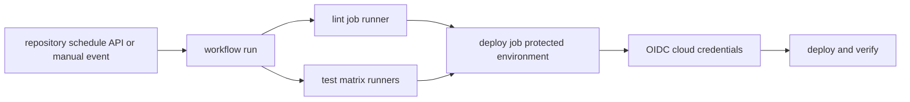

# GitHub Actions

<!-- chapter-guide:start -->
> **Step 203 of 373 — 09.03.03**
>
> **Builds on:** [CD fundamentals](../02-cd-fundamentals/README.md)
>
> **Now:** Learn **GitHub Actions** from its mental model through production ownership.
>
> **Then:** Rehearse the linked questions and continue to [GitLab CI](../04-gitlab-ci/README.md).
<!-- chapter-guide:end -->

> [60 junior/mid/senior questions and answers](questions-and-answers.md) · [Parent CI/CD note](../README.md) · Syntax changes over time, so verify examples against the official references linked below.

## Easy mode: what executes what?

A workflow is a YAML document under `.github/workflows/`. An event creates a workflow run. A workflow run contains jobs; jobs run on isolated runners and are parallel unless `needs` creates dependencies. A job contains ordered steps. A step either executes shell code with `run` or invokes a reusable action with `uses`.



Do not confuse these units:

| Unit | Location | Meaning |
|---|---|---|
| Workflow | `.github/workflows/*.yml` | Triggered automation containing one or more jobs. |
| Job | `jobs.<job_id>` | One runner allocation and ordered set of steps. Jobs do not share a filesystem unless data is transferred. |
| Step | `jobs.<job_id>.steps[]` | A shell script or action invocation inside one job. |
| Action | repository, local folder or container image | Reusable task implemented as JavaScript, a Docker container, or a composite action. |
| Reusable workflow | `.github/workflows/*.yml` with `workflow_call` | Reusable job graph called at job level; useful for organization deployment policy. |
| Runner | GitHub-hosted or self-hosted execution environment | Trust and network boundary that receives a job-scoped token and code. |
| Environment | repository deployment control | Named target with reviewers, wait rules, branch rules, secrets/variables and deployment history. |

## Repository structure

```text
repository/
├── .github/
│   ├── workflows/
│   │   ├── pull-request.yml       # unprivileged validation
│   │   ├── deploy.yml             # protected deployment
│   │   └── reusable-deploy.yml    # workflow_call contract
│   ├── actions/
│   │   └── validate-release/
│   │       ├── action.yml         # composite/custom action metadata
│   │       └── scripts/
│   └── dependabot.yml
├── scripts/                       # locally runnable pipeline logic
├── tests/
└── application/IaC source
```

Keep substantial build/test/deploy logic in versioned scripts that run locally. The workflow should express event, permissions, runner, dependency graph, inputs/outputs, environment and policy—not hide hundreds of lines of untestable YAML shell.

## Complete workflow format

The common top-level keys are:

```yaml
name: human-readable workflow name
run-name: >-
  CI for ${{ github.ref_name }} by ${{ github.actor }}

on:                              # event contract
  pull_request:
    branches: [main]
    paths-ignore: ["docs/**"]
  push:
    branches: [main]
    tags: ["v*"]
  workflow_dispatch:
    inputs:
      environment:
        description: Target environment
        required: true
        type: choice
        options: [staging, production]

permissions:                     # GITHUB_TOKEN least privilege
  contents: read

concurrency:                     # workflow-level overlap policy
  group: ${{ github.workflow }}-${{ github.ref }}
  cancel-in-progress: true

env:                             # workflow-wide non-secret values
  PYTHON_VERSION: "3.12"

defaults:
  run:
    shell: bash

jobs:
  job_id:
    name: name shown in UI
    if: ${{ !cancelled() }}
    runs-on: ubuntu-latest
    timeout-minutes: 15
    permissions:
      contents: read
    env:
      JOB_VALUE: example
    defaults:
      run:
        working-directory: ./app
    strategy:
      fail-fast: false
      matrix:
        python: ["3.11", "3.12"]
    container:                    # optional job container, Linux runner
      image: python:3.12-slim
    services:                     # optional sibling service containers
      postgres:
        image: postgres:16
        env:
          POSTGRES_PASSWORD: test-only-password
        ports: [5432:5432]
        options: >-
          --health-cmd pg_isready
          --health-interval 5s
          --health-timeout 5s
          --health-retries 10
    outputs:
      artifact_digest: ${{ steps.build.outputs.digest }}
    steps:
      - name: Checkout exact event revision
        uses: actions/checkout@v4
      - id: build
        name: Build
        run: ./scripts/build.sh
        env:
          VERSION: ${{ github.sha }}
```

`name` is display text; `job_id` and step `id` are machine references. `run-name` controls the run display. YAML indentation changes meaning. Quote ambiguous scalar values and remember that expressions are evaluated by GitHub before a shell sees the result.

For production, replace readable major action tags such as `@v4` with reviewed full commit SHAs and use dependency automation to update those pins. A tag or branch is mutable.

## A practical CI → artifact → protected deployment workflow

This example validates Python, builds one immutable artifact, passes it between jobs, uses a protected environment, requests OIDC only in the deployment job, and verifies after deployment. Replace commands and the cloud login with your application; define `STAGING_URL` as an environment variable. The placeholders `PINNED_SHA` and `CLOUD_ROLE` must be replaced with reviewed values.

```yaml
name: application delivery

on:
  pull_request:
  push:
    branches: [main]
  workflow_dispatch:

permissions:
  contents: read

concurrency:
  group: delivery-${{ github.ref }}
  cancel-in-progress: ${{ github.ref != 'refs/heads/main' }}

jobs:
  test:
    name: Test Python ${{ matrix.python }}
    runs-on: ubuntu-latest
    timeout-minutes: 15
    strategy:
      fail-fast: false
      matrix:
        python: ["3.11", "3.12"]
    steps:
      - uses: actions/checkout@v4 # pin a reviewed SHA in production
      - uses: actions/setup-python@v5
        with:
          python-version: ${{ matrix.python }}
          cache: pip
      - name: Install from lock file
        run: python -m pip install -r requirements.txt
      - name: Unit tests
        run: python -m pytest -q --junitxml=test-results.xml
      - name: Upload test evidence
        if: ${{ always() }}
        uses: actions/upload-artifact@v4
        with:
          name: tests-${{ matrix.python }}
          path: test-results.xml
          retention-days: 7

  build:
    needs: test
    if: ${{ github.event_name != 'pull_request' }}
    runs-on: ubuntu-latest
    permissions:
      contents: read
      attestations: write
      id-token: write
    outputs:
      digest: ${{ steps.package.outputs.digest }}
    steps:
      - uses: actions/checkout@v4
        with:
          persist-credentials: false
      - id: package
        name: Build once
        shell: bash
        run: |
          set -Eeuo pipefail
          tar -czf application.tgz src requirements.txt
          digest="$(sha256sum application.tgz | awk '{print $1}')"
          printf 'digest=%s\n' "$digest" >> "$GITHUB_OUTPUT"
          printf '### Artifact\n`sha256:%s`\n' "$digest" >> "$GITHUB_STEP_SUMMARY"
      - uses: actions/upload-artifact@v4
        with:
          name: application-${{ github.sha }}
          path: application.tgz
          if-no-files-found: error
          retention-days: 14

  deploy-staging:
    needs: build
    runs-on: ubuntu-latest
    timeout-minutes: 20
    environment:
      name: staging
      url: ${{ vars.STAGING_URL }}
    concurrency:
      group: deploy-staging
      cancel-in-progress: false
    permissions:
      contents: read
      id-token: write
    steps:
      - uses: actions/download-artifact@v4
        with:
          name: application-${{ github.sha }}
      - name: Verify promoted bytes
        env:
          EXPECTED_DIGEST: ${{ needs.build.outputs.digest }}
        run: test "$(sha256sum application.tgz | awk '{print $1}')" = "$EXPECTED_DIGEST"
      - name: Exchange GitHub OIDC token for a short-lived cloud role
        run: ./scripts/cloud-login-oidc.sh "CLOUD_ROLE"
      - name: Deploy exact artifact and verify
        env:
          ARTIFACT_DIGEST: ${{ needs.build.outputs.digest }}
          STAGING_URL: ${{ vars.STAGING_URL }}
        run: |
          ./scripts/deploy.sh application.tgz "$ARTIFACT_DIGEST"
          ./scripts/smoke-test.sh "$STAGING_URL"
```

Important review points:

- PR jobs receive untrusted repository content; do not expose deployment secrets or privileged self-hosted runners.
- Build once and promote the same digest. Do not rebuild different bytes for production.
- `needs` passes status and declared outputs, not the runner filesystem.
- Artifact upload/download transfers files; cache accelerates dependency restoration and is not an artifact promotion system.
- `environment` can enforce reviewers and target-scoped variables/secrets. Job-level `concurrency` serializes the target.
- OIDC permission only allows requesting a token; the cloud trust policy must restrict repository, ref/environment, audience and preferably the reusable workflow identity.

## Events and filters

`on` may be one event, a list, or a mapping with event-specific filters. Common events include `push`, `pull_request`, `merge_group`, `release`, `schedule`, `workflow_dispatch`, `workflow_call`, `workflow_run` and `repository_dispatch`.

```yaml
on:
  pull_request:
    types: [opened, synchronize, reopened]
    branches: [main]
    paths: ["src/**", "tests/**", ".github/workflows/ci.yml"]
  schedule:
    - cron: "17 3 * * 1-5" # UTC; expect scheduling delay
  workflow_dispatch:
    inputs:
      dry_run:
        type: boolean
        default: true
```

Filters can cause a required workflow to remain pending when it never runs; design branch protection and required checks deliberately. Scheduled workflows run from default-branch workflow content. Event payloads differ, so a context field present for a PR may be empty for a manual run.

Security boundary: `pull_request` is the normal validation event for forks and does not grant repository secrets to fork code. `pull_request_target` runs in the base repository's privileged context and is dangerous if it checks out or executes attacker-controlled PR code. Use it only for carefully constrained metadata operations.

## Jobs, dependencies and matrices

Jobs run in parallel by default. `needs` creates a directed acyclic graph. By default a failed/skipped dependency prevents downstream execution; use explicit status functions such as `always()`, `failure()`, `cancelled()` or `success()` only when the resulting behavior is safe.

```yaml
jobs:
  test:
    strategy:
      fail-fast: false
      max-parallel: 4
      matrix:
        os: [ubuntu-latest, macos-latest]
        runtime: ["20", "22"]
        include:
          - os: ubuntu-latest
            runtime: "22"
            experimental: true
        exclude:
          - os: macos-latest
            runtime: "20"
    runs-on: ${{ matrix.os }}
    continue-on-error: ${{ matrix.experimental || false }}
```

Large matrices consume time/money and can saturate rate limits or test dependencies. Use representative compatibility coverage, `max-parallel`, fail-fast behavior and separate required versus experimental cells.

## Steps, shells and workflow commands

Each `run` step starts a new process. The working directory persists within the job, but ordinary shell variables do not. Use the runner-provided files:

```bash
printf 'NAME=%s\n' 'value' >> "$GITHUB_ENV"          # later steps in this job
printf 'result=%s\n' 'value' >> "$GITHUB_OUTPUT"    # output from a step with id
printf '%s\n' '/opt/tool/bin' >> "$GITHUB_PATH"     # later PATH entries
printf '### Diagnostic summary\n' >> "$GITHUB_STEP_SUMMARY"
```

Use `set -Eeuo pipefail`, quote values and pass untrusted event data through environment variables rather than interpolating it directly into shell source:

```yaml
- name: Safely print PR title
  env:
    PR_TITLE: ${{ github.event.pull_request.title }}
  run: printf '%s\n' "$PR_TITLE"
```

`continue-on-error` is not a substitute for understanding failure semantics. Always apply timeouts to external operations and make deployment/retry scripts idempotent.

## Contexts, expressions, variables and secrets

Common contexts include `github`, `env`, `vars`, `secrets`, `inputs`, `runner`, `job`, `steps`, `needs`, `matrix` and `strategy`. Expressions use `${{ ... }}` and functions such as `contains`, `startsWith`, `fromJSON`, `toJSON`, `hashFiles`, and the status functions.

```yaml
if: >-
  github.ref == 'refs/heads/main' &&
  github.repository_owner == 'YOUR_ORG'
env:
  REGION: ${{ vars.AWS_REGION }}
  DEPLOY_TOKEN: ${{ secrets.DEPLOY_TOKEN }}
```

Repository/organization/environment variables are not secrets. Secret redaction is best-effort and cannot save a workflow that deliberately transforms or exfiltrates a secret. Avoid dumping entire contexts because event payloads/tokens can be sensitive. Secrets are unavailable in several untrusted-event situations and should not be referenced directly in `if`; map them into an environment value only when required.

## Outputs, artifacts and caches

- Step output: small metadata within a job, declared through `$GITHUB_OUTPUT`.
- Job output: maps a step output so dependent jobs access `needs.<job>.outputs.<name>`.
- Reusable-workflow output: maps called job output into the `workflow_call` contract.
- Artifact: retained files/evidence transferred between jobs or downloaded later.
- Cache: best-effort dependency/build acceleration keyed by input identity; treat restore content from untrusted scopes cautiously.

```yaml
- uses: actions/cache@v4
  with:
    path: ~/.cache/pip
    key: ${{ runner.os }}-pip-${{ hashFiles('requirements.txt') }}
    restore-keys: |
      ${{ runner.os }}-pip-
```

Never cache credentials. Use lock-file hashes, bound retention and cache scopes. Artifacts intended for deployment need digest/provenance verification, access control and retention; a successful upload does not prove the artifact is trustworthy.

## Reusable workflows, composite actions and custom actions

Use a reusable workflow when you need a governed multi-job deployment contract; call it as a job, not as a step:

```yaml
# .github/workflows/reusable-deploy.yml
name: reusable deploy
on:
  workflow_call:
    inputs:
      environment:
        required: true
        type: string
      artifact_digest:
        required: true
        type: string
    secrets:
      deployment_token:
        required: false
    outputs:
      endpoint:
        value: ${{ jobs.deploy.outputs.endpoint }}

jobs:
  deploy:
    runs-on: ubuntu-latest
    environment: ${{ inputs.environment }}
    outputs:
      endpoint: ${{ steps.deploy.outputs.endpoint }}
    steps:
      - id: deploy
        env:
          DIGEST: ${{ inputs.artifact_digest }}
        run: ./scripts/deploy.sh "$DIGEST"
```

```yaml
# caller job
jobs:
  deploy:
    uses: YOUR_ORG/platform-automation/.github/workflows/reusable-deploy.yml@PINNED_SHA
    with:
      environment: production
      artifact_digest: ${{ needs.build.outputs.digest }}
    secrets: inherit # prefer explicitly named secrets when possible
```

A composite action packages steps and runs in the caller's job. Its `action.yml` looks like:

```yaml
name: Validate release
description: Validate a release manifest
inputs:
  manifest:
    description: Path to the release manifest
    required: true
outputs:
  digest:
    description: Validated digest
    value: ${{ steps.validate.outputs.digest }}
runs:
  using: composite
  steps:
    - id: validate
      shell: bash
      env:
        MANIFEST: ${{ inputs.manifest }}
      run: "$GITHUB_ACTION_PATH/scripts/validate.sh" "$MANIFEST"
```

JavaScript and Docker actions use other `runs.using` forms and require their runtime/bundle or Dockerfile. Pin every external action and reusable workflow. Review transitive code, token permissions and network behavior; marketplace presence is not a security proof.

## Runners and isolation

GitHub-hosted runners are ephemeral managed VMs for ordinary jobs. Self-hosted runners provide custom hardware/network (including GPUs/on-prem) but code can persist, inspect neighboring state or attack the network if isolation is weak. Do not place untrusted public-PR work on privileged persistent runners. Prefer ephemeral one-job runners, clean images, network egress controls, workload identity, separate runner groups, patching, capacity limits and no ambient credentials.

Job containers and service containers require a Linux runner with a container runtime. They are convenience environments, not a hardened multi-tenant boundary from the runner host.

## Security and supply-chain checklist

1. Set top-level `permissions: contents: read` or `{}` and add job-level grants only where used.
2. Prefer OIDC short-lived cloud credentials; restrict cloud trust to organization/repository, event/ref/environment, audience and reusable workflow.
3. Pin third-party actions/reusable workflows to reviewed commit SHAs and automate updates.
4. Separate untrusted validation from privileged deployment; never execute fork code in `pull_request_target` context.
5. Protect environments, release branches/tags and workflow files with required review/CODEOWNERS.
6. Build once, generate SBOM/provenance/attestation, sign or verify, scan, and promote the same digest.
7. Harden ephemeral/self-hosted runners, control egress and isolate tenants/repositories.
8. Prevent command/script injection; never interpolate attacker-controlled context directly into shell.
9. Bound time, concurrency, artifact/cache retention and costs; make cancellation and deployment idempotent.
10. Audit workflow changes, reruns, approvals, OIDC/cloud events and final deployment identity.

## CLI, debugging and operations

With the GitHub CLI authenticated to a test repository:

```bash
gh workflow list
gh workflow view "application delivery" --yaml
gh workflow run deploy.yml -f environment=staging
gh run list --workflow deploy.yml --limit 10
gh run view RUN_ID --log-failed
gh run watch RUN_ID --exit-status
gh run rerun RUN_ID --failed
gh run download RUN_ID --dir ./run-artifacts
gh api repos/OWNER/REPO/actions/runs/RUN_ID/jobs
```

Diagnose in this order: event/filter and selected SHA → repository/organization Actions policy → expression/`if` → dependency/skipped status → runner availability/labels → token permissions/secrets/environment approval → action/tool dependency → application command → artifact/cloud/deployment state. Enable runner/step debug logging only briefly and review whether it could expose sensitive data.

Static and local checks:

```bash
actionlint .github/workflows/*.yml
shellcheck scripts/*.sh
yamllint .github/workflows
git diff --check
```

## Hands-on lab: beginner → senior

1. Fork or create a disposable private repository with a tiny tested script. Add PR CI using `checkout`, a pinned runtime and one test job.
2. Add a two-version matrix, JUnit artifact on `always()`, dependency cache and step summary. Intentionally break a test and explain the job/step conclusions and exit status.
3. Split build and deploy. Pass a digest as a job output and bytes as an artifact. Add staging environment approval and concurrency; verify the exact digest after download.
4. Replace a stored cloud key with OIDC in a sandbox role. Inspect token claims without printing the token and demonstrate that the wrong branch/environment cannot assume the role.
5. Extract deployment into a pinned reusable workflow; restrict cloud trust to that workflow. Add an untrusted PR test proving it cannot obtain privileged credentials.
6. Observe with `gh run`, cancel a run, rerun only failed jobs, download evidence, then delete the disposable cloud resources/repository or disable the workflows.

## Further documentation and video learning

Official documentation:

- [GitHub Actions documentation](https://docs.github.com/en/actions)
- [Workflow syntax reference](https://docs.github.com/en/actions/reference/workflows-and-actions/workflow-syntax)
- [Events that trigger workflows](https://docs.github.com/en/actions/reference/workflows-and-actions/events-that-trigger-workflows)
- [Contexts reference](https://docs.github.com/en/actions/reference/workflows-and-actions/contexts)
- [Expressions reference](https://docs.github.com/en/actions/reference/workflows-and-actions/expressions)
- [Reuse workflows](https://docs.github.com/en/actions/how-tos/reuse-automations/reuse-workflows)
- [Metadata syntax for custom actions](https://docs.github.com/en/actions/reference/workflows-and-actions/metadata-syntax)
- [Security hardening and OIDC](https://docs.github.com/en/actions/how-tos/secure-your-work/security-harden-deployments)
- [GitHub CLI Actions manual](https://cli.github.com/manual/gh_run)

Video resources (verify the publish date because syntax and runner behavior change):

- [GitHub's official YouTube channel—GitHub Actions videos](https://www.youtube.com/@GitHub/search?query=GitHub%20Actions)
- [GitHub Skills: Hello GitHub Actions hands-on course](https://github.com/skills/hello-github-actions)
- [GitHub Skills: reusable workflows hands-on course](https://github.com/skills/reusable-workflows)

## Interview traps

- A job is not a step, and `needs` does not share a filesystem.
- Cache is not a release artifact repository.
- `id-token: write` must be combined with a narrow external trust policy.
- Encrypted secrets are still exposed to any step that is authorized to read and exfiltrate them.
- `pull_request_target` plus checkout/execution of PR code is a high-risk privilege inversion.
- Self-hosted runners are part of the production trust boundary.
- A green deployment step is not user-facing verification; check SLO, correctness, security and the exact artifact revision.

After the lab, delete sandbox deployments and temporary artifacts, remove test environments and repository secrets, revoke temporary cloud trust, and verify that no self-hosted runner, workflow schedule or billable resource remains. Reliability and observability checks must prove the exact artifact, runner, environment and user-facing result rather than trusting a green job alone.

<!-- reading-navigation:start -->
---

**Reading path:** [← Back: CD fundamentals](../02-cd-fundamentals/README.md) · [Questions](questions-and-answers.md) · [Next: GitLab CI →](../04-gitlab-ci/README.md)

<!-- reading-navigation:end -->
