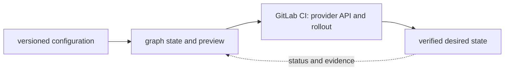

# GitLab CI

<!-- chapter-guide:start -->
> **Step 204 of 373 — 09.03.04**
>
> **Builds on:** [GitHub Actions](../03-github-actions/README.md)
>
> **Now:** Learn **GitLab CI** from its mental model through production ownership.
>
> **Then:** Rehearse the linked questions and continue to [Jenkins](../05-jenkins/README.md).
<!-- chapter-guide:end -->

> [Interview questions and answers](questions-and-answers.md) · [Master curriculum](../../../curriculum/master-curriculum.txt) · Official starting point: <https://docs.github.com/en/actions>

## Explanation

### What it is and why it exists

**GitLab CI** is easiest to understand as one part of a larger path. The subject turns version-controlled intent into a reviewed state transition. A tool parses configuration, resolves dependencies, compares desired and recorded/remote state, proposes a change set and calls provider APIs after approval.

The chapter focuses on Pipelines, Jobs, Stages, Runners. These are connected mechanisms, not vocabulary to memorize. GitLab CI is the part of CI/CD that connects the listed mechanisms to effective runtime state, observable behavior and production outcomes The explanations below first build the simple model, then add the exact system behavior and production consequences.

### History and evolution

Infrastructure automation evolved from shell scripts and host configuration tools into declarative resource graphs, remote state and reviewed delivery pipelines. Terraform popularized provider-based declarative provisioning from 2014, while later tools and GitOps connected infrastructure changes to normal software review, testing and promotion practices.

In this chapter, **GitLab CI** is the next layer of that evolution. Its modern purpose is to gitLab CI is the part of CI/CD that connects the listed mechanisms to effective runtime state, observable behavior and production outcomes. The exact product surface may change by version, but the underlying state, request path and failure boundaries remain the durable ideas to learn.

### How it works: the end-to-end path



The path begins with a concrete input: a user request, configuration revision, packet, job, model request or operational symptom. The relevant subsystem validates that input, reads current state, performs or schedules work and exposes a result. Some transitions complete before the caller receives a response; others acknowledge the request and converge later. That difference determines whether a timeout means "nothing happened," "the operation failed," or "the final result is still unknown."

For **GitLab CI**, the important stages are Pipelines, Jobs, Stages, Runners, Includes, Rules, Environments, Artifacts, Caching, Protected variables. Their boundaries explain where identity is checked, where state becomes durable, where capacity is consumed, how failures propagate and which signal can distinguish one layer from another. A production explanation should follow the actual path rather than treating each term as an isolated definition.


### Core concepts explained in detail

#### Pipelines

**What it is.** The term Pipelines is an ordered or dependency-aware chain of stages that transforms versioned inputs into outputs and records status so failed work can be retried, resumed or rolled back safely within GitLab CI.

**Junior mental model.** Treat delivery like a controlled assembly line: reviewed source becomes an immutable artifact, the artifact is promoted without being rebuilt, and each environment records exactly which revision is effective.

**How it works.** The lifecycle begins with versioned intent, validates syntax and policy, resolves dependencies, builds or selects immutable inputs, produces a diff or release plan, changes the target in bounded waves, and records status. Reconciliation keeps desired and observed state aligned; rollback is another tested state transition, not merely a command name.

**What it looks like in production.** Healthy evidence links source revision, review, test, artifact digest, signer/provenance, deployment target and user-facing verification. Mutable tags, environment-specific rebuilds, unpinned dependencies, non-idempotent migrations and controllers fighting emergency changes are recurring failure modes.

#### Jobs

**What it is.** The term Jobs refers to a configuration, state or promotion mechanism that moves a reviewed revision toward effective runtime state within GitLab CI.

**Junior mental model.** A queue is like a numbered waiting line: producers can hand off work without waiting for completion, but someone must define ordering, capacity, acknowledgement and what happens when a worker disappears.

**How it works.** A producer serializes and publishes a message, the service stores or routes it, a consumer receives it under a delivery contract, and acknowledgement advances or removes the item. At-least-once systems can redeliver after an unknown outcome, so stable operation identifiers and idempotent state changes are part of correctness.

**What it looks like in production.** Healthy evidence includes publish and consume rates, queue depth and age, processing latency, retry/dead-letter counts and end-to-end business completion. Poison messages, hot partitions, backlog growth, duplicate effects and retry storms are common; adding consumers helps only when the downstream dependency and partition model can absorb them.

#### Stages

**What it is.** The term Stages refers to a configuration, state or promotion mechanism that moves a reviewed revision toward effective runtime state within GitLab CI.

**Junior mental model.** Treat delivery like a controlled assembly line: reviewed source becomes an immutable artifact, the artifact is promoted without being rebuilt, and each environment records exactly which revision is effective.

**How it works.** The lifecycle begins with versioned intent, validates syntax and policy, resolves dependencies, builds or selects immutable inputs, produces a diff or release plan, changes the target in bounded waves, and records status. Reconciliation keeps desired and observed state aligned; rollback is another tested state transition, not merely a command name.

**What it looks like in production.** Healthy evidence links source revision, review, test, artifact digest, signer/provenance, deployment target and user-facing verification. Mutable tags, environment-specific rebuilds, unpinned dependencies, non-idempotent migrations and controllers fighting emergency changes are recurring failure modes.

#### Runners

**What it is.** The term Runners refers to a configuration, state or promotion mechanism that moves a reviewed revision toward effective runtime state within GitLab CI.

**Junior mental model.** Treat delivery like a controlled assembly line: reviewed source becomes an immutable artifact, the artifact is promoted without being rebuilt, and each environment records exactly which revision is effective.

**How it works.** The lifecycle begins with versioned intent, validates syntax and policy, resolves dependencies, builds or selects immutable inputs, produces a diff or release plan, changes the target in bounded waves, and records status. Reconciliation keeps desired and observed state aligned; rollback is another tested state transition, not merely a command name.

**What it looks like in production.** Healthy evidence links source revision, review, test, artifact digest, signer/provenance, deployment target and user-facing verification. Mutable tags, environment-specific rebuilds, unpinned dependencies, non-idempotent migrations and controllers fighting emergency changes are recurring failure modes.

#### Includes

**What it is.** The term Includes refers to a configuration, state or promotion mechanism that moves a reviewed revision toward effective runtime state within GitLab CI.

**Junior mental model.** Treat delivery like a controlled assembly line: reviewed source becomes an immutable artifact, the artifact is promoted without being rebuilt, and each environment records exactly which revision is effective.

**How it works.** The lifecycle begins with versioned intent, validates syntax and policy, resolves dependencies, builds or selects immutable inputs, produces a diff or release plan, changes the target in bounded waves, and records status. Reconciliation keeps desired and observed state aligned; rollback is another tested state transition, not merely a command name.

**What it looks like in production.** Healthy evidence links source revision, review, test, artifact digest, signer/provenance, deployment target and user-facing verification. Mutable tags, environment-specific rebuilds, unpinned dependencies, non-idempotent migrations and controllers fighting emergency changes are recurring failure modes.

#### Rules

**What it is.** The term Rules refers to a configuration, state or promotion mechanism that moves a reviewed revision toward effective runtime state within GitLab CI.

**Junior mental model.** Treat delivery like a controlled assembly line: reviewed source becomes an immutable artifact, the artifact is promoted without being rebuilt, and each environment records exactly which revision is effective.

**How it works.** The lifecycle begins with versioned intent, validates syntax and policy, resolves dependencies, builds or selects immutable inputs, produces a diff or release plan, changes the target in bounded waves, and records status. Reconciliation keeps desired and observed state aligned; rollback is another tested state transition, not merely a command name.

**What it looks like in production.** Healthy evidence links source revision, review, test, artifact digest, signer/provenance, deployment target and user-facing verification. Mutable tags, environment-specific rebuilds, unpinned dependencies, non-idempotent migrations and controllers fighting emergency changes are recurring failure modes.

#### Environments

**What it is.** The term Environments refers to a configuration, state or promotion mechanism that moves a reviewed revision toward effective runtime state within GitLab CI.

**Junior mental model.** Treat delivery like a controlled assembly line: reviewed source becomes an immutable artifact, the artifact is promoted without being rebuilt, and each environment records exactly which revision is effective.

**How it works.** The lifecycle begins with versioned intent, validates syntax and policy, resolves dependencies, builds or selects immutable inputs, produces a diff or release plan, changes the target in bounded waves, and records status. Reconciliation keeps desired and observed state aligned; rollback is another tested state transition, not merely a command name.

**What it looks like in production.** Healthy evidence links source revision, review, test, artifact digest, signer/provenance, deployment target and user-facing verification. Mutable tags, environment-specific rebuilds, unpinned dependencies, non-idempotent migrations and controllers fighting emergency changes are recurring failure modes.

#### Artifacts

**What it is.** The term Artifacts is a delivery mechanism that binds reviewed source to an immutable revision and moves that revision through validation and bounded rollout toward verified runtime state within GitLab CI.

**Junior mental model.** Think of this as a library catalog plus shelves: metadata says what should exist and where, while physical or remote storage holds the bytes. A successful write is not necessarily durable, replicated, backed up or restorable under the same contract.

**How it works.** A write normally passes validation and authorization, enters a buffer or transaction, reaches a durable medium, and may then replicate or become visible to readers. Caches and indexes accelerate access but introduce freshness and eviction behavior; snapshots preserve a point-in-time representation but application consistency depends on write ordering.

**What it looks like in production.** Healthy evidence combines capacity, latency, error, replication and integrity signals with a tested read or restore. Typical failures include exhausted bytes or inodes, throttling, stale replicas, corrupt metadata, topology mismatch, lost encryption keys and backups that exist but cannot reconstruct the application within RPO/RTO.

#### Caching

**What it is.** The term Caching keeps reusable results closer to the caller to reduce repeated work or latency, while introducing freshness, eviction, capacity and invalidation behavior that becomes part of correctness within GitLab CI.

**Junior mental model.** Treat delivery like a controlled assembly line: reviewed source becomes an immutable artifact, the artifact is promoted without being rebuilt, and each environment records exactly which revision is effective.

**How it works.** The lifecycle begins with versioned intent, validates syntax and policy, resolves dependencies, builds or selects immutable inputs, produces a diff or release plan, changes the target in bounded waves, and records status. Reconciliation keeps desired and observed state aligned; rollback is another tested state transition, not merely a command name.

**What it looks like in production.** Healthy evidence links source revision, review, test, artifact digest, signer/provenance, deployment target and user-facing verification. Mutable tags, environment-specific rebuilds, unpinned dependencies, non-idempotent migrations and controllers fighting emergency changes are recurring failure modes.

#### Protected variables

**What it is.** The term Protected variables refers to a configuration, state or promotion mechanism that moves a reviewed revision toward effective runtime state within GitLab CI.

**Junior mental model.** Treat delivery like a controlled assembly line: reviewed source becomes an immutable artifact, the artifact is promoted without being rebuilt, and each environment records exactly which revision is effective.

**How it works.** The lifecycle begins with versioned intent, validates syntax and policy, resolves dependencies, builds or selects immutable inputs, produces a diff or release plan, changes the target in bounded waves, and records status. Reconciliation keeps desired and observed state aligned; rollback is another tested state transition, not merely a command name.

**What it looks like in production.** Healthy evidence links source revision, review, test, artifact digest, signer/provenance, deployment target and user-facing verification. Mutable tags, environment-specific rebuilds, unpinned dependencies, non-idempotent migrations and controllers fighting emergency changes are recurring failure modes.

### Worked command and configuration example

The following is a diagnostic example, not an unexplained command dump. Define every uppercase placeholder first—for example `NAME`, `RESOURCE`, `PROJECT`, `REGION`, `NAMESPACE`, `URL`, `IMAGE` or `CONTAINER`—and use a sandbox or read-only production role.

```bash
terraform fmt -check -recursive
terraform validate; terraform plan
pulumi preview --diff
git diff --check
```

What the example demonstrates:

- `terraform fmt -check -recursive` checks configuration or previews the dependency-aware state transition before any apply; the preview must be reviewed for replacement, deletion, identity and cost.
- `terraform validate; terraform plan` checks configuration or previews the dependency-aware state transition before any apply; the preview must be reviewed for replacement, deletion, identity and cost.
- `pulumi preview --diff` checks configuration or previews the dependency-aware state transition before any apply; the preview must be reviewed for replacement, deletion, identity and cost.
- `git diff --check` inspects the repository's object graph, refs or diff so a delivery decision is tied to exact content rather than an assumed branch name.

A healthy run returns the intended identity/context, exits successfully and shows the expected object or response without a new warning, retry loop or saturation signal. A failure is useful evidence: preserve the exact exit code, status/reason, timestamp and target, then inspect the immediately adjacent layer before changing anything. This makes the example part of the explanation of **GitLab CI**, not merely a list to copy.

### Security, reliability and production ownership

Security controls who can initiate a transition and what data or resource that transition may affect. Authentication, authorization, network reachability, encryption and audit solve different problems and must align at each boundary. Short-lived attributable identities, least privilege, explicit tenant separation and tested key/certificate rotation reduce blast radius. Logs and traces need their own data controls because copying a secret or customer payload into telemetry defeats the primary protection.

Reliability depends on every synchronous dependency and on the eventual convergence of asynchronous work. Timeouts bound waiting; idempotency makes an ambiguous retry safe; backpressure and load shedding keep demand within useful capacity; replication and failover help only across independent failure domains. Recovery must be tested from protected state and verified through the original user outcome, not inferred from a green administrative status.

Ownership makes these mechanisms operable. Every production resource or service needs an accountable team, source-of-truth revision, environment and data classification, SLO, runbook, cost center and retirement policy. Reversible mitigation can stabilize an incident, but the durable repair belongs in Git, IaC, policy or the owning application so reconciliation does not reintroduce the fault.

### Observability, performance and cost

Metrics, logs, traces, profiles and audit events are complementary. A useful diagnostic path starts with time, identity, exact target and user symptom, then compares desired and observed state before moving through reconciliation, network/protocol, runtime, dependency and saturation layers. High-cardinality request or object IDs belong in sampled logs or traces rather than metric labels; alerts should represent actionable user-impact risk or leading exhaustion.

Performance is governed by work distribution, queueing and bottlenecks. Rate, latency percentiles, errors, saturation, queue depth or age and service-specific limits reveal more than average utilization. Application replicas and underlying machines, storage or provider quota scale through separate loops with different cold delays. Cost includes idle headroom, requests or work units, storage/retention, network transfer, telemetry, support and recovery capacity; optimize cost per successful outcome rather than the cheapest isolated resource.

### What you should be able to explain

The table remains as a revision checklist. Read the explanations above first; afterward, use each row to check whether you can explain the concept without relying on memorized wording.

| # | Topic | What you must understand and demonstrate |
|---:|---|---|
| 1 | **Pipelines** | is part of GitLab CI; learn its precise definition, mechanism and lifecycle, nearest alternatives, configuration interface, failure/limit, security boundary, observable evidence and production trade-off |
| 2 | **Jobs** | is part of GitLab CI; learn its precise definition, mechanism and lifecycle, nearest alternatives, configuration interface, failure/limit, security boundary, observable evidence and production trade-off |
| 3 | **Stages** | is part of GitLab CI; learn its precise definition, mechanism and lifecycle, nearest alternatives, configuration interface, failure/limit, security boundary, observable evidence and production trade-off |
| 4 | **Runners** | is part of GitLab CI; learn its precise definition, mechanism and lifecycle, nearest alternatives, configuration interface, failure/limit, security boundary, observable evidence and production trade-off |
| 5 | **Includes** | is part of GitLab CI; learn its precise definition, mechanism and lifecycle, nearest alternatives, configuration interface, failure/limit, security boundary, observable evidence and production trade-off |
| 6 | **Rules** | is part of GitLab CI; learn its precise definition, mechanism and lifecycle, nearest alternatives, configuration interface, failure/limit, security boundary, observable evidence and production trade-off |
| 7 | **Environments** | is part of GitLab CI; learn its precise definition, mechanism and lifecycle, nearest alternatives, configuration interface, failure/limit, security boundary, observable evidence and production trade-off |
| 8 | **Artifacts** | is part of GitLab CI; learn its precise definition, mechanism and lifecycle, nearest alternatives, configuration interface, failure/limit, security boundary, observable evidence and production trade-off |
| 9 | **Caching** | is part of GitLab CI; learn its precise definition, mechanism and lifecycle, nearest alternatives, configuration interface, failure/limit, security boundary, observable evidence and production trade-off |
| 10 | **Protected variables** | is part of GitLab CI; learn its precise definition, mechanism and lifecycle, nearest alternatives, configuration interface, failure/limit, security boundary, observable evidence and production trade-off |

## Practice

### Practice objective

Build a small, safe proof of **GitLab CI** and explain the result in your own words. The goal is not command completion; it is to connect input, internal mechanism, observable state and user outcome.

### Prerequisites and setup

Use a disposable state/backend and sandbox account. Format, validate and test first; preview/plan and save the reviewed output; apply one harmless tagged resource only after checking identity and estimated cost; introduce a configuration-only diff; inspect the plan; revert it in source; and verify no drift. Destroy only the exact sandbox stack after inspecting the destroy preview and retaining no required state.

Record tool and platform versions because flags, APIs and defaults can change. Define every uppercase placeholder before use and keep secrets out of shell history and committed files.

### Activity 1: establish a healthy baseline

Run the read-oriented example first:

```bash
terraform fmt -check -recursive
terraform validate; terraform plan
pulumi preview --diff
git diff --check
```

For each line, write down the layer it inspects, the expected healthy field or response, and one thing it cannot prove. The expected result is an attributable request against the intended target plus enough state to draw the path from input to outcome.

### Activity 2: create or review the smallest working example

Put the smallest relevant command, configuration, manifest or code sample in source control. Validate or lint it, produce a preview/diff where the tool supports one, and apply only inside the disposable boundary. Record the exact revision and resulting resource or process ID. If the topic is observational rather than configurable, save a sanitized baseline and an automated assertion instead of mutating the system.

### Activity 3: controlled failure and troubleshooting

Introduce one bounded failure: use a definitely nonexistent resource name, an invalid sandbox-only value, a denied test identity, a closed test port or a stopped disposable dependency. Capture the exact error and classify it as identity/policy, input/configuration, control-plane reconciliation, network/protocol, dependency or capacity. Test one discriminating hypothesis at a time; do not widen access or restart unrelated components.

Expected failure evidence is a specific non-zero exit, status/reason, event or protocol response that disappears when the controlled fault is removed. If healthy and failing runs look identical, the chosen signal does not explain the phenomenon and the exercise is not complete.

### Verification

Repeat the original client or user-facing check, not only an administrative status command. Confirm the desired revision, data correctness where applicable, error and latency recovery, and absence of a continuing retry/backlog/saturation condition. Explain why this evidence proves recovery and what uncertainty remains.

### Cleanup and rollback

Revert the configuration in its source of truth and review the rollback diff before applying it. Delete only the named sandbox resources, stop disposable processes, remove temporary credentials and verify that no billable resource, volume, artifact, queue item or background job remains. Read-only activities require no infrastructure rollback, but sanitized captures must still follow retention policy.

### Harder extension

Automate the healthy and failing paths in CI, use short-lived identity, add one SLI/alert or policy assertion, and write a five-step runbook another engineer can execute without hidden context. Then explain how the design changes for two tenants, a zonal or dependency failure, 10× load and a strict cost or recovery target.

<!-- reading-navigation:start -->
---

**Reading path:** [← Back: GitHub Actions](../03-github-actions/README.md) · [Questions](questions-and-answers.md) · [Next: Jenkins →](../05-jenkins/README.md)

<!-- reading-navigation:end -->
