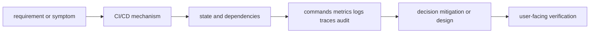
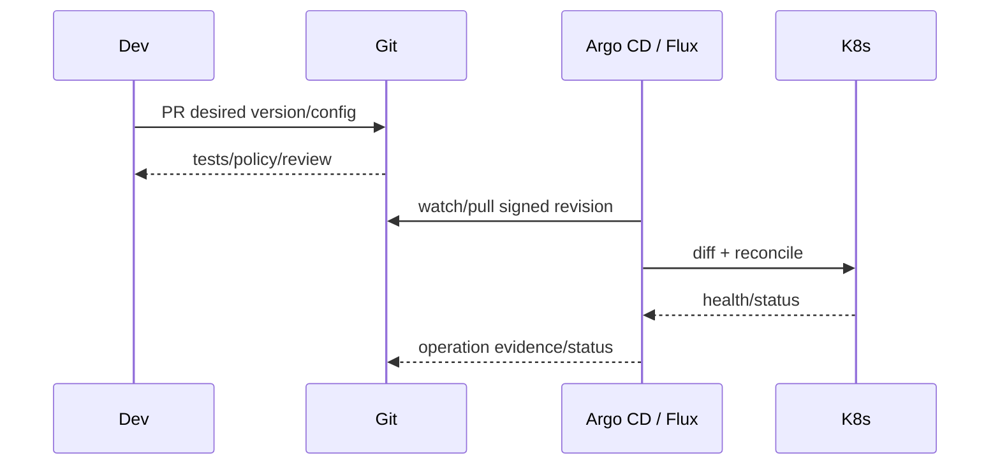

# CI/CD

<!-- chapter-guide:start -->
> **Step 200 of 373 — 09.03**
>
> **Builds on:** [Terraform versus Pulumi](../02-pulumi/08-terraform-versus-pulumi/README.md)
>
> **Now:** Learn **CI/CD** from its mental model through production ownership.
>
> **Then:** Rehearse the linked questions and continue to [CI fundamentals](01-ci-fundamentals/README.md).
<!-- chapter-guide:end -->

> [Interview questions and answers](questions-and-answers.md) · [Master curriculum](../../curriculum/master-curriculum.txt) · Official starting point: <https://docs.github.com/en/actions>

## Easy mode: mental model

Integrate every part of CI/CD into one secure, reliable, observable, supportable and cost-aware production capability.

Learn this topic in layers: name the object or mechanism, trace its lifecycle/data path, configure it safely, observe a healthy and failed state, recover it, and then design it across failure domains and team boundaries.



## Deeper topic folders

- [31.1 CI fundamentals](01-ci-fundamentals/README.md) — [Q&A](01-ci-fundamentals/questions-and-answers.md)
- [31.2 CD fundamentals](02-cd-fundamentals/README.md) — [Q&A](02-cd-fundamentals/questions-and-answers.md)
- [31.3 GitHub Actions](03-github-actions/README.md) — [Q&A](03-github-actions/questions-and-answers.md)
- [31.4 GitLab CI](04-gitlab-ci/README.md) — [Q&A](04-gitlab-ci/questions-and-answers.md)
- [31.5 Jenkins](05-jenkins/README.md) — [Q&A](05-jenkins/questions-and-answers.md)
- [31.6 Deployment strategies](06-deployment-strategies/README.md) — [Q&A](06-deployment-strategies/questions-and-answers.md)
- [31.7 GitOps](07-gitops/README.md) — [Q&A](07-gitops/questions-and-answers.md)
- [31.8 CI/CD security](08-ci-cd-security/README.md) — [Q&A](08-ci-cd-security/questions-and-answers.md)

## Complete curriculum checklist

| # | Topic | What you must understand and demonstrate |
|---:|---|---|
| 1 | **Source checkout** | is part of CI/CD; learn its precise definition, mechanism and lifecycle, nearest alternatives, configuration interface, failure/limit, security boundary, observable evidence and production trade-off. |
| 2 | **Dependency installation** | is part of CI/CD; learn its precise definition, mechanism and lifecycle, nearest alternatives, configuration interface, failure/limit, security boundary, observable evidence and production trade-off. |
| 3 | **Compilation** | is part of CI/CD; learn its precise definition, mechanism and lifecycle, nearest alternatives, configuration interface, failure/limit, security boundary, observable evidence and production trade-off. |
| 4 | **Unit tests** | is part of CI/CD; learn its precise definition, mechanism and lifecycle, nearest alternatives, configuration interface, failure/limit, security boundary, observable evidence and production trade-off. |
| 5 | **Integration tests** | is part of CI/CD; learn its precise definition, mechanism and lifecycle, nearest alternatives, configuration interface, failure/limit, security boundary, observable evidence and production trade-off. |
| 6 | **Static analysis** | is part of CI/CD; learn its precise definition, mechanism and lifecycle, nearest alternatives, configuration interface, failure/limit, security boundary, observable evidence and production trade-off. |
| 7 | **Artifact creation** | is part of CI/CD; learn its precise definition, mechanism and lifecycle, nearest alternatives, configuration interface, failure/limit, security boundary, observable evidence and production trade-off. |
| 8 | **Artifact promotion** | is part of CI/CD; learn its precise definition, mechanism and lifecycle, nearest alternatives, configuration interface, failure/limit, security boundary, observable evidence and production trade-off. |
| 9 | **Caching** | is part of CI/CD; learn its precise definition, mechanism and lifecycle, nearest alternatives, configuration interface, failure/limit, security boundary, observable evidence and production trade-off. |
| 10 | **Environment promotion** | is part of CI/CD; learn its precise definition, mechanism and lifecycle, nearest alternatives, configuration interface, failure/limit, security boundary, observable evidence and production trade-off. |
| 11 | **Deployment approvals** | is part of CI/CD; learn its precise definition, mechanism and lifecycle, nearest alternatives, configuration interface, failure/limit, security boundary, observable evidence and production trade-off. |
| 12 | **Release gates** | is part of CI/CD; learn its precise definition, mechanism and lifecycle, nearest alternatives, configuration interface, failure/limit, security boundary, observable evidence and production trade-off. |
| 13 | **Rollback** | is part of CI/CD; learn its precise definition, mechanism and lifecycle, nearest alternatives, configuration interface, failure/limit, security boundary, observable evidence and production trade-off. |
| 14 | **Database migrations** | is a controlled state transition requiring inventory, compatibility, protected state, rehearsal, rollback/abort criteria, integrity checks and measured user-facing RPO/RTO or completion. |
| 15 | **Configuration changes** | is part of CI/CD; learn its precise definition, mechanism and lifecycle, nearest alternatives, configuration interface, failure/limit, security boundary, observable evidence and production trade-off. |
| 16 | **Feature flags** | is part of CI/CD; learn its precise definition, mechanism and lifecycle, nearest alternatives, configuration interface, failure/limit, security boundary, observable evidence and production trade-off. |
| 17 | **Change windows** | is part of CI/CD; learn its precise definition, mechanism and lifecycle, nearest alternatives, configuration interface, failure/limit, security boundary, observable evidence and production trade-off. |
| 18 | **Workflows** | is part of CI/CD; learn its precise definition, mechanism and lifecycle, nearest alternatives, configuration interface, failure/limit, security boundary, observable evidence and production trade-off. |
| 19 | **Events** | is part of CI/CD; learn its precise definition, mechanism and lifecycle, nearest alternatives, configuration interface, failure/limit, security boundary, observable evidence and production trade-off. |
| 20 | **Jobs** | is part of CI/CD; learn its precise definition, mechanism and lifecycle, nearest alternatives, configuration interface, failure/limit, security boundary, observable evidence and production trade-off. |
| 21 | **Steps** | is part of CI/CD; learn its precise definition, mechanism and lifecycle, nearest alternatives, configuration interface, failure/limit, security boundary, observable evidence and production trade-off. |
| 22 | **Actions** | is part of CI/CD; learn its precise definition, mechanism and lifecycle, nearest alternatives, configuration interface, failure/limit, security boundary, observable evidence and production trade-off. |
| 23 | **Runners** | is part of CI/CD; learn its precise definition, mechanism and lifecycle, nearest alternatives, configuration interface, failure/limit, security boundary, observable evidence and production trade-off. |
| 24 | **Matrices** | is part of CI/CD; learn its precise definition, mechanism and lifecycle, nearest alternatives, configuration interface, failure/limit, security boundary, observable evidence and production trade-off. |
| 25 | **Reusable workflows** | is part of CI/CD; learn its precise definition, mechanism and lifecycle, nearest alternatives, configuration interface, failure/limit, security boundary, observable evidence and production trade-off. |
| 26 | **Environments** | is part of CI/CD; learn its precise definition, mechanism and lifecycle, nearest alternatives, configuration interface, failure/limit, security boundary, observable evidence and production trade-off. |
| 27 | **Secrets** | is part of CI/CD; learn its precise definition, mechanism and lifecycle, nearest alternatives, configuration interface, failure/limit, security boundary, observable evidence and production trade-off. |
| 28 | **OIDC** | is part of CI/CD; learn its precise definition, mechanism and lifecycle, nearest alternatives, configuration interface, failure/limit, security boundary, observable evidence and production trade-off. |
| 29 | **Caching** | is part of CI/CD; learn its precise definition, mechanism and lifecycle, nearest alternatives, configuration interface, failure/limit, security boundary, observable evidence and production trade-off. |
| 30 | **Artifacts** | is part of CI/CD; learn its precise definition, mechanism and lifecycle, nearest alternatives, configuration interface, failure/limit, security boundary, observable evidence and production trade-off. |
| 31 | **Concurrency controls** | is part of CI/CD; learn its precise definition, mechanism and lifecycle, nearest alternatives, configuration interface, failure/limit, security boundary, observable evidence and production trade-off. |
| 32 | **Pipelines** | is part of CI/CD; learn its precise definition, mechanism and lifecycle, nearest alternatives, configuration interface, failure/limit, security boundary, observable evidence and production trade-off. |
| 33 | **Jobs** | is part of CI/CD; learn its precise definition, mechanism and lifecycle, nearest alternatives, configuration interface, failure/limit, security boundary, observable evidence and production trade-off. |
| 34 | **Stages** | is part of CI/CD; learn its precise definition, mechanism and lifecycle, nearest alternatives, configuration interface, failure/limit, security boundary, observable evidence and production trade-off. |
| 35 | **Runners** | is part of CI/CD; learn its precise definition, mechanism and lifecycle, nearest alternatives, configuration interface, failure/limit, security boundary, observable evidence and production trade-off. |
| 36 | **Includes** | is part of CI/CD; learn its precise definition, mechanism and lifecycle, nearest alternatives, configuration interface, failure/limit, security boundary, observable evidence and production trade-off. |
| 37 | **Rules** | is part of CI/CD; learn its precise definition, mechanism and lifecycle, nearest alternatives, configuration interface, failure/limit, security boundary, observable evidence and production trade-off. |
| 38 | **Environments** | is part of CI/CD; learn its precise definition, mechanism and lifecycle, nearest alternatives, configuration interface, failure/limit, security boundary, observable evidence and production trade-off. |
| 39 | **Artifacts** | is part of CI/CD; learn its precise definition, mechanism and lifecycle, nearest alternatives, configuration interface, failure/limit, security boundary, observable evidence and production trade-off. |
| 40 | **Caching** | is part of CI/CD; learn its precise definition, mechanism and lifecycle, nearest alternatives, configuration interface, failure/limit, security boundary, observable evidence and production trade-off. |
| 41 | **Protected variables** | is part of CI/CD; learn its precise definition, mechanism and lifecycle, nearest alternatives, configuration interface, failure/limit, security boundary, observable evidence and production trade-off. |
| 42 | **Controller and agents** | is part of CI/CD; learn its precise definition, mechanism and lifecycle, nearest alternatives, configuration interface, failure/limit, security boundary, observable evidence and production trade-off. |
| 43 | **Jenkinsfiles** | is part of CI/CD; learn its precise definition, mechanism and lifecycle, nearest alternatives, configuration interface, failure/limit, security boundary, observable evidence and production trade-off. |
| 44 | **Declarative pipelines** | is part of CI/CD; learn its precise definition, mechanism and lifecycle, nearest alternatives, configuration interface, failure/limit, security boundary, observable evidence and production trade-off. |
| 45 | **Scripted pipelines** | is part of CI/CD; learn its precise definition, mechanism and lifecycle, nearest alternatives, configuration interface, failure/limit, security boundary, observable evidence and production trade-off. |
| 46 | **Shared libraries** | is part of CI/CD; learn its precise definition, mechanism and lifecycle, nearest alternatives, configuration interface, failure/limit, security boundary, observable evidence and production trade-off. |
| 47 | **Credentials** | is part of CI/CD; learn its precise definition, mechanism and lifecycle, nearest alternatives, configuration interface, failure/limit, security boundary, observable evidence and production trade-off. |
| 48 | **Plugins** | is part of CI/CD; learn its precise definition, mechanism and lifecycle, nearest alternatives, configuration interface, failure/limit, security boundary, observable evidence and production trade-off. |
| 49 | **Agent security** | defines a trust/control boundary: identify actor, protected asset, decision/enforcement point, least privilege, bypass path, audit evidence, rotation/revocation and recovery. |
| 50 | **Scaling** | must connect demand and work units to latency, errors, saturation, queueing, provisioning delay, headroom, failure domains and unit cost using measured distributions. |
| 51 | **Backup and restoration** | is a controlled state transition requiring inventory, compatibility, protected state, rehearsal, rollback/abort criteria, integrity checks and measured user-facing RPO/RTO or completion. |
| 52 | **Recreate** | is part of CI/CD; learn its precise definition, mechanism and lifecycle, nearest alternatives, configuration interface, failure/limit, security boundary, observable evidence and production trade-off. |
| 53 | **Rolling** | is part of CI/CD; learn its precise definition, mechanism and lifecycle, nearest alternatives, configuration interface, failure/limit, security boundary, observable evidence and production trade-off. |
| 54 | **Blue-green** | is part of CI/CD; learn its precise definition, mechanism and lifecycle, nearest alternatives, configuration interface, failure/limit, security boundary, observable evidence and production trade-off. |
| 55 | **Canary** | is part of CI/CD; learn its precise definition, mechanism and lifecycle, nearest alternatives, configuration interface, failure/limit, security boundary, observable evidence and production trade-off. |
| 56 | **Traffic splitting** | is part of CI/CD; learn its precise definition, mechanism and lifecycle, nearest alternatives, configuration interface, failure/limit, security boundary, observable evidence and production trade-off. |
| 57 | **Shadow deployment** | is part of CI/CD; learn its precise definition, mechanism and lifecycle, nearest alternatives, configuration interface, failure/limit, security boundary, observable evidence and production trade-off. |
| 58 | **A/B testing** | is part of CI/CD; learn its precise definition, mechanism and lifecycle, nearest alternatives, configuration interface, failure/limit, security boundary, observable evidence and production trade-off. |
| 59 | **Feature flags** | is part of CI/CD; learn its precise definition, mechanism and lifecycle, nearest alternatives, configuration interface, failure/limit, security boundary, observable evidence and production trade-off. |
| 60 | **Progressive delivery** | is part of CI/CD; learn its precise definition, mechanism and lifecycle, nearest alternatives, configuration interface, failure/limit, security boundary, observable evidence and production trade-off. |
| 61 | **Desired state** | is part of CI/CD; learn its precise definition, mechanism and lifecycle, nearest alternatives, configuration interface, failure/limit, security boundary, observable evidence and production trade-off. |
| 62 | **Reconciliation** | is part of CI/CD; learn its precise definition, mechanism and lifecycle, nearest alternatives, configuration interface, failure/limit, security boundary, observable evidence and production trade-off. |
| 63 | **Argo CD** | is part of CI/CD; learn its precise definition, mechanism and lifecycle, nearest alternatives, configuration interface, failure/limit, security boundary, observable evidence and production trade-off. |
| 64 | **Flux** | is part of CI/CD; learn its precise definition, mechanism and lifecycle, nearest alternatives, configuration interface, failure/limit, security boundary, observable evidence and production trade-off. |
| 65 | **ApplicationSets** | is part of CI/CD; learn its precise definition, mechanism and lifecycle, nearest alternatives, configuration interface, failure/limit, security boundary, observable evidence and production trade-off. |
| 66 | **Multi-cluster GitOps** | is part of CI/CD; learn its precise definition, mechanism and lifecycle, nearest alternatives, configuration interface, failure/limit, security boundary, observable evidence and production trade-off. |
| 67 | **Promotion** | is part of CI/CD; learn its precise definition, mechanism and lifecycle, nearest alternatives, configuration interface, failure/limit, security boundary, observable evidence and production trade-off. |
| 68 | **Rollback** | is part of CI/CD; learn its precise definition, mechanism and lifecycle, nearest alternatives, configuration interface, failure/limit, security boundary, observable evidence and production trade-off. |
| 69 | **Drift** | is part of CI/CD; learn its precise definition, mechanism and lifecycle, nearest alternatives, configuration interface, failure/limit, security boundary, observable evidence and production trade-off. |
| 70 | **Secret handling** | is part of CI/CD; learn its precise definition, mechanism and lifecycle, nearest alternatives, configuration interface, failure/limit, security boundary, observable evidence and production trade-off. |
| 71 | **OIDC instead of static credentials** | is part of CI/CD; learn its precise definition, mechanism and lifecycle, nearest alternatives, configuration interface, failure/limit, security boundary, observable evidence and production trade-off. |
| 72 | **Least-privilege runners** | is part of CI/CD; learn its precise definition, mechanism and lifecycle, nearest alternatives, configuration interface, failure/limit, security boundary, observable evidence and production trade-off. |
| 73 | **Ephemeral runners** | is part of CI/CD; learn its precise definition, mechanism and lifecycle, nearest alternatives, configuration interface, failure/limit, security boundary, observable evidence and production trade-off. |
| 74 | **Dependency pinning** | is part of CI/CD; learn its precise definition, mechanism and lifecycle, nearest alternatives, configuration interface, failure/limit, security boundary, observable evidence and production trade-off. |
| 75 | **Action pinning** | is part of CI/CD; learn its precise definition, mechanism and lifecycle, nearest alternatives, configuration interface, failure/limit, security boundary, observable evidence and production trade-off. |
| 76 | **SBOM generation** | is part of CI/CD; learn its precise definition, mechanism and lifecycle, nearest alternatives, configuration interface, failure/limit, security boundary, observable evidence and production trade-off. |
| 77 | **Artifact signing** | is part of CI/CD; learn its precise definition, mechanism and lifecycle, nearest alternatives, configuration interface, failure/limit, security boundary, observable evidence and production trade-off. |
| 78 | **Provenance** | is part of CI/CD; learn its precise definition, mechanism and lifecycle, nearest alternatives, configuration interface, failure/limit, security boundary, observable evidence and production trade-off. |
| 79 | **Secret scanning** | is part of CI/CD; learn its precise definition, mechanism and lifecycle, nearest alternatives, configuration interface, failure/limit, security boundary, observable evidence and production trade-off. |
| 80 | **SAST** | is part of CI/CD; learn its precise definition, mechanism and lifecycle, nearest alternatives, configuration interface, failure/limit, security boundary, observable evidence and production trade-off. |
| 81 | **DAST** | is part of CI/CD; learn its precise definition, mechanism and lifecycle, nearest alternatives, configuration interface, failure/limit, security boundary, observable evidence and production trade-off. |
| 82 | **Container scanning** | is part of CI/CD; learn its precise definition, mechanism and lifecycle, nearest alternatives, configuration interface, failure/limit, security boundary, observable evidence and production trade-off. |

## Beginner → mid-level → senior learning path

1. **Beginner:** define every term; identify the relevant file, object, protocol, API, or command; explain one normal use.
2. **Mid-level:** configure it from source control, inspect effective runtime state, diagnose two failure modes, automate a safe change, and explain one trade-off.
3. **Senior:** clarify ambiguous requirements, map trust and failure domains, quantify capacity/SLO/RPO/RTO/cost, compare alternatives, plan migration/rollback, and assign ownership.

## Command and configuration lab

Run read-only checks first in a sandbox. For each command, predict healthy output, one failing result, the next discriminating check, and the safe rollback for any later mutation.

```bash
terraform fmt -check -recursive
terraform validate; terraform plan
pulumi preview --diff
git diff --check
```

## Hands-on practice: setup → failure → verification → cleanup

Use a disposable state/backend and sandbox account. Format, validate and test first; preview/plan and save the reviewed output; apply one harmless tagged resource only after checking identity and estimated cost; introduce a configuration-only diff; inspect the plan; revert it in source; and verify no drift. Destroy only the exact sandbox stack after inspecting the destroy preview and retaining no required state.

Expected result: you can show the healthy evidence, reproduce a safe failure, explain why each command distinguishes one layer from another, restore the baseline, and prove cleanup. Hard extension: automate the lab from source control, add a test or alert for the injected failure, and write a five-step runbook another engineer can execute.

For code/configuration, be ready to review an intentionally unsafe diff and improve idempotency, secret handling, timeouts, validation, logging, tests, and rollback.

## Senior design checklist

State assumptions for tenants, traffic/work units, latency and availability targets, data classification/residency, recovery, team skills and budget. Draw control/data planes and synchronous/asynchronous dependencies. Cover identity, policy, encryption/key lifecycle, delivery provenance, observability, capacity, unit cost, operational ownership, migration and exit criteria. Name the evidence that would cause you to revise the design.

## Revision and practice

Complete the separate [checkbox interview bank](questions-and-answers.md). Do not memorize wording: speak in the order **definition → mechanism → evidence/configuration → failure/trade-off → production example**. For procedures use **stabilize → scope → inspect → hypothesize → test → mitigate → verify → prevent**.

<!-- merged-09-IAC-DELIVERY-CICD-MD:start -->
## Practical deep dive

## Mental model

CI turns source into trusted evidence and immutable artifacts. Continuous delivery keeps every accepted change deployable; continuous deployment automatically releases eligible changes. A pipeline is a privileged production system and software-supply-chain boundary.

```mermaid
flowchart LR
  SRC[reviewed source] --> BUILD[hermetic build]
  BUILD --> TEST[unit/integration/security/policy]
  TEST --> ART[immutable artifact + SBOM + provenance + signature]
  ART --> DEV[dev deploy]
  DEV --> STAGE[stage verification]
  STAGE --> GATE[approval / automated gate]
  GATE --> CANARY[prod canary]
  CANARY --> FULL[progressive rollout]
  FULL --> OBS[SLO + rollback evidence]
```



Never rebuild per environment; promote the same digest. Separate build identity from deploy/runtime identity. Pin dependencies, base images, actions/plugins and runners. Treat PRs from forks as untrusted code that must not access secrets or privileged self-hosted runners.

## GitHub Actions production sketch

```yaml
name: build-deploy
on:
  push: {branches: [main]}
permissions: {contents: read}
concurrency: {group: production-api, cancel-in-progress: false}

jobs:
  build:
    runs-on: ubuntu-latest
    permissions: {contents: read, packages: write, id-token: write}
    steps:
      - uses: actions/checkout@PINNED_COMMIT
      - uses: docker/setup-buildx-action@PINNED_COMMIT
      - run: make lint test integration
      - run: docker buildx build --provenance=true --sbom=true --tag "$IMAGE:$GITHUB_SHA" --push .
      - run: cosign sign --yes "$IMAGE@$DIGEST"

  deploy:
    needs: build
    environment: production
    runs-on: ubuntu-latest
    permissions: {contents: read, id-token: write}
    steps:
      - uses: actions/checkout@PINNED_COMMIT
      - uses: aws-actions/configure-aws-credentials@PINNED_COMMIT
        with:
          role-to-assume: arn:aws:iam::123456789012:role/prod-deployer
          aws-region: eu-central-1
      - run: ./scripts/deploy --image "$IMAGE@$DIGEST" --canary 5
      - run: ./scripts/verify --slo-window 10m
      - run: ./scripts/promote --image "$IMAGE@$DIGEST"
```

In real workflows, pass digest through a protected signed artifact/output rather than relying on shell-global variables; pin action commits and constrain OIDC trust to repository/ref/workflow/environment claims.

## GitLab and Jenkins concepts

GitLab jobs/stages/rules/includes/environments/artifacts/cache/runners compose pipelines. Use `needs` for DAG parallelism, protected environments/variables, child pipelines for monorepos and OIDC/federated credentials.

```yaml
stages: [test, build, deploy]
test:
  stage: test
  image: golang:1.24@sha256:DIGEST
  script: ["go test ./..."]
  rules:
    - changes: ["**/*.go", "go.mod", "go.sum"]
build:
  stage: build
  needs: [test]
  script: ["./scripts/build-signed-image"]
deploy_prod:
  stage: deploy
  environment: {name: production}
  resource_group: production
  id_tokens:
    CLOUD_OIDC: {aud: https://sts.example}
  script: ["./scripts/deploy-and-verify"]
  rules:
    - if: '$CI_COMMIT_BRANCH == $CI_DEFAULT_BRANCH'
      when: manual
```

Jenkins controller schedules agents; Jenkinsfile defines pipeline. Minimize controller plugins/execution, use ephemeral isolated agents, scoped credentials and backed-up/tested controller configuration.

```groovy
pipeline {
  agent none
  options { disableConcurrentBuilds(); timestamps() }
  stages {
    stage('Test') {
      agent { kubernetes { yamlFile 'ci/pod.yaml' } }
      steps { sh 'make verify' }
    }
    stage('Deploy') {
      when { branch 'main' }
      input { message 'Deploy signed digest to production?' }
      agent { label 'trusted-prod-deployer' }
      steps { sh './scripts/deploy-and-verify' }
    }
  }
  post { always { junit 'reports/*.xml'; deleteDir() } }
}
```

## Deployment strategies

- Recreate: downtime accepted; simplest.
- Rolling: replaces incrementally; requires version compatibility and correct readiness/drain.
- Blue-green: parallel environments and fast traffic switch; duplicates capacity/state migration complexity.
- Canary: expose small traffic/capacity/cohort, compare SLO/quality/cost, automatically halt/rollback.
- Shadow: copy traffic without returning result; privacy/side-effect/cost risks.
- A/B: product experiment, not primarily safety rollout.
- Feature flag: decouples code activation; flags need ownership, testing, audit and retirement.

Database changes use expand/migrate/contract: add backward-compatible schema → deploy dual-compatible code → backfill with checkpoint/throttle → switch/read verify → remove old after rollback window. Do not couple irreversible DDL blindly to app startup replicas.

## GitOps



GitOps provides pull-based reconciliation, audit and drift correction. It does not solve secret encryption, bad desired state, database rollback, promotion policy or controller compromise. Separate fleet/cluster/app ownership, use ApplicationSets/tenancy carefully, restrict source/destination/projects and protect controller credentials.

```bash
argocd app diff APP
argocd app sync APP --revision COMMIT
argocd app wait APP --health --sync --timeout 600
argocd app history APP
flux reconcile kustomization APP --with-source
flux get kustomizations -A
```

## Pipeline optimization

Measure queue, setup, dependency, build, test, artifact and deploy time plus retry/flakiness/cache hit. Parallelize independent DAG nodes, shard balanced tests, use content-addressed dependency/build caches, prebuild trusted runner images and skip only from reliable change impact. Cache is not an artifact: keys include OS/tool/lockfile and restore fallbacks must not introduce stale outputs. Optimize feedback without removing evidence.

## Security and failure runbook

Controls: ephemeral runners; network egress restrictions; no shared privileged Docker socket; OIDC; least-privilege deploy roles; secret masking plus leak prevention; dependency/action pinning; SBOM/signature/provenance; SAST/DAST/IaC/container/license scans; protected branches/environments; audit and break-glass.

Pipeline failure: classify infrastructure/transient/test/product/security/policy/deploy; preserve logs/artifacts; stop unsafe promotion; do not “rerun until green” flaky evidence; isolate runner/dependency/outage; repair and reproduce. Deployment failure: freeze rollout, measure impact, rollback/disable flag if safer, protect data compatibility, verify user SLO, then fix source and evidence gates.

## Code-review and hands-on drills

Find vulnerabilities in workflows: unpinned action, `pull_request_target` checkout of attacker code, secret in shell tracing, broad `contents: write`, self-hosted runner on fork, artifact name/path traversal, mutable image tag, plan/apply mismatch, command injection through branch/input, broad OIDC subject, cache poisoning.

Labs:

1. Build a signed multi-arch container with SBOM/provenance and verify before deploy.
2. Implement canary with latency/error/quality/cost gates and automatic rollback.
3. Perform expand/migrate/contract schema release with old/new app versions.
4. Optimize a 30-minute pipeline using measured critical path; retain all evidence.
5. Exploit then fix an unsafe PR workflow in a sandbox.
6. Break GitOps health, drift live state, pause/reconcile and document emergency source workflow.

## Revision summary

- CI produces evidence and immutable artifacts; CD promotes them safely.
- Pipelines execute untrusted code near powerful credentials, so identity/runner isolation is central.
- Choose rollout from compatibility, observability, state and rollback needs.
- GitOps reconciles desired state but does not make desired state correct.
- Measure pipeline critical path, flakiness, change failure and recovery—not speed alone.


<!-- merged-09-IAC-DELIVERY-CICD-MD:end -->

<!-- reading-navigation:start -->
---

**Reading path:** [← Back: Terraform versus Pulumi](../02-pulumi/08-terraform-versus-pulumi/README.md) · [Questions](questions-and-answers.md) · [Next: CI fundamentals →](01-ci-fundamentals/README.md)

<!-- reading-navigation:end -->
