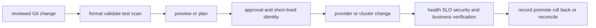

# Infrastructure as Code and delivery

<!-- chapter-guide:start -->
> **Step 178 of 373 — 09**
>
> **Builds on:** [GCP operations, security and cost](../08-gcp/08-gcp-operations-security-and-cost/README.md)
>
> **Now:** Learn **Infrastructure as Code and delivery** from its mental model through production ownership.
>
> **Then:** Rehearse the linked questions and continue to [Terraform](01-terraform/README.md).
<!-- chapter-guide:end -->

## Integrated delivery mental model

Terraform and Pulumi turn reviewed desired state into provider API operations; CI/CD supplies the trusted identity, policy gates, tests, approvals, artifact provenance and environment promotion around that change. State is sensitive coordination data, not a casual cache. A senior engineer must be able to explain graph/dependency evaluation, previews/plans, state and locking, refactors/import, drift, secrets, runner trust, progressive delivery, rollback and evidence.

## Practical starting exercise

In an isolated directory and sandbox account, create the smallest configuration, run format/validate/test and a saved preview/plan, inspect every action and dependency, then apply only after confirming identity and cost. Make a non-destructive source change, inspect the new diff, revert it, and verify no drift. Finally inspect the destroy preview before cleaning up only the named sandbox stack. Continue into the child Terraform, Pulumi and CI/CD notes for runnable code and local banks.

Reliability and observability evidence must connect the reviewed source and plan to provider events, runtime health, user outcomes and rollback; a successful apply alone is not proof of a safe delivery.

Authoritative starting points: [Terraform documentation](https://developer.hashicorp.com/terraform/docs), [Pulumi documentation](https://www.pulumi.com/docs/), and [GitHub Actions documentation](https://docs.github.com/en/actions).

<!-- reading-navigation:start -->
---

**Reading path:** [← Back: GCP operations, security and cost](../08-gcp/08-gcp-operations-security-and-cost/README.md) · [Questions](questions-and-answers.md) · [Next: Terraform →](01-terraform/README.md)

<!-- reading-navigation:end -->
