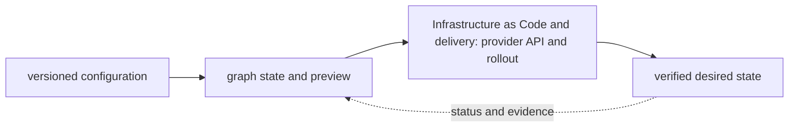
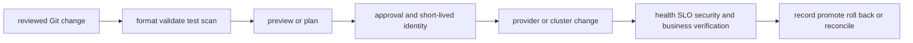

# Infrastructure as Code and delivery

<!-- chapter-guide:start -->
> **Step 178 of 373 — 09**
>
> **Builds on:** [GCP operations, security and cost](../08-gcp/08-gcp-operations-security-and-cost/README.md)
>
> **Now:** Learn **Infrastructure as Code and delivery** from its mental model through production ownership.
>
> **Then:** Rehearse the linked questions and continue to [Terraform](01-terraform/README.md).
<!-- chapter-guide:end -->

<!-- explanation-practice-normalizer:v1 -->


## Explanation

### What this chapter is and why it exists

**Infrastructure as Code and delivery** is easiest to understand as one part of a larger path. The subject turns version-controlled intent into a reviewed state transition. A tool parses configuration, resolves dependencies, compares desired and recorded/remote state, proposes a change set and calls provider APIs after approval.

The chapter focuses on Infrastructure as Code and delivery. These are connected mechanisms, not vocabulary to memorize. The infrastructure-delivery branch explains how source configuration, dependency graphs, state, plans, artifacts and promotion produce reviewed runtime changes The explanations below first build the simple model, then add the exact system behavior and production consequences.

### History and evolution

Infrastructure automation evolved from shell scripts and host configuration tools into declarative resource graphs, remote state and reviewed delivery pipelines. Terraform popularized provider-based declarative provisioning from 2014, while later tools and GitOps connected infrastructure changes to normal software review, testing and promotion practices.

In this chapter, **Infrastructure as Code and delivery** is the next layer of that evolution. Its modern purpose is to the infrastructure-delivery branch explains how source configuration, dependency graphs, state, plans, artifacts and promotion produce reviewed runtime changes. The exact product surface may change by version, but the underlying state, request path and failure boundaries remain the durable ideas to learn.

### How the complete branch works



A branch overview connects child mechanisms into one lifecycle. The input crosses identity and policy, a control or decision plane, the runtime data path and its dependencies before producing a user-visible result. Status and telemetry travel back through the loop so operators and controllers can correct drift or failure. Reading the child chapters adds precision, but this overview explains why those chapters depend on one another.

A useful test of understanding is to trace one concrete request or change from origin to outcome and name the authoritative state at each boundary. That trace reveals where work is synchronous or asynchronous, which failure domains are independent, what a timeout can prove, and which evidence distinguishes accepted intent from healthy behavior.

### Integrated delivery mental model

Terraform and Pulumi turn reviewed desired state into provider API operations; CI/CD supplies the trusted identity, policy gates, tests, approvals, artifact provenance and environment promotion around that change. State is sensitive coordination data, not a casual cache. A senior engineer must be able to explain graph/dependency evaluation, previews/plans, state and locking, refactors/import, drift, secrets, runner trust, progressive delivery, rollback and evidence.



## Practice

### Practical starting exercise

In an isolated directory and sandbox account, create the smallest configuration, run format/validate/test and a saved preview/plan, inspect every action and dependency, then apply only after confirming identity and cost. Make a non-destructive source change, inspect the new diff, revert it, and verify no drift. Finally inspect the destroy preview before cleaning up only the named sandbox stack. Continue into the child Terraform, Pulumi and CI/CD notes for runnable code and local banks.

Reliability and observability evidence must connect the reviewed source and plan to provider events, runtime health, user outcomes and rollback; a successful apply alone is not proof of a safe delivery.

Authoritative starting points: [Terraform documentation](https://developer.hashicorp.com/terraform/docs), [Pulumi documentation](https://www.pulumi.com/docs/), and [GitHub Actions documentation](https://docs.github.com/en/actions).

### Practice objective

Build a small, safe proof of **Infrastructure as Code and delivery** and explain the result in your own words. The goal is not command completion; it is to connect input, internal mechanism, observable state and user outcome.

### Prerequisites and setup

Use a disposable local environment, sandbox account/project or isolated namespace. Confirm the effective identity and target, record the start time, and set a cost limit before creating anything.

Record tool and platform versions because flags, APIs and defaults can change. Define every uppercase placeholder before use and keep secrets out of shell history and committed files.

### Activity 1: establish a healthy baseline

Run the read-oriented example first:

```bash
terraform fmt -check -recursive
terraform validate
terraform plan
```

For each line, write down the layer it inspects, the expected healthy field or response, and one thing it cannot prove. The expected result is an attributable request against the intended target plus enough state to draw the path from input to outcome.

### Activity 2: create or review the smallest working example

Put the smallest relevant command, configuration, manifest or code sample in source control. Validate or lint it, produce a preview/diff where the tool supports one, and apply only inside the disposable boundary. Record the exact revision and resulting resource or process ID. If the topic is observational rather than configurable, save a sanitized baseline and an automated assertion instead of mutating the system.

### Activity 3: controlled failure and troubleshooting

Introduce one bounded failure: use a definitely nonexistent resource name, an invalid sandbox-only value, a denied test identity, a closed test port or a stopped disposable dependency. Capture the exact error and classify it as identity/policy, input/configuration, control-plane reconciliation, network/protocol, dependency or capacity. Test one discriminating hypothesis at a time; do not widen access or restart unrelated components.

Expected failure evidence is a specific non-zero exit, status/reason, event or protocol response that disappears when the controlled fault is removed. If healthy and failing runs look identical, the chosen signal does not explain the phenomenon and the exercise is not complete.

### Verification

Repeat the original client or user-facing check, not only an administrative status command. Confirm the desired revision, data correctness where applicable, error and latency recovery, and absence of a continuing retry/backlog/saturation condition. Explain why this evidence proves recovery and what uncertainty remains.

### Cleanup and rollback

Revert the configuration in its source of truth and review the rollback diff before applying it. Delete only the named sandbox resources, stop disposable processes, remove temporary credentials and verify that no billable resource, volume, artifact, queue item or background job remains. Read-only activities require no infrastructure rollback, but sanitized captures must still follow retention policy.

### Harder extension

Automate the healthy and failing paths in CI, use short-lived identity, add one SLI/alert or policy assertion, and write a five-step runbook another engineer can execute without hidden context. Then explain how the design changes for two tenants, a zonal or dependency failure, 10× load and a strict cost or recovery target.

<!-- reading-navigation:start -->
---

**Reading path:** [← Back: GCP operations, security and cost](../08-gcp/08-gcp-operations-security-and-cost/README.md) · [Questions](questions-and-answers.md) · [Next: Terraform →](01-terraform/README.md)

<!-- reading-navigation:end -->
