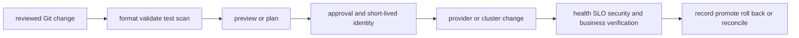

# Infrastructure as Code and delivery

<!-- child-topic-toc:start -->
## Table of contents and deeper notes

This parent note explains how the child topics work together. Follow each child link for the deeper mechanism, real commands/configuration, hands-on practice, authoritative documentation, and its local interview bank.

- [CI/CD](ci-cd/README.md) — [questions and answers](ci-cd/questions-and-answers.md)
- [Pulumi](pulumi/README.md) — [questions and answers](pulumi/questions-and-answers.md)
- [Terraform](terraform/README.md) — [questions and answers](terraform/questions-and-answers.md)
<!-- child-topic-toc:end -->
<!-- generated-topic-index:start -->
## Deep topic branches

- [Terraform](terraform/README.md) — [Q&A](terraform/questions-and-answers.md)
- [Pulumi](pulumi/README.md) — [Q&A](pulumi/questions-and-answers.md)
- [CI/CD](ci-cd/README.md) — [Q&A](ci-cd/questions-and-answers.md)
<!-- generated-topic-index:end -->

## Integrated delivery mental model

Terraform and Pulumi turn reviewed desired state into provider API operations; CI/CD supplies the trusted identity, policy gates, tests, approvals, artifact provenance and environment promotion around that change. State is sensitive coordination data, not a casual cache. A senior engineer must be able to explain graph/dependency evaluation, previews/plans, state and locking, refactors/import, drift, secrets, runner trust, progressive delivery, rollback and evidence.

## Practical starting exercise

In an isolated directory and sandbox account, create the smallest configuration, run format/validate/test and a saved preview/plan, inspect every action and dependency, then apply only after confirming identity and cost. Make a non-destructive source change, inspect the new diff, revert it, and verify no drift. Finally inspect the destroy preview before cleaning up only the named sandbox stack. Continue into the child Terraform, Pulumi and CI/CD notes for runnable code and local banks.

Authoritative starting points: [Terraform documentation](https://developer.hashicorp.com/terraform/docs), [Pulumi documentation](https://www.pulumi.com/docs/), and [GitHub Actions documentation](https://docs.github.com/en/actions).
