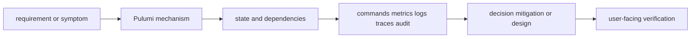
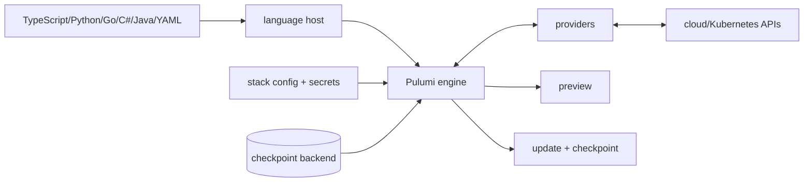

# Pulumi

<!-- child-topic-toc:start -->
## Table of contents and deeper notes

This parent note explains how the child topics work together. Follow each child link for the deeper mechanism, real commands/configuration, hands-on practice, authoritative documentation, and its local interview bank.

- [Component resources](component-resources/README.md) — [questions and answers](component-resources/questions-and-answers.md)
- [Pulumi Automation API](pulumi-automation-api/README.md) — [questions and answers](pulumi-automation-api/questions-and-answers.md)
- [Pulumi CI/CD](pulumi-ci-cd/README.md) — [questions and answers](pulumi-ci-cd/questions-and-answers.md)
- [Pulumi concepts](pulumi-concepts/README.md) — [questions and answers](pulumi-concepts/questions-and-answers.md)
- [Pulumi languages](pulumi-languages/README.md) — [questions and answers](pulumi-languages/questions-and-answers.md)
- [Pulumi policies](pulumi-policies/README.md) — [questions and answers](pulumi-policies/questions-and-answers.md)
- [Pulumi state](pulumi-state/README.md) — [questions and answers](pulumi-state/questions-and-answers.md)
- [Terraform versus Pulumi](terraform-versus-pulumi/README.md) — [questions and answers](terraform-versus-pulumi/questions-and-answers.md)
<!-- child-topic-toc:end -->
> [Interview questions and answers](questions-and-answers.md) · [Master curriculum](../../curriculum/master-curriculum.txt) · Official starting point: <https://www.pulumi.com/docs/>

## Easy mode: mental model

Integrate every part of Pulumi into one secure, reliable, observable, supportable and cost-aware production capability.

Learn this topic in layers: name the object or mechanism, trace its lifecycle/data path, configure it safely, observe a healthy and failed state, recover it, and then design it across failure domains and team boundaries.



## Deeper topic folders

- [30.1 Pulumi concepts](pulumi-concepts/README.md) — [Q&A](pulumi-concepts/questions-and-answers.md)
- [30.2 Pulumi languages](pulumi-languages/README.md) — [Q&A](pulumi-languages/questions-and-answers.md)
- [30.3 Pulumi state](pulumi-state/README.md) — [Q&A](pulumi-state/questions-and-answers.md)
- [30.4 Component resources](component-resources/README.md) — [Q&A](component-resources/questions-and-answers.md)
- [30.5 Pulumi Automation API](pulumi-automation-api/README.md) — [Q&A](pulumi-automation-api/questions-and-answers.md)
- [30.6 Pulumi policies](pulumi-policies/README.md) — [Q&A](pulumi-policies/questions-and-answers.md)
- [30.7 Pulumi CI/CD](pulumi-ci-cd/README.md) — [Q&A](pulumi-ci-cd/questions-and-answers.md)
- [30.8 Terraform versus Pulumi](terraform-versus-pulumi/README.md) — [Q&A](terraform-versus-pulumi/questions-and-answers.md)

## Complete curriculum checklist

| # | Topic | What you must understand and demonstrate |
|---:|---|---|
| 1 | **Pulumi supports general-purpose programming languages, state backends, policy enforcement, CI/CD workflows and Automation API-driven turn589377search39** | defines a trust/control boundary: identify actor, protected asset, decision/enforcement point, least privilege, bypass path, audit evidence, rotation/revocation and recovery. |
| 2 | **Projects** | is part of Pulumi; learn its precise definition, mechanism and lifecycle, nearest alternatives, configuration interface, failure/limit, security boundary, observable evidence and production trade-off. |
| 3 | **Stacks** | is part of Pulumi; learn its precise definition, mechanism and lifecycle, nearest alternatives, configuration interface, failure/limit, security boundary, observable evidence and production trade-off. |
| 4 | **Resources** | is part of Pulumi; learn its precise definition, mechanism and lifecycle, nearest alternatives, configuration interface, failure/limit, security boundary, observable evidence and production trade-off. |
| 5 | **Inputs** | is part of Pulumi; learn its precise definition, mechanism and lifecycle, nearest alternatives, configuration interface, failure/limit, security boundary, observable evidence and production trade-off. |
| 6 | **Outputs** | is part of Pulumi; learn its precise definition, mechanism and lifecycle, nearest alternatives, configuration interface, failure/limit, security boundary, observable evidence and production trade-off. |
| 7 | **Providers** | is part of Pulumi; learn its precise definition, mechanism and lifecycle, nearest alternatives, configuration interface, failure/limit, security boundary, observable evidence and production trade-off. |
| 8 | **Components** | is part of Pulumi; learn its precise definition, mechanism and lifecycle, nearest alternatives, configuration interface, failure/limit, security boundary, observable evidence and production trade-off. |
| 9 | **Configuration** | is part of Pulumi; learn its precise definition, mechanism and lifecycle, nearest alternatives, configuration interface, failure/limit, security boundary, observable evidence and production trade-off. |
| 10 | **Secrets** | is part of Pulumi; learn its precise definition, mechanism and lifecycle, nearest alternatives, configuration interface, failure/limit, security boundary, observable evidence and production trade-off. |
| 11 | **TypeScript** | is part of Pulumi; learn its precise definition, mechanism and lifecycle, nearest alternatives, configuration interface, failure/limit, security boundary, observable evidence and production trade-off. |
| 12 | **Python** | is part of Pulumi; learn its precise definition, mechanism and lifecycle, nearest alternatives, configuration interface, failure/limit, security boundary, observable evidence and production trade-off. |
| 13 | **Go** | is part of Pulumi; learn its precise definition, mechanism and lifecycle, nearest alternatives, configuration interface, failure/limit, security boundary, observable evidence and production trade-off. |
| 14 | **C#** | is part of Pulumi; learn its precise definition, mechanism and lifecycle, nearest alternatives, configuration interface, failure/limit, security boundary, observable evidence and production trade-off. |
| 15 | **Java** | is part of Pulumi; learn its precise definition, mechanism and lifecycle, nearest alternatives, configuration interface, failure/limit, security boundary, observable evidence and production trade-off. |
| 16 | **YAML** | is part of Pulumi; learn its precise definition, mechanism and lifecycle, nearest alternatives, configuration interface, failure/limit, security boundary, observable evidence and production trade-off. |
| 17 | **Language-selection trade-offs** | is part of Pulumi; learn its precise definition, mechanism and lifecycle, nearest alternatives, configuration interface, failure/limit, security boundary, observable evidence and production trade-off. |
| 18 | **Pulumi Cloud backend** | is part of Pulumi; learn its precise definition, mechanism and lifecycle, nearest alternatives, configuration interface, failure/limit, security boundary, observable evidence and production trade-off. |
| 19 | **DIY backends** | is part of Pulumi; learn its precise definition, mechanism and lifecycle, nearest alternatives, configuration interface, failure/limit, security boundary, observable evidence and production trade-off. |
| 20 | **State encryption** | is part of Pulumi; learn its precise definition, mechanism and lifecycle, nearest alternatives, configuration interface, failure/limit, security boundary, observable evidence and production trade-off. |
| 21 | **State locking** | is part of Pulumi; learn its precise definition, mechanism and lifecycle, nearest alternatives, configuration interface, failure/limit, security boundary, observable evidence and production trade-off. |
| 22 | **State recovery** | is a controlled state transition requiring inventory, compatibility, protected state, rehearsal, rollback/abort criteria, integrity checks and measured user-facing RPO/RTO or completion. |
| 23 | **Import** | is part of Pulumi; learn its precise definition, mechanism and lifecycle, nearest alternatives, configuration interface, failure/limit, security boundary, observable evidence and production trade-off. |
| 24 | **Refresh** | is part of Pulumi; learn its precise definition, mechanism and lifecycle, nearest alternatives, configuration interface, failure/limit, security boundary, observable evidence and production trade-off. |
| 25 | **Drift** | is part of Pulumi; learn its precise definition, mechanism and lifecycle, nearest alternatives, configuration interface, failure/limit, security boundary, observable evidence and production trade-off. |
| 26 | **Reusable components** | is part of Pulumi; learn its precise definition, mechanism and lifecycle, nearest alternatives, configuration interface, failure/limit, security boundary, observable evidence and production trade-off. |
| 27 | **Platform abstractions** | is part of Pulumi; learn its precise definition, mechanism and lifecycle, nearest alternatives, configuration interface, failure/limit, security boundary, observable evidence and production trade-off. |
| 28 | **Inputs and outputs** | is part of Pulumi; learn its precise definition, mechanism and lifecycle, nearest alternatives, configuration interface, failure/limit, security boundary, observable evidence and production trade-off. |
| 29 | **Resource parenting** | is part of Pulumi; learn its precise definition, mechanism and lifecycle, nearest alternatives, configuration interface, failure/limit, security boundary, observable evidence and production trade-off. |
| 30 | **Provider inheritance** | is part of Pulumi; learn its precise definition, mechanism and lifecycle, nearest alternatives, configuration interface, failure/limit, security boundary, observable evidence and production trade-off. |
| 31 | **Versioning** | is part of Pulumi; learn its precise definition, mechanism and lifecycle, nearest alternatives, configuration interface, failure/limit, security boundary, observable evidence and production trade-off. |
| 32 | **Programmatic deployments** | is part of Pulumi; learn its precise definition, mechanism and lifecycle, nearest alternatives, configuration interface, failure/limit, security boundary, observable evidence and production trade-off. |
| 33 | **Embedded IaC** | is part of Pulumi; learn its precise definition, mechanism and lifecycle, nearest alternatives, configuration interface, failure/limit, security boundary, observable evidence and production trade-off. |
| 34 | **Self-service platforms** | is part of Pulumi; learn its precise definition, mechanism and lifecycle, nearest alternatives, configuration interface, failure/limit, security boundary, observable evidence and production trade-off. |
| 35 | **Stack creation** | is part of Pulumi; learn its precise definition, mechanism and lifecycle, nearest alternatives, configuration interface, failure/limit, security boundary, observable evidence and production trade-off. |
| 36 | **Preview** | is part of Pulumi; learn its precise definition, mechanism and lifecycle, nearest alternatives, configuration interface, failure/limit, security boundary, observable evidence and production trade-off. |
| 37 | **Update** | is part of Pulumi; learn its precise definition, mechanism and lifecycle, nearest alternatives, configuration interface, failure/limit, security boundary, observable evidence and production trade-off. |
| 38 | **Destroy** | is part of Pulumi; learn its precise definition, mechanism and lifecycle, nearest alternatives, configuration interface, failure/limit, security boundary, observable evidence and production trade-off. |
| 39 | **Event streaming** | is part of Pulumi; learn its precise definition, mechanism and lifecycle, nearest alternatives, configuration interface, failure/limit, security boundary, observable evidence and production trade-off. |
| 40 | **Error handling** | is part of Pulumi; learn its precise definition, mechanism and lifecycle, nearest alternatives, configuration interface, failure/limit, security boundary, observable evidence and production trade-off. |
| 41 | **Policy as code** | defines a trust/control boundary: identify actor, protected asset, decision/enforcement point, least privilege, bypass path, audit evidence, rotation/revocation and recovery. |
| 42 | **Advisory policies** | is part of Pulumi; learn its precise definition, mechanism and lifecycle, nearest alternatives, configuration interface, failure/limit, security boundary, observable evidence and production trade-off. |
| 43 | **Mandatory policies** | is part of Pulumi; learn its precise definition, mechanism and lifecycle, nearest alternatives, configuration interface, failure/limit, security boundary, observable evidence and production trade-off. |
| 44 | **CrossGuard** | is part of Pulumi; learn its precise definition, mechanism and lifecycle, nearest alternatives, configuration interface, failure/limit, security boundary, observable evidence and production trade-off. |
| 45 | **Organizational policies** | is part of Pulumi; learn its precise definition, mechanism and lifecycle, nearest alternatives, configuration interface, failure/limit, security boundary, observable evidence and production trade-off. |
| 46 | **Compliance controls** | is part of Pulumi; learn its precise definition, mechanism and lifecycle, nearest alternatives, configuration interface, failure/limit, security boundary, observable evidence and production trade-off. |
| 47 | **Preview on pull request** | is part of Pulumi; learn its precise definition, mechanism and lifecycle, nearest alternatives, configuration interface, failure/limit, security boundary, observable evidence and production trade-off. |
| 48 | **Apply after approval** | is part of Pulumi; learn its precise definition, mechanism and lifecycle, nearest alternatives, configuration interface, failure/limit, security boundary, observable evidence and production trade-off. |
| 49 | **OIDC** | is part of Pulumi; learn its precise definition, mechanism and lifecycle, nearest alternatives, configuration interface, failure/limit, security boundary, observable evidence and production trade-off. |
| 50 | **Secret handling** | is part of Pulumi; learn its precise definition, mechanism and lifecycle, nearest alternatives, configuration interface, failure/limit, security boundary, observable evidence and production trade-off. |
| 51 | **Drift detection** | is part of Pulumi; learn its precise definition, mechanism and lifecycle, nearest alternatives, configuration interface, failure/limit, security boundary, observable evidence and production trade-off. |
| 52 | **Stack promotion** | is part of Pulumi; learn its precise definition, mechanism and lifecycle, nearest alternatives, configuration interface, failure/limit, security boundary, observable evidence and production trade-off. |
| 53 | **Rollback** | is part of Pulumi; learn its precise definition, mechanism and lifecycle, nearest alternatives, configuration interface, failure/limit, security boundary, observable evidence and production trade-off. |
| 54 | **Declarative HCL versus general-purpose languages** | is a design comparison: define both sides, contrast mechanism and guarantees, then select using workload, failure, security, ownership and cost evidence rather than preference. |
| 55 | **State models** | is part of Pulumi; learn its precise definition, mechanism and lifecycle, nearest alternatives, configuration interface, failure/limit, security boundary, observable evidence and production trade-off. |
| 56 | **Testing** | is part of Pulumi; learn its precise definition, mechanism and lifecycle, nearest alternatives, configuration interface, failure/limit, security boundary, observable evidence and production trade-off. |
| 57 | **Reuse** | is part of Pulumi; learn its precise definition, mechanism and lifecycle, nearest alternatives, configuration interface, failure/limit, security boundary, observable evidence and production trade-off. |
| 58 | **Provider maturity** | is part of Pulumi; learn its precise definition, mechanism and lifecycle, nearest alternatives, configuration interface, failure/limit, security boundary, observable evidence and production trade-off. |
| 59 | **Team skills** | is part of Pulumi; learn its precise definition, mechanism and lifecycle, nearest alternatives, configuration interface, failure/limit, security boundary, observable evidence and production trade-off. |
| 60 | **Platform API integration** | is part of Pulumi; learn its precise definition, mechanism and lifecycle, nearest alternatives, configuration interface, failure/limit, security boundary, observable evidence and production trade-off. |
| 61 | **Migration strategies** | is a controlled state transition requiring inventory, compatibility, protected state, rehearsal, rollback/abort criteria, integrity checks and measured user-facing RPO/RTO or completion. |

## Beginner → mid-level → senior learning path

1. **Beginner:** define every term; identify the relevant file, object, protocol, API, or command; explain one normal use.
2. **Mid-level:** configure it from source control, inspect effective runtime state, diagnose two failure modes, automate a safe change, and explain one trade-off.
3. **Senior:** clarify ambiguous requirements, map trust and failure domains, quantify capacity/SLO/RPO/RTO/cost, compare alternatives, plan migration/rollback, and assign ownership.

## Command and configuration lab

Run read-only checks first in a sandbox. For each command, predict healthy output, one failing result, the next discriminating check, and the safe rollback for any later mutation.

```bash
terraform fmt -check -recursive
terraform validate; terraform plan
pulumi preview --diff
git diff --check
```

## Hands-on practice: setup → failure → verification → cleanup

Use a disposable state/backend and sandbox account. Format, validate and test first; preview/plan and save the reviewed output; apply one harmless tagged resource only after checking identity and estimated cost; introduce a configuration-only diff; inspect the plan; revert it in source; and verify no drift. Destroy only the exact sandbox stack after inspecting the destroy preview and retaining no required state.

Expected result: you can show the healthy evidence, reproduce a safe failure, explain why each command distinguishes one layer from another, restore the baseline, and prove cleanup. Hard extension: automate the lab from source control, add a test or alert for the injected failure, and write a five-step runbook another engineer can execute.

For code/configuration, be ready to review an intentionally unsafe diff and improve idempotency, secret handling, timeouts, validation, logging, tests, and rollback.

## Senior design checklist

State assumptions for tenants, traffic/work units, latency and availability targets, data classification/residency, recovery, team skills and budget. Draw control/data planes and synchronous/asynchronous dependencies. Cover identity, policy, encryption/key lifecycle, delivery provenance, observability, capacity, unit cost, operational ownership, migration and exit criteria. Name the evidence that would cause you to revise the design.

## Revision and practice

Complete the separate [checkbox interview bank](questions-and-answers.md). Do not memorize wording: speak in the order **definition → mechanism → evidence/configuration → failure/trade-off → production example**. For procedures use **stabilize → scope → inspect → hypothesize → test → mitigate → verify → prevent**.

<!-- merged-practical-pulumi-note:start -->
## Practical Pulumi deep dive

## 1. Mental model

Pulumi evaluates a program in a supported language, registers desired resources with the deployment engine, calls providers and stores checkpoint state. A project groups code; a stack is an isolated configured instance. `Input<T>` can be immediate or eventual; `Output<T>` represents engine-tracked asynchronous values with dependency and secret metadata. Do not unwrap Outputs by blocking or stringify them accidentally.



## 2. Repository, project, stack and program structure

One Pulumi **project** is described by `Pulumi.yaml` and contains one program. A **stack** is an independently configured and state-tracked instance of that project, such as `dev`, `staging`, or `production`. The program registers resources; providers translate those registrations into cloud/Kubernetes API calls; the backend holds deployment checkpoints and locks.

```text
infrastructure/
├── Pulumi.yaml                 # project metadata/runtime/config schema
├── Pulumi.dev.yaml             # stack config; encrypted secret ciphertext may be committed
├── Pulumi.production.yaml
├── package.json                # language dependencies (TypeScript example)
├── package-lock.json
├── tsconfig.json
├── index.ts                    # program entry point
├── components/
│   ├── model-serving.ts        # ComponentResource golden path
│   └── network.ts
├── policy/
│   ├── PulumiPolicy.yaml
│   └── index.ts
├── tests/
│   ├── unit.test.ts
│   └── integration.test.ts
└── scripts/
    ├── verify.sh
    └── smoke-test.sh
```

### `Pulumi.yaml` project file

The filename begins with capital `P`. The language runtime tells Pulumi which language host executes the program. The `config` block can define a typed project configuration schema and defaults; provider-specific values such as `aws:region` are normally set in stack configuration.

```yaml
name: ai-platform
runtime:
  name: nodejs
  options:
    typescript: true
description: GPU inference platform infrastructure
main: .
stackConfigDir: stacks

config:
  ai-platform:owner:
    type: string
  ai-platform:replicas:
    type: integer
    default: 2
  ai-platform:allowedCidrs:
    type: array
    items:
      type: string
  ai-platform:apiToken:
    type: string
    secret: true
```

Common project-file concerns:

- `name` is the project identity and participates in stack/resource URNs; rename it as a migration, not cosmetic text.
- `runtime` may be Node.js/TypeScript, Python, Go, .NET, Java or YAML, with runtime-specific options.
- `main` relocates the program entry directory.
- `stackConfigDir` moves `Pulumi.<stack>.yaml` files to a defined directory.
- `config` documents and validates project-level inputs. A schema marked `secret` prevents accidental plaintext CLI configuration, but application code can still disclose a secret after reading it.
- In a Pulumi YAML program, the project file can also contain top-level `variables`, `resources` and `outputs` infrastructure definitions.

### `Pulumi.<stack>.yaml` stack configuration

```yaml
config:
  aws:region: eu-central-1
  ai-platform:owner: platform-team
  ai-platform:replicas: 3
  ai-platform:allowedCidrs:
    - 10.20.0.0/16
  ai-platform:apiToken:
    secure: ENCRYPTED_CIPHERTEXT_FROM_PULUMI
  ai-platform:release:
    modelDigest: sha256:REPLACE_WITH_VERIFIED_DIGEST
    runtimeImage: registry.example/inference@sha256:REPLACE_WITH_VERIFIED_DIGEST
```

The stack file is configuration, not the state checkpoint. `secure:` values are ciphertext tied to the configured secrets provider and can usually be committed, but access to decrypt, stack history and backups remains sensitive. Do not manually invent ciphertext. Set values with the CLI and inspect effective config:

```bash
pulumi stack select organization/ai-platform/dev
pulumi config set owner platform-team
pulumi config set replicas 3
pulumi config set --path 'allowedCidrs[0]' 10.20.0.0/16
pulumi config set --secret apiToken 'VALUE_FROM_SECURE_INPUT'
pulumi config
pulumi config get owner
```

### Program entry and language files

For TypeScript, `index.ts` is the ordinary entry; `package.json`, lock file and `tsconfig.json` make the language environment reproducible. For Python, expect `__main__.py` (or configured entry), `requirements.txt`/`pyproject.toml` and lock data. Go compiles a normal module/program. General-purpose language code must still be deterministic during Pulumi evaluation: do not make unmanaged side effects, read changing remote data without a data source, or create resources outside the engine.

```typescript
import * as pulumi from "@pulumi/pulumi";
import * as aws from "@pulumi/aws";
import { ModelServing } from "./components/model-serving";

const config = new pulumi.Config();
const owner = config.require("owner");
const replicas = config.getNumber("replicas") ?? 2;
const apiToken = config.requireSecret("apiToken");

const provider = new aws.Provider("regional", {
  region: "eu-central-1",
  defaultTags: { tags: { Owner: owner, Stack: pulumi.getStack() } },
});

const serving = new ModelServing("gateway", {
  replicas,
  apiToken,
}, { provider, protect: pulumi.getStack() === "production" });

export const endpoint = serving.endpoint;
```

### Resource anatomy and options

Every custom resource generally has a logical name, provider-specific arguments and `ResourceOptions`:

```typescript
const bucket = new aws.s3.BucketV2("model-artifacts", {
  forceDestroy: false,
  tags: { DataClass: "model-artifact" },
}, {
  provider,
  parent: serving,
  protect: true,
  aliases: [{ name: "models" }],
  dependsOn: [auditLogBucket],
  ignoreChanges: ["tags[ExternalController]"] ,
});
```

- Logical name plus project/stack/type/parent contributes to the URN and state identity.
- Arguments are desired provider inputs and may contain `Input<T>`/`Output<T>` values.
- `parent` creates component hierarchy and provider inheritance.
- `provider`/`providers` select explicit provider instances; never rely on an unintended default account/region.
- `protect` blocks Pulumi-driven deletion, but does not prevent console/provider deletion and is not a backup.
- `aliases` preserve identity across supported rename/reparent/refactor operations.
- `dependsOn` expresses hidden behavioral ordering only; output-to-input references create normal graph dependencies.
- `ignoreChanges`, `replaceOnChanges`, `retainOnDelete`, deletion timeouts and transformations/hook options can be useful but may hide drift or change destruction semantics. Review preview carefully.

### Project, stack, backend and secrets identities

Keep these separate:

| Identity | Example | Responsibility |
|---|---|---|
| Project | `ai-platform` | Program/metadata/config schema. |
| Stack | `organization/ai-platform/production` | Isolated config plus checkpoint history and lock. |
| Backend | Pulumi Cloud or `s3://...`, `azblob://...`, `gs://...`, local | Stores stack state/checkpoints; requires backup, access and audit. |
| Secrets provider | Pulumi service, passphrase, cloud KMS or supported provider | Encrypts configuration/checkpoint secrets; rotation/recovery must be tested. |
| Cloud provider | Explicit `aws.Provider`, `kubernetes.Provider`, etc. | Account/project, region/cluster, credentials and defaults used for resource calls. |

The same stack name on two backends is different state. `pulumi login` changes backend; `pulumi stack select` changes stack; cloud credentials change the target APIs. Print and verify all three before preview/update.

### Pulumi YAML program structure

Pulumi YAML expresses variables/resources/outputs directly in YAML:

```yaml
name: model-storage
runtime: yaml
config:
  owner:
    type: string
resources:
  models:
    type: aws:s3:BucketV2
    properties:
      tags:
        Owner: ${owner}
  publicAccessBlock:
    type: aws:s3:BucketPublicAccessBlock
    properties:
      bucket: ${models.id}
      blockPublicAcls: true
      blockPublicPolicy: true
      ignorePublicAcls: true
      restrictPublicBuckets: true
outputs:
  bucketName: ${models.bucket}
```

YAML removes general-language tooling but has its own interpolation, function and resource-reference rules. Choose the runtime based on team skill, abstraction/testing needs and control-plane integration—not the belief that one format eliminates state or provider failure.

### Lifecycle commands from safe inspection to cleanup

```bash
pulumi version
pulumi whoami -v
pulumi about
pulumi stack --show-name
pulumi config --show-secrets=false
pulumi preview --diff --refresh=false
pulumi up --diff
pulumi stack output --json
pulumi history
pulumi refresh --preview-only --diff
pulumi destroy --preview-only
```

Preview is a proposal based on program, configuration, state, provider reads/defaults and credentials. Provider behavior is not globally transactional, so cancellation/failure can leave partial cloud effects; the engine checkpoint and refresh/reconciliation path matter.

## 3. TypeScript production example

```typescript
import * as pulumi from "@pulumi/pulumi";
import * as aws from "@pulumi/aws";

const cfg = new pulumi.Config();
const environment = pulumi.getStack();
const owner = cfg.require("owner");

const provider = new aws.Provider("eu-central", {
  region: "eu-central-1",
  defaultTags: {
    tags: { ManagedBy: "pulumi", Environment: environment, Owner: owner },
  },
});

const models = new aws.s3.BucketV2("models", {
  forceDestroy: false,
}, {
  provider,
  protect: environment === "prod",
});

new aws.s3.BucketVersioningV2("models-versioning", {
  bucket: models.id,
  versioningConfiguration: { status: "Enabled" },
}, { provider, parent: models });

new aws.s3.BucketPublicAccessBlock("models-public-block", {
  bucket: models.id,
  blockPublicAcls: true,
  blockPublicPolicy: true,
  ignorePublicAcls: true,
  restrictPublicBuckets: true,
}, { provider, parent: models });

export const modelBucket = models.bucket;
```

```bash
pulumi login
pulumi stack init prod
pulumi config set owner ai-platform
pulumi config set --secret apiToken VALUE
pulumi preview --diff
pulumi up --yes
pulumi stack output --json
pulumi refresh --preview-only
pulumi history
```

Use stack/project naming and backends as ownership boundaries. A `protect` option blocks Pulumi deletion but is not backup. Provider credentials should be short-lived; Pulumi secret ciphertext depends on the stack secrets provider and can still leak if code exports/logs plaintext.

## 3. Inputs, Outputs and dependency correctness

```typescript
const url: pulumi.Output<string> = pulumi.interpolate`https://${loadBalancer.dnsName}`;

const policy = bucket.arn.apply(arn => JSON.stringify({
  Version: "2012-10-17",
  Statement: [{ Effect: "Allow", Action: ["s3:GetObject"], Resource: `${arn}/*` }],
}));
```

`apply` runs when a value is known and may behave differently during preview. Keep side effects out of it. Output-to-input references automatically track dependency; `dependsOn` is for hidden behavioral dependencies. `pulumi.secret` marks propagation, but third-party code/logging can still disclose values.

Python equivalent:

```python
import pulumi
import pulumi_aws as aws

cfg = pulumi.Config()
token = cfg.require_secret("apiToken")
bucket = aws.s3.BucketV2("models", force_destroy=False,
    opts=pulumi.ResourceOptions(protect=pulumi.get_stack() == "prod"))

endpoint = bucket.bucket.apply(lambda name: f"s3://{name}/models/")
pulumi.export("modelUri", endpoint)
```

## 4. Component resources: platform abstractions

```typescript
interface ModelBucketArgs {
  kmsKeyArn: pulumi.Input<string>;
  retentionDays?: pulumi.Input<number>;
}

class ModelBucket extends pulumi.ComponentResource {
  readonly bucket: aws.s3.BucketV2;

  constructor(name: string, args: ModelBucketArgs, opts?: pulumi.ComponentResourceOptions) {
    super("company:ai:ModelBucket", name, {}, opts);

    this.bucket = new aws.s3.BucketV2(name, {}, { parent: this });
    new aws.s3.BucketServerSideEncryptionConfigurationV2(`${name}-sse`, {
      bucket: this.bucket.id,
      rules: [{ applyServerSideEncryptionByDefault: {
        sseAlgorithm: "aws:kms",
        kmsMasterKeyId: args.kmsKeyArn,
      }}],
    }, { parent: this, deletedWith: this.bucket });

    this.registerOutputs({ bucket: this.bucket.bucket });
  }
}
```

Components encode a cohesive golden path, parent/ownership tree, provider inheritance and output contract. Version them semantically, provide migration notes and avoid creating cloud resources in constructors outside engine registration. Use transformations/hooks/policies carefully; hidden global magic makes review hard.

## 5. State, import, aliases and recovery

Pulumi Cloud or DIY backends store checkpoint history/locks and encrypt secrets according to configuration. Back up, restrict/audit and test recovery. `pulumi refresh` accepts remote reality into state; preview first because it can record deletions/changes. Export/import state is a recovery tool, not a normal editor.

```bash
pulumi stack export --file stack-backup.json
pulumi refresh --preview-only --diff
pulumi import aws:s3/bucketV2:BucketV2 models EXISTING_BUCKET
pulumi state rename 'urn:pulumi:prod::project::old:type::old' NEW_NAME
pulumi cancel
pulumi stack import --file reviewed-recovery.json
```

Aliases preserve identity across resource/type/parent/name refactors:

```typescript
const bucket = new aws.s3.BucketV2("models", {}, {
  aliases: [{ name: "model-artifacts" }],
});
```

Before state changes: freeze updates, export checkpoint and backend version, confirm stack/cloud identity, use aliases/import/state commands, preview for no unintended replace/delete, peer review and validate. `pulumi cancel` releases a stuck update record; it does not undo cloud calls already made.

## 6. Automation API

Automation API embeds Pulumi programs/stacks in a service or CLI, enabling self-service platform APIs. The embedding system becomes a privileged multi-tenant control plane: authenticate/authorize every request, constrain inputs/policy/providers, isolate work directories/state/credentials, serialize per stack, stream redacted events, handle cancellation/timeouts and return durable operation IDs.

```typescript
import { LocalWorkspace } from "@pulumi/pulumi/automation";

const stack = await LocalWorkspace.createOrSelectStack({
  stackName: request.environment,
  projectName: "ai-platform",
  program: async () => {
    const bucket = new aws.s3.BucketV2(`models-${request.tenant}`);
    return { bucket: bucket.bucket };
  },
}, {
  workDir: `/isolated/${operationId}`,
  envVars: shortLivedCredentialEnv,
});

await stack.setConfig("aws:region", { value: request.region });
const preview = await stack.preview({ onOutput: redactAndPersist });
authorizePreview(request.actor, preview.changeSummary);
const result = await stack.up({ onOutput: redactAndPersist });
```

Do not accept arbitrary user programs or environment variables. Define idempotency, operation reconciliation after worker crash, lease/lock ownership, approval expiry, rollback/compensation and audit linkage from API request to Pulumi update and cloud events.

## 7. Policy as code

Pulumi policies can be advisory or mandatory and validate resource properties or stack relationships. Test policy packs and provide remediation/exception process.

```typescript
import { PolicyPack, validateResourceOfType } from "@pulumi/policy";
import * as aws from "@pulumi/aws";

new PolicyPack("ai-platform-guardrails", {
  policies: [{
    name: "s3-public-access-block",
    description: "Model buckets must block public access.",
    enforcementLevel: "mandatory",
    validateResource: validateResourceOfType(aws.s3.BucketPublicAccessBlock,
      (args, _, report) => {
        if (!args.blockPublicAcls || !args.blockPublicPolicy ||
            !args.ignorePublicAcls || !args.restrictPublicBuckets) {
          report("All S3 public access block controls must be true.");
        }
      }),
  }],
});
```

Policy does not see everything—runtime identity/data flow and provider defaults may require external checks. Pin policy pack version with deployment evidence.

## 8. Testing

Unit tests can use mocks to inspect registered inputs; integration tests deploy ephemeral stacks; policy tests exercise violations; post-deploy tests verify cloud behavior.

```typescript
pulumi.runtime.setMocks({
  newResource: args => ({ id: `${args.name}_id`, state: args.inputs }),
  call: args => args.inputs,
});

test("production bucket is protected", async () => {
  const bucket = await import("../index");
  expect(await promise(bucket.modelBucket)).toBeDefined();
});
```

```bash
npm test
pulumi preview --diff --policy-pack ../policy
pulumi up --stack test-${CI_RUN_ID} --yes
pulumi destroy --stack test-${CI_RUN_ID} --yes
pulumi stack rm test-${CI_RUN_ID} --yes
```

Track cleanup even on failure and use dedicated accounts/budgets/TTL.

## 9. CI/CD

```yaml
name: pulumi
on: [pull_request]
permissions: {contents: read, id-token: write}
jobs:
  preview:
    runs-on: ubuntu-latest
    concurrency: {group: pulumi-prod, cancel-in-progress: false}
    steps:
      - uses: actions/checkout@PINNED_COMMIT
      - uses: actions/setup-node@PINNED_COMMIT
      - run: npm ci
      - run: npm test
      - uses: aws-actions/configure-aws-credentials@PINNED_COMMIT
        with: {role-to-assume: arn:aws:iam::123456789012:role/pulumi-preview, aws-region: eu-central-1}
      - run: pulumi preview --stack company/prod --diff --policy-pack ./policy
        env: {PULUMI_ACCESS_TOKEN: "${{ secrets.PULUMI_ACCESS_TOKEN }}"}
```

Use OIDC/dynamic cloud credentials, protected environments, pinned actions/tool/dependencies, preview comments without secrets, per-stack concurrency and drift/refresh schedule. Apply must verify commit/preview freshness and use a narrower workflow trust policy.

## 10. Terraform versus Pulumi

Terraform provides a purpose-built declarative language, large ecosystem and plan/state workflows. Pulumi provides general-language abstraction/testing and Automation API integration, with risks of nondeterministic/side-effectful code and language dependency complexity. Both keep sensitive state and perform non-transactional provider API operations. Choose from team language skill, ecosystem/provider coverage, governance, abstraction needs, control-plane embedding, state/service strategy and exit plan.

Migration is resource identity/state surgery: inventory ownership, select stable boundaries, prevent both tools managing one object, import into target, reach zero-change preview, migrate in waves, retain rollback/backups and remove old binding only after proof.

## 11. Code review and labs

Review side effects/non-determinism, Output/secret handling, resource names/aliases/parents/providers, protect/retain/replace/delete, permissions/config/backend, dependency pinning, tests/policy, preview and unit cost.

Labs:

1. Build the model-bucket Component in TypeScript and Python; compare Output handling.
2. Rename/reparent with and without alias; inspect replacement preview.
3. Import a resource, refresh and reach no-change.
4. Build an Automation API endpoint with operation persistence/idempotency and deliberately crash the worker mid-update.
5. Write mandatory policies for encryption/public access/tags and test allowed exception metadata.
6. Migrate one Terraform-managed resource to Pulumi in a sandbox without recreation.

## Common traps

- A programming language does not make an imperative cloud script; resources still belong to the engine graph.
- `Output.apply` is not a safe place for arbitrary side effects.
- Secret Outputs can leak through logging/export/conversion.
- `refresh` mutates state to observed reality; preview it.
- Canceling an update does not rollback completed provider calls.
- Component abstraction can hide security/cost/replacement; expose a clear contract.

## Revision summary

- Pulumi programs register a desired resource graph backed by checkpoint state.
- Inputs/Outputs carry dependencies and secrecy; treat them deliberately.
- Components are versioned platform contracts; Automation API is a privileged control plane.
- Aliases/import/state recovery preserve resource identity.
- Secure previews, policies, short-lived credentials and per-stack serialization remain essential.

## Documentation and video learning

Official documentation:

- [Pulumi projects overview](https://www.pulumi.com/docs/iac/concepts/projects/)
- [`Pulumi.yaml` project-file reference](https://www.pulumi.com/docs/iac/concepts/projects/project-file/)
- [Stacks](https://www.pulumi.com/docs/iac/concepts/stacks/)
- [Configuration and secrets](https://www.pulumi.com/docs/iac/concepts/config/)
- [Inputs and Outputs](https://www.pulumi.com/docs/iac/concepts/inputs-outputs/)
- [Resource options](https://www.pulumi.com/docs/iac/concepts/options/)
- [Component resources](https://www.pulumi.com/docs/iac/concepts/resources/components/)
- [State and backends](https://www.pulumi.com/docs/iac/concepts/state-and-backends/)
- [Automation API](https://www.pulumi.com/docs/iac/using-pulumi/automation-api/)
- [Policy as Code](https://www.pulumi.com/docs/insights/policy/)
- [Pulumi YAML reference](https://www.pulumi.com/docs/iac/languages-sdks/yaml/yaml-language-reference/)

Video resources (prefer recent videos and check the CLI/runtime version used):

- [Pulumi's official YouTube channel—getting-started videos](https://www.youtube.com/@PulumiTV/search?query=getting%20started)
- [Pulumi's official YouTube channel—Automation API videos](https://www.youtube.com/@PulumiTV/search?query=Automation%20API)
- [Pulumi's official YouTube channel—components and testing](https://www.youtube.com/@PulumiTV/search?query=component%20resources%20testing)

<!-- merged-practical-pulumi-note:end -->
