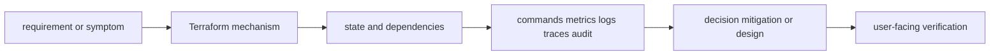
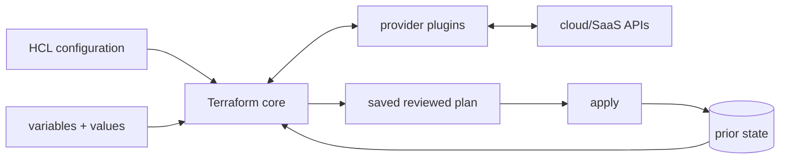
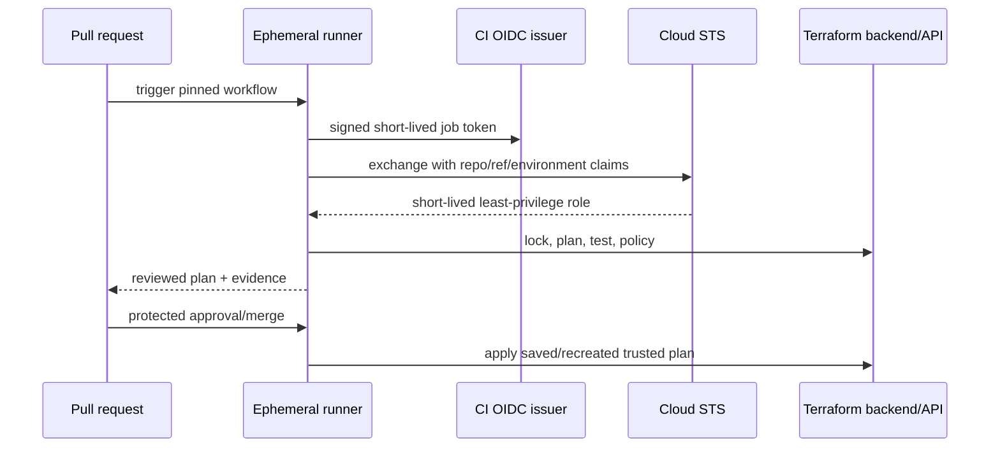

# Terraform

<!-- child-topic-toc:start -->
## Table of contents and deeper notes

This parent note explains how the child topics work together. Follow each child link for the deeper mechanism, real commands/configuration, hands-on practice, authoritative documentation, and its local interview bank.

- [Import and refactoring](import-and-refactoring/README.md) — [questions and answers](import-and-refactoring/questions-and-answers.md)
- [Terraform CI/CD](terraform-ci-cd/README.md) — [questions and answers](terraform-ci-cd/questions-and-answers.md)
- [Terraform environments](terraform-environments/README.md) — [questions and answers](terraform-environments/questions-and-answers.md)
- [Terraform fundamentals](terraform-fundamentals/README.md) — [questions and answers](terraform-fundamentals/questions-and-answers.md)
- [Terraform language depth](terraform-language-depth/README.md) — [questions and answers](terraform-language-depth/questions-and-answers.md)
- [Terraform modules](terraform-modules/README.md) — [questions and answers](terraform-modules/questions-and-answers.md)
- [Terraform planning](terraform-planning/README.md) — [questions and answers](terraform-planning/questions-and-answers.md)
- [Terraform resource lifecycle](terraform-resource-lifecycle/README.md) — [questions and answers](terraform-resource-lifecycle/questions-and-answers.md)
- [Terraform security](terraform-security/README.md) — [questions and answers](terraform-security/questions-and-answers.md)
- [Terraform state](terraform-state/README.md) — [questions and answers](terraform-state/questions-and-answers.md)
- [Terraform testing and validation](terraform-testing-and-validation/README.md) — [questions and answers](terraform-testing-and-validation/questions-and-answers.md)
<!-- child-topic-toc:end -->
> [Interview questions and answers](questions-and-answers.md) · [Master curriculum](../../curriculum/master-curriculum.txt) · Official starting point: <https://developer.hashicorp.com/terraform/docs>

## Easy mode: mental model

Integrate every part of Terraform into one secure, reliable, observable, supportable and cost-aware production capability.

Learn this topic in layers: name the object or mechanism, trace its lifecycle/data path, configure it safely, observe a healthy and failed state, recover it, and then design it across failure domains and team boundaries.



## Deeper topic folders

- [29.1 Terraform fundamentals](terraform-fundamentals/README.md) — [Q&A](terraform-fundamentals/questions-and-answers.md)
- [29.2 Terraform planning](terraform-planning/README.md) — [Q&A](terraform-planning/questions-and-answers.md)
- [29.3 Terraform state](terraform-state/README.md) — [Q&A](terraform-state/questions-and-answers.md)
- [29.4 Terraform resource lifecycle](terraform-resource-lifecycle/README.md) — [Q&A](terraform-resource-lifecycle/questions-and-answers.md)
- [29.5 Terraform modules](terraform-modules/README.md) — [Q&A](terraform-modules/questions-and-answers.md)
- [29.6 Terraform language depth](terraform-language-depth/README.md) — [Q&A](terraform-language-depth/questions-and-answers.md)
- [29.7 Import and refactoring](import-and-refactoring/README.md) — [Q&A](import-and-refactoring/questions-and-answers.md)
- [29.8 Terraform environments](terraform-environments/README.md) — [Q&A](terraform-environments/questions-and-answers.md)
- [29.9 Terraform testing and validation](terraform-testing-and-validation/README.md) — [Q&A](terraform-testing-and-validation/questions-and-answers.md)
- [29.10 Terraform CI/CD](terraform-ci-cd/README.md) — [Q&A](terraform-ci-cd/questions-and-answers.md)
- [29.11 Terraform security](terraform-security/README.md) — [Q&A](terraform-security/questions-and-answers.md)

## Complete curriculum checklist

| # | Topic | What you must understand and demonstrate |
|---:|---|---|
| 1 | **Terraform uses state to map configuration to real resources, and its current workflow includes module composition 6turn589377search2** | is part of Terraform; learn its precise definition, mechanism and lifecycle, nearest alternatives, configuration interface, failure/limit, security boundary, observable evidence and production trade-off. |
| 2 | **HCL** | is part of Terraform; learn its precise definition, mechanism and lifecycle, nearest alternatives, configuration interface, failure/limit, security boundary, observable evidence and production trade-off. |
| 3 | **Providers** | is part of Terraform; learn its precise definition, mechanism and lifecycle, nearest alternatives, configuration interface, failure/limit, security boundary, observable evidence and production trade-off. |
| 4 | **Resources** | is part of Terraform; learn its precise definition, mechanism and lifecycle, nearest alternatives, configuration interface, failure/limit, security boundary, observable evidence and production trade-off. |
| 5 | **Data sources** | is part of Terraform; learn its precise definition, mechanism and lifecycle, nearest alternatives, configuration interface, failure/limit, security boundary, observable evidence and production trade-off. |
| 6 | **Variables** | is part of Terraform; learn its precise definition, mechanism and lifecycle, nearest alternatives, configuration interface, failure/limit, security boundary, observable evidence and production trade-off. |
| 7 | **Local values** | is part of Terraform; learn its precise definition, mechanism and lifecycle, nearest alternatives, configuration interface, failure/limit, security boundary, observable evidence and production trade-off. |
| 8 | **Outputs** | is part of Terraform; learn its precise definition, mechanism and lifecycle, nearest alternatives, configuration interface, failure/limit, security boundary, observable evidence and production trade-off. |
| 9 | **Expressions** | is part of Terraform; learn its precise definition, mechanism and lifecycle, nearest alternatives, configuration interface, failure/limit, security boundary, observable evidence and production trade-off. |
| 10 | **Functions** | is part of Terraform; learn its precise definition, mechanism and lifecycle, nearest alternatives, configuration interface, failure/limit, security boundary, observable evidence and production trade-off. |
| 11 | **Dependency graph** | is part of Terraform; learn its precise definition, mechanism and lifecycle, nearest alternatives, configuration interface, failure/limit, security boundary, observable evidence and production trade-off. |
| 12 | **Initialization** | is part of Terraform; learn its precise definition, mechanism and lifecycle, nearest alternatives, configuration interface, failure/limit, security boundary, observable evidence and production trade-off. |
| 13 | **Provider installation** | is part of Terraform; learn its precise definition, mechanism and lifecycle, nearest alternatives, configuration interface, failure/limit, security boundary, observable evidence and production trade-off. |
| 14 | **Refresh** | is part of Terraform; learn its precise definition, mechanism and lifecycle, nearest alternatives, configuration interface, failure/limit, security boundary, observable evidence and production trade-off. |
| 15 | **Plan** | is part of Terraform; learn its precise definition, mechanism and lifecycle, nearest alternatives, configuration interface, failure/limit, security boundary, observable evidence and production trade-off. |
| 16 | **Apply** | is part of Terraform; learn its precise definition, mechanism and lifecycle, nearest alternatives, configuration interface, failure/limit, security boundary, observable evidence and production trade-off. |
| 17 | **Destroy** | is part of Terraform; learn its precise definition, mechanism and lifecycle, nearest alternatives, configuration interface, failure/limit, security boundary, observable evidence and production trade-off. |
| 18 | **Saved plans** | is part of Terraform; learn its precise definition, mechanism and lifecycle, nearest alternatives, configuration interface, failure/limit, security boundary, observable evidence and production trade-off. |
| 19 | **Exit codes** | is part of Terraform; learn its precise definition, mechanism and lifecycle, nearest alternatives, configuration interface, failure/limit, security boundary, observable evidence and production trade-off. |
| 20 | **Plan review** | is part of Terraform; learn its precise definition, mechanism and lifecycle, nearest alternatives, configuration interface, failure/limit, security boundary, observable evidence and production trade-off. |
| 21 | **State purpose** | is part of Terraform; learn its precise definition, mechanism and lifecycle, nearest alternatives, configuration interface, failure/limit, security boundary, observable evidence and production trade-off. |
| 22 | **Resource addressing** | is part of Terraform; learn its precise definition, mechanism and lifecycle, nearest alternatives, configuration interface, failure/limit, security boundary, observable evidence and production trade-off. |
| 23 | **Remote state** | is part of Terraform; learn its precise definition, mechanism and lifecycle, nearest alternatives, configuration interface, failure/limit, security boundary, observable evidence and production trade-off. |
| 24 | **Backends** | is part of Terraform; learn its precise definition, mechanism and lifecycle, nearest alternatives, configuration interface, failure/limit, security boundary, observable evidence and production trade-off. |
| 25 | **State locking** | is part of Terraform; learn its precise definition, mechanism and lifecycle, nearest alternatives, configuration interface, failure/limit, security boundary, observable evidence and production trade-off. |
| 26 | **Encryption** | is part of Terraform; learn its precise definition, mechanism and lifecycle, nearest alternatives, configuration interface, failure/limit, security boundary, observable evidence and production trade-off. |
| 27 | **Sensitive state** | is part of Terraform; learn its precise definition, mechanism and lifecycle, nearest alternatives, configuration interface, failure/limit, security boundary, observable evidence and production trade-off. |
| 28 | **State recovery** | is a controlled state transition requiring inventory, compatibility, protected state, rehearsal, rollback/abort criteria, integrity checks and measured user-facing RPO/RTO or completion. |
| 29 | **State migration** | is a controlled state transition requiring inventory, compatibility, protected state, rehearsal, rollback/abort criteria, integrity checks and measured user-facing RPO/RTO or completion. |
| 30 | **State corruption** | is part of Terraform; learn its precise definition, mechanism and lifecycle, nearest alternatives, configuration interface, failure/limit, security boundary, observable evidence and production trade-off. |
| 31 | **Create** | is part of Terraform; learn its precise definition, mechanism and lifecycle, nearest alternatives, configuration interface, failure/limit, security boundary, observable evidence and production trade-off. |
| 32 | **Update** | is part of Terraform; learn its precise definition, mechanism and lifecycle, nearest alternatives, configuration interface, failure/limit, security boundary, observable evidence and production trade-off. |
| 33 | **Replace** | is part of Terraform; learn its precise definition, mechanism and lifecycle, nearest alternatives, configuration interface, failure/limit, security boundary, observable evidence and production trade-off. |
| 34 | **Destroy** | is part of Terraform; learn its precise definition, mechanism and lifecycle, nearest alternatives, configuration interface, failure/limit, security boundary, observable evidence and production trade-off. |
| 35 | **create_before_destroy** | is part of Terraform; learn its precise definition, mechanism and lifecycle, nearest alternatives, configuration interface, failure/limit, security boundary, observable evidence and production trade-off. |
| 36 | **prevent_destroy** | is part of Terraform; learn its precise definition, mechanism and lifecycle, nearest alternatives, configuration interface, failure/limit, security boundary, observable evidence and production trade-off. |
| 37 | **ignore_changes** | is part of Terraform; learn its precise definition, mechanism and lifecycle, nearest alternatives, configuration interface, failure/limit, security boundary, observable evidence and production trade-off. |
| 38 | **replace_triggered_by** | is part of Terraform; learn its precise definition, mechanism and lifecycle, nearest alternatives, configuration interface, failure/limit, security boundary, observable evidence and production trade-off. |
| 39 | **Tainted resources** | is part of Terraform; learn its precise definition, mechanism and lifecycle, nearest alternatives, configuration interface, failure/limit, security boundary, observable evidence and production trade-off. |
| 40 | **Forced replacement** | is part of Terraform; learn its precise definition, mechanism and lifecycle, nearest alternatives, configuration interface, failure/limit, security boundary, observable evidence and production trade-off. |
| 41 | **Root modules** | is part of Terraform; learn its precise definition, mechanism and lifecycle, nearest alternatives, configuration interface, failure/limit, security boundary, observable evidence and production trade-off. |
| 42 | **Child modules** | is part of Terraform; learn its precise definition, mechanism and lifecycle, nearest alternatives, configuration interface, failure/limit, security boundary, observable evidence and production trade-off. |
| 43 | **Inputs and outputs** | is part of Terraform; learn its precise definition, mechanism and lifecycle, nearest alternatives, configuration interface, failure/limit, security boundary, observable evidence and production trade-off. |
| 44 | **Module composition** | is part of Terraform; learn its precise definition, mechanism and lifecycle, nearest alternatives, configuration interface, failure/limit, security boundary, observable evidence and production trade-off. |
| 45 | **Module versioning** | is part of Terraform; learn its precise definition, mechanism and lifecycle, nearest alternatives, configuration interface, failure/limit, security boundary, observable evidence and production trade-off. |
| 46 | **Module registries** | is part of Terraform; learn its precise definition, mechanism and lifecycle, nearest alternatives, configuration interface, failure/limit, security boundary, observable evidence and production trade-off. |
| 47 | **Module boundaries** | is part of Terraform; learn its precise definition, mechanism and lifecycle, nearest alternatives, configuration interface, failure/limit, security boundary, observable evidence and production trade-off. |
| 48 | **Opinionated versus flexible modules** | is a design comparison: define both sides, contrast mechanism and guarantees, then select using workload, failure, security, ownership and cost evidence rather than preference. |
| 49 | **count** | is part of Terraform; learn its precise definition, mechanism and lifecycle, nearest alternatives, configuration interface, failure/limit, security boundary, observable evidence and production trade-off. |
| 50 | **for_each** | is part of Terraform; learn its precise definition, mechanism and lifecycle, nearest alternatives, configuration interface, failure/limit, security boundary, observable evidence and production trade-off. |
| 51 | **Dynamic blocks** | is part of Terraform; learn its precise definition, mechanism and lifecycle, nearest alternatives, configuration interface, failure/limit, security boundary, observable evidence and production trade-off. |
| 52 | **for expressions** | is part of Terraform; learn its precise definition, mechanism and lifecycle, nearest alternatives, configuration interface, failure/limit, security boundary, observable evidence and production trade-off. |
| 53 | **Conditional expressions** | is part of Terraform; learn its precise definition, mechanism and lifecycle, nearest alternatives, configuration interface, failure/limit, security boundary, observable evidence and production trade-off. |
| 54 | **Type constraints** | is part of Terraform; learn its precise definition, mechanism and lifecycle, nearest alternatives, configuration interface, failure/limit, security boundary, observable evidence and production trade-off. |
| 55 | **Optional attributes** | is part of Terraform; learn its precise definition, mechanism and lifecycle, nearest alternatives, configuration interface, failure/limit, security boundary, observable evidence and production trade-off. |
| 56 | **Validation** | is part of Terraform; learn its precise definition, mechanism and lifecycle, nearest alternatives, configuration interface, failure/limit, security boundary, observable evidence and production trade-off. |
| 57 | **Preconditions** | is part of Terraform; learn its precise definition, mechanism and lifecycle, nearest alternatives, configuration interface, failure/limit, security boundary, observable evidence and production trade-off. |
| 58 | **Postconditions** | is part of Terraform; learn its precise definition, mechanism and lifecycle, nearest alternatives, configuration interface, failure/limit, security boundary, observable evidence and production trade-off. |
| 59 | **Import blocks** | is part of Terraform; learn its precise definition, mechanism and lifecycle, nearest alternatives, configuration interface, failure/limit, security boundary, observable evidence and production trade-off. |
| 60 | **terraform import** | is part of Terraform; learn its precise definition, mechanism and lifecycle, nearest alternatives, configuration interface, failure/limit, security boundary, observable evidence and production trade-off. |
| 61 | **Moved blocks** | is part of Terraform; learn its precise definition, mechanism and lifecycle, nearest alternatives, configuration interface, failure/limit, security boundary, observable evidence and production trade-off. |
| 62 | **Removed blocks** | is part of Terraform; learn its precise definition, mechanism and lifecycle, nearest alternatives, configuration interface, failure/limit, security boundary, observable evidence and production trade-off. |
| 63 | **Resource renaming** | is part of Terraform; learn its precise definition, mechanism and lifecycle, nearest alternatives, configuration interface, failure/limit, security boundary, observable evidence and production trade-off. |
| 64 | **Module extraction** | is part of Terraform; learn its precise definition, mechanism and lifecycle, nearest alternatives, configuration interface, failure/limit, security boundary, observable evidence and production trade-off. |
| 65 | **State movement** | is part of Terraform; learn its precise definition, mechanism and lifecycle, nearest alternatives, configuration interface, failure/limit, security boundary, observable evidence and production trade-off. |
| 66 | **Zero-downtime refactoring** | is part of Terraform; learn its precise definition, mechanism and lifecycle, nearest alternatives, configuration interface, failure/limit, security boundary, observable evidence and production trade-off. |
| 67 | **Separate state files** | is part of Terraform; learn its precise definition, mechanism and lifecycle, nearest alternatives, configuration interface, failure/limit, security boundary, observable evidence and production trade-off. |
| 68 | **Directory-based environments** | is part of Terraform; learn its precise definition, mechanism and lifecycle, nearest alternatives, configuration interface, failure/limit, security boundary, observable evidence and production trade-off. |
| 69 | **Workspaces** | is part of Terraform; learn its precise definition, mechanism and lifecycle, nearest alternatives, configuration interface, failure/limit, security boundary, observable evidence and production trade-off. |
| 70 | **Account and project separation** | is part of Terraform; learn its precise definition, mechanism and lifecycle, nearest alternatives, configuration interface, failure/limit, security boundary, observable evidence and production trade-off. |
| 71 | **Environment promotion** | is part of Terraform; learn its precise definition, mechanism and lifecycle, nearest alternatives, configuration interface, failure/limit, security boundary, observable evidence and production trade-off. |
| 72 | **Variable management** | is part of Terraform; learn its precise definition, mechanism and lifecycle, nearest alternatives, configuration interface, failure/limit, security boundary, observable evidence and production trade-off. |
| 73 | **terraform validate** | is part of Terraform; learn its precise definition, mechanism and lifecycle, nearest alternatives, configuration interface, failure/limit, security boundary, observable evidence and production trade-off. |
| 74 | **terraform test** | is part of Terraform; learn its precise definition, mechanism and lifecycle, nearest alternatives, configuration interface, failure/limit, security boundary, observable evidence and production trade-off. |
| 75 | **Unit-style module tests** | is part of Terraform; learn its precise definition, mechanism and lifecycle, nearest alternatives, configuration interface, failure/limit, security boundary, observable evidence and production trade-off. |
| 76 | **Integration tests** | is part of Terraform; learn its precise definition, mechanism and lifecycle, nearest alternatives, configuration interface, failure/limit, security boundary, observable evidence and production trade-off. |
| 77 | **Policy testing** | defines a trust/control boundary: identify actor, protected asset, decision/enforcement point, least privilege, bypass path, audit evidence, rotation/revocation and recovery. |
| 78 | **Terratest** | is part of Terraform; learn its precise definition, mechanism and lifecycle, nearest alternatives, configuration interface, failure/limit, security boundary, observable evidence and production trade-off. |
| 79 | **Static analysis** | is part of Terraform; learn its precise definition, mechanism and lifecycle, nearest alternatives, configuration interface, failure/limit, security boundary, observable evidence and production trade-off. |
| 80 | **Security scanning** | defines a trust/control boundary: identify actor, protected asset, decision/enforcement point, least privilege, bypass path, audit evidence, rotation/revocation and recovery. |
| 81 | **Formatting** | is part of Terraform; learn its precise definition, mechanism and lifecycle, nearest alternatives, configuration interface, failure/limit, security boundary, observable evidence and production trade-off. |
| 82 | **Validation** | is part of Terraform; learn its precise definition, mechanism and lifecycle, nearest alternatives, configuration interface, failure/limit, security boundary, observable evidence and production trade-off. |
| 83 | **Plan generation** | is part of Terraform; learn its precise definition, mechanism and lifecycle, nearest alternatives, configuration interface, failure/limit, security boundary, observable evidence and production trade-off. |
| 84 | **Plan review** | is part of Terraform; learn its precise definition, mechanism and lifecycle, nearest alternatives, configuration interface, failure/limit, security boundary, observable evidence and production trade-off. |
| 85 | **Approval** | is part of Terraform; learn its precise definition, mechanism and lifecycle, nearest alternatives, configuration interface, failure/limit, security boundary, observable evidence and production trade-off. |
| 86 | **Apply** | is part of Terraform; learn its precise definition, mechanism and lifecycle, nearest alternatives, configuration interface, failure/limit, security boundary, observable evidence and production trade-off. |
| 87 | **OIDC authentication** | defines a trust/control boundary: identify actor, protected asset, decision/enforcement point, least privilege, bypass path, audit evidence, rotation/revocation and recovery. |
| 88 | **Drift detection** | is part of Terraform; learn its precise definition, mechanism and lifecycle, nearest alternatives, configuration interface, failure/limit, security boundary, observable evidence and production trade-off. |
| 89 | **Scheduled plans** | is part of Terraform; learn its precise definition, mechanism and lifecycle, nearest alternatives, configuration interface, failure/limit, security boundary, observable evidence and production trade-off. |
| 90 | **Failure recovery** | requires a layer-by-layer, evidence-first path from user impact and recent change through identity, configuration, runtime, dependency and resource saturation, followed by reversible mitigation and verified repair. |
| 91 | **Credential handling** | is part of Terraform; learn its precise definition, mechanism and lifecycle, nearest alternatives, configuration interface, failure/limit, security boundary, observable evidence and production trade-off. |
| 92 | **Secret values** | is part of Terraform; learn its precise definition, mechanism and lifecycle, nearest alternatives, configuration interface, failure/limit, security boundary, observable evidence and production trade-off. |
| 93 | **State protection** | is part of Terraform; learn its precise definition, mechanism and lifecycle, nearest alternatives, configuration interface, failure/limit, security boundary, observable evidence and production trade-off. |
| 94 | **Provider verification** | is part of Terraform; learn its precise definition, mechanism and lifecycle, nearest alternatives, configuration interface, failure/limit, security boundary, observable evidence and production trade-off. |
| 95 | **Module supply chain** | is part of Terraform; learn its precise definition, mechanism and lifecycle, nearest alternatives, configuration interface, failure/limit, security boundary, observable evidence and production trade-off. |
| 96 | **Policy as code** | defines a trust/control boundary: identify actor, protected asset, decision/enforcement point, least privilege, bypass path, audit evidence, rotation/revocation and recovery. |
| 97 | **Least-privilege deployment roles** | is part of Terraform; learn its precise definition, mechanism and lifecycle, nearest alternatives, configuration interface, failure/limit, security boundary, observable evidence and production trade-off. |

## Beginner → mid-level → senior learning path

1. **Beginner:** define every term; identify the relevant file, object, protocol, API, or command; explain one normal use.
2. **Mid-level:** configure it from source control, inspect effective runtime state, diagnose two failure modes, automate a safe change, and explain one trade-off.
3. **Senior:** clarify ambiguous requirements, map trust and failure domains, quantify capacity/SLO/RPO/RTO/cost, compare alternatives, plan migration/rollback, and assign ownership.

## Command and configuration lab

Run read-only checks first in a sandbox. For each command, predict healthy output, one failing result, the next discriminating check, and the safe rollback for any later mutation.

```bash
terraform fmt -check -recursive
terraform validate; terraform plan
pulumi preview --diff
git diff --check
```

## Hands-on practice: setup → failure → verification → cleanup

Use a disposable state/backend and sandbox account. Format, validate and test first; preview/plan and save the reviewed output; apply one harmless tagged resource only after checking identity and estimated cost; introduce a configuration-only diff; inspect the plan; revert it in source; and verify no drift. Destroy only the exact sandbox stack after inspecting the destroy preview and retaining no required state.

Expected result: you can show the healthy evidence, reproduce a safe failure, explain why each command distinguishes one layer from another, restore the baseline, and prove cleanup. Hard extension: automate the lab from source control, add a test or alert for the injected failure, and write a five-step runbook another engineer can execute.

For code/configuration, be ready to review an intentionally unsafe diff and improve idempotency, secret handling, timeouts, validation, logging, tests, and rollback.

## Senior design checklist

State assumptions for tenants, traffic/work units, latency and availability targets, data classification/residency, recovery, team skills and budget. Draw control/data planes and synchronous/asynchronous dependencies. Cover identity, policy, encryption/key lifecycle, delivery provenance, observability, capacity, unit cost, operational ownership, migration and exit criteria. Name the evidence that would cause you to revise the design.

## Revision and practice

Complete the separate [checkbox interview bank](questions-and-answers.md). Do not memorize wording: speak in the order **definition → mechanism → evidence/configuration → failure/trade-off → production example**. For procedures use **stabilize → scope → inspect → hypothesize → test → mitigate → verify → prevent**.

<!-- merged-09-IAC-DELIVERY-TERRAFORM-MD:start -->
## Practical deep dive

## 1. Easy mode: desired graph plus state

Terraform evaluates configuration, provider schemas and prior state, refreshes remote objects, builds a dependency graph and proposes actions. State maps resource addresses to remote object identities and stores attributes/metadata. It is not merely a cache; protect it like a sensitive database.



Providers translate resource/data-source operations to APIs. Resources declare managed objects; data sources read external facts; variables are module inputs; locals name expressions; outputs expose module contracts. Terraform infers dependencies from references; use `depends_on` only for real hidden behavioral dependency.

## 2. Production-shaped root module

```hcl
terraform {
  required_version = "~> 1.13"

  required_providers {
    aws = {
      source  = "hashicorp/aws"
      version = "~> 6.0"
    }
  }

  backend "s3" {
    bucket       = "company-terraform-state-prod"
    key          = "platform/inference/terraform.tfstate"
    region       = "eu-central-1"
    encrypt      = true
    use_lockfile = true
  }
}

provider "aws" {
  region = var.region

  default_tags {
    tags = {
      ManagedBy   = "terraform"
      Environment = var.environment
      Owner       = var.owner
      CostCenter  = var.cost_center
    }
  }
}

variable "environment" {
  type        = string
  description = "Deployment environment."
  validation {
    condition     = contains(["dev", "stage", "prod"], var.environment)
    error_message = "environment must be dev, stage, or prod"
  }
}

variable "allowed_models" {
  type = map(object({
    min_replicas = number
    max_replicas = number
    gpu_class    = string
  }))
  validation {
    condition     = alltrue([for m in values(var.allowed_models) : m.min_replicas >= 0 && m.max_replicas >= m.min_replicas])
    error_message = "replica bounds are invalid"
  }
}

locals {
  name = "${var.environment}-inference"
}

module "network" {
  source  = "app.terraform.io/company/vpc/aws"
  version = "~> 4.2"

  name               = local.name
  cidr               = var.vpc_cidr
  availability_zones = var.availability_zones
}

resource "aws_s3_bucket" "models" {
  bucket = "${local.name}-models-${data.aws_caller_identity.current.account_id}"

  lifecycle {
    prevent_destroy = true
    precondition {
      condition     = var.environment != "prod" || length(var.availability_zones) >= 3
      error_message = "production requires at least three AZs"
    }
  }
}

resource "aws_s3_bucket_versioning" "models" {
  bucket = aws_s3_bucket.models.id
  versioning_configuration { status = "Enabled" }
}

data "aws_caller_identity" "current" {}

output "model_bucket" {
  description = "Model artifact bucket name."
  value       = aws_s3_bucket.models.id
}
```

Version numbers are examples; verify current compatibility and commit `.terraform.lock.hcl`. Backend blocks cannot use ordinary input variables. Keep credentials outside code via OIDC/dynamic credentials.

Commands:

```bash
terraform fmt -check -recursive
terraform init -backend=false               # syntax/module/provider init in some CI stages
terraform init -reconfigure
terraform validate
terraform plan -out=tfplan -detailed-exitcode
terraform show -no-color tfplan
terraform show -json tfplan > tfplan.json
terraform apply tfplan                       # apply exactly the reviewed saved plan
terraform output -json
```

`-detailed-exitcode`: 0 no change, 1 error, 2 change. Never run `apply` on an old plan after uncontrolled environment/state change; saved plans embed prior/config information and may contain secrets.

## 3. Expressions: `for_each`, `count`, dynamic and types

Prefer `for_each` with stable business keys when instances have identity; `count` addresses by index and list reordering can cause churn.

```hcl
resource "aws_sqs_queue" "tenant" {
  for_each = var.tenants

  name                       = "${local.name}-${each.key}"
  visibility_timeout_seconds = each.value.visibility_timeout
  kms_master_key_id           = var.queue_kms_key_arn
}

locals {
  queue_arns = { for name, q in aws_sqs_queue.tenant : name => q.arn }
  prod_tenants = {
    for k, v in var.tenants : k => v if v.production
  }
}
```

Dynamic blocks generate nested blocks, not resources; use sparingly because they obscure shape.

```hcl
dynamic "ingress" {
  for_each = var.ingress_rules
  content {
    description = ingress.value.description
    protocol    = ingress.value.protocol
    from_port   = ingress.value.port
    to_port     = ingress.value.port
    cidr_blocks = ingress.value.cidrs
  }
}
```

Know `null` (omit/default depending on schema), unknown values during plan, sensitive marking (redacts UI but state still stores), optional object attributes, `try`/`can`, `merge`, `flatten`, `setproduct`, splats and collection conversions. Avoid `try` that hides true configuration errors.

## 4. Resource lifecycle

Default update is provider-defined in place or replace. `create_before_destroy` reduces downtime only if names/quotas/dependencies allow coexistence. `prevent_destroy` stops planned destruction but is not backup. `ignore_changes` hands ownership of named attributes elsewhere and can hide drift. `replace_triggered_by` ties replacement to managed changes.

```hcl
lifecycle {
  create_before_destroy = true
  ignore_changes        = [desired_capacity]
  replace_triggered_by  = [terraform_data.ami_rollout]

  postcondition {
    condition     = self.versioning[0].enabled
    error_message = "bucket versioning must be enabled"
  }
}
```

Use `-replace=ADDRESS` to request replacement in a plan; legacy `taint` mutates state and is less reviewable. Treat `-target` as exceptional recovery: it can produce incomplete convergence and requires a full plan afterward.

## 5. State, locking and recovery

Remote state needs encryption, access/audit, versioning, locking and backup. State often contains secret values even when marked sensitive. One state should align with ownership, change cadence and blast radius; too large serializes teams and increases impact, too fragmented creates coupling/outputs and consistency problems.

```bash
terraform state list
terraform state show 'module.eks.aws_eks_cluster.this'
terraform state mv 'aws_s3_bucket.old' 'module.storage.aws_s3_bucket.models'
terraform state rm 'aws_resource.no_longer_managed'
terraform state pull > state-backup-$(date +%Y%m%dT%H%M%S).json
terraform force-unlock LOCK_ID
```

Before any state mutation: stop concurrent runs, back up/version state, verify workspace/account, quote addresses, preview configuration refactor, perform the smallest operation, then full refresh-only and normal plan. Never edit JSON directly. `force-unlock` only after proving the owning run is dead.

State corruption/runbook: freeze applies → preserve backend versions/locks/logs → identify last good serial/lineage and real resources → restore backend version or carefully rebuild bindings/import → `plan -refresh-only` → normal plan → peer review → apply → validate. Do not choose “cloud” or “state” as truth without resource-specific ownership/risk.

## 6. Import and zero-downtime refactoring

Import blocks make adoption reviewable:

```hcl
import {
  to = aws_s3_bucket.models
  id = "prod-inference-models-123456789012"
}
```

Import creates a binding, not correct configuration. Write config, import in a sandbox/state copy if possible, refresh-only plan, inspect every proposed update/replacement and normalize defaults.

Moved blocks preserve address identity:

```hcl
moved {
  from = aws_s3_bucket.models
  to   = module.storage.aws_s3_bucket.models
}
```

Removed block can stop management without destroy in supported versions:

```hcl
removed {
  from = aws_s3_bucket.legacy
  lifecycle { destroy = false }
}
```

Refactor sequence: tests/current clean plan → add new module/config + moved blocks → plan must show address moves, not recreation → apply in lower environment → prod plan/apply → keep moved blocks long enough for consumers upgrading across versions.

## 7. Module engineering

A module should represent a cohesive capability with explicit inputs/outputs and safe opinions, not wrap every provider argument. Avoid deep nesting and passing entire provider resource objects. Document requirements, examples, upgrade notes, security/cost choices and compatibility. Pin published module versions.

```text
modules/eks-platform/
├── README.md
├── main.tf
├── variables.tf
├── outputs.tf
├── versions.tf
├── examples/complete/
└── tests/platform.tftest.hcl
```

Provider aliases for multi-account/Region:

```hcl
provider "aws" {
  alias  = "dr"
  region = "eu-west-1"
  assume_role { role_arn = var.dr_deployment_role_arn }
}

module "replica" {
  source = "./modules/replica"
  providers = { aws = aws.dr }
}
```

Child modules declare `configuration_aliases` if they accept aliases. Provider configurations stay in root modules for reusable modules.

## 8. Tests and policy

Variable validation checks inputs; pre/postconditions check resource assumptions/results; check blocks can continuously assert; `terraform test` executes run/assert blocks and may create real billable resources depending on mode/provider mocking.

```hcl
# tests/platform.tftest.hcl
mock_provider "aws" {}

run "plan_secure_defaults" {
  command = plan
  variables {
    environment        = "prod"
    availability_zones = ["eu-central-1a", "eu-central-1b", "eu-central-1c"]
  }

  assert {
    condition     = aws_s3_bucket_versioning.models.versioning_configuration[0].status == "Enabled"
    error_message = "model bucket must have versioning"
  }
}
```

```bash
terraform test
tflint --recursive
trivy config .
checkov -d .
conftest test tfplan.json
```

Layer tests: format/validate → lint/security/policy → module unit/contract → plan assertions → ephemeral integration → post-deploy/DR. Policy should explain remediation and allow reviewed/time-bound exceptions.

## 9. CI/CD with OIDC



Pipeline contract:

1. Trusted pinned runner/action/tool versions; no production credentials on untrusted fork code.
2. `fmt`, `validate`, lint/security/policy/tests.
3. Initialize correct backend, acquire lock, plan with detailed exit, render redacted summary and store protected artifact.
4. Human/automated approval proportional to risk; verify commit, environment and plan freshness.
5. Apply serially with short-lived OIDC role, capture outputs/evidence.
6. Post-deploy smoke/SLO, unlock/cleanup, scheduled drift plan and incident path.

GitHub Actions sketch (pin real actions by commit SHA):

```yaml
name: terraform
on:
  pull_request:
    paths: ["infra/**"]
permissions:
  contents: read
  id-token: write
jobs:
  plan:
    runs-on: ubuntu-latest
    environment: prod-plan
    concurrency: {group: terraform-prod, cancel-in-progress: false}
    defaults: {run: {working-directory: infra/prod}}
    steps:
      - uses: actions/checkout@PINNED_COMMIT
      - uses: hashicorp/setup-terraform@PINNED_COMMIT
        with: {terraform_version: 1.13.0}
      - uses: aws-actions/configure-aws-credentials@PINNED_COMMIT
        with:
          role-to-assume: arn:aws:iam::123456789012:role/terraform-plan
          aws-region: eu-central-1
      - run: terraform fmt -check -recursive
      - run: terraform init -input=false
      - run: terraform validate
      - run: terraform test
      - run: terraform plan -input=false -lock-timeout=5m -out=tfplan -detailed-exitcode
```

The plan command returns 2 for changes, so shell/workflow must handle it without treating it as failure while still failing on 1. Separate plan/apply roles; apply from protected branch/environment and never expose plans containing sensitive values publicly.

## 10. Workspaces and environment strategy

CLI workspaces are multiple state instances for one configuration/backend. They are useful for homogeneous ephemeral copies, but do not create AWS account/IAM isolation and can make accidental environment selection easy. For durable dev/stage/prod, prefer separate accounts/projects, state keys and root configurations with shared versioned modules. Minimize cross-state coupling; use provider data sources or stable service contracts rather than broad `terraform_remote_state` access.

## 11. Debugging commands

```bash
TF_LOG=DEBUG TF_LOG_PATH=terraform-debug.log terraform plan
terraform providers
terraform providers lock -platform=linux_amd64 -platform=darwin_arm64
terraform graph | dot -Tsvg > graph.svg
terraform console
terraform plan -refresh-only
terraform plan -replace='module.nodes.aws_instance.worker["gpu-a"]'
terraform show -json tfplan | jq '.resource_changes[] | {address,actions:.change.actions}'
```

Do not publish debug logs; providers may include secrets. Diagnose: configuration/type/unknown → provider schema/version → credentials/account/Region → API permission/quota → state lock/binding → remote drift/eventual consistency → lifecycle replacement/dependency. Minimize and reproduce with the exact versions/lock file.

## 12. Code-review checklist

- Correct account/Region/backend/workspace and ownership boundary?
- Versions/lock/modules pinned and trusted?
- Stable `for_each` keys, explicit types/validation, no hidden positional churn?
- Plan contains replacement/deletion/sensitive/state migration? Is coexistence possible?
- IAM/network/encryption/logging/backup/tags safe by default?
- State/outputs expose secrets? Deployment role too broad?
- Availability, quota, timeout, retry and cost consequences understood?
- Tests/policy/docs/upgrade and rollback included?
- Drift/externally managed fields deliberately owned?

## 13. Hands-on labs

1. Build a versioned encrypted model S3 module with tests, policy and CI plan.
2. Create `count` resources, reorder input and observe churn; refactor to `for_each` with moved blocks.
3. Import a hand-created resource and reach a zero-change plan without replacement.
4. Simulate a stale lock and state-version recovery in a disposable backend.
5. Split a monolithic state into network/platform/workload while preserving addresses and documenting contracts.
6. Write a policy rejecting public ingress, unencrypted storage, mutable image tags and missing ownership tags.
7. Review a malicious PR attempting OIDC/runner/`local-exec` credential exfiltration.
8. Intentionally fail a provider call after partial apply; reason from state and remote API to convergence.

## Common interview traps

- `terraform validate` does not validate live permissions, quotas or production safety.
- Sensitive values are still stored in state.
- Workspaces are state separation, not security/account separation.
- `ignore_changes` suppresses ownership, not drift existence.
- `prevent_destroy` is not backup and can be removed.
- Import binds identity; it does not generate/validate complete intent.
- Apply rollback is not automatic transaction rollback across cloud APIs.
- `depends_on` cannot repair a missing data-flow contract and can over-serialize/unknown values.
- Applying a reviewed saved plan is safer only if artifact/commit/environment are protected and fresh.

## Revision summary

- Terraform is graph reconciliation backed by sensitive state.
- Stable addresses and explicit lifecycle make refactoring safe.
- Module/state boundaries follow ownership and blast radius.
- Test code, policy and live behavior at different layers.
- CI uses short-lived identity, protected plans, serialization and post-apply validation.


<!-- merged-09-IAC-DELIVERY-TERRAFORM-MD:end -->
