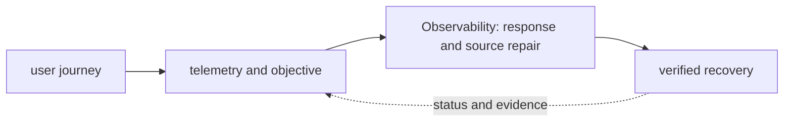

# Observability

<!-- chapter-guide:start -->
> **Step 211 of 373 — 10.01**
>
> **Builds on:** [Operations, observability, reliability and security](../README.md)
>
> **Now:** Learn **Observability** from its mental model through production ownership.
>
> **Then:** Rehearse the linked questions and continue to [Observability fundamentals](01-observability-fundamentals/README.md).
<!-- chapter-guide:end -->

> [Interview questions and answers](questions-and-answers.md) · [Master curriculum](../../curriculum/master-curriculum.txt) · Official starting point: <https://opentelemetry.io/docs/>

## Explanation

### What it is and why it exists

**Observability** is easiest to understand as one part of a larger path. The subject closes the loop between a user outcome and engineering action. Telemetry describes behavior, objectives define acceptable behavior, alerts identify urgent risk, and responders mitigate and repair the source of truth.

The chapter focuses on OpenTelemetry traces, metrics, logs and GenAI semantic conventions for operations, models, token usage and evaluation, Metrics, Logs, Traces. These are connected mechanisms, not vocabulary to memorize. Integrate every part of Observability into one secure, reliable, observable, supportable and cost-aware production capability The explanations below first build the simple model, then add the exact system behavior and production consequences.

### History and evolution

Production operations moved from checking individual hosts to measuring distributed user journeys. SRE formalized service levels, error budgets and engineering approaches to toil; observability, incident command, post-incident learning and policy-as-code extended that model across cloud platforms.

In this chapter, **Observability** is the next layer of that evolution. Its modern purpose is to integrate every part of Observability into one secure, reliable, observable, supportable and cost-aware production capability. The exact product surface may change by version, but the underlying state, request path and failure boundaries remain the durable ideas to learn.

### How it works: the end-to-end path



The path begins with a concrete input: a user request, configuration revision, packet, job, model request or operational symptom. The relevant subsystem validates that input, reads current state, performs or schedules work and exposes a result. Some transitions complete before the caller receives a response; others acknowledge the request and converge later. That difference determines whether a timeout means "nothing happened," "the operation failed," or "the final result is still unknown."

For **Observability**, the important stages are OpenTelemetry traces, metrics, logs and GenAI semantic conventions for operations, models, token usage and evaluation, Metrics, Logs, Traces, Events, Profiles, Correlation, Context propagation, Structured telemetry, Counters, Gauges, Histograms, Summaries, Labels, Cardinality, Aggregation, Percentiles, Scraping, Exporters, Service discovery, PromQL, Recording rules, Alerting rules, Federation, Remote write, High availability, Long-term storage, Dashboards, Variables, Alerting, Datasources, Dashboard-as-code, Operational views, Executive views, Structured logs, Log levels, Correlation IDs, Centralized logging, OpenSearch/ELK, Loki, Retention, Redaction, Sampling, Cost control, Spans, Traces, Trace context, Baggage, Sampling, Tail-based sampling, OpenTelemetry Collector, Cross-service propagation, Prompt and response metadata, Model/provider, Token counts, Time to first token, Time per output token, Retrieval latency, Retrieved-document identifiers, Tool-call traces, Evaluation scores, Cost per request, Tenant-level usage, Privacy-aware telemetry. Their boundaries explain where identity is checked, where state becomes durable, where capacity is consumed, how failures propagate and which signal can distinguish one layer from another. A production explanation should follow the actual path rather than treating each term as an isolated definition.


### Core concepts explained in detail

#### OpenTelemetry traces, metrics, logs and GenAI semantic conventions for operations, models, token usage and evaluation

**What it is.** Turns runtime state into evidence; define signal semantics, labels/context, retention/privacy/cost, healthy baseline, actionable threshold and a query that distinguishes competing hypotheses.

**Junior mental model.** Telemetry is the instrument panel, not the system itself. Metrics summarize trends, logs preserve discrete context, traces connect work across boundaries, profiles attribute resource use, and audit events record security-relevant actions.

**How it works.** Instrumentation observes a defined event or state, attaches bounded context, transports the signal, stores it under retention rules and makes it queryable. A useful signal has documented semantics and can distinguish at least two competing explanations; correlation identifiers belong in logs or traces rather than unbounded metric labels.

**What it looks like in production.** Healthy evidence includes coverage of the user journey, known collection delay and actionable SLO or saturation views. Missing telemetry, sampling bias, cardinality explosions, sensitive payload capture and alert thresholds disconnected from user impact are failures of the observability system itself.

#### Metrics

**What it is.** Turns runtime state into evidence; define signal semantics, labels/context, retention/privacy/cost, healthy baseline, actionable threshold and a query that distinguishes competing hypotheses.

**Junior mental model.** Telemetry is the instrument panel, not the system itself. Metrics summarize trends, logs preserve discrete context, traces connect work across boundaries, profiles attribute resource use, and audit events record security-relevant actions.

**How it works.** Instrumentation observes a defined event or state, attaches bounded context, transports the signal, stores it under retention rules and makes it queryable. A useful signal has documented semantics and can distinguish at least two competing explanations; correlation identifiers belong in logs or traces rather than unbounded metric labels.

**What it looks like in production.** Healthy evidence includes coverage of the user journey, known collection delay and actionable SLO or saturation views. Missing telemetry, sampling bias, cardinality explosions, sensitive payload capture and alert thresholds disconnected from user impact are failures of the observability system itself.

#### Logs

**What it is.** Turns runtime state into evidence; define signal semantics, labels/context, retention/privacy/cost, healthy baseline, actionable threshold and a query that distinguishes competing hypotheses.

**Junior mental model.** Telemetry is the instrument panel, not the system itself. Metrics summarize trends, logs preserve discrete context, traces connect work across boundaries, profiles attribute resource use, and audit events record security-relevant actions.

**How it works.** Instrumentation observes a defined event or state, attaches bounded context, transports the signal, stores it under retention rules and makes it queryable. A useful signal has documented semantics and can distinguish at least two competing explanations; correlation identifiers belong in logs or traces rather than unbounded metric labels.

**What it looks like in production.** Healthy evidence includes coverage of the user journey, known collection delay and actionable SLO or saturation views. Missing telemetry, sampling bias, cardinality explosions, sensitive payload capture and alert thresholds disconnected from user impact are failures of the observability system itself.

#### Traces

**What it is.** The term Traces is an observability signal that records a defined aspect of runtime behavior; its schema, context, sampling, retention and query semantics determine which hypotheses it can distinguish within Observability.

**Junior mental model.** Telemetry is the instrument panel, not the system itself. Metrics summarize trends, logs preserve discrete context, traces connect work across boundaries, profiles attribute resource use, and audit events record security-relevant actions.

**How it works.** Instrumentation observes a defined event or state, attaches bounded context, transports the signal, stores it under retention rules and makes it queryable. A useful signal has documented semantics and can distinguish at least two competing explanations; correlation identifiers belong in logs or traces rather than unbounded metric labels.

**What it looks like in production.** Healthy evidence includes coverage of the user journey, known collection delay and actionable SLO or saturation views. Missing telemetry, sampling bias, cardinality explosions, sensitive payload capture and alert thresholds disconnected from user impact are failures of the observability system itself.

#### Events

**What it is.** The term Events is an asynchronous hand-off mechanism that decouples producers from consumers and therefore must define ordering, retention, delivery, acknowledgement, retry and backlog behavior within Observability.

**Junior mental model.** Telemetry is the instrument panel, not the system itself. Metrics summarize trends, logs preserve discrete context, traces connect work across boundaries, profiles attribute resource use, and audit events record security-relevant actions.

**How it works.** Instrumentation observes a defined event or state, attaches bounded context, transports the signal, stores it under retention rules and makes it queryable. A useful signal has documented semantics and can distinguish at least two competing explanations; correlation identifiers belong in logs or traces rather than unbounded metric labels.

**What it looks like in production.** Healthy evidence includes coverage of the user journey, known collection delay and actionable SLO or saturation views. Missing telemetry, sampling bias, cardinality explosions, sensitive payload capture and alert thresholds disconnected from user impact are failures of the observability system itself.

#### Profiles

**What it is.** The term Profiles is an observability signal that records a defined aspect of runtime behavior; its schema, context, sampling, retention and query semantics determine which hypotheses it can distinguish within Observability.

**Junior mental model.** Telemetry is the instrument panel, not the system itself. Metrics summarize trends, logs preserve discrete context, traces connect work across boundaries, profiles attribute resource use, and audit events record security-relevant actions.

**How it works.** Instrumentation observes a defined event or state, attaches bounded context, transports the signal, stores it under retention rules and makes it queryable. A useful signal has documented semantics and can distinguish at least two competing explanations; correlation identifiers belong in logs or traces rather than unbounded metric labels.

**What it looks like in production.** Healthy evidence includes coverage of the user journey, known collection delay and actionable SLO or saturation views. Missing telemetry, sampling bias, cardinality explosions, sensitive payload capture and alert thresholds disconnected from user impact are failures of the observability system itself.

#### Correlation

**What it is.** The term Correlation refers to an operational feedback mechanism that connects service behavior to detection, decision, recovery and prevention within Observability.

**Junior mental model.** Telemetry is the instrument panel, not the system itself. Metrics summarize trends, logs preserve discrete context, traces connect work across boundaries, profiles attribute resource use, and audit events record security-relevant actions.

**How it works.** Instrumentation observes a defined event or state, attaches bounded context, transports the signal, stores it under retention rules and makes it queryable. A useful signal has documented semantics and can distinguish at least two competing explanations; correlation identifiers belong in logs or traces rather than unbounded metric labels.

**What it looks like in production.** Healthy evidence includes coverage of the user journey, known collection delay and actionable SLO or saturation views. Missing telemetry, sampling bias, cardinality explosions, sensitive payload capture and alert thresholds disconnected from user impact are failures of the observability system itself.

#### Context propagation

**What it is.** The term Context propagation refers to an operational feedback mechanism that connects service behavior to detection, decision, recovery and prevention within Observability.

**Junior mental model.** Telemetry is the instrument panel, not the system itself. Metrics summarize trends, logs preserve discrete context, traces connect work across boundaries, profiles attribute resource use, and audit events record security-relevant actions.

**How it works.** Instrumentation observes a defined event or state, attaches bounded context, transports the signal, stores it under retention rules and makes it queryable. A useful signal has documented semantics and can distinguish at least two competing explanations; correlation identifiers belong in logs or traces rather than unbounded metric labels.

**What it looks like in production.** Healthy evidence includes coverage of the user journey, known collection delay and actionable SLO or saturation views. Missing telemetry, sampling bias, cardinality explosions, sensitive payload capture and alert thresholds disconnected from user impact are failures of the observability system itself.

#### Structured telemetry

**What it is.** The term Structured telemetry is an observability signal that records a defined aspect of runtime behavior; its schema, context, sampling, retention and query semantics determine which hypotheses it can distinguish within Observability.

**Junior mental model.** Telemetry is the instrument panel, not the system itself. Metrics summarize trends, logs preserve discrete context, traces connect work across boundaries, profiles attribute resource use, and audit events record security-relevant actions.

**How it works.** Instrumentation observes a defined event or state, attaches bounded context, transports the signal, stores it under retention rules and makes it queryable. A useful signal has documented semantics and can distinguish at least two competing explanations; correlation identifiers belong in logs or traces rather than unbounded metric labels.

**What it looks like in production.** Healthy evidence includes coverage of the user journey, known collection delay and actionable SLO or saturation views. Missing telemetry, sampling bias, cardinality explosions, sensitive payload capture and alert thresholds disconnected from user impact are failures of the observability system itself.

#### Counters

**What it is.** The term Counters refers to an operational feedback mechanism that connects service behavior to detection, decision, recovery and prevention within Observability.

**Junior mental model.** Failure controls are traffic rules for unhealthy conditions: they bound how long work waits, how often it retries, how much enters the system and what reduced service remains possible.

**How it works.** A caller assigns a deadline and attempt budget, classifies an error, applies bounded backoff with jitter only when retry is safe, and propagates capacity limits upstream. Circuit breakers, bulkheads and load shedding prevent one dependency from consuming every worker; recovery probes and gradual traffic return avoid a second overload.

**What it looks like in production.** Healthy evidence shows bounded queues, stable retry ratios and recovery within an objective. Unbounded retries, identical timeouts at every layer, non-idempotent replays, shared resource pools and failover to an unqualified target commonly turn a small fault into an outage.

#### Gauges

**What it is.** The term Gauges refers to an operational feedback mechanism that connects service behavior to detection, decision, recovery and prevention within Observability.

**Junior mental model.** Failure controls are traffic rules for unhealthy conditions: they bound how long work waits, how often it retries, how much enters the system and what reduced service remains possible.

**How it works.** A caller assigns a deadline and attempt budget, classifies an error, applies bounded backoff with jitter only when retry is safe, and propagates capacity limits upstream. Circuit breakers, bulkheads and load shedding prevent one dependency from consuming every worker; recovery probes and gradual traffic return avoid a second overload.

**What it looks like in production.** Healthy evidence shows bounded queues, stable retry ratios and recovery within an objective. Unbounded retries, identical timeouts at every layer, non-idempotent replays, shared resource pools and failover to an unqualified target commonly turn a small fault into an outage.

#### Histograms

**What it is.** The term Histograms refers to an operational feedback mechanism that connects service behavior to detection, decision, recovery and prevention within Observability.

**Junior mental model.** Failure controls are traffic rules for unhealthy conditions: they bound how long work waits, how often it retries, how much enters the system and what reduced service remains possible.

**How it works.** A caller assigns a deadline and attempt budget, classifies an error, applies bounded backoff with jitter only when retry is safe, and propagates capacity limits upstream. Circuit breakers, bulkheads and load shedding prevent one dependency from consuming every worker; recovery probes and gradual traffic return avoid a second overload.

**What it looks like in production.** Healthy evidence shows bounded queues, stable retry ratios and recovery within an objective. Unbounded retries, identical timeouts at every layer, non-idempotent replays, shared resource pools and failover to an unqualified target commonly turn a small fault into an outage.

#### Summaries

**What it is.** The term Summaries refers to an operational feedback mechanism that connects service behavior to detection, decision, recovery and prevention within Observability.

**Junior mental model.** Failure controls are traffic rules for unhealthy conditions: they bound how long work waits, how often it retries, how much enters the system and what reduced service remains possible.

**How it works.** A caller assigns a deadline and attempt budget, classifies an error, applies bounded backoff with jitter only when retry is safe, and propagates capacity limits upstream. Circuit breakers, bulkheads and load shedding prevent one dependency from consuming every worker; recovery probes and gradual traffic return avoid a second overload.

**What it looks like in production.** Healthy evidence shows bounded queues, stable retry ratios and recovery within an objective. Unbounded retries, identical timeouts at every layer, non-idempotent replays, shared resource pools and failover to an unqualified target commonly turn a small fault into an outage.

#### Labels

**What it is.** The term Labels refers to an operational feedback mechanism that connects service behavior to detection, decision, recovery and prevention within Observability.

**Junior mental model.** Failure controls are traffic rules for unhealthy conditions: they bound how long work waits, how often it retries, how much enters the system and what reduced service remains possible.

**How it works.** A caller assigns a deadline and attempt budget, classifies an error, applies bounded backoff with jitter only when retry is safe, and propagates capacity limits upstream. Circuit breakers, bulkheads and load shedding prevent one dependency from consuming every worker; recovery probes and gradual traffic return avoid a second overload.

**What it looks like in production.** Healthy evidence shows bounded queues, stable retry ratios and recovery within an objective. Unbounded retries, identical timeouts at every layer, non-idempotent replays, shared resource pools and failover to an unqualified target commonly turn a small fault into an outage.

#### Cardinality

**What it is.** The term Cardinality refers to an operational feedback mechanism that connects service behavior to detection, decision, recovery and prevention within Observability.

**Junior mental model.** Failure controls are traffic rules for unhealthy conditions: they bound how long work waits, how often it retries, how much enters the system and what reduced service remains possible.

**How it works.** A caller assigns a deadline and attempt budget, classifies an error, applies bounded backoff with jitter only when retry is safe, and propagates capacity limits upstream. Circuit breakers, bulkheads and load shedding prevent one dependency from consuming every worker; recovery probes and gradual traffic return avoid a second overload.

**What it looks like in production.** Healthy evidence shows bounded queues, stable retry ratios and recovery within an objective. Unbounded retries, identical timeouts at every layer, non-idempotent replays, shared resource pools and failover to an unqualified target commonly turn a small fault into an outage.

#### Aggregation

**What it is.** The term Aggregation refers to an operational feedback mechanism that connects service behavior to detection, decision, recovery and prevention within Observability.

**Junior mental model.** Failure controls are traffic rules for unhealthy conditions: they bound how long work waits, how often it retries, how much enters the system and what reduced service remains possible.

**How it works.** A caller assigns a deadline and attempt budget, classifies an error, applies bounded backoff with jitter only when retry is safe, and propagates capacity limits upstream. Circuit breakers, bulkheads and load shedding prevent one dependency from consuming every worker; recovery probes and gradual traffic return avoid a second overload.

**What it looks like in production.** Healthy evidence shows bounded queues, stable retry ratios and recovery within an objective. Unbounded retries, identical timeouts at every layer, non-idempotent replays, shared resource pools and failover to an unqualified target commonly turn a small fault into an outage.

#### Percentiles

**What it is.** The term Percentiles refers to an operational feedback mechanism that connects service behavior to detection, decision, recovery and prevention within Observability.

**Junior mental model.** Failure controls are traffic rules for unhealthy conditions: they bound how long work waits, how often it retries, how much enters the system and what reduced service remains possible.

**How it works.** A caller assigns a deadline and attempt budget, classifies an error, applies bounded backoff with jitter only when retry is safe, and propagates capacity limits upstream. Circuit breakers, bulkheads and load shedding prevent one dependency from consuming every worker; recovery probes and gradual traffic return avoid a second overload.

**What it looks like in production.** Healthy evidence shows bounded queues, stable retry ratios and recovery within an objective. Unbounded retries, identical timeouts at every layer, non-idempotent replays, shared resource pools and failover to an unqualified target commonly turn a small fault into an outage.

#### Scraping

**What it is.** The term Scraping refers to an operational feedback mechanism that connects service behavior to detection, decision, recovery and prevention within Observability.

**Junior mental model.** Failure controls are traffic rules for unhealthy conditions: they bound how long work waits, how often it retries, how much enters the system and what reduced service remains possible.

**How it works.** A caller assigns a deadline and attempt budget, classifies an error, applies bounded backoff with jitter only when retry is safe, and propagates capacity limits upstream. Circuit breakers, bulkheads and load shedding prevent one dependency from consuming every worker; recovery probes and gradual traffic return avoid a second overload.

**What it looks like in production.** Healthy evidence shows bounded queues, stable retry ratios and recovery within an objective. Unbounded retries, identical timeouts at every layer, non-idempotent replays, shared resource pools and failover to an unqualified target commonly turn a small fault into an outage.

#### Exporters

**What it is.** The term Exporters refers to an operational feedback mechanism that connects service behavior to detection, decision, recovery and prevention within Observability.

**Junior mental model.** A useful analogy is a parcel journey: the name identifies the destination, routing selects each next hop, policy decides whether the parcel may pass, transport tracks delivery, and the application decides what the contents mean.

**How it works.** A real request crosses several independent states: name resolution returns an address, the source selects a route and source address, link or overlay forwarding reaches the next hop, stateful or stateless policy evaluates the flow, transport establishes communication, and TLS/application protocols negotiate their own contract. The return path must also work.

**What it looks like in production.** Healthy evidence progresses layer by layer: correct name/address, expected route, permitted flow, listening endpoint, successful handshake and valid application response. Timeouts, refusals, resets and protocol errors mean different layers; packet loss, MTU, asymmetric paths, connection-state exhaustion and proxy timeout mismatch are common production failures.

#### Service discovery

**What it is.** The term Service discovery refers to an operational feedback mechanism that connects service behavior to detection, decision, recovery and prevention within Observability.

**Junior mental model.** Failure controls are traffic rules for unhealthy conditions: they bound how long work waits, how often it retries, how much enters the system and what reduced service remains possible.

**How it works.** A caller assigns a deadline and attempt budget, classifies an error, applies bounded backoff with jitter only when retry is safe, and propagates capacity limits upstream. Circuit breakers, bulkheads and load shedding prevent one dependency from consuming every worker; recovery probes and gradual traffic return avoid a second overload.

**What it looks like in production.** Healthy evidence shows bounded queues, stable retry ratios and recovery within an objective. Unbounded retries, identical timeouts at every layer, non-idempotent replays, shared resource pools and failover to an unqualified target commonly turn a small fault into an outage.

#### PromQL

**What it is.** The term PromQL refers to an operational feedback mechanism that connects service behavior to detection, decision, recovery and prevention within Observability.

**Junior mental model.** Failure controls are traffic rules for unhealthy conditions: they bound how long work waits, how often it retries, how much enters the system and what reduced service remains possible.

**How it works.** A caller assigns a deadline and attempt budget, classifies an error, applies bounded backoff with jitter only when retry is safe, and propagates capacity limits upstream. Circuit breakers, bulkheads and load shedding prevent one dependency from consuming every worker; recovery probes and gradual traffic return avoid a second overload.

**What it looks like in production.** Healthy evidence shows bounded queues, stable retry ratios and recovery within an objective. Unbounded retries, identical timeouts at every layer, non-idempotent replays, shared resource pools and failover to an unqualified target commonly turn a small fault into an outage.

#### Recording rules

**What it is.** The term Recording rules refers to an operational feedback mechanism that connects service behavior to detection, decision, recovery and prevention within Observability.

**Junior mental model.** Failure controls are traffic rules for unhealthy conditions: they bound how long work waits, how often it retries, how much enters the system and what reduced service remains possible.

**How it works.** A caller assigns a deadline and attempt budget, classifies an error, applies bounded backoff with jitter only when retry is safe, and propagates capacity limits upstream. Circuit breakers, bulkheads and load shedding prevent one dependency from consuming every worker; recovery probes and gradual traffic return avoid a second overload.

**What it looks like in production.** Healthy evidence shows bounded queues, stable retry ratios and recovery within an objective. Unbounded retries, identical timeouts at every layer, non-idempotent replays, shared resource pools and failover to an unqualified target commonly turn a small fault into an outage.

#### Alerting rules

**What it is.** Turns runtime state into evidence; define signal semantics, labels/context, retention/privacy/cost, healthy baseline, actionable threshold and a query that distinguishes competing hypotheses.

**Junior mental model.** Telemetry is the instrument panel, not the system itself. Metrics summarize trends, logs preserve discrete context, traces connect work across boundaries, profiles attribute resource use, and audit events record security-relevant actions.

**How it works.** Instrumentation observes a defined event or state, attaches bounded context, transports the signal, stores it under retention rules and makes it queryable. A useful signal has documented semantics and can distinguish at least two competing explanations; correlation identifiers belong in logs or traces rather than unbounded metric labels.

**What it looks like in production.** Healthy evidence includes coverage of the user journey, known collection delay and actionable SLO or saturation views. Missing telemetry, sampling bias, cardinality explosions, sensitive payload capture and alert thresholds disconnected from user impact are failures of the observability system itself.

#### Federation

**What it is.** The term Federation refers to an operational feedback mechanism that connects service behavior to detection, decision, recovery and prevention within Observability.

**Junior mental model.** Failure controls are traffic rules for unhealthy conditions: they bound how long work waits, how often it retries, how much enters the system and what reduced service remains possible.

**How it works.** A caller assigns a deadline and attempt budget, classifies an error, applies bounded backoff with jitter only when retry is safe, and propagates capacity limits upstream. Circuit breakers, bulkheads and load shedding prevent one dependency from consuming every worker; recovery probes and gradual traffic return avoid a second overload.

**What it looks like in production.** Healthy evidence shows bounded queues, stable retry ratios and recovery within an objective. Unbounded retries, identical timeouts at every layer, non-idempotent replays, shared resource pools and failover to an unqualified target commonly turn a small fault into an outage.

#### Remote write

**What it is.** The term Remote write refers to an operational feedback mechanism that connects service behavior to detection, decision, recovery and prevention within Observability.

**Junior mental model.** Failure controls are traffic rules for unhealthy conditions: they bound how long work waits, how often it retries, how much enters the system and what reduced service remains possible.

**How it works.** A caller assigns a deadline and attempt budget, classifies an error, applies bounded backoff with jitter only when retry is safe, and propagates capacity limits upstream. Circuit breakers, bulkheads and load shedding prevent one dependency from consuming every worker; recovery probes and gradual traffic return avoid a second overload.

**What it looks like in production.** Healthy evidence shows bounded queues, stable retry ratios and recovery within an objective. Unbounded retries, identical timeouts at every layer, non-idempotent replays, shared resource pools and failover to an unqualified target commonly turn a small fault into an outage.

#### High availability

**What it is.** The term High availability refers to an operational feedback mechanism that connects service behavior to detection, decision, recovery and prevention within Observability.

**Junior mental model.** Failure controls are traffic rules for unhealthy conditions: they bound how long work waits, how often it retries, how much enters the system and what reduced service remains possible.

**How it works.** A caller assigns a deadline and attempt budget, classifies an error, applies bounded backoff with jitter only when retry is safe, and propagates capacity limits upstream. Circuit breakers, bulkheads and load shedding prevent one dependency from consuming every worker; recovery probes and gradual traffic return avoid a second overload.

**What it looks like in production.** Healthy evidence shows bounded queues, stable retry ratios and recovery within an objective. Unbounded retries, identical timeouts at every layer, non-idempotent replays, shared resource pools and failover to an unqualified target commonly turn a small fault into an outage.

#### Long-term storage

**What it is.** The term Long-term storage holds state beyond one operation or process lifetime and therefore must define durability, consistency, concurrency, replication, backup, restore and deletion semantics within Observability.

**Junior mental model.** An AI result is produced by a release made of several moving parts—not only model weights. Data, tokenizer, prompt/template, adapter, retrieval index, runtime, hardware and evaluator can each change behavior.

**How it works.** Inputs are validated and transformed, a versioned model or pipeline performs work, and post-processing and policy produce the exposed result. Offline evaluation compares a candidate with a baseline; shadow or canary traffic supplies production evidence; lineage connects the decision back to exact artifacts and data.

**What it looks like in production.** Healthy evidence combines task quality and safety with latency, token or accelerator work, failure rate and unit cost. Training-serving skew, stale or unauthorized retrieval, incompatible runtime/hardware, biased evaluators, prompt injection and silent provider/model changes are core production risks.

#### Dashboards

**What it is.** The term Dashboards refers to an operational feedback mechanism that connects service behavior to detection, decision, recovery and prevention within Observability.

**Junior mental model.** Telemetry is the instrument panel, not the system itself. Metrics summarize trends, logs preserve discrete context, traces connect work across boundaries, profiles attribute resource use, and audit events record security-relevant actions.

**How it works.** Instrumentation observes a defined event or state, attaches bounded context, transports the signal, stores it under retention rules and makes it queryable. A useful signal has documented semantics and can distinguish at least two competing explanations; correlation identifiers belong in logs or traces rather than unbounded metric labels.

**What it looks like in production.** Healthy evidence includes coverage of the user journey, known collection delay and actionable SLO or saturation views. Missing telemetry, sampling bias, cardinality explosions, sensitive payload capture and alert thresholds disconnected from user impact are failures of the observability system itself.

#### Variables

**What it is.** The term Variables refers to an operational feedback mechanism that connects service behavior to detection, decision, recovery and prevention within Observability.

**Junior mental model.** Treat delivery like a controlled assembly line: reviewed source becomes an immutable artifact, the artifact is promoted without being rebuilt, and each environment records exactly which revision is effective.

**How it works.** The lifecycle begins with versioned intent, validates syntax and policy, resolves dependencies, builds or selects immutable inputs, produces a diff or release plan, changes the target in bounded waves, and records status. Reconciliation keeps desired and observed state aligned; rollback is another tested state transition, not merely a command name.

**What it looks like in production.** Healthy evidence links source revision, review, test, artifact digest, signer/provenance, deployment target and user-facing verification. Mutable tags, environment-specific rebuilds, unpinned dependencies, non-idempotent migrations and controllers fighting emergency changes are recurring failure modes.

#### Alerting

**What it is.** Turns runtime state into evidence; define signal semantics, labels/context, retention/privacy/cost, healthy baseline, actionable threshold and a query that distinguishes competing hypotheses.

**Junior mental model.** Telemetry is the instrument panel, not the system itself. Metrics summarize trends, logs preserve discrete context, traces connect work across boundaries, profiles attribute resource use, and audit events record security-relevant actions.

**How it works.** Instrumentation observes a defined event or state, attaches bounded context, transports the signal, stores it under retention rules and makes it queryable. A useful signal has documented semantics and can distinguish at least two competing explanations; correlation identifiers belong in logs or traces rather than unbounded metric labels.

**What it looks like in production.** Healthy evidence includes coverage of the user journey, known collection delay and actionable SLO or saturation views. Missing telemetry, sampling bias, cardinality explosions, sensitive payload capture and alert thresholds disconnected from user impact are failures of the observability system itself.

#### Datasources

**What it is.** The term Datasources refers to an operational feedback mechanism that connects service behavior to detection, decision, recovery and prevention within Observability.

**Junior mental model.** Failure controls are traffic rules for unhealthy conditions: they bound how long work waits, how often it retries, how much enters the system and what reduced service remains possible.

**How it works.** A caller assigns a deadline and attempt budget, classifies an error, applies bounded backoff with jitter only when retry is safe, and propagates capacity limits upstream. Circuit breakers, bulkheads and load shedding prevent one dependency from consuming every worker; recovery probes and gradual traffic return avoid a second overload.

**What it looks like in production.** Healthy evidence shows bounded queues, stable retry ratios and recovery within an objective. Unbounded retries, identical timeouts at every layer, non-idempotent replays, shared resource pools and failover to an unqualified target commonly turn a small fault into an outage.

#### Dashboard-as-code

**What it is.** The term Dashboard-as-code refers to an operational feedback mechanism that connects service behavior to detection, decision, recovery and prevention within Observability.

**Junior mental model.** Telemetry is the instrument panel, not the system itself. Metrics summarize trends, logs preserve discrete context, traces connect work across boundaries, profiles attribute resource use, and audit events record security-relevant actions.

**How it works.** Instrumentation observes a defined event or state, attaches bounded context, transports the signal, stores it under retention rules and makes it queryable. A useful signal has documented semantics and can distinguish at least two competing explanations; correlation identifiers belong in logs or traces rather than unbounded metric labels.

**What it looks like in production.** Healthy evidence includes coverage of the user journey, known collection delay and actionable SLO or saturation views. Missing telemetry, sampling bias, cardinality explosions, sensitive payload capture and alert thresholds disconnected from user impact are failures of the observability system itself.

#### Operational views

**What it is.** The term Operational views refers to an operational feedback mechanism that connects service behavior to detection, decision, recovery and prevention within Observability.

**Junior mental model.** Failure controls are traffic rules for unhealthy conditions: they bound how long work waits, how often it retries, how much enters the system and what reduced service remains possible.

**How it works.** A caller assigns a deadline and attempt budget, classifies an error, applies bounded backoff with jitter only when retry is safe, and propagates capacity limits upstream. Circuit breakers, bulkheads and load shedding prevent one dependency from consuming every worker; recovery probes and gradual traffic return avoid a second overload.

**What it looks like in production.** Healthy evidence shows bounded queues, stable retry ratios and recovery within an objective. Unbounded retries, identical timeouts at every layer, non-idempotent replays, shared resource pools and failover to an unqualified target commonly turn a small fault into an outage.

#### Executive views

**What it is.** The term Executive views refers to an operational feedback mechanism that connects service behavior to detection, decision, recovery and prevention within Observability.

**Junior mental model.** Failure controls are traffic rules for unhealthy conditions: they bound how long work waits, how often it retries, how much enters the system and what reduced service remains possible.

**How it works.** A caller assigns a deadline and attempt budget, classifies an error, applies bounded backoff with jitter only when retry is safe, and propagates capacity limits upstream. Circuit breakers, bulkheads and load shedding prevent one dependency from consuming every worker; recovery probes and gradual traffic return avoid a second overload.

**What it looks like in production.** Healthy evidence shows bounded queues, stable retry ratios and recovery within an objective. Unbounded retries, identical timeouts at every layer, non-idempotent replays, shared resource pools and failover to an unqualified target commonly turn a small fault into an outage.

#### Structured logs

**What it is.** Turns runtime state into evidence; define signal semantics, labels/context, retention/privacy/cost, healthy baseline, actionable threshold and a query that distinguishes competing hypotheses.

**Junior mental model.** Telemetry is the instrument panel, not the system itself. Metrics summarize trends, logs preserve discrete context, traces connect work across boundaries, profiles attribute resource use, and audit events record security-relevant actions.

**How it works.** Instrumentation observes a defined event or state, attaches bounded context, transports the signal, stores it under retention rules and makes it queryable. A useful signal has documented semantics and can distinguish at least two competing explanations; correlation identifiers belong in logs or traces rather than unbounded metric labels.

**What it looks like in production.** Healthy evidence includes coverage of the user journey, known collection delay and actionable SLO or saturation views. Missing telemetry, sampling bias, cardinality explosions, sensitive payload capture and alert thresholds disconnected from user impact are failures of the observability system itself.

#### Log levels

**What it is.** The term Log levels is an observability signal that records a defined aspect of runtime behavior; its schema, context, sampling, retention and query semantics determine which hypotheses it can distinguish within Observability.

**Junior mental model.** Telemetry is the instrument panel, not the system itself. Metrics summarize trends, logs preserve discrete context, traces connect work across boundaries, profiles attribute resource use, and audit events record security-relevant actions.

**How it works.** Instrumentation observes a defined event or state, attaches bounded context, transports the signal, stores it under retention rules and makes it queryable. A useful signal has documented semantics and can distinguish at least two competing explanations; correlation identifiers belong in logs or traces rather than unbounded metric labels.

**What it looks like in production.** Healthy evidence includes coverage of the user journey, known collection delay and actionable SLO or saturation views. Missing telemetry, sampling bias, cardinality explosions, sensitive payload capture and alert thresholds disconnected from user impact are failures of the observability system itself.

#### Correlation IDs

**What it is.** The term Correlation IDs refers to an operational feedback mechanism that connects service behavior to detection, decision, recovery and prevention within Observability.

**Junior mental model.** Telemetry is the instrument panel, not the system itself. Metrics summarize trends, logs preserve discrete context, traces connect work across boundaries, profiles attribute resource use, and audit events record security-relevant actions.

**How it works.** Instrumentation observes a defined event or state, attaches bounded context, transports the signal, stores it under retention rules and makes it queryable. A useful signal has documented semantics and can distinguish at least two competing explanations; correlation identifiers belong in logs or traces rather than unbounded metric labels.

**What it looks like in production.** Healthy evidence includes coverage of the user journey, known collection delay and actionable SLO or saturation views. Missing telemetry, sampling bias, cardinality explosions, sensitive payload capture and alert thresholds disconnected from user impact are failures of the observability system itself.

#### Centralized logging

**What it is.** The term Centralized logging is an observability signal that records a defined aspect of runtime behavior; its schema, context, sampling, retention and query semantics determine which hypotheses it can distinguish within Observability.

**Junior mental model.** Telemetry is the instrument panel, not the system itself. Metrics summarize trends, logs preserve discrete context, traces connect work across boundaries, profiles attribute resource use, and audit events record security-relevant actions.

**How it works.** Instrumentation observes a defined event or state, attaches bounded context, transports the signal, stores it under retention rules and makes it queryable. A useful signal has documented semantics and can distinguish at least two competing explanations; correlation identifiers belong in logs or traces rather than unbounded metric labels.

**What it looks like in production.** Healthy evidence includes coverage of the user journey, known collection delay and actionable SLO or saturation views. Missing telemetry, sampling bias, cardinality explosions, sensitive payload capture and alert thresholds disconnected from user impact are failures of the observability system itself.

#### OpenSearch/ELK

**What it is.** The term OpenSearch/ELK refers to an operational feedback mechanism that connects service behavior to detection, decision, recovery and prevention within Observability.

**Junior mental model.** Failure controls are traffic rules for unhealthy conditions: they bound how long work waits, how often it retries, how much enters the system and what reduced service remains possible.

**How it works.** A caller assigns a deadline and attempt budget, classifies an error, applies bounded backoff with jitter only when retry is safe, and propagates capacity limits upstream. Circuit breakers, bulkheads and load shedding prevent one dependency from consuming every worker; recovery probes and gradual traffic return avoid a second overload.

**What it looks like in production.** Healthy evidence shows bounded queues, stable retry ratios and recovery within an objective. Unbounded retries, identical timeouts at every layer, non-idempotent replays, shared resource pools and failover to an unqualified target commonly turn a small fault into an outage.

#### Loki

**What it is.** The term Loki refers to an operational feedback mechanism that connects service behavior to detection, decision, recovery and prevention within Observability.

**Junior mental model.** Failure controls are traffic rules for unhealthy conditions: they bound how long work waits, how often it retries, how much enters the system and what reduced service remains possible.

**How it works.** A caller assigns a deadline and attempt budget, classifies an error, applies bounded backoff with jitter only when retry is safe, and propagates capacity limits upstream. Circuit breakers, bulkheads and load shedding prevent one dependency from consuming every worker; recovery probes and gradual traffic return avoid a second overload.

**What it looks like in production.** Healthy evidence shows bounded queues, stable retry ratios and recovery within an objective. Unbounded retries, identical timeouts at every layer, non-idempotent replays, shared resource pools and failover to an unqualified target commonly turn a small fault into an outage.

#### Retention

**What it is.** The term Retention refers to an operational feedback mechanism that connects service behavior to detection, decision, recovery and prevention within Observability.

**Junior mental model.** Failure controls are traffic rules for unhealthy conditions: they bound how long work waits, how often it retries, how much enters the system and what reduced service remains possible.

**How it works.** A caller assigns a deadline and attempt budget, classifies an error, applies bounded backoff with jitter only when retry is safe, and propagates capacity limits upstream. Circuit breakers, bulkheads and load shedding prevent one dependency from consuming every worker; recovery probes and gradual traffic return avoid a second overload.

**What it looks like in production.** Healthy evidence shows bounded queues, stable retry ratios and recovery within an objective. Unbounded retries, identical timeouts at every layer, non-idempotent replays, shared resource pools and failover to an unqualified target commonly turn a small fault into an outage.

#### Redaction

**What it is.** The term Redaction refers to an operational feedback mechanism that connects service behavior to detection, decision, recovery and prevention within Observability.

**Junior mental model.** Failure controls are traffic rules for unhealthy conditions: they bound how long work waits, how often it retries, how much enters the system and what reduced service remains possible.

**How it works.** A caller assigns a deadline and attempt budget, classifies an error, applies bounded backoff with jitter only when retry is safe, and propagates capacity limits upstream. Circuit breakers, bulkheads and load shedding prevent one dependency from consuming every worker; recovery probes and gradual traffic return avoid a second overload.

**What it looks like in production.** Healthy evidence shows bounded queues, stable retry ratios and recovery within an objective. Unbounded retries, identical timeouts at every layer, non-idempotent replays, shared resource pools and failover to an unqualified target commonly turn a small fault into an outage.

#### Sampling

**What it is.** The term Sampling refers to an operational feedback mechanism that connects service behavior to detection, decision, recovery and prevention within Observability.

**Junior mental model.** Failure controls are traffic rules for unhealthy conditions: they bound how long work waits, how often it retries, how much enters the system and what reduced service remains possible.

**How it works.** A caller assigns a deadline and attempt budget, classifies an error, applies bounded backoff with jitter only when retry is safe, and propagates capacity limits upstream. Circuit breakers, bulkheads and load shedding prevent one dependency from consuming every worker; recovery probes and gradual traffic return avoid a second overload.

**What it looks like in production.** Healthy evidence shows bounded queues, stable retry ratios and recovery within an objective. Unbounded retries, identical timeouts at every layer, non-idempotent replays, shared resource pools and failover to an unqualified target commonly turn a small fault into an outage.

#### Cost control

**What it is.** The term Cost control connects attributed resource consumption to a useful workload outcome and applies forecast, quota, anomaly, commitment and optimization decisions without ignoring reliability or quality within Observability.

**Junior mental model.** Governance is how a team makes repeated decisions visible and enforceable; economics shows which resources those decisions consume. Neither is a one-time approval or a monthly bill review.

**How it works.** An asset or service receives an owner, lifecycle state, data/risk class, policy, budget and evidence requirements. Usage is attributed to stable organizational dimensions, compared with outcome and SLO, and reviewed through changes, exceptions and retirement; automated guardrails enforce the decisions at the relevant control point.

**What it looks like in production.** Healthy evidence connects an accountable owner and approved intent to runtime inventory, audit and unit cost. Orphaned resources, permanent exceptions, unallocated shared cost, vanity utilization and savings that damage reliability or quality are common failure modes.

#### Spans

**What it is.** The term Spans refers to an operational feedback mechanism that connects service behavior to detection, decision, recovery and prevention within Observability.

**Junior mental model.** Failure controls are traffic rules for unhealthy conditions: they bound how long work waits, how often it retries, how much enters the system and what reduced service remains possible.

**How it works.** A caller assigns a deadline and attempt budget, classifies an error, applies bounded backoff with jitter only when retry is safe, and propagates capacity limits upstream. Circuit breakers, bulkheads and load shedding prevent one dependency from consuming every worker; recovery probes and gradual traffic return avoid a second overload.

**What it looks like in production.** Healthy evidence shows bounded queues, stable retry ratios and recovery within an objective. Unbounded retries, identical timeouts at every layer, non-idempotent replays, shared resource pools and failover to an unqualified target commonly turn a small fault into an outage.

#### Traces

**What it is.** The term Traces is an observability signal that records a defined aspect of runtime behavior; its schema, context, sampling, retention and query semantics determine which hypotheses it can distinguish within Observability.

**Junior mental model.** Telemetry is the instrument panel, not the system itself. Metrics summarize trends, logs preserve discrete context, traces connect work across boundaries, profiles attribute resource use, and audit events record security-relevant actions.

**How it works.** Instrumentation observes a defined event or state, attaches bounded context, transports the signal, stores it under retention rules and makes it queryable. A useful signal has documented semantics and can distinguish at least two competing explanations; correlation identifiers belong in logs or traces rather than unbounded metric labels.

**What it looks like in production.** Healthy evidence includes coverage of the user journey, known collection delay and actionable SLO or saturation views. Missing telemetry, sampling bias, cardinality explosions, sensitive payload capture and alert thresholds disconnected from user impact are failures of the observability system itself.

#### Trace context

**What it is.** The term Trace context is an observability signal that records a defined aspect of runtime behavior; its schema, context, sampling, retention and query semantics determine which hypotheses it can distinguish within Observability.

**Junior mental model.** Telemetry is the instrument panel, not the system itself. Metrics summarize trends, logs preserve discrete context, traces connect work across boundaries, profiles attribute resource use, and audit events record security-relevant actions.

**How it works.** Instrumentation observes a defined event or state, attaches bounded context, transports the signal, stores it under retention rules and makes it queryable. A useful signal has documented semantics and can distinguish at least two competing explanations; correlation identifiers belong in logs or traces rather than unbounded metric labels.

**What it looks like in production.** Healthy evidence includes coverage of the user journey, known collection delay and actionable SLO or saturation views. Missing telemetry, sampling bias, cardinality explosions, sensitive payload capture and alert thresholds disconnected from user impact are failures of the observability system itself.

#### Baggage

**What it is.** The term Baggage refers to an operational feedback mechanism that connects service behavior to detection, decision, recovery and prevention within Observability.

**Junior mental model.** Failure controls are traffic rules for unhealthy conditions: they bound how long work waits, how often it retries, how much enters the system and what reduced service remains possible.

**How it works.** A caller assigns a deadline and attempt budget, classifies an error, applies bounded backoff with jitter only when retry is safe, and propagates capacity limits upstream. Circuit breakers, bulkheads and load shedding prevent one dependency from consuming every worker; recovery probes and gradual traffic return avoid a second overload.

**What it looks like in production.** Healthy evidence shows bounded queues, stable retry ratios and recovery within an objective. Unbounded retries, identical timeouts at every layer, non-idempotent replays, shared resource pools and failover to an unqualified target commonly turn a small fault into an outage.

#### Sampling

**What it is.** The term Sampling refers to an operational feedback mechanism that connects service behavior to detection, decision, recovery and prevention within Observability.

**Junior mental model.** Failure controls are traffic rules for unhealthy conditions: they bound how long work waits, how often it retries, how much enters the system and what reduced service remains possible.

**How it works.** A caller assigns a deadline and attempt budget, classifies an error, applies bounded backoff with jitter only when retry is safe, and propagates capacity limits upstream. Circuit breakers, bulkheads and load shedding prevent one dependency from consuming every worker; recovery probes and gradual traffic return avoid a second overload.

**What it looks like in production.** Healthy evidence shows bounded queues, stable retry ratios and recovery within an objective. Unbounded retries, identical timeouts at every layer, non-idempotent replays, shared resource pools and failover to an unqualified target commonly turn a small fault into an outage.

#### Tail-based sampling

**What it is.** The term Tail-based sampling refers to an operational feedback mechanism that connects service behavior to detection, decision, recovery and prevention within Observability.

**Junior mental model.** Failure controls are traffic rules for unhealthy conditions: they bound how long work waits, how often it retries, how much enters the system and what reduced service remains possible.

**How it works.** A caller assigns a deadline and attempt budget, classifies an error, applies bounded backoff with jitter only when retry is safe, and propagates capacity limits upstream. Circuit breakers, bulkheads and load shedding prevent one dependency from consuming every worker; recovery probes and gradual traffic return avoid a second overload.

**What it looks like in production.** Healthy evidence shows bounded queues, stable retry ratios and recovery within an objective. Unbounded retries, identical timeouts at every layer, non-idempotent replays, shared resource pools and failover to an unqualified target commonly turn a small fault into an outage.

#### OpenTelemetry Collector

**What it is.** The term OpenTelemetry Collector is an observability signal that records a defined aspect of runtime behavior; its schema, context, sampling, retention and query semantics determine which hypotheses it can distinguish within Observability.

**Junior mental model.** Telemetry is the instrument panel, not the system itself. Metrics summarize trends, logs preserve discrete context, traces connect work across boundaries, profiles attribute resource use, and audit events record security-relevant actions.

**How it works.** Instrumentation observes a defined event or state, attaches bounded context, transports the signal, stores it under retention rules and makes it queryable. A useful signal has documented semantics and can distinguish at least two competing explanations; correlation identifiers belong in logs or traces rather than unbounded metric labels.

**What it looks like in production.** Healthy evidence includes coverage of the user journey, known collection delay and actionable SLO or saturation views. Missing telemetry, sampling bias, cardinality explosions, sensitive payload capture and alert thresholds disconnected from user impact are failures of the observability system itself.

#### Cross-service propagation

**What it is.** The term Cross-service propagation refers to an operational feedback mechanism that connects service behavior to detection, decision, recovery and prevention within Observability.

**Junior mental model.** Failure controls are traffic rules for unhealthy conditions: they bound how long work waits, how often it retries, how much enters the system and what reduced service remains possible.

**How it works.** A caller assigns a deadline and attempt budget, classifies an error, applies bounded backoff with jitter only when retry is safe, and propagates capacity limits upstream. Circuit breakers, bulkheads and load shedding prevent one dependency from consuming every worker; recovery probes and gradual traffic return avoid a second overload.

**What it looks like in production.** Healthy evidence shows bounded queues, stable retry ratios and recovery within an objective. Unbounded retries, identical timeouts at every layer, non-idempotent replays, shared resource pools and failover to an unqualified target commonly turn a small fault into an outage.

#### Prompt and response metadata

**What it is.** The term Prompt and response metadata is an AI data or behavior artifact whose exact revision, inputs, transformations, compatibility and evaluation evidence affect the result produced at runtime within Observability.

**Junior mental model.** An AI result is produced by a release made of several moving parts—not only model weights. Data, tokenizer, prompt/template, adapter, retrieval index, runtime, hardware and evaluator can each change behavior.

**How it works.** Inputs are validated and transformed, a versioned model or pipeline performs work, and post-processing and policy produce the exposed result. Offline evaluation compares a candidate with a baseline; shadow or canary traffic supplies production evidence; lineage connects the decision back to exact artifacts and data.

**What it looks like in production.** Healthy evidence combines task quality and safety with latency, token or accelerator work, failure rate and unit cost. Training-serving skew, stale or unauthorized retrieval, incompatible runtime/hardware, biased evaluators, prompt injection and silent provider/model changes are core production risks.

#### Model/provider

**What it is.** The term Model/provider is an AI data or behavior artifact whose exact revision, inputs, transformations, compatibility and evaluation evidence affect the result produced at runtime within Observability.

**Junior mental model.** An AI result is produced by a release made of several moving parts—not only model weights. Data, tokenizer, prompt/template, adapter, retrieval index, runtime, hardware and evaluator can each change behavior.

**How it works.** Inputs are validated and transformed, a versioned model or pipeline performs work, and post-processing and policy produce the exposed result. Offline evaluation compares a candidate with a baseline; shadow or canary traffic supplies production evidence; lineage connects the decision back to exact artifacts and data.

**What it looks like in production.** Healthy evidence combines task quality and safety with latency, token or accelerator work, failure rate and unit cost. Training-serving skew, stale or unauthorized retrieval, incompatible runtime/hardware, biased evaluators, prompt injection and silent provider/model changes are core production risks.

#### Token counts

**What it is.** The term Token counts refers to an operational feedback mechanism that connects service behavior to detection, decision, recovery and prevention within Observability.

**Junior mental model.** An AI result is produced by a release made of several moving parts—not only model weights. Data, tokenizer, prompt/template, adapter, retrieval index, runtime, hardware and evaluator can each change behavior.

**How it works.** Inputs are validated and transformed, a versioned model or pipeline performs work, and post-processing and policy produce the exposed result. Offline evaluation compares a candidate with a baseline; shadow or canary traffic supplies production evidence; lineage connects the decision back to exact artifacts and data.

**What it looks like in production.** Healthy evidence combines task quality and safety with latency, token or accelerator work, failure rate and unit cost. Training-serving skew, stale or unauthorized retrieval, incompatible runtime/hardware, biased evaluators, prompt injection and silent provider/model changes are core production risks.

#### Time to first token

**What it is.** The term Time to first token refers to an operational feedback mechanism that connects service behavior to detection, decision, recovery and prevention within Observability.

**Junior mental model.** An AI result is produced by a release made of several moving parts—not only model weights. Data, tokenizer, prompt/template, adapter, retrieval index, runtime, hardware and evaluator can each change behavior.

**How it works.** Inputs are validated and transformed, a versioned model or pipeline performs work, and post-processing and policy produce the exposed result. Offline evaluation compares a candidate with a baseline; shadow or canary traffic supplies production evidence; lineage connects the decision back to exact artifacts and data.

**What it looks like in production.** Healthy evidence combines task quality and safety with latency, token or accelerator work, failure rate and unit cost. Training-serving skew, stale or unauthorized retrieval, incompatible runtime/hardware, biased evaluators, prompt injection and silent provider/model changes are core production risks.

#### Time per output token

**What it is.** The term Time per output token refers to an operational feedback mechanism that connects service behavior to detection, decision, recovery and prevention within Observability.

**Junior mental model.** An AI result is produced by a release made of several moving parts—not only model weights. Data, tokenizer, prompt/template, adapter, retrieval index, runtime, hardware and evaluator can each change behavior.

**How it works.** Inputs are validated and transformed, a versioned model or pipeline performs work, and post-processing and policy produce the exposed result. Offline evaluation compares a candidate with a baseline; shadow or canary traffic supplies production evidence; lineage connects the decision back to exact artifacts and data.

**What it looks like in production.** Healthy evidence combines task quality and safety with latency, token or accelerator work, failure rate and unit cost. Training-serving skew, stale or unauthorized retrieval, incompatible runtime/hardware, biased evaluators, prompt injection and silent provider/model changes are core production risks.

#### Retrieval latency

**What it is.** The term Retrieval latency is an AI data or behavior artifact whose exact revision, inputs, transformations, compatibility and evaluation evidence affect the result produced at runtime within Observability.

**Junior mental model.** An AI result is produced by a release made of several moving parts—not only model weights. Data, tokenizer, prompt/template, adapter, retrieval index, runtime, hardware and evaluator can each change behavior.

**How it works.** Inputs are validated and transformed, a versioned model or pipeline performs work, and post-processing and policy produce the exposed result. Offline evaluation compares a candidate with a baseline; shadow or canary traffic supplies production evidence; lineage connects the decision back to exact artifacts and data.

**What it looks like in production.** Healthy evidence combines task quality and safety with latency, token or accelerator work, failure rate and unit cost. Training-serving skew, stale or unauthorized retrieval, incompatible runtime/hardware, biased evaluators, prompt injection and silent provider/model changes are core production risks.

#### Retrieved-document identifiers

**What it is.** The term Retrieved-document identifiers is an AI data or behavior artifact whose exact revision, inputs, transformations, compatibility and evaluation evidence affect the result produced at runtime within Observability.

**Junior mental model.** An AI result is produced by a release made of several moving parts—not only model weights. Data, tokenizer, prompt/template, adapter, retrieval index, runtime, hardware and evaluator can each change behavior.

**How it works.** Inputs are validated and transformed, a versioned model or pipeline performs work, and post-processing and policy produce the exposed result. Offline evaluation compares a candidate with a baseline; shadow or canary traffic supplies production evidence; lineage connects the decision back to exact artifacts and data.

**What it looks like in production.** Healthy evidence combines task quality and safety with latency, token or accelerator work, failure rate and unit cost. Training-serving skew, stale or unauthorized retrieval, incompatible runtime/hardware, biased evaluators, prompt injection and silent provider/model changes are core production risks.

#### Tool-call traces

**What it is.** The term Tool-call traces is an observability signal that records a defined aspect of runtime behavior; its schema, context, sampling, retention and query semantics determine which hypotheses it can distinguish within Observability.

**Junior mental model.** Telemetry is the instrument panel, not the system itself. Metrics summarize trends, logs preserve discrete context, traces connect work across boundaries, profiles attribute resource use, and audit events record security-relevant actions.

**How it works.** Instrumentation observes a defined event or state, attaches bounded context, transports the signal, stores it under retention rules and makes it queryable. A useful signal has documented semantics and can distinguish at least two competing explanations; correlation identifiers belong in logs or traces rather than unbounded metric labels.

**What it looks like in production.** Healthy evidence includes coverage of the user journey, known collection delay and actionable SLO or saturation views. Missing telemetry, sampling bias, cardinality explosions, sensitive payload capture and alert thresholds disconnected from user impact are failures of the observability system itself.

#### Evaluation scores

**What it is.** The term Evaluation scores is a repeatable comparison between defined input, expected or baseline behavior and an acceptance threshold, with recorded environment and artifact revisions so the result can support a release decision within Observability.

**Junior mental model.** An AI result is produced by a release made of several moving parts—not only model weights. Data, tokenizer, prompt/template, adapter, retrieval index, runtime, hardware and evaluator can each change behavior.

**How it works.** Inputs are validated and transformed, a versioned model or pipeline performs work, and post-processing and policy produce the exposed result. Offline evaluation compares a candidate with a baseline; shadow or canary traffic supplies production evidence; lineage connects the decision back to exact artifacts and data.

**What it looks like in production.** Healthy evidence combines task quality and safety with latency, token or accelerator work, failure rate and unit cost. Training-serving skew, stale or unauthorized retrieval, incompatible runtime/hardware, biased evaluators, prompt injection and silent provider/model changes are core production risks.

#### Cost per request

**What it is.** The term Cost per request connects attributed resource consumption to a useful workload outcome and applies forecast, quota, anomaly, commitment and optimization decisions without ignoring reliability or quality within Observability.

**Junior mental model.** Governance is how a team makes repeated decisions visible and enforceable; economics shows which resources those decisions consume. Neither is a one-time approval or a monthly bill review.

**How it works.** An asset or service receives an owner, lifecycle state, data/risk class, policy, budget and evidence requirements. Usage is attributed to stable organizational dimensions, compared with outcome and SLO, and reviewed through changes, exceptions and retirement; automated guardrails enforce the decisions at the relevant control point.

**What it looks like in production.** Healthy evidence connects an accountable owner and approved intent to runtime inventory, audit and unit cost. Orphaned resources, permanent exceptions, unallocated shared cost, vanity utilization and savings that damage reliability or quality are common failure modes.

#### Tenant-level usage

**What it is.** The term Tenant-level usage refers to an operational feedback mechanism that connects service behavior to detection, decision, recovery and prevention within Observability.

**Junior mental model.** Think of this as a badge plus a checkpoint: identity says who or what is acting, while policy decides whether that actor may perform this exact action on this exact target under the current conditions.

**How it works.** At runtime a caller presents or derives an identity, the enforcement point gathers identity, resource and request context, and applicable rules produce allow or deny. The effective decision is the intersection of all guardrails; encryption protects bytes but does not replace authorization, and audit records explain which decision was made.

**What it looks like in production.** Healthy evidence includes a short-lived attributable identity, narrowly scoped access and an audit event for the intended resource. Failures commonly come from expired credentials, mismatched trust, an overriding deny, wrong resource scope or key/certificate lifecycle problems; widening access may hide the cause while creating a breach path.

#### Privacy-aware telemetry

**What it is.** The term Privacy-aware telemetry is an observability signal that records a defined aspect of runtime behavior; its schema, context, sampling, retention and query semantics determine which hypotheses it can distinguish within Observability.

**Junior mental model.** Telemetry is the instrument panel, not the system itself. Metrics summarize trends, logs preserve discrete context, traces connect work across boundaries, profiles attribute resource use, and audit events record security-relevant actions.

**How it works.** Instrumentation observes a defined event or state, attaches bounded context, transports the signal, stores it under retention rules and makes it queryable. A useful signal has documented semantics and can distinguish at least two competing explanations; correlation identifiers belong in logs or traces rather than unbounded metric labels.

**What it looks like in production.** Healthy evidence includes coverage of the user journey, known collection delay and actionable SLO or saturation views. Missing telemetry, sampling bias, cardinality explosions, sensitive payload capture and alert thresholds disconnected from user impact are failures of the observability system itself.

### Worked command and configuration example

The following is a diagnostic example, not an unexplained command dump. Define every uppercase placeholder first—for example `NAME`, `RESOURCE`, `PROJECT`, `REGION`, `NAMESPACE`, `URL`, `IMAGE` or `CONTAINER`—and use a sandbox or read-only production role.

```bash
curl -s http://SERVICE/metrics
promtool check rules rules.yml
kubectl get events -A --sort-by=.lastTimestamp
trivy fs .
```

What the example demonstrates:

- `curl -s http://SERVICE/metrics` tests one part of the end-to-end request path and preserves protocol-level evidence such as resolution, connection, handshake, status or packet direction.
- `promtool check rules rules.yml` captures a read-oriented state snapshot that must be interpreted against a healthy baseline, the exact target and the next adjacent dependency.
- `kubectl get events -A --sort-by=.lastTimestamp` reads Kubernetes API desired/status state or recent reconciliation evidence without treating a single `Ready` value as proof of the user journey.
- `trivy fs .` captures a read-oriented state snapshot that must be interpreted against a healthy baseline, the exact target and the next adjacent dependency.

A healthy run returns the intended identity/context, exits successfully and shows the expected object or response without a new warning, retry loop or saturation signal. A failure is useful evidence: preserve the exact exit code, status/reason, timestamp and target, then inspect the immediately adjacent layer before changing anything. This makes the example part of the explanation of **Observability**, not merely a list to copy.

### Security, reliability and production ownership

Security controls who can initiate a transition and what data or resource that transition may affect. Authentication, authorization, network reachability, encryption and audit solve different problems and must align at each boundary. Short-lived attributable identities, least privilege, explicit tenant separation and tested key/certificate rotation reduce blast radius. Logs and traces need their own data controls because copying a secret or customer payload into telemetry defeats the primary protection.

Reliability depends on every synchronous dependency and on the eventual convergence of asynchronous work. Timeouts bound waiting; idempotency makes an ambiguous retry safe; backpressure and load shedding keep demand within useful capacity; replication and failover help only across independent failure domains. Recovery must be tested from protected state and verified through the original user outcome, not inferred from a green administrative status.

Ownership makes these mechanisms operable. Every production resource or service needs an accountable team, source-of-truth revision, environment and data classification, SLO, runbook, cost center and retirement policy. Reversible mitigation can stabilize an incident, but the durable repair belongs in Git, IaC, policy or the owning application so reconciliation does not reintroduce the fault.

### Observability, performance and cost

Metrics, logs, traces, profiles and audit events are complementary. A useful diagnostic path starts with time, identity, exact target and user symptom, then compares desired and observed state before moving through reconciliation, network/protocol, runtime, dependency and saturation layers. High-cardinality request or object IDs belong in sampled logs or traces rather than metric labels; alerts should represent actionable user-impact risk or leading exhaustion.

Performance is governed by work distribution, queueing and bottlenecks. Rate, latency percentiles, errors, saturation, queue depth or age and service-specific limits reveal more than average utilization. Application replicas and underlying machines, storage or provider quota scale through separate loops with different cold delays. Cost includes idle headroom, requests or work units, storage/retention, network transfer, telemetry, support and recovery capacity; optimize cost per successful outcome rather than the cheapest isolated resource.

### What you should be able to explain

The table remains as a revision checklist. Read the explanations above first; afterward, use each row to check whether you can explain the concept without relying on memorized wording.

| # | Topic | What you must understand and demonstrate |
|---:|---|---|
| 1 | **OpenTelemetry traces, metrics, logs and GenAI semantic conventions for operations, models, token usage and evaluation** | turns runtime state into evidence; define signal semantics, labels/context, retention/privacy/cost, healthy baseline, actionable threshold and a query that distinguishes competing hypotheses |
| 2 | **Metrics** | turns runtime state into evidence; define signal semantics, labels/context, retention/privacy/cost, healthy baseline, actionable threshold and a query that distinguishes competing hypotheses |
| 3 | **Logs** | turns runtime state into evidence; define signal semantics, labels/context, retention/privacy/cost, healthy baseline, actionable threshold and a query that distinguishes competing hypotheses |
| 4 | **Traces** | is part of Observability; learn its precise definition, mechanism and lifecycle, nearest alternatives, configuration interface, failure/limit, security boundary, observable evidence and production trade-off |
| 5 | **Events** | is part of Observability; learn its precise definition, mechanism and lifecycle, nearest alternatives, configuration interface, failure/limit, security boundary, observable evidence and production trade-off |
| 6 | **Profiles** | is part of Observability; learn its precise definition, mechanism and lifecycle, nearest alternatives, configuration interface, failure/limit, security boundary, observable evidence and production trade-off |
| 7 | **Correlation** | is part of Observability; learn its precise definition, mechanism and lifecycle, nearest alternatives, configuration interface, failure/limit, security boundary, observable evidence and production trade-off |
| 8 | **Context propagation** | is part of Observability; learn its precise definition, mechanism and lifecycle, nearest alternatives, configuration interface, failure/limit, security boundary, observable evidence and production trade-off |
| 9 | **Structured telemetry** | is part of Observability; learn its precise definition, mechanism and lifecycle, nearest alternatives, configuration interface, failure/limit, security boundary, observable evidence and production trade-off |
| 10 | **Counters** | is part of Observability; learn its precise definition, mechanism and lifecycle, nearest alternatives, configuration interface, failure/limit, security boundary, observable evidence and production trade-off |
| 11 | **Gauges** | is part of Observability; learn its precise definition, mechanism and lifecycle, nearest alternatives, configuration interface, failure/limit, security boundary, observable evidence and production trade-off |
| 12 | **Histograms** | is part of Observability; learn its precise definition, mechanism and lifecycle, nearest alternatives, configuration interface, failure/limit, security boundary, observable evidence and production trade-off |
| 13 | **Summaries** | is part of Observability; learn its precise definition, mechanism and lifecycle, nearest alternatives, configuration interface, failure/limit, security boundary, observable evidence and production trade-off |
| 14 | **Labels** | is part of Observability; learn its precise definition, mechanism and lifecycle, nearest alternatives, configuration interface, failure/limit, security boundary, observable evidence and production trade-off |
| 15 | **Cardinality** | is part of Observability; learn its precise definition, mechanism and lifecycle, nearest alternatives, configuration interface, failure/limit, security boundary, observable evidence and production trade-off |
| 16 | **Aggregation** | is part of Observability; learn its precise definition, mechanism and lifecycle, nearest alternatives, configuration interface, failure/limit, security boundary, observable evidence and production trade-off |
| 17 | **Percentiles** | is part of Observability; learn its precise definition, mechanism and lifecycle, nearest alternatives, configuration interface, failure/limit, security boundary, observable evidence and production trade-off |
| 18 | **Scraping** | is part of Observability; learn its precise definition, mechanism and lifecycle, nearest alternatives, configuration interface, failure/limit, security boundary, observable evidence and production trade-off |
| 19 | **Exporters** | is part of Observability; learn its precise definition, mechanism and lifecycle, nearest alternatives, configuration interface, failure/limit, security boundary, observable evidence and production trade-off |
| 20 | **Service discovery** | is part of Observability; learn its precise definition, mechanism and lifecycle, nearest alternatives, configuration interface, failure/limit, security boundary, observable evidence and production trade-off |
| 21 | **PromQL** | is part of Observability; learn its precise definition, mechanism and lifecycle, nearest alternatives, configuration interface, failure/limit, security boundary, observable evidence and production trade-off |
| 22 | **Recording rules** | is part of Observability; learn its precise definition, mechanism and lifecycle, nearest alternatives, configuration interface, failure/limit, security boundary, observable evidence and production trade-off |
| 23 | **Alerting rules** | turns runtime state into evidence; define signal semantics, labels/context, retention/privacy/cost, healthy baseline, actionable threshold and a query that distinguishes competing hypotheses |
| 24 | **Federation** | is part of Observability; learn its precise definition, mechanism and lifecycle, nearest alternatives, configuration interface, failure/limit, security boundary, observable evidence and production trade-off |
| 25 | **Remote write** | is part of Observability; learn its precise definition, mechanism and lifecycle, nearest alternatives, configuration interface, failure/limit, security boundary, observable evidence and production trade-off |
| 26 | **High availability** | is part of Observability; learn its precise definition, mechanism and lifecycle, nearest alternatives, configuration interface, failure/limit, security boundary, observable evidence and production trade-off |
| 27 | **Long-term storage** | is part of Observability; learn its precise definition, mechanism and lifecycle, nearest alternatives, configuration interface, failure/limit, security boundary, observable evidence and production trade-off |
| 28 | **Dashboards** | is part of Observability; learn its precise definition, mechanism and lifecycle, nearest alternatives, configuration interface, failure/limit, security boundary, observable evidence and production trade-off |
| 29 | **Variables** | is part of Observability; learn its precise definition, mechanism and lifecycle, nearest alternatives, configuration interface, failure/limit, security boundary, observable evidence and production trade-off |
| 30 | **Alerting** | turns runtime state into evidence; define signal semantics, labels/context, retention/privacy/cost, healthy baseline, actionable threshold and a query that distinguishes competing hypotheses |
| 31 | **Datasources** | is part of Observability; learn its precise definition, mechanism and lifecycle, nearest alternatives, configuration interface, failure/limit, security boundary, observable evidence and production trade-off |
| 32 | **Dashboard-as-code** | is part of Observability; learn its precise definition, mechanism and lifecycle, nearest alternatives, configuration interface, failure/limit, security boundary, observable evidence and production trade-off |
| 33 | **Operational views** | is part of Observability; learn its precise definition, mechanism and lifecycle, nearest alternatives, configuration interface, failure/limit, security boundary, observable evidence and production trade-off |
| 34 | **Executive views** | is part of Observability; learn its precise definition, mechanism and lifecycle, nearest alternatives, configuration interface, failure/limit, security boundary, observable evidence and production trade-off |
| 35 | **Structured logs** | turns runtime state into evidence; define signal semantics, labels/context, retention/privacy/cost, healthy baseline, actionable threshold and a query that distinguishes competing hypotheses |
| 36 | **Log levels** | is part of Observability; learn its precise definition, mechanism and lifecycle, nearest alternatives, configuration interface, failure/limit, security boundary, observable evidence and production trade-off |
| 37 | **Correlation IDs** | is part of Observability; learn its precise definition, mechanism and lifecycle, nearest alternatives, configuration interface, failure/limit, security boundary, observable evidence and production trade-off |
| 38 | **Centralized logging** | is part of Observability; learn its precise definition, mechanism and lifecycle, nearest alternatives, configuration interface, failure/limit, security boundary, observable evidence and production trade-off |
| 39 | **OpenSearch/ELK** | is part of Observability; learn its precise definition, mechanism and lifecycle, nearest alternatives, configuration interface, failure/limit, security boundary, observable evidence and production trade-off |
| 40 | **Loki** | is part of Observability; learn its precise definition, mechanism and lifecycle, nearest alternatives, configuration interface, failure/limit, security boundary, observable evidence and production trade-off |
| 41 | **Retention** | is part of Observability; learn its precise definition, mechanism and lifecycle, nearest alternatives, configuration interface, failure/limit, security boundary, observable evidence and production trade-off |
| 42 | **Redaction** | is part of Observability; learn its precise definition, mechanism and lifecycle, nearest alternatives, configuration interface, failure/limit, security boundary, observable evidence and production trade-off |
| 43 | **Sampling** | is part of Observability; learn its precise definition, mechanism and lifecycle, nearest alternatives, configuration interface, failure/limit, security boundary, observable evidence and production trade-off |
| 44 | **Cost control** | is part of Observability; learn its precise definition, mechanism and lifecycle, nearest alternatives, configuration interface, failure/limit, security boundary, observable evidence and production trade-off |
| 45 | **Spans** | is part of Observability; learn its precise definition, mechanism and lifecycle, nearest alternatives, configuration interface, failure/limit, security boundary, observable evidence and production trade-off |
| 46 | **Traces** | is part of Observability; learn its precise definition, mechanism and lifecycle, nearest alternatives, configuration interface, failure/limit, security boundary, observable evidence and production trade-off |
| 47 | **Trace context** | is part of Observability; learn its precise definition, mechanism and lifecycle, nearest alternatives, configuration interface, failure/limit, security boundary, observable evidence and production trade-off |
| 48 | **Baggage** | is part of Observability; learn its precise definition, mechanism and lifecycle, nearest alternatives, configuration interface, failure/limit, security boundary, observable evidence and production trade-off |
| 49 | **Sampling** | is part of Observability; learn its precise definition, mechanism and lifecycle, nearest alternatives, configuration interface, failure/limit, security boundary, observable evidence and production trade-off |
| 50 | **Tail-based sampling** | is part of Observability; learn its precise definition, mechanism and lifecycle, nearest alternatives, configuration interface, failure/limit, security boundary, observable evidence and production trade-off |
| 51 | **OpenTelemetry Collector** | is part of Observability; learn its precise definition, mechanism and lifecycle, nearest alternatives, configuration interface, failure/limit, security boundary, observable evidence and production trade-off |
| 52 | **Cross-service propagation** | is part of Observability; learn its precise definition, mechanism and lifecycle, nearest alternatives, configuration interface, failure/limit, security boundary, observable evidence and production trade-off |
| 53 | **Prompt and response metadata** | is part of Observability; learn its precise definition, mechanism and lifecycle, nearest alternatives, configuration interface, failure/limit, security boundary, observable evidence and production trade-off |
| 54 | **Model/provider** | is part of Observability; learn its precise definition, mechanism and lifecycle, nearest alternatives, configuration interface, failure/limit, security boundary, observable evidence and production trade-off |
| 55 | **Token counts** | is part of Observability; learn its precise definition, mechanism and lifecycle, nearest alternatives, configuration interface, failure/limit, security boundary, observable evidence and production trade-off |
| 56 | **Time to first token** | is part of Observability; learn its precise definition, mechanism and lifecycle, nearest alternatives, configuration interface, failure/limit, security boundary, observable evidence and production trade-off |
| 57 | **Time per output token** | is part of Observability; learn its precise definition, mechanism and lifecycle, nearest alternatives, configuration interface, failure/limit, security boundary, observable evidence and production trade-off |
| 58 | **Retrieval latency** | is part of Observability; learn its precise definition, mechanism and lifecycle, nearest alternatives, configuration interface, failure/limit, security boundary, observable evidence and production trade-off |
| 59 | **Retrieved-document identifiers** | is part of Observability; learn its precise definition, mechanism and lifecycle, nearest alternatives, configuration interface, failure/limit, security boundary, observable evidence and production trade-off |
| 60 | **Tool-call traces** | is part of Observability; learn its precise definition, mechanism and lifecycle, nearest alternatives, configuration interface, failure/limit, security boundary, observable evidence and production trade-off |
| 61 | **Evaluation scores** | is part of Observability; learn its precise definition, mechanism and lifecycle, nearest alternatives, configuration interface, failure/limit, security boundary, observable evidence and production trade-off |
| 62 | **Cost per request** | is part of Observability; learn its precise definition, mechanism and lifecycle, nearest alternatives, configuration interface, failure/limit, security boundary, observable evidence and production trade-off |
| 63 | **Tenant-level usage** | is part of Observability; learn its precise definition, mechanism and lifecycle, nearest alternatives, configuration interface, failure/limit, security boundary, observable evidence and production trade-off |
| 64 | **Privacy-aware telemetry** | is part of Observability; learn its precise definition, mechanism and lifecycle, nearest alternatives, configuration interface, failure/limit, security boundary, observable evidence and production trade-off |

## Practice

### Practice objective

Build a small, safe proof of **Observability** and explain the result in your own words. The goal is not command completion; it is to connect input, internal mechanism, observable state and user outcome.

### Prerequisites and setup

Use a disposable local or cloud sandbox. Confirm identity/context and cost boundary, capture a healthy baseline with the commands above, introduce one bounded configuration or invalid-input failure, compare evidence, revert from source control, verify the original outcome, and delete only the named lab resources.

Record tool and platform versions because flags, APIs and defaults can change. Define every uppercase placeholder before use and keep secrets out of shell history and committed files.

### Activity 1: establish a healthy baseline

Run the read-oriented example first:

```bash
curl -s http://SERVICE/metrics
promtool check rules rules.yml
kubectl get events -A --sort-by=.lastTimestamp
trivy fs .
```

For each line, write down the layer it inspects, the expected healthy field or response, and one thing it cannot prove. The expected result is an attributable request against the intended target plus enough state to draw the path from input to outcome.

### Activity 2: create or review the smallest working example

Put the smallest relevant command, configuration, manifest or code sample in source control. Validate or lint it, produce a preview/diff where the tool supports one, and apply only inside the disposable boundary. Record the exact revision and resulting resource or process ID. If the topic is observational rather than configurable, save a sanitized baseline and an automated assertion instead of mutating the system.

### Activity 3: controlled failure and troubleshooting

Introduce one bounded failure: use a definitely nonexistent resource name, an invalid sandbox-only value, a denied test identity, a closed test port or a stopped disposable dependency. Capture the exact error and classify it as identity/policy, input/configuration, control-plane reconciliation, network/protocol, dependency or capacity. Test one discriminating hypothesis at a time; do not widen access or restart unrelated components.

Expected failure evidence is a specific non-zero exit, status/reason, event or protocol response that disappears when the controlled fault is removed. If healthy and failing runs look identical, the chosen signal does not explain the phenomenon and the exercise is not complete.

### Verification

Repeat the original client or user-facing check, not only an administrative status command. Confirm the desired revision, data correctness where applicable, error and latency recovery, and absence of a continuing retry/backlog/saturation condition. Explain why this evidence proves recovery and what uncertainty remains.

### Cleanup and rollback

Revert the configuration in its source of truth and review the rollback diff before applying it. Delete only the named sandbox resources, stop disposable processes, remove temporary credentials and verify that no billable resource, volume, artifact, queue item or background job remains. Read-only activities require no infrastructure rollback, but sanitized captures must still follow retention policy.

### Harder extension

Automate the healthy and failing paths in CI, use short-lived identity, add one SLI/alert or policy assertion, and write a five-step runbook another engineer can execute without hidden context. Then explain how the design changes for two tenants, a zonal or dependency failure, 10× load and a strict cost or recovery target.

<!-- reading-navigation:start -->
---

**Reading path:** [← Back: Operations, observability, reliability and security](../README.md) · [Questions](questions-and-answers.md) · [Next: Observability fundamentals →](01-observability-fundamentals/README.md)

<!-- reading-navigation:end -->
