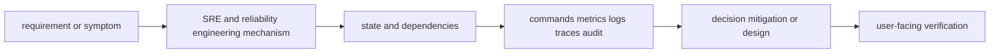
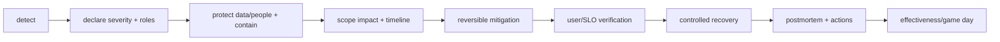

# SRE and reliability engineering

<!-- chapter-guide:start -->
> **Step 219 of 373 — 10.02**
>
> **Builds on:** [AI observability](../01-observability/07-ai-observability/README.md)
>
> **Now:** Learn **SRE and reliability engineering** from its mental model through production ownership.
>
> **Then:** Rehearse the linked questions and continue to [Reliability concepts](01-reliability-concepts/README.md).
<!-- chapter-guide:end -->

> [Interview questions and answers](questions-and-answers.md) · [Master curriculum](../../curriculum/master-curriculum.txt) · Official starting point: <https://sre.google/books/>

## Easy mode: mental model

Integrate every part of SRE and reliability engineering into one secure, reliable, observable, supportable and cost-aware production capability.

Learn this topic in layers: name the object or mechanism, trace its lifecycle/data path, configure it safely, observe a healthy and failed state, recover it, and then design it across failure domains and team boundaries.



## Deeper topic folders

- [33.1 Reliability concepts](01-reliability-concepts/README.md) — [Q&A](01-reliability-concepts/questions-and-answers.md)
- [33.2 Service indicators and objectives](02-service-indicators-and-objectives/README.md) — [Q&A](02-service-indicators-and-objectives/questions-and-answers.md)
- [33.3 Alerting](03-alerting/README.md) — [Q&A](03-alerting/questions-and-answers.md)
- [33.4 Capacity planning](04-capacity-planning/README.md) — [Q&A](04-capacity-planning/questions-and-answers.md)
- [33.5 Incident response](05-incident-response/README.md) — [Q&A](05-incident-response/questions-and-answers.md)
- [33.6 Post-incident work](06-post-incident-work/README.md) — [Q&A](06-post-incident-work/questions-and-answers.md)
- [33.7 Disaster recovery](07-disaster-recovery/README.md) — [Q&A](07-disaster-recovery/questions-and-answers.md)
- [33.8 Chaos and resilience testing](08-chaos-and-resilience-testing/README.md) — [Q&A](08-chaos-and-resilience-testing/questions-and-answers.md)

## Complete curriculum checklist

| # | Topic | What you must understand and demonstrate |
|---:|---|---|
| 1 | **Availability** | is part of SRE and reliability engineering; learn its precise definition, mechanism and lifecycle, nearest alternatives, configuration interface, failure/limit, security boundary, observable evidence and production trade-off. |
| 2 | **Durability** | is part of SRE and reliability engineering; learn its precise definition, mechanism and lifecycle, nearest alternatives, configuration interface, failure/limit, security boundary, observable evidence and production trade-off. |
| 3 | **Reliability** | is part of SRE and reliability engineering; learn its precise definition, mechanism and lifecycle, nearest alternatives, configuration interface, failure/limit, security boundary, observable evidence and production trade-off. |
| 4 | **Latency** | is part of SRE and reliability engineering; learn its precise definition, mechanism and lifecycle, nearest alternatives, configuration interface, failure/limit, security boundary, observable evidence and production trade-off. |
| 5 | **Throughput** | is part of SRE and reliability engineering; learn its precise definition, mechanism and lifecycle, nearest alternatives, configuration interface, failure/limit, security boundary, observable evidence and production trade-off. |
| 6 | **Correctness** | is part of SRE and reliability engineering; learn its precise definition, mechanism and lifecycle, nearest alternatives, configuration interface, failure/limit, security boundary, observable evidence and production trade-off. |
| 7 | **Freshness** | is part of SRE and reliability engineering; learn its precise definition, mechanism and lifecycle, nearest alternatives, configuration interface, failure/limit, security boundary, observable evidence and production trade-off. |
| 8 | **Quality** | is part of SRE and reliability engineering; learn its precise definition, mechanism and lifecycle, nearest alternatives, configuration interface, failure/limit, security boundary, observable evidence and production trade-off. |
| 9 | **SLIs** | is part of SRE and reliability engineering; learn its precise definition, mechanism and lifecycle, nearest alternatives, configuration interface, failure/limit, security boundary, observable evidence and production trade-off. |
| 10 | **SLOs** | is part of SRE and reliability engineering; learn its precise definition, mechanism and lifecycle, nearest alternatives, configuration interface, failure/limit, security boundary, observable evidence and production trade-off. |
| 11 | **SLAs** | is part of SRE and reliability engineering; learn its precise definition, mechanism and lifecycle, nearest alternatives, configuration interface, failure/limit, security boundary, observable evidence and production trade-off. |
| 12 | **Error budgets** | is part of SRE and reliability engineering; learn its precise definition, mechanism and lifecycle, nearest alternatives, configuration interface, failure/limit, security boundary, observable evidence and production trade-off. |
| 13 | **Burn rates** | is part of SRE and reliability engineering; learn its precise definition, mechanism and lifecycle, nearest alternatives, configuration interface, failure/limit, security boundary, observable evidence and production trade-off. |
| 14 | **Multi-window alerts** | turns runtime state into evidence; define signal semantics, labels/context, retention/privacy/cost, healthy baseline, actionable threshold and a query that distinguishes competing hypotheses. |
| 15 | **User-facing indicators** | is part of SRE and reliability engineering; learn its precise definition, mechanism and lifecycle, nearest alternatives, configuration interface, failure/limit, security boundary, observable evidence and production trade-off. |
| 16 | **AI-quality SLOs** | is part of SRE and reliability engineering; learn its precise definition, mechanism and lifecycle, nearest alternatives, configuration interface, failure/limit, security boundary, observable evidence and production trade-off. |
| 17 | **Symptom-based alerts** | turns runtime state into evidence; define signal semantics, labels/context, retention/privacy/cost, healthy baseline, actionable threshold and a query that distinguishes competing hypotheses. |
| 18 | **Cause-based alerts** | turns runtime state into evidence; define signal semantics, labels/context, retention/privacy/cost, healthy baseline, actionable threshold and a query that distinguishes competing hypotheses. |
| 19 | **Actionable alerts** | turns runtime state into evidence; define signal semantics, labels/context, retention/privacy/cost, healthy baseline, actionable threshold and a query that distinguishes competing hypotheses. |
| 20 | **Alert fatigue** | turns runtime state into evidence; define signal semantics, labels/context, retention/privacy/cost, healthy baseline, actionable threshold and a query that distinguishes competing hypotheses. |
| 21 | **Escalation** | is part of SRE and reliability engineering; learn its precise definition, mechanism and lifecycle, nearest alternatives, configuration interface, failure/limit, security boundary, observable evidence and production trade-off. |
| 22 | **Paging policies** | is part of SRE and reliability engineering; learn its precise definition, mechanism and lifecycle, nearest alternatives, configuration interface, failure/limit, security boundary, observable evidence and production trade-off. |
| 23 | **Runbook links** | is part of SRE and reliability engineering; learn its precise definition, mechanism and lifecycle, nearest alternatives, configuration interface, failure/limit, security boundary, observable evidence and production trade-off. |
| 24 | **Baselines** | is part of SRE and reliability engineering; learn its precise definition, mechanism and lifecycle, nearest alternatives, configuration interface, failure/limit, security boundary, observable evidence and production trade-off. |
| 25 | **Forecasts** | is part of SRE and reliability engineering; learn its precise definition, mechanism and lifecycle, nearest alternatives, configuration interface, failure/limit, security boundary, observable evidence and production trade-off. |
| 26 | **Headroom** | is part of SRE and reliability engineering; learn its precise definition, mechanism and lifecycle, nearest alternatives, configuration interface, failure/limit, security boundary, observable evidence and production trade-off. |
| 27 | **Seasonal demand** | is part of SRE and reliability engineering; learn its precise definition, mechanism and lifecycle, nearest alternatives, configuration interface, failure/limit, security boundary, observable evidence and production trade-off. |
| 28 | **Load testing** | is part of SRE and reliability engineering; learn its precise definition, mechanism and lifecycle, nearest alternatives, configuration interface, failure/limit, security boundary, observable evidence and production trade-off. |
| 29 | **Stress testing** | is part of SRE and reliability engineering; learn its precise definition, mechanism and lifecycle, nearest alternatives, configuration interface, failure/limit, security boundary, observable evidence and production trade-off. |
| 30 | **Saturation** | is part of SRE and reliability engineering; learn its precise definition, mechanism and lifecycle, nearest alternatives, configuration interface, failure/limit, security boundary, observable evidence and production trade-off. |
| 31 | **Queueing** | is part of SRE and reliability engineering; learn its precise definition, mechanism and lifecycle, nearest alternatives, configuration interface, failure/limit, security boundary, observable evidence and production trade-off. |
| 32 | **GPU capacity planning** | must connect demand and work units to latency, errors, saturation, queueing, provisioning delay, headroom, failure domains and unit cost using measured distributions. |
| 33 | **Incident commander** | requires a layer-by-layer, evidence-first path from user impact and recent change through identity, configuration, runtime, dependency and resource saturation, followed by reversible mitigation and verified repair. |
| 34 | **Operations lead** | is part of SRE and reliability engineering; learn its precise definition, mechanism and lifecycle, nearest alternatives, configuration interface, failure/limit, security boundary, observable evidence and production trade-off. |
| 35 | **Communications lead** | is part of SRE and reliability engineering; learn its precise definition, mechanism and lifecycle, nearest alternatives, configuration interface, failure/limit, security boundary, observable evidence and production trade-off. |
| 36 | **Severity levels** | is part of SRE and reliability engineering; learn its precise definition, mechanism and lifecycle, nearest alternatives, configuration interface, failure/limit, security boundary, observable evidence and production trade-off. |
| 37 | **Impact assessment** | is part of SRE and reliability engineering; learn its precise definition, mechanism and lifecycle, nearest alternatives, configuration interface, failure/limit, security boundary, observable evidence and production trade-off. |
| 38 | **Timeline** | is part of SRE and reliability engineering; learn its precise definition, mechanism and lifecycle, nearest alternatives, configuration interface, failure/limit, security boundary, observable evidence and production trade-off. |
| 39 | **Mitigation** | is part of SRE and reliability engineering; learn its precise definition, mechanism and lifecycle, nearest alternatives, configuration interface, failure/limit, security boundary, observable evidence and production trade-off. |
| 40 | **Recovery validation** | is a controlled state transition requiring inventory, compatibility, protected state, rehearsal, rollback/abort criteria, integrity checks and measured user-facing RPO/RTO or completion. |
| 41 | **Stakeholder updates** | is part of SRE and reliability engineering; learn its precise definition, mechanism and lifecycle, nearest alternatives, configuration interface, failure/limit, security boundary, observable evidence and production trade-off. |
| 42 | **Evidence preservation** | is part of SRE and reliability engineering; learn its precise definition, mechanism and lifecycle, nearest alternatives, configuration interface, failure/limit, security boundary, observable evidence and production trade-off. |
| 43 | **Blameless postmortems** | is part of SRE and reliability engineering; learn its precise definition, mechanism and lifecycle, nearest alternatives, configuration interface, failure/limit, security boundary, observable evidence and production trade-off. |
| 44 | **Root cause** | is part of SRE and reliability engineering; learn its precise definition, mechanism and lifecycle, nearest alternatives, configuration interface, failure/limit, security boundary, observable evidence and production trade-off. |
| 45 | **Contributing factors** | is part of SRE and reliability engineering; learn its precise definition, mechanism and lifecycle, nearest alternatives, configuration interface, failure/limit, security boundary, observable evidence and production trade-off. |
| 46 | **Corrective actions** | is part of SRE and reliability engineering; learn its precise definition, mechanism and lifecycle, nearest alternatives, configuration interface, failure/limit, security boundary, observable evidence and production trade-off. |
| 47 | **Preventive actions** | is part of SRE and reliability engineering; learn its precise definition, mechanism and lifecycle, nearest alternatives, configuration interface, failure/limit, security boundary, observable evidence and production trade-off. |
| 48 | **Ownership** | is part of SRE and reliability engineering; learn its precise definition, mechanism and lifecycle, nearest alternatives, configuration interface, failure/limit, security boundary, observable evidence and production trade-off. |
| 49 | **Deadlines** | is part of SRE and reliability engineering; learn its precise definition, mechanism and lifecycle, nearest alternatives, configuration interface, failure/limit, security boundary, observable evidence and production trade-off. |
| 50 | **Effectiveness reviews** | is part of SRE and reliability engineering; learn its precise definition, mechanism and lifecycle, nearest alternatives, configuration interface, failure/limit, security boundary, observable evidence and production trade-off. |
| 51 | **RPO** | is part of SRE and reliability engineering; learn its precise definition, mechanism and lifecycle, nearest alternatives, configuration interface, failure/limit, security boundary, observable evidence and production trade-off. |
| 52 | **RTO** | is part of SRE and reliability engineering; learn its precise definition, mechanism and lifecycle, nearest alternatives, configuration interface, failure/limit, security boundary, observable evidence and production trade-off. |
| 53 | **Backup** | is a controlled state transition requiring inventory, compatibility, protected state, rehearsal, rollback/abort criteria, integrity checks and measured user-facing RPO/RTO or completion. |
| 54 | **Restore** | is a controlled state transition requiring inventory, compatibility, protected state, rehearsal, rollback/abort criteria, integrity checks and measured user-facing RPO/RTO or completion. |
| 55 | **Pilot light** | is part of SRE and reliability engineering; learn its precise definition, mechanism and lifecycle, nearest alternatives, configuration interface, failure/limit, security boundary, observable evidence and production trade-off. |
| 56 | **Warm standby** | is part of SRE and reliability engineering; learn its precise definition, mechanism and lifecycle, nearest alternatives, configuration interface, failure/limit, security boundary, observable evidence and production trade-off. |
| 57 | **Active-passive** | is part of SRE and reliability engineering; learn its precise definition, mechanism and lifecycle, nearest alternatives, configuration interface, failure/limit, security boundary, observable evidence and production trade-off. |
| 58 | **Active-active** | is part of SRE and reliability engineering; learn its precise definition, mechanism and lifecycle, nearest alternatives, configuration interface, failure/limit, security boundary, observable evidence and production trade-off. |
| 59 | **Regional failover** | is part of SRE and reliability engineering; learn its precise definition, mechanism and lifecycle, nearest alternatives, configuration interface, failure/limit, security boundary, observable evidence and production trade-off. |
| 60 | **Data reconciliation** | is part of SRE and reliability engineering; learn its precise definition, mechanism and lifecycle, nearest alternatives, configuration interface, failure/limit, security boundary, observable evidence and production trade-off. |
| 61 | **DR testing** | is part of SRE and reliability engineering; learn its precise definition, mechanism and lifecycle, nearest alternatives, configuration interface, failure/limit, security boundary, observable evidence and production trade-off. |
| 62 | **Failure injection** | requires a layer-by-layer, evidence-first path from user impact and recent change through identity, configuration, runtime, dependency and resource saturation, followed by reversible mitigation and verified repair. |
| 63 | **Node failure** | requires a layer-by-layer, evidence-first path from user impact and recent change through identity, configuration, runtime, dependency and resource saturation, followed by reversible mitigation and verified repair. |
| 64 | **Zone failure** | requires a layer-by-layer, evidence-first path from user impact and recent change through identity, configuration, runtime, dependency and resource saturation, followed by reversible mitigation and verified repair. |
| 65 | **Dependency failure** | requires a layer-by-layer, evidence-first path from user impact and recent change through identity, configuration, runtime, dependency and resource saturation, followed by reversible mitigation and verified repair. |
| 66 | **Network latency** | is part of SRE and reliability engineering; learn its precise definition, mechanism and lifecycle, nearest alternatives, configuration interface, failure/limit, security boundary, observable evidence and production trade-off. |
| 67 | **Packet loss** | is part of SRE and reliability engineering; learn its precise definition, mechanism and lifecycle, nearest alternatives, configuration interface, failure/limit, security boundary, observable evidence and production trade-off. |
| 68 | **Provider outage** | is part of SRE and reliability engineering; learn its precise definition, mechanism and lifecycle, nearest alternatives, configuration interface, failure/limit, security boundary, observable evidence and production trade-off. |
| 69 | **GPU failure** | requires a layer-by-layer, evidence-first path from user impact and recent change through identity, configuration, runtime, dependency and resource saturation, followed by reversible mitigation and verified repair. |
| 70 | **Model-serving overload** | is part of SRE and reliability engineering; learn its precise definition, mechanism and lifecycle, nearest alternatives, configuration interface, failure/limit, security boundary, observable evidence and production trade-off. |
| 71 | **Game days** | is part of SRE and reliability engineering; learn its precise definition, mechanism and lifecycle, nearest alternatives, configuration interface, failure/limit, security boundary, observable evidence and production trade-off. |

## Beginner → mid-level → senior learning path

1. **Beginner:** define every term; identify the relevant file, object, protocol, API, or command; explain one normal use.
2. **Mid-level:** configure it from source control, inspect effective runtime state, diagnose two failure modes, automate a safe change, and explain one trade-off.
3. **Senior:** clarify ambiguous requirements, map trust and failure domains, quantify capacity/SLO/RPO/RTO/cost, compare alternatives, plan migration/rollback, and assign ownership.

## Command and configuration lab

Run read-only checks first in a sandbox. For each command, predict healthy output, one failing result, the next discriminating check, and the safe rollback for any later mutation.

```bash
curl -s http://SERVICE/metrics
promtool check rules rules.yml
kubectl get events -A --sort-by=.lastTimestamp
trivy fs .
```

## Hands-on practice: setup → failure → verification → cleanup

Use a disposable local or cloud sandbox. Confirm identity/context and cost boundary, capture a healthy baseline with the commands above, introduce one bounded configuration or invalid-input failure, compare evidence, revert from source control, verify the original outcome, and delete only the named lab resources.

Expected result: you can show the healthy evidence, reproduce a safe failure, explain why each command distinguishes one layer from another, restore the baseline, and prove cleanup. Hard extension: automate the lab from source control, add a test or alert for the injected failure, and write a five-step runbook another engineer can execute.

For code/configuration, be ready to review an intentionally unsafe diff and improve idempotency, secret handling, timeouts, validation, logging, tests, and rollback.

## Senior design checklist

State assumptions for tenants, traffic/work units, latency and availability targets, data classification/residency, recovery, team skills and budget. Draw control/data planes and synchronous/asynchronous dependencies. Cover identity, policy, encryption/key lifecycle, delivery provenance, observability, capacity, unit cost, operational ownership, migration and exit criteria. Name the evidence that would cause you to revise the design.

## Revision and practice

Complete the separate [checkbox interview bank](questions-and-answers.md). Do not memorize wording: speak in the order **definition → mechanism → evidence/configuration → failure/trade-off → production example**. For procedures use **stabilize → scope → inspect → hypothesize → test → mitigate → verify → prevent**.

<!-- merged-10-OPERATIONS-SRE-RELIABILITY-MD:start -->
## Practical deep dive

## SLO system

SLI is a measured user outcome; SLO is its target over a window; SLA is an external commitment/consequence; error budget is allowed unreliability. Availability, latency, correctness, freshness and AI quality may all matter. Define eligible events, good criteria, data source, window and exclusions before a percentage.

```text
availability SLI = successful eligible requests / eligible requests
99.9% monthly error budget ≈ 0.1% bad eligible requests (or ~43.8 min only under time-based simplification)
```

Use multi-window multi-burn alerts: a high short+long burn pages; slower burn tickets. Error-budget policy controls rollout/risk work but should not incentivize hiding errors/exclusions.

## Capacity and queueing

Measure arrival distribution, request/token size, service time, concurrency, throughput/goodput and saturation. Use Little’s Law in a stable system: `L = λW`. Capacity test with realistic prompt/output lengths, cache state, tenant mix and failures. Plan forecast/headroom, quotas/reservations, provisioning/warm time, growth/seasonality and dependency limits. Stress reveals collapse; load validates expected; soak reveals leaks; spike tests elasticity.

## Incident operating model



Incident commander owns priorities/decisions; operations lead coordinates technical work; communications lead maintains stakeholder updates; scribe records timeline. Use single command channel, explicit owners/timestamps and scheduled updates. Preserve evidence. Recovery validation uses user transactions and data correctness, not “Pods green.”

## Disaster recovery

RPO is tolerable data loss time; RTO is tolerable restoration time. Backup is a copy; restore is a procedure; DR is recovery of service and business dependencies. Strategies range backup/restore → pilot light → warm standby → active/passive → active/active, increasing cost/complexity. Active-active requires conflict/routing/failback design.

DR runbook includes trigger/authority, identity/DNS/certs/keys, infrastructure rebuild, data restore/replay/order, artifact/config version, dependency/provider, validation, traffic shift, customer communication, failback and evidence. Test with representative data and measure actual RPO/RTO.

## Chaos and resilience

Write hypothesis, steady-state SLI, blast radius, abort criteria, owner/communications and rollback. Begin dependency timeout in staging, then controlled production game days: Pod/node/AZ, packet loss/latency, DNS, queue overload, database failover, provider throttling, GPU failure, telemetry outage. A chaos tool is not a safety plan.

Kubernetes experiment sketch:

```bash
kubectl get pdb -A
kubectl cordon NODE
kubectl drain NODE --ignore-daemonsets --delete-emptydir-data --timeout=20m
kubectl get pods -A -o wide --watch
kubectl uncordon NODE
```

Network fault in a disposable namespace/container only:

```bash
tc qdisc add dev eth0 root netem delay 200ms 50ms loss 2%
tc qdisc show dev eth0
tc qdisc del dev eth0 root
```

## Postmortem quality

Include impact and duration, detection, response/timeline, causal mechanism, contributing conditions, what worked/failed, counterfactual safeguards and actions. Avoid a single “human error” root. Actions have owner/deadline/type (detect/mitigate/prevent), risk priority and effectiveness check. Update design, tests, alerts/runbook/training and backlog.

## AI reliability extensions

Quality can silently regress while HTTP stays 200. Define evaluation/groundedness/tool-success/citation/safety SLIs with sample/label/judge reliability. Model/provider fallback may change quality/cost/residency/context/tool support. Streaming cancellation, retry ambiguity, queue/token overload, GPU cold starts and RAG staleness need explicit SLO and degradation modes.

## Labs and revision

Write SLOs/burn alerts for gateway and model TTFT; capacity-test token distributions; run node/AZ/provider-failure tabletop; restore a vector index and validate retrieval metrics; lead a timed mock incident with updates; write postmortem/action review.

- Reliability is a measured user outcome and operating policy.
- Capacity includes provisioning delay and dependency/quota/cold-start constraints.
- Incidents prioritize safety, reversible mitigation and communication.
- DR is only credible after successful timed restore/failover tests.
- AI systems require quality/safety/freshness SLOs alongside infrastructure.


<!-- merged-10-OPERATIONS-SRE-RELIABILITY-MD:end -->

<!-- reading-navigation:start -->
---

**Reading path:** [← Back: AI observability](../01-observability/07-ai-observability/README.md) · [Questions](questions-and-answers.md) · [Next: Reliability concepts →](01-reliability-concepts/README.md)

<!-- reading-navigation:end -->
