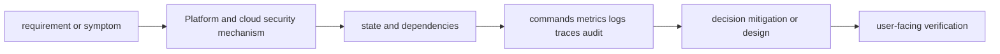
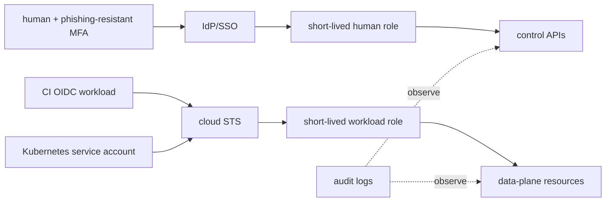
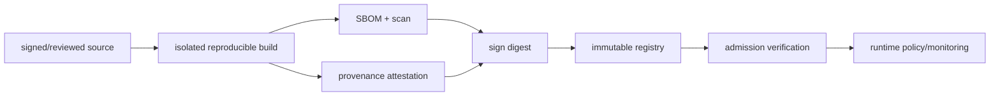

# Platform and cloud security

<!-- chapter-guide:start -->
> **Step 228 of 373 — 10.03**
>
> **Builds on:** [Chaos and resilience testing](../02-sre-and-reliability-engineering/08-chaos-and-resilience-testing/README.md)
>
> **Now:** Learn **Platform and cloud security** from its mental model through production ownership.
>
> **Then:** Rehearse the linked questions and continue to [Identity security](01-identity-security/README.md).
<!-- chapter-guide:end -->

> [Interview questions and answers](questions-and-answers.md) · [Master curriculum](../../curriculum/master-curriculum.txt) · Official starting point: <https://slsa.dev/spec/v1.0/>

## Easy mode: mental model

Integrate every part of Platform and cloud security into one secure, reliable, observable, supportable and cost-aware production capability.

Learn this topic in layers: name the object or mechanism, trace its lifecycle/data path, configure it safely, observe a healthy and failed state, recover it, and then design it across failure domains and team boundaries.



## Deeper topic folders

- [34.1 Identity security](01-identity-security/README.md) — [Q&A](01-identity-security/questions-and-answers.md)
- [34.2 Secret management](02-secret-management/README.md) — [Q&A](02-secret-management/questions-and-answers.md)
- [34.3 Network security](03-network-security/README.md) — [Q&A](03-network-security/questions-and-answers.md)
- [34.4 Software supply chain](04-software-supply-chain/README.md) — [Q&A](04-software-supply-chain/questions-and-answers.md)
- [34.5 Kubernetes security](05-kubernetes-security/README.md) — [Q&A](05-kubernetes-security/questions-and-answers.md)
- [34.6 Vulnerability management](06-vulnerability-management/README.md) — [Q&A](06-vulnerability-management/questions-and-answers.md)
- [34.7 Compliance evidence](07-compliance-evidence/README.md) — [Q&A](07-compliance-evidence/questions-and-answers.md)

## Complete curriculum checklist

| # | Topic | What you must understand and demonstrate |
|---:|---|---|
| 1 | **Human identities** | is part of Platform and cloud security; learn its precise definition, mechanism and lifecycle, nearest alternatives, configuration interface, failure/limit, security boundary, observable evidence and production trade-off. |
| 2 | **Workload identities** | is part of Platform and cloud security; learn its precise definition, mechanism and lifecycle, nearest alternatives, configuration interface, failure/limit, security boundary, observable evidence and production trade-off. |
| 3 | **Federation** | is part of Platform and cloud security; learn its precise definition, mechanism and lifecycle, nearest alternatives, configuration interface, failure/limit, security boundary, observable evidence and production trade-off. |
| 4 | **OIDC** | is part of Platform and cloud security; learn its precise definition, mechanism and lifecycle, nearest alternatives, configuration interface, failure/limit, security boundary, observable evidence and production trade-off. |
| 5 | **Short-lived credentials** | is part of Platform and cloud security; learn its precise definition, mechanism and lifecycle, nearest alternatives, configuration interface, failure/limit, security boundary, observable evidence and production trade-off. |
| 6 | **Least privilege** | is part of Platform and cloud security; learn its precise definition, mechanism and lifecycle, nearest alternatives, configuration interface, failure/limit, security boundary, observable evidence and production trade-off. |
| 7 | **Privileged access** | is part of Platform and cloud security; learn its precise definition, mechanism and lifecycle, nearest alternatives, configuration interface, failure/limit, security boundary, observable evidence and production trade-off. |
| 8 | **Break-glass access** | is part of Platform and cloud security; learn its precise definition, mechanism and lifecycle, nearest alternatives, configuration interface, failure/limit, security boundary, observable evidence and production trade-off. |
| 9 | **Access reviews** | is part of Platform and cloud security; learn its precise definition, mechanism and lifecycle, nearest alternatives, configuration interface, failure/limit, security boundary, observable evidence and production trade-off. |
| 10 | **Secret stores** | is part of Platform and cloud security; learn its precise definition, mechanism and lifecycle, nearest alternatives, configuration interface, failure/limit, security boundary, observable evidence and production trade-off. |
| 11 | **Secret rotation** | is part of Platform and cloud security; learn its precise definition, mechanism and lifecycle, nearest alternatives, configuration interface, failure/limit, security boundary, observable evidence and production trade-off. |
| 12 | **Dynamic secrets** | is part of Platform and cloud security; learn its precise definition, mechanism and lifecycle, nearest alternatives, configuration interface, failure/limit, security boundary, observable evidence and production trade-off. |
| 13 | **Envelope encryption** | is part of Platform and cloud security; learn its precise definition, mechanism and lifecycle, nearest alternatives, configuration interface, failure/limit, security boundary, observable evidence and production trade-off. |
| 14 | **KMS integration** | is part of Platform and cloud security; learn its precise definition, mechanism and lifecycle, nearest alternatives, configuration interface, failure/limit, security boundary, observable evidence and production trade-off. |
| 15 | **Secret injection** | is part of Platform and cloud security; learn its precise definition, mechanism and lifecycle, nearest alternatives, configuration interface, failure/limit, security boundary, observable evidence and production trade-off. |
| 16 | **Preventing secrets in source code** | is part of Platform and cloud security; learn its precise definition, mechanism and lifecycle, nearest alternatives, configuration interface, failure/limit, security boundary, observable evidence and production trade-off. |
| 17 | **Preventing secrets in logs** | turns runtime state into evidence; define signal semantics, labels/context, retention/privacy/cost, healthy baseline, actionable threshold and a query that distinguishes competing hypotheses. |
| 18 | **Segmentation** | is part of Platform and cloud security; learn its precise definition, mechanism and lifecycle, nearest alternatives, configuration interface, failure/limit, security boundary, observable evidence and production trade-off. |
| 19 | **Zero trust** | is part of Platform and cloud security; learn its precise definition, mechanism and lifecycle, nearest alternatives, configuration interface, failure/limit, security boundary, observable evidence and production trade-off. |
| 20 | **Private endpoints** | is part of Platform and cloud security; learn its precise definition, mechanism and lifecycle, nearest alternatives, configuration interface, failure/limit, security boundary, observable evidence and production trade-off. |
| 21 | **Egress controls** | is part of Platform and cloud security; learn its precise definition, mechanism and lifecycle, nearest alternatives, configuration interface, failure/limit, security boundary, observable evidence and production trade-off. |
| 22 | **mTLS** | is part of Platform and cloud security; learn its precise definition, mechanism and lifecycle, nearest alternatives, configuration interface, failure/limit, security boundary, observable evidence and production trade-off. |
| 23 | **NetworkPolicy** | defines a trust/control boundary: identify actor, protected asset, decision/enforcement point, least privilege, bypass path, audit evidence, rotation/revocation and recovery. |
| 24 | **Firewalls** | is part of Platform and cloud security; learn its precise definition, mechanism and lifecycle, nearest alternatives, configuration interface, failure/limit, security boundary, observable evidence and production trade-off. |
| 25 | **WAF** | is part of Platform and cloud security; learn its precise definition, mechanism and lifecycle, nearest alternatives, configuration interface, failure/limit, security boundary, observable evidence and production trade-off. |
| 26 | **DDoS protection** | is part of Platform and cloud security; learn its precise definition, mechanism and lifecycle, nearest alternatives, configuration interface, failure/limit, security boundary, observable evidence and production trade-off. |
| 27 | **SBOMs** | is part of Platform and cloud security; learn its precise definition, mechanism and lifecycle, nearest alternatives, configuration interface, failure/limit, security boundary, observable evidence and production trade-off. |
| 28 | **Dependency scanning** | is part of Platform and cloud security; learn its precise definition, mechanism and lifecycle, nearest alternatives, configuration interface, failure/limit, security boundary, observable evidence and production trade-off. |
| 29 | **Image scanning** | is part of Platform and cloud security; learn its precise definition, mechanism and lifecycle, nearest alternatives, configuration interface, failure/limit, security boundary, observable evidence and production trade-off. |
| 30 | **Provenance** | is part of Platform and cloud security; learn its precise definition, mechanism and lifecycle, nearest alternatives, configuration interface, failure/limit, security boundary, observable evidence and production trade-off. |
| 31 | **Artifact signing** | is part of Platform and cloud security; learn its precise definition, mechanism and lifecycle, nearest alternatives, configuration interface, failure/limit, security boundary, observable evidence and production trade-off. |
| 32 | **Admission verification** | is part of Platform and cloud security; learn its precise definition, mechanism and lifecycle, nearest alternatives, configuration interface, failure/limit, security boundary, observable evidence and production trade-off. |
| 33 | **SLSA** | is part of Platform and cloud security; learn its precise definition, mechanism and lifecycle, nearest alternatives, configuration interface, failure/limit, security boundary, observable evidence and production trade-off. |
| 34 | **Trusted build systems** | is part of Platform and cloud security; learn its precise definition, mechanism and lifecycle, nearest alternatives, configuration interface, failure/limit, security boundary, observable evidence and production trade-off. |
| 35 | **Registry controls** | is part of Platform and cloud security; learn its precise definition, mechanism and lifecycle, nearest alternatives, configuration interface, failure/limit, security boundary, observable evidence and production trade-off. |
| 36 | **RBAC** | is part of Platform and cloud security; learn its precise definition, mechanism and lifecycle, nearest alternatives, configuration interface, failure/limit, security boundary, observable evidence and production trade-off. |
| 37 | **Pod Security Standards** | defines a trust/control boundary: identify actor, protected asset, decision/enforcement point, least privilege, bypass path, audit evidence, rotation/revocation and recovery. |
| 38 | **Admission control** | is part of Platform and cloud security; learn its precise definition, mechanism and lifecycle, nearest alternatives, configuration interface, failure/limit, security boundary, observable evidence and production trade-off. |
| 39 | **NetworkPolicy** | defines a trust/control boundary: identify actor, protected asset, decision/enforcement point, least privilege, bypass path, audit evidence, rotation/revocation and recovery. |
| 40 | **Runtime security** | defines a trust/control boundary: identify actor, protected asset, decision/enforcement point, least privilege, bypass path, audit evidence, rotation/revocation and recovery. |
| 41 | **Secrets encryption** | is part of Platform and cloud security; learn its precise definition, mechanism and lifecycle, nearest alternatives, configuration interface, failure/limit, security boundary, observable evidence and production trade-off. |
| 42 | **Audit logs** | turns runtime state into evidence; define signal semantics, labels/context, retention/privacy/cost, healthy baseline, actionable threshold and a query that distinguishes competing hypotheses. |
| 43 | **Node hardening** | defines a trust/control boundary: identify actor, protected asset, decision/enforcement point, least privilege, bypass path, audit evidence, rotation/revocation and recovery. |
| 44 | **Multi-tenancy** | is part of Platform and cloud security; learn its precise definition, mechanism and lifecycle, nearest alternatives, configuration interface, failure/limit, security boundary, observable evidence and production trade-off. |
| 45 | **Discovery** | is part of Platform and cloud security; learn its precise definition, mechanism and lifecycle, nearest alternatives, configuration interface, failure/limit, security boundary, observable evidence and production trade-off. |
| 46 | **Prioritization** | is part of Platform and cloud security; learn its precise definition, mechanism and lifecycle, nearest alternatives, configuration interface, failure/limit, security boundary, observable evidence and production trade-off. |
| 47 | **CVSS limitations** | is part of Platform and cloud security; learn its precise definition, mechanism and lifecycle, nearest alternatives, configuration interface, failure/limit, security boundary, observable evidence and production trade-off. |
| 48 | **Exploitability** | is part of Platform and cloud security; learn its precise definition, mechanism and lifecycle, nearest alternatives, configuration interface, failure/limit, security boundary, observable evidence and production trade-off. |
| 49 | **Patch management** | is part of Platform and cloud security; learn its precise definition, mechanism and lifecycle, nearest alternatives, configuration interface, failure/limit, security boundary, observable evidence and production trade-off. |
| 50 | **Exceptions** | is part of Platform and cloud security; learn its precise definition, mechanism and lifecycle, nearest alternatives, configuration interface, failure/limit, security boundary, observable evidence and production trade-off. |
| 51 | **Compensating controls** | is part of Platform and cloud security; learn its precise definition, mechanism and lifecycle, nearest alternatives, configuration interface, failure/limit, security boundary, observable evidence and production trade-off. |
| 52 | **Verification** | is part of Platform and cloud security; learn its precise definition, mechanism and lifecycle, nearest alternatives, configuration interface, failure/limit, security boundary, observable evidence and production trade-off. |
| 53 | **Access logs** | turns runtime state into evidence; define signal semantics, labels/context, retention/privacy/cost, healthy baseline, actionable threshold and a query that distinguishes competing hypotheses. |
| 54 | **Change logs** | turns runtime state into evidence; define signal semantics, labels/context, retention/privacy/cost, healthy baseline, actionable threshold and a query that distinguishes competing hypotheses. |
| 55 | **IaC history** | is part of Platform and cloud security; learn its precise definition, mechanism and lifecycle, nearest alternatives, configuration interface, failure/limit, security boundary, observable evidence and production trade-off. |
| 56 | **Approval records** | is part of Platform and cloud security; learn its precise definition, mechanism and lifecycle, nearest alternatives, configuration interface, failure/limit, security boundary, observable evidence and production trade-off. |
| 57 | **Vulnerability reports** | is part of Platform and cloud security; learn its precise definition, mechanism and lifecycle, nearest alternatives, configuration interface, failure/limit, security boundary, observable evidence and production trade-off. |
| 58 | **Backup tests** | is a controlled state transition requiring inventory, compatibility, protected state, rehearsal, rollback/abort criteria, integrity checks and measured user-facing RPO/RTO or completion. |
| 59 | **Restore tests** | is a controlled state transition requiring inventory, compatibility, protected state, rehearsal, rollback/abort criteria, integrity checks and measured user-facing RPO/RTO or completion. |
| 60 | **Incident records** | requires a layer-by-layer, evidence-first path from user impact and recent change through identity, configuration, runtime, dependency and resource saturation, followed by reversible mitigation and verified repair. |
| 61 | **Policy reports** | defines a trust/control boundary: identify actor, protected asset, decision/enforcement point, least privilege, bypass path, audit evidence, rotation/revocation and recovery. |

## Beginner → mid-level → senior learning path

1. **Beginner:** define every term; identify the relevant file, object, protocol, API, or command; explain one normal use.
2. **Mid-level:** configure it from source control, inspect effective runtime state, diagnose two failure modes, automate a safe change, and explain one trade-off.
3. **Senior:** clarify ambiguous requirements, map trust and failure domains, quantify capacity/SLO/RPO/RTO/cost, compare alternatives, plan migration/rollback, and assign ownership.

## Command and configuration lab

Run read-only checks first in a sandbox. For each command, predict healthy output, one failing result, the next discriminating check, and the safe rollback for any later mutation.

```bash
curl -s http://SERVICE/metrics
promtool check rules rules.yml
kubectl get events -A --sort-by=.lastTimestamp
trivy fs .
```

## Hands-on practice: setup → failure → verification → cleanup

Use a disposable local or cloud sandbox. Confirm identity/context and cost boundary, capture a healthy baseline with the commands above, introduce one bounded configuration or invalid-input failure, compare evidence, revert from source control, verify the original outcome, and delete only the named lab resources.

Expected result: you can show the healthy evidence, reproduce a safe failure, explain why each command distinguishes one layer from another, restore the baseline, and prove cleanup. Hard extension: automate the lab from source control, add a test or alert for the injected failure, and write a five-step runbook another engineer can execute.

For code/configuration, be ready to review an intentionally unsafe diff and improve idempotency, secret handling, timeouts, validation, logging, tests, and rollback.

## Senior design checklist

State assumptions for tenants, traffic/work units, latency and availability targets, data classification/residency, recovery, team skills and budget. Draw control/data planes and synchronous/asynchronous dependencies. Cover identity, policy, encryption/key lifecycle, delivery provenance, observability, capacity, unit cost, operational ownership, migration and exit criteria. Name the evidence that would cause you to revise the design.

## Revision and practice

Complete the separate [checkbox interview bank](questions-and-answers.md). Do not memorize wording: speak in the order **definition → mechanism → evidence/configuration → failure/trade-off → production example**. For procedures use **stabilize → scope → inspect → hypothesize → test → mitigate → verify → prevent**.

<!-- merged-10-OPERATIONS-SECURITY-MD:start -->
## Practical deep dive

## Threat model and identity

Inventory assets, actors, entry points, data flows, trust boundaries and abuse cases. Separate human, CI/control-plane and runtime identities. Use federation, short-lived credentials, MFA, least privilege, just-in-time privileged access, reviewed break-glass and periodic access review. Workload identity binds runtime subject/audience/conditions to a narrow role; never distribute cloud keys in images or Kubernetes Secrets by default.



## Secrets and encryption

Prefer no secret (identity federation), then dynamic short-lived, then rotated static. Store in managed secret systems with envelope encryption/KMS, narrow policy, version/stage, audit, cache/revocation and tested rotation. Prevent source/log/trace/CLI history leakage. Encryption at rest protects media/service paths but availability depends on key policy/lifecycle; TLS/mTLS protects transit/identity; application-level encryption changes processing/search/recovery.

## Network and Kubernetes controls

Segment accounts/projects/VPCs/namespaces; private endpoints and egress policy reduce paths; WAF/DDoS protect supported edges; mTLS/service identity can authenticate workloads. Zero trust means each access is explicitly authenticated/authorized under context, not “no network.”

Kubernetes: private/controlled API, OIDC, minimal RBAC, Pod Security restricted, non-root/read-only/seccomp/cap drop, NetworkPolicy, secret encryption/external store, admission policy, audit, node/runtime hardening, protected etcd/backups and tenant isolation. Creating privileged Pods, mounting host paths, using node credentials, reading Secrets, exec/impersonate/bind/escalate are privilege paths.

Audit commands:

```bash
kubectl auth can-i --list --as=system:serviceaccount:NS:SA -n NS
kubectl get clusterrolebinding -o json | jq '.items[] | select(.roleRef.name=="cluster-admin")'
kubectl get pods -A -o json | jq '.items[] | select(any(.spec.containers[]; .securityContext.privileged==true)) | [.metadata.namespace,.metadata.name]'
kubectl get networkpolicy -A
kubectl get validatingadmissionpolicy,validatingwebhookconfiguration
```

## Software supply chain



Pin dependencies/actions/base images; isolate build workers; generate SBOM/provenance; sign and verify by digest/identity; restrict registry mutation; admission verifies trusted provenance/policy; scan continuously and rebuild. Vulnerability priority uses reachability/exploitability/exposure/asset impact and compensating controls, not CVSS alone. Time-bound exceptions have owner/expiry.

## Detection, response and evidence

Collect identity/admin/data audit, network/DNS, admission, runtime and artifact events into a protected account/project. Alerts link to owner/runbook. Incident: contain without destroying evidence, revoke sessions/credentials, isolate resources, timeline scope, rebuild from trusted artifact, rotate secrets/keys as needed, validate and notify. Compliance evidence includes access/change/IaC approvals, vulnerability/exception, backup/restore, incident and policy reports with integrity/retention/access controls.

## Code/config review example

Unsafe Pod:

```yaml
spec:
  hostNetwork: true
  containers:
    - name: app
      securityContext: {privileged: true}
      volumeMounts: [{name: host, mountPath: /host}]
  volumes:
    - name: host
      hostPath: {path: /}
```

This effectively exposes host/root/network and bypasses tenant isolation. Replace with narrow APIs/CSI/device plugin, non-root, dropped capabilities, RuntimeDefault seccomp, read-only FS and minimal volumes; enforce with admission.

## Labs and revision

Threat-model gateway→RAG→model→tool; audit RBAC escalation in sandbox; build/sign/admit image; rotate a database secret without outage; quarantine compromised CI runner; restore KMS-encrypted backup with separate role; produce an evidence packet.

- Identity is the primary control plane; eliminate long-lived credentials.
- Encryption keys and secret rotation have availability lifecycles.
- Network and workload controls are layered, not interchangeable.
- Supply-chain trust binds source/build/artifact/deployment evidence.
- Security operations need owned detection, response and verifiable evidence.


<!-- merged-10-OPERATIONS-SECURITY-MD:end -->

<!-- reading-navigation:start -->
---

**Reading path:** [← Back: Chaos and resilience testing](../02-sre-and-reliability-engineering/08-chaos-and-resilience-testing/README.md) · [Questions](questions-and-answers.md) · [Next: Identity security →](01-identity-security/README.md)

<!-- reading-navigation:end -->
