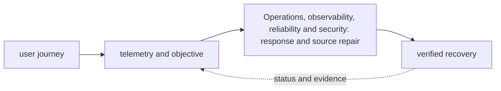

# Operations, observability, reliability and security

<!-- chapter-guide:start -->
> **Step 210 of 373 — 10**
>
> **Builds on:** [CircleCI](../09-iac-delivery/03-ci-cd/09-circleci/README.md)
>
> **Now:** Learn **Operations, observability, reliability and security** from its mental model through production ownership.
>
> **Then:** Rehearse the linked questions and continue to [Observability](01-observability/README.md).
<!-- chapter-guide:end -->

<!-- explanation-practice-normalizer:v1 -->


## Explanation

### What this chapter is and why it exists

**Operations, observability, reliability and security** is easiest to understand as one part of a larger path. The subject closes the loop between a user outcome and engineering action. Telemetry describes behavior, objectives define acceptable behavior, alerts identify urgent risk, and responders mitigate and repair the source of truth.

The chapter focuses on Operations, observability, reliability and security. These are connected mechanisms, not vocabulary to memorize. The operations branch connects telemetry and service objectives to incident response, recovery, security controls and durable prevention The explanations below first build the simple model, then add the exact system behavior and production consequences.

### History and evolution

Production operations moved from checking individual hosts to measuring distributed user journeys. SRE formalized service levels, error budgets and engineering approaches to toil; observability, incident command, post-incident learning and policy-as-code extended that model across cloud platforms.

In this chapter, **Operations, observability, reliability and security** is the next layer of that evolution. Its modern purpose is to the operations branch connects telemetry and service objectives to incident response, recovery, security controls and durable prevention. The exact product surface may change by version, but the underlying state, request path and failure boundaries remain the durable ideas to learn.

### How the complete branch works



A branch overview connects child mechanisms into one lifecycle. The input crosses identity and policy, a control or decision plane, the runtime data path and its dependencies before producing a user-visible result. Status and telemetry travel back through the loop so operators and controllers can correct drift or failure. Reading the child chapters adds precision, but this overview explains why those chapters depend on one another.

A useful test of understanding is to trace one concrete request or change from origin to outcome and name the authoritative state at each boundary. That trace reveals where work is synchronous or asynchronous, which failure domains are independent, what a timeout can prove, and which evidence distinguishes accepted intent from healthy behavior.

### Integrated operations mental model

Observe user outcomes and system state, compare them with explicit SLO and security objectives, and take the smallest reversible action that reduces risk. Metrics, logs, traces, profiles and audit records answer different questions; telemetry itself needs availability, privacy, retention and cost controls. Reliability work joins capacity, alerting, incident response, postmortems, disaster recovery and game days with identity, secret, network, supply-chain and workload security.

```bash
curl -s http://SERVICE/metrics
kubectl get events -A --sort-by=.lastTimestamp
promtool check rules rules.yml
trivy fs .
```

Practise by selecting one disposable service, defining a user-facing SLI/SLO, adding a dashboard and multi-window burn alert, injecting a bounded latency or dependency failure, following metrics→trace→logs→change/audit evidence, restoring the SLO, and proving that the alert and runbook worked. Then test a restore rather than merely checking that a backup job is green.

Cleanup the injected failure, temporary alerts, dashboards, test data and disposable service; confirm telemetry ingestion and billable resources returned to the intended baseline.

Authoritative starting points: [OpenTelemetry](https://opentelemetry.io/docs/), [Google SRE books](https://sre.google/books/), and [SLSA](https://slsa.dev/).

## Practice

### Practice objective

Build a small, safe proof of **Operations, observability, reliability and security** and explain the result in your own words. The goal is not command completion; it is to connect input, internal mechanism, observable state and user outcome.

### Prerequisites and setup

Use a disposable local environment, sandbox account/project or isolated namespace. Confirm the effective identity and target, record the start time, and set a cost limit before creating anything.

Record tool and platform versions because flags, APIs and defaults can change. Define every uppercase placeholder before use and keep secrets out of shell history and committed files.

### Activity 1: establish a healthy baseline

Run the read-oriented example first:

```bash
date -u
curl -sS URL/metrics
kubectl get events -A --sort-by=.lastTimestamp
```

For each line, write down the layer it inspects, the expected healthy field or response, and one thing it cannot prove. The expected result is an attributable request against the intended target plus enough state to draw the path from input to outcome.

### Activity 2: create or review the smallest working example

Put the smallest relevant command, configuration, manifest or code sample in source control. Validate or lint it, produce a preview/diff where the tool supports one, and apply only inside the disposable boundary. Record the exact revision and resulting resource or process ID. If the topic is observational rather than configurable, save a sanitized baseline and an automated assertion instead of mutating the system.

### Activity 3: controlled failure and troubleshooting

Introduce one bounded failure: use a definitely nonexistent resource name, an invalid sandbox-only value, a denied test identity, a closed test port or a stopped disposable dependency. Capture the exact error and classify it as identity/policy, input/configuration, control-plane reconciliation, network/protocol, dependency or capacity. Test one discriminating hypothesis at a time; do not widen access or restart unrelated components.

Expected failure evidence is a specific non-zero exit, status/reason, event or protocol response that disappears when the controlled fault is removed. If healthy and failing runs look identical, the chosen signal does not explain the phenomenon and the exercise is not complete.

### Verification

Repeat the original client or user-facing check, not only an administrative status command. Confirm the desired revision, data correctness where applicable, error and latency recovery, and absence of a continuing retry/backlog/saturation condition. Explain why this evidence proves recovery and what uncertainty remains.

### Cleanup and rollback

Revert the configuration in its source of truth and review the rollback diff before applying it. Delete only the named sandbox resources, stop disposable processes, remove temporary credentials and verify that no billable resource, volume, artifact, queue item or background job remains. Read-only activities require no infrastructure rollback, but sanitized captures must still follow retention policy.

### Harder extension

Automate the healthy and failing paths in CI, use short-lived identity, add one SLI/alert or policy assertion, and write a five-step runbook another engineer can execute without hidden context. Then explain how the design changes for two tenants, a zonal or dependency failure, 10× load and a strict cost or recovery target.

<!-- reading-navigation:start -->
---

**Reading path:** [← Back: CircleCI](../09-iac-delivery/03-ci-cd/09-circleci/README.md) · [Questions](questions-and-answers.md) · [Next: Observability →](01-observability/README.md)

<!-- reading-navigation:end -->
