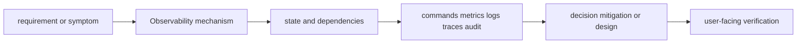
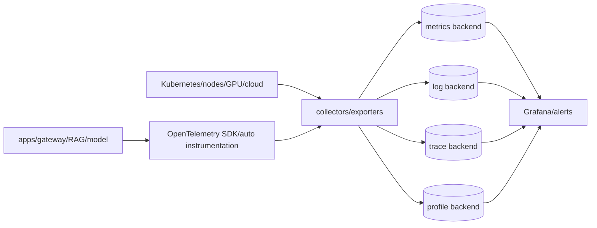
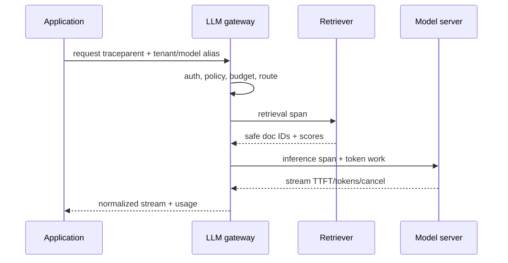

# Observability

<!-- child-topic-toc:start -->
## Table of contents and deeper notes

This parent note explains how the child topics work together. Follow each child link for the deeper mechanism, real commands/configuration, hands-on practice, authoritative documentation, and its local interview bank.

- [AI observability](ai-observability/README.md) — [questions and answers](ai-observability/questions-and-answers.md)
- [Distributed tracing](distributed-tracing/README.md) — [questions and answers](distributed-tracing/questions-and-answers.md)
- [Grafana](grafana/README.md) — [questions and answers](grafana/questions-and-answers.md)
- [Logging](logging/README.md) — [questions and answers](logging/questions-and-answers.md)
- [Metrics](metrics/README.md) — [questions and answers](metrics/questions-and-answers.md)
- [Observability fundamentals](observability-fundamentals/README.md) — [questions and answers](observability-fundamentals/questions-and-answers.md)
- [Prometheus](prometheus/README.md) — [questions and answers](prometheus/questions-and-answers.md)
<!-- child-topic-toc:end -->
> [Interview questions and answers](questions-and-answers.md) · [Master curriculum](../../curriculum/master-curriculum.txt) · Official starting point: <https://opentelemetry.io/docs/>

## Easy mode: mental model

Integrate every part of Observability into one secure, reliable, observable, supportable and cost-aware production capability.

Learn this topic in layers: name the object or mechanism, trace its lifecycle/data path, configure it safely, observe a healthy and failed state, recover it, and then design it across failure domains and team boundaries.



## Deeper topic folders

- [32.1 Observability fundamentals](observability-fundamentals/README.md) — [Q&A](observability-fundamentals/questions-and-answers.md)
- [32.2 Metrics](metrics/README.md) — [Q&A](metrics/questions-and-answers.md)
- [32.3 Prometheus](prometheus/README.md) — [Q&A](prometheus/questions-and-answers.md)
- [32.4 Grafana](grafana/README.md) — [Q&A](grafana/questions-and-answers.md)
- [32.5 Logging](logging/README.md) — [Q&A](logging/questions-and-answers.md)
- [32.6 Distributed tracing](distributed-tracing/README.md) — [Q&A](distributed-tracing/questions-and-answers.md)
- [32.7 AI observability](ai-observability/README.md) — [Q&A](ai-observability/questions-and-answers.md)

## Complete curriculum checklist

| # | Topic | What you must understand and demonstrate |
|---:|---|---|
| 1 | **OpenTelemetry provides common conventions for traces, metrics and logs, including GenAI-specific attributes for operations, models, token usage, evaluaturn660468search16** | turns runtime state into evidence; define signal semantics, labels/context, retention/privacy/cost, healthy baseline, actionable threshold and a query that distinguishes competing hypotheses. |
| 2 | **Metrics** | turns runtime state into evidence; define signal semantics, labels/context, retention/privacy/cost, healthy baseline, actionable threshold and a query that distinguishes competing hypotheses. |
| 3 | **Logs** | turns runtime state into evidence; define signal semantics, labels/context, retention/privacy/cost, healthy baseline, actionable threshold and a query that distinguishes competing hypotheses. |
| 4 | **Traces** | is part of Observability; learn its precise definition, mechanism and lifecycle, nearest alternatives, configuration interface, failure/limit, security boundary, observable evidence and production trade-off. |
| 5 | **Events** | is part of Observability; learn its precise definition, mechanism and lifecycle, nearest alternatives, configuration interface, failure/limit, security boundary, observable evidence and production trade-off. |
| 6 | **Profiles** | is part of Observability; learn its precise definition, mechanism and lifecycle, nearest alternatives, configuration interface, failure/limit, security boundary, observable evidence and production trade-off. |
| 7 | **Correlation** | is part of Observability; learn its precise definition, mechanism and lifecycle, nearest alternatives, configuration interface, failure/limit, security boundary, observable evidence and production trade-off. |
| 8 | **Context propagation** | is part of Observability; learn its precise definition, mechanism and lifecycle, nearest alternatives, configuration interface, failure/limit, security boundary, observable evidence and production trade-off. |
| 9 | **Structured telemetry** | is part of Observability; learn its precise definition, mechanism and lifecycle, nearest alternatives, configuration interface, failure/limit, security boundary, observable evidence and production trade-off. |
| 10 | **Counters** | is part of Observability; learn its precise definition, mechanism and lifecycle, nearest alternatives, configuration interface, failure/limit, security boundary, observable evidence and production trade-off. |
| 11 | **Gauges** | is part of Observability; learn its precise definition, mechanism and lifecycle, nearest alternatives, configuration interface, failure/limit, security boundary, observable evidence and production trade-off. |
| 12 | **Histograms** | is part of Observability; learn its precise definition, mechanism and lifecycle, nearest alternatives, configuration interface, failure/limit, security boundary, observable evidence and production trade-off. |
| 13 | **Summaries** | is part of Observability; learn its precise definition, mechanism and lifecycle, nearest alternatives, configuration interface, failure/limit, security boundary, observable evidence and production trade-off. |
| 14 | **Labels** | is part of Observability; learn its precise definition, mechanism and lifecycle, nearest alternatives, configuration interface, failure/limit, security boundary, observable evidence and production trade-off. |
| 15 | **Cardinality** | is part of Observability; learn its precise definition, mechanism and lifecycle, nearest alternatives, configuration interface, failure/limit, security boundary, observable evidence and production trade-off. |
| 16 | **Aggregation** | is part of Observability; learn its precise definition, mechanism and lifecycle, nearest alternatives, configuration interface, failure/limit, security boundary, observable evidence and production trade-off. |
| 17 | **Percentiles** | is part of Observability; learn its precise definition, mechanism and lifecycle, nearest alternatives, configuration interface, failure/limit, security boundary, observable evidence and production trade-off. |
| 18 | **Scraping** | is part of Observability; learn its precise definition, mechanism and lifecycle, nearest alternatives, configuration interface, failure/limit, security boundary, observable evidence and production trade-off. |
| 19 | **Exporters** | is part of Observability; learn its precise definition, mechanism and lifecycle, nearest alternatives, configuration interface, failure/limit, security boundary, observable evidence and production trade-off. |
| 20 | **Service discovery** | is part of Observability; learn its precise definition, mechanism and lifecycle, nearest alternatives, configuration interface, failure/limit, security boundary, observable evidence and production trade-off. |
| 21 | **PromQL** | is part of Observability; learn its precise definition, mechanism and lifecycle, nearest alternatives, configuration interface, failure/limit, security boundary, observable evidence and production trade-off. |
| 22 | **Recording rules** | is part of Observability; learn its precise definition, mechanism and lifecycle, nearest alternatives, configuration interface, failure/limit, security boundary, observable evidence and production trade-off. |
| 23 | **Alerting rules** | turns runtime state into evidence; define signal semantics, labels/context, retention/privacy/cost, healthy baseline, actionable threshold and a query that distinguishes competing hypotheses. |
| 24 | **Federation** | is part of Observability; learn its precise definition, mechanism and lifecycle, nearest alternatives, configuration interface, failure/limit, security boundary, observable evidence and production trade-off. |
| 25 | **Remote write** | is part of Observability; learn its precise definition, mechanism and lifecycle, nearest alternatives, configuration interface, failure/limit, security boundary, observable evidence and production trade-off. |
| 26 | **High availability** | is part of Observability; learn its precise definition, mechanism and lifecycle, nearest alternatives, configuration interface, failure/limit, security boundary, observable evidence and production trade-off. |
| 27 | **Long-term storage** | is part of Observability; learn its precise definition, mechanism and lifecycle, nearest alternatives, configuration interface, failure/limit, security boundary, observable evidence and production trade-off. |
| 28 | **Dashboards** | is part of Observability; learn its precise definition, mechanism and lifecycle, nearest alternatives, configuration interface, failure/limit, security boundary, observable evidence and production trade-off. |
| 29 | **Variables** | is part of Observability; learn its precise definition, mechanism and lifecycle, nearest alternatives, configuration interface, failure/limit, security boundary, observable evidence and production trade-off. |
| 30 | **Alerting** | turns runtime state into evidence; define signal semantics, labels/context, retention/privacy/cost, healthy baseline, actionable threshold and a query that distinguishes competing hypotheses. |
| 31 | **Datasources** | is part of Observability; learn its precise definition, mechanism and lifecycle, nearest alternatives, configuration interface, failure/limit, security boundary, observable evidence and production trade-off. |
| 32 | **Dashboard-as-code** | is part of Observability; learn its precise definition, mechanism and lifecycle, nearest alternatives, configuration interface, failure/limit, security boundary, observable evidence and production trade-off. |
| 33 | **Operational views** | is part of Observability; learn its precise definition, mechanism and lifecycle, nearest alternatives, configuration interface, failure/limit, security boundary, observable evidence and production trade-off. |
| 34 | **Executive views** | is part of Observability; learn its precise definition, mechanism and lifecycle, nearest alternatives, configuration interface, failure/limit, security boundary, observable evidence and production trade-off. |
| 35 | **Structured logs** | turns runtime state into evidence; define signal semantics, labels/context, retention/privacy/cost, healthy baseline, actionable threshold and a query that distinguishes competing hypotheses. |
| 36 | **Log levels** | is part of Observability; learn its precise definition, mechanism and lifecycle, nearest alternatives, configuration interface, failure/limit, security boundary, observable evidence and production trade-off. |
| 37 | **Correlation IDs** | is part of Observability; learn its precise definition, mechanism and lifecycle, nearest alternatives, configuration interface, failure/limit, security boundary, observable evidence and production trade-off. |
| 38 | **Centralized logging** | is part of Observability; learn its precise definition, mechanism and lifecycle, nearest alternatives, configuration interface, failure/limit, security boundary, observable evidence and production trade-off. |
| 39 | **OpenSearch/ELK** | is part of Observability; learn its precise definition, mechanism and lifecycle, nearest alternatives, configuration interface, failure/limit, security boundary, observable evidence and production trade-off. |
| 40 | **Loki** | is part of Observability; learn its precise definition, mechanism and lifecycle, nearest alternatives, configuration interface, failure/limit, security boundary, observable evidence and production trade-off. |
| 41 | **Retention** | is part of Observability; learn its precise definition, mechanism and lifecycle, nearest alternatives, configuration interface, failure/limit, security boundary, observable evidence and production trade-off. |
| 42 | **Redaction** | is part of Observability; learn its precise definition, mechanism and lifecycle, nearest alternatives, configuration interface, failure/limit, security boundary, observable evidence and production trade-off. |
| 43 | **Sampling** | is part of Observability; learn its precise definition, mechanism and lifecycle, nearest alternatives, configuration interface, failure/limit, security boundary, observable evidence and production trade-off. |
| 44 | **Cost control** | is part of Observability; learn its precise definition, mechanism and lifecycle, nearest alternatives, configuration interface, failure/limit, security boundary, observable evidence and production trade-off. |
| 45 | **Spans** | is part of Observability; learn its precise definition, mechanism and lifecycle, nearest alternatives, configuration interface, failure/limit, security boundary, observable evidence and production trade-off. |
| 46 | **Traces** | is part of Observability; learn its precise definition, mechanism and lifecycle, nearest alternatives, configuration interface, failure/limit, security boundary, observable evidence and production trade-off. |
| 47 | **Trace context** | is part of Observability; learn its precise definition, mechanism and lifecycle, nearest alternatives, configuration interface, failure/limit, security boundary, observable evidence and production trade-off. |
| 48 | **Baggage** | is part of Observability; learn its precise definition, mechanism and lifecycle, nearest alternatives, configuration interface, failure/limit, security boundary, observable evidence and production trade-off. |
| 49 | **Sampling** | is part of Observability; learn its precise definition, mechanism and lifecycle, nearest alternatives, configuration interface, failure/limit, security boundary, observable evidence and production trade-off. |
| 50 | **Tail-based sampling** | is part of Observability; learn its precise definition, mechanism and lifecycle, nearest alternatives, configuration interface, failure/limit, security boundary, observable evidence and production trade-off. |
| 51 | **OpenTelemetry Collector** | is part of Observability; learn its precise definition, mechanism and lifecycle, nearest alternatives, configuration interface, failure/limit, security boundary, observable evidence and production trade-off. |
| 52 | **Cross-service propagation** | is part of Observability; learn its precise definition, mechanism and lifecycle, nearest alternatives, configuration interface, failure/limit, security boundary, observable evidence and production trade-off. |
| 53 | **Prompt and response metadata** | is part of Observability; learn its precise definition, mechanism and lifecycle, nearest alternatives, configuration interface, failure/limit, security boundary, observable evidence and production trade-off. |
| 54 | **Model/provider** | is part of Observability; learn its precise definition, mechanism and lifecycle, nearest alternatives, configuration interface, failure/limit, security boundary, observable evidence and production trade-off. |
| 55 | **Token counts** | is part of Observability; learn its precise definition, mechanism and lifecycle, nearest alternatives, configuration interface, failure/limit, security boundary, observable evidence and production trade-off. |
| 56 | **Time to first token** | is part of Observability; learn its precise definition, mechanism and lifecycle, nearest alternatives, configuration interface, failure/limit, security boundary, observable evidence and production trade-off. |
| 57 | **Time per output token** | is part of Observability; learn its precise definition, mechanism and lifecycle, nearest alternatives, configuration interface, failure/limit, security boundary, observable evidence and production trade-off. |
| 58 | **Retrieval latency** | is part of Observability; learn its precise definition, mechanism and lifecycle, nearest alternatives, configuration interface, failure/limit, security boundary, observable evidence and production trade-off. |
| 59 | **Retrieved-document identifiers** | is part of Observability; learn its precise definition, mechanism and lifecycle, nearest alternatives, configuration interface, failure/limit, security boundary, observable evidence and production trade-off. |
| 60 | **Tool-call traces** | is part of Observability; learn its precise definition, mechanism and lifecycle, nearest alternatives, configuration interface, failure/limit, security boundary, observable evidence and production trade-off. |
| 61 | **Evaluation scores** | is part of Observability; learn its precise definition, mechanism and lifecycle, nearest alternatives, configuration interface, failure/limit, security boundary, observable evidence and production trade-off. |
| 62 | **Cost per request** | is part of Observability; learn its precise definition, mechanism and lifecycle, nearest alternatives, configuration interface, failure/limit, security boundary, observable evidence and production trade-off. |
| 63 | **Tenant-level usage** | is part of Observability; learn its precise definition, mechanism and lifecycle, nearest alternatives, configuration interface, failure/limit, security boundary, observable evidence and production trade-off. |
| 64 | **Privacy-aware telemetry** | is part of Observability; learn its precise definition, mechanism and lifecycle, nearest alternatives, configuration interface, failure/limit, security boundary, observable evidence and production trade-off. |

## Beginner → mid-level → senior learning path

1. **Beginner:** define every term; identify the relevant file, object, protocol, API, or command; explain one normal use.
2. **Mid-level:** configure it from source control, inspect effective runtime state, diagnose two failure modes, automate a safe change, and explain one trade-off.
3. **Senior:** clarify ambiguous requirements, map trust and failure domains, quantify capacity/SLO/RPO/RTO/cost, compare alternatives, plan migration/rollback, and assign ownership.

## Command and configuration lab

Run read-only checks first in a sandbox. For each command, predict healthy output, one failing result, the next discriminating check, and the safe rollback for any later mutation.

```bash
curl -s http://SERVICE/metrics
promtool check rules rules.yml
kubectl get events -A --sort-by=.lastTimestamp
trivy fs .
```

## Hands-on practice: setup → failure → verification → cleanup

Use a disposable local or cloud sandbox. Confirm identity/context and cost boundary, capture a healthy baseline with the commands above, introduce one bounded configuration or invalid-input failure, compare evidence, revert from source control, verify the original outcome, and delete only the named lab resources.

Expected result: you can show the healthy evidence, reproduce a safe failure, explain why each command distinguishes one layer from another, restore the baseline, and prove cleanup. Hard extension: automate the lab from source control, add a test or alert for the injected failure, and write a five-step runbook another engineer can execute.

For code/configuration, be ready to review an intentionally unsafe diff and improve idempotency, secret handling, timeouts, validation, logging, tests, and rollback.

## Senior design checklist

State assumptions for tenants, traffic/work units, latency and availability targets, data classification/residency, recovery, team skills and budget. Draw control/data planes and synchronous/asynchronous dependencies. Cover identity, policy, encryption/key lifecycle, delivery provenance, observability, capacity, unit cost, operational ownership, migration and exit criteria. Name the evidence that would cause you to revise the design.

## Revision and practice

Complete the separate [checkbox interview bank](questions-and-answers.md). Do not memorize wording: speak in the order **definition → mechanism → evidence/configuration → failure/trade-off → production example**. For procedures use **stabilize → scope → inspect → hypothesize → test → mitigate → verify → prevent**.

<!-- merged-10-OPERATIONS-OBSERVABILITY-MD:start -->
## Practical deep dive

## Mental model and architecture

Observability is the ability to explain a system's internal state from outputs. Instrumentation produces metrics, logs, traces, events and profiles; a collection pipeline enriches, samples/redacts and exports; storage/query/alerts/dashboards turn signals into decisions. Start from user journeys and SLOs, not from “collect everything.”



Counters increase, gauges sample a value, histograms bucket distributions, summaries calculate client-side quantiles with aggregation limits. Labels make series; unbounded user/request/prompt/document IDs cause cardinality explosions. Percentiles must come from distributions, not averages of percentiles.

Logs should be structured with time, severity, service/version/environment, trace/span, request/operation, error taxonomy and safe tenant/model identifiers. Traces form parent/child spans with context propagation and baggage; baggage is transmitted and must not carry secrets/PII. Profiles show where CPU/allocation/blocking time is spent.

## OpenTelemetry Collector

```yaml
receivers:
  otlp:
    protocols:
      grpc: {endpoint: 0.0.0.0:4317}
      http: {endpoint: 0.0.0.0:4318}
processors:
  memory_limiter:
    check_interval: 1s
    limit_mib: 1024
  k8sattributes: {}
  attributes/redact:
    actions:
      - {key: gen_ai.prompt, action: delete}
      - {key: gen_ai.completion, action: delete}
      - {key: enduser.id, action: hash}
  batch: {send_batch_size: 8192, timeout: 5s}
exporters:
  otlp/metrics: {endpoint: metrics-gateway:4317, tls: {insecure: false}}
  otlp/traces: {endpoint: trace-gateway:4317, tls: {insecure: false}}
  loki: {endpoint: https://logs.example/loki/api/v1/push}
service:
  pipelines:
    metrics: {receivers: [otlp], processors: [memory_limiter, k8sattributes, batch], exporters: [otlp/metrics]}
    traces: {receivers: [otlp], processors: [memory_limiter, k8sattributes, attributes/redact, batch], exporters: [otlp/traces]}
    logs: {receivers: [otlp], processors: [memory_limiter, k8sattributes, attributes/redact, batch], exporters: [loki]}
```

Validate component names/options against the chosen Collector distribution/version. Deploy agents for node-local inputs and gateways for centralized processing; bound memory/queues, disk-buffer critical signals where justified, secure OTLP, isolate tenants and monitor dropped/refused/export failures.

## Prometheus and PromQL

```yaml
groups:
  - name: api-slo
    rules:
      - record: job:http_requests:rate5m
        expr: sum by (job) (rate(http_server_request_duration_seconds_count[5m]))
      - record: job:http_errors:ratio_rate5m
        expr: |
          sum by (job) (rate(http_server_request_duration_seconds_count{http_response_status_code=~"5.."}[5m]))
          /
          sum by (job) (rate(http_server_request_duration_seconds_count[5m]))
      - alert: ApiFastBurn
        expr: job:http_errors:ratio_rate5m > 14.4 * 0.001
        for: 2m
        labels: {severity: page}
        annotations:
          summary: "API consumes 30-day 99.9% error budget too quickly"
          runbook_url: "https://runbooks.example/api-errors"
```

```promql
# p95 from a histogram
histogram_quantile(0.95,
  sum by (le, model) (rate(gen_ai_server_request_duration_seconds_bucket[5m])))

# CPU throttling ratio
sum by (pod) (rate(container_cpu_cfs_throttled_periods_total[5m]))
/
sum by (pod) (rate(container_cpu_cfs_periods_total[5m]))

# GPU memory used ratio (metric names depend on exporter)
max by (pod, model) (DCGM_FI_DEV_FB_USED / DCGM_FI_DEV_FB_TOTAL)

# queue growth and oldest work
sum by (model) (inference_queue_depth)
max by (model) (inference_queue_oldest_seconds)
```

Use `rate` for counters, align windows with decisions, handle absent metrics and protect alert queries from divide-by-zero/low traffic. Recording rules precompute expensive stable queries. HA Prometheus needs deduplication/remote storage strategy; federation/remote write have different purposes.

## AI observability

Trace: client → LLM gateway policy/routing → retrieval query → vector/search → reranker → prompt/context assembly → model queue/prefill/decode → tool calls. Record model/provider/region, prompt template/version, safe token counts, finish reason, TTFT, output timing, retrieval document IDs only if authorized/safe, cache/fallback/retry and cost. Store raw prompt/response only with explicit necessity, consent/access/retention/redaction; metadata can still be sensitive.



Do not put prompt, document text, user ID or arbitrary error into metric labels. Use traces/logs with access control and sampling, or hashed/allowlisted attributes.

## Dashboards and alerting

Dashboard hierarchy: executive/user SLO and cost → service RED (rate/errors/duration) → resource USE (utilization/saturation/errors) → dependency/request path → release/capacity/debug. Every panel states unit, aggregation, scope and link to deeper evidence. Alerts page on actionable user impact/fast budget burn; tickets can cover capacity/certificate/disk trends. Test notifications and ownership.

## Commands and diagnosis

```bash
curl -s http://localhost:9090/-/ready
curl -G http://localhost:9090/api/v1/query --data-urlencode 'query=up'
promtool check rules rules.yaml
promtool test rules tests.yaml
otelcol-contrib validate --config collector.yaml
kubectl logs -n observability deploy/otel-gateway --since=30m | rg 'drop|refused|export|memory'
kubectl port-forward -n observability svc/prometheus 9090:9090
```

Missing telemetry path: instrumented? → SDK sampling/export → DNS/TLS/auth/egress → agent/gateway receiver → processor drop/cardinality/memory → exporter retry/queue → backend ingestion/quota → query time/labels. Do not restart collectors before capturing their self-metrics/logs.

## Cost and labs

Cost derives from bytes/events/samples/series/spans, retention, replicas, query and egress. Control at source: stable labels, histogram buckets, log levels/sampling, head/tail trace sampling, aggregation and tiered retention. Preserve audit/security evidence obligations.

Labs: instrument a gateway/RAG/model toy path; propagate trace context; create RED/USE/AI dashboards; add redaction; deliberately break exporter TLS; create high-cardinality label and observe; write/test burn-rate alerts; compare head/tail sampling; calculate monthly telemetry cost.

## Revision summary

- Signals answer different questions and need shared context.
- SLO/user journey determines instrumentation and alerting.
- Cardinality/privacy/cost are schema design concerns.
- AI telemetry needs tokens/TTFT/quality/cost without leaking prompts/data.
- Monitor the monitoring pipeline and test alert/runbook paths.


<!-- merged-10-OPERATIONS-OBSERVABILITY-MD:end -->
