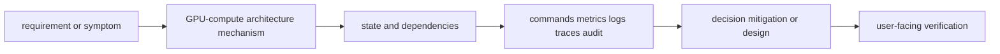
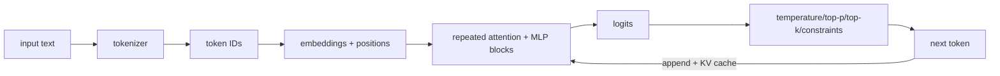

# GPU-compute architecture

<!-- chapter-guide:start -->
> **Step 244 of 373 — 11.03**
>
> **Builds on:** [LLM and transformer fundamentals](../02-llm-and-transformer-fundamentals/README.md)
>
> **Now:** Learn **GPU-compute architecture** from its mental model through production ownership.
>
> **Then:** Rehearse the linked questions and continue to [Model serving and inference platforms](../04-model-serving-and-inference-platforms/README.md).
<!-- chapter-guide:end -->

> [Interview questions and answers](questions-and-answers.md) · [Master curriculum](../../curriculum/master-curriculum.txt) · Official starting point: <https://docs.nvidia.com/datacenter/cloud-native/>

## Easy mode: mental model

Integrate every part of GPU-compute architecture into one secure, reliable, observable, supportable and cost-aware production capability.

Learn this topic in layers: name the object or mechanism, trace its lifecycle/data path, configure it safely, observe a healthy and failed state, recover it, and then design it across failure domains and team boundaries.



## Complete curriculum checklist

| # | Topic | What you must understand and demonstrate |
|---:|---|---|
| 1 | **GPU cores and streaming multiprocessors** | is part of GPU-compute architecture; learn its precise definition, mechanism and lifecycle, nearest alternatives, configuration interface, failure/limit, security boundary, observable evidence and production trade-off. |
| 2 | **Tensor cores** | is part of GPU-compute architecture; learn its precise definition, mechanism and lifecycle, nearest alternatives, configuration interface, failure/limit, security boundary, observable evidence and production trade-off. |
| 3 | **GPU memory** | is part of GPU-compute architecture; learn its precise definition, mechanism and lifecycle, nearest alternatives, configuration interface, failure/limit, security boundary, observable evidence and production trade-off. |
| 4 | **Memory bandwidth** | is part of GPU-compute architecture; learn its precise definition, mechanism and lifecycle, nearest alternatives, configuration interface, failure/limit, security boundary, observable evidence and production trade-off. |
| 5 | **Compute capability** | is part of GPU-compute architecture; learn its precise definition, mechanism and lifecycle, nearest alternatives, configuration interface, failure/limit, security boundary, observable evidence and production trade-off. |
| 6 | **Precision formats** | is part of GPU-compute architecture; learn its precise definition, mechanism and lifecycle, nearest alternatives, configuration interface, failure/limit, security boundary, observable evidence and production trade-off. |
| 7 | **FP32** | is part of GPU-compute architecture; learn its precise definition, mechanism and lifecycle, nearest alternatives, configuration interface, failure/limit, security boundary, observable evidence and production trade-off. |
| 8 | **FP16** | is part of GPU-compute architecture; learn its precise definition, mechanism and lifecycle, nearest alternatives, configuration interface, failure/limit, security boundary, observable evidence and production trade-off. |
| 9 | **BF16** | is part of GPU-compute architecture; learn its precise definition, mechanism and lifecycle, nearest alternatives, configuration interface, failure/limit, security boundary, observable evidence and production trade-off. |
| 10 | **FP8** | is part of GPU-compute architecture; learn its precise definition, mechanism and lifecycle, nearest alternatives, configuration interface, failure/limit, security boundary, observable evidence and production trade-off. |
| 11 | **INT8** | is part of GPU-compute architecture; learn its precise definition, mechanism and lifecycle, nearest alternatives, configuration interface, failure/limit, security boundary, observable evidence and production trade-off. |
| 12 | **INT4** | is part of GPU-compute architecture; learn its precise definition, mechanism and lifecycle, nearest alternatives, configuration interface, failure/limit, security boundary, observable evidence and production trade-off. |
| 13 | **Quantization trade-offs** | is part of GPU-compute architecture; learn its precise definition, mechanism and lifecycle, nearest alternatives, configuration interface, failure/limit, security boundary, observable evidence and production trade-off. |
| 14 | **Model-memory calculation** | is part of GPU-compute architecture; learn its precise definition, mechanism and lifecycle, nearest alternatives, configuration interface, failure/limit, security boundary, observable evidence and production trade-off. |
| 15 | **KV-cache memory** | is part of GPU-compute architecture; learn its precise definition, mechanism and lifecycle, nearest alternatives, configuration interface, failure/limit, security boundary, observable evidence and production trade-off. |
| 16 | **Batch-size effects** | is part of GPU-compute architecture; learn its precise definition, mechanism and lifecycle, nearest alternatives, configuration interface, failure/limit, security boundary, observable evidence and production trade-off. |
| 17 | **Context-length effects** | is part of GPU-compute architecture; learn its precise definition, mechanism and lifecycle, nearest alternatives, configuration interface, failure/limit, security boundary, observable evidence and production trade-off. |
| 18 | **Tensor parallelism** | is part of GPU-compute architecture; learn its precise definition, mechanism and lifecycle, nearest alternatives, configuration interface, failure/limit, security boundary, observable evidence and production trade-off. |
| 19 | **Pipeline parallelism** | is part of GPU-compute architecture; learn its precise definition, mechanism and lifecycle, nearest alternatives, configuration interface, failure/limit, security boundary, observable evidence and production trade-off. |
| 20 | **Data parallelism** | is part of GPU-compute architecture; learn its precise definition, mechanism and lifecycle, nearest alternatives, configuration interface, failure/limit, security boundary, observable evidence and production trade-off. |
| 21 | **Expert parallelism** | is part of GPU-compute architecture; learn its precise definition, mechanism and lifecycle, nearest alternatives, configuration interface, failure/limit, security boundary, observable evidence and production trade-off. |
| 22 | **Multi-node inference** | is part of GPU-compute architecture; learn its precise definition, mechanism and lifecycle, nearest alternatives, configuration interface, failure/limit, security boundary, observable evidence and production trade-off. |
| 23 | **Hardware topology** | is part of GPU-compute architecture; learn its precise definition, mechanism and lifecycle, nearest alternatives, configuration interface, failure/limit, security boundary, observable evidence and production trade-off. |
| 24 | **GPU utilization and fragmentation** | is part of GPU-compute architecture; learn its precise definition, mechanism and lifecycle, nearest alternatives, configuration interface, failure/limit, security boundary, observable evidence and production trade-off. |

## Beginner → mid-level → senior learning path

1. **Beginner:** define every term; identify the relevant file, object, protocol, API, or command; explain one normal use.
2. **Mid-level:** configure it from source control, inspect effective runtime state, diagnose two failure modes, automate a safe change, and explain one trade-off.
3. **Senior:** clarify ambiguous requirements, map trust and failure domains, quantify capacity/SLO/RPO/RTO/cost, compare alternatives, plan migration/rollback, and assign ownership.

## Command and configuration lab

Run read-only checks first in a sandbox. For each command, predict healthy output, one failing result, the next discriminating check, and the safe rollback for any later mutation.

```bash
nvidia-smi
kubectl get pods -A -o wide
curl -s http://MODEL/metrics
python -m pytest -q
```

## Hands-on practice: setup → failure → verification → cleanup

Use a tiny local model or approved sandbox endpoint and a versioned JSONL dataset. Record model/tokenizer/prompt/runtime/hardware and baseline latency, token and quality metrics; change one bounded variable; rerun; compare; then simulate an unavailable route or rejected request and verify safe fallback/denial. Cleanup artifacts, endpoint and cached test data according to their classification and retention policy.

Expected result: you can show the healthy evidence, reproduce a safe failure, explain why each command distinguishes one layer from another, restore the baseline, and prove cleanup. Hard extension: automate the lab from source control, add a test or alert for the injected failure, and write a five-step runbook another engineer can execute.

For code/configuration, be ready to review an intentionally unsafe diff and improve idempotency, secret handling, timeouts, validation, logging, tests, and rollback.

## Senior design checklist

State assumptions for tenants, traffic/work units, latency and availability targets, data classification/residency, recovery, team skills and budget. Draw control/data planes and synchronous/asynchronous dependencies. Cover identity, policy, encryption/key lifecycle, delivery provenance, observability, capacity, unit cost, operational ownership, migration and exit criteria. Name the evidence that would cause you to revise the design.

## Revision and practice

Complete the separate [checkbox interview bank](questions-and-answers.md). Do not memorize wording: speak in the order **definition → mechanism → evidence/configuration → failure/trade-off → production example**. For procedures use **stabilize → scope → inspect → hypothesize → test → mitigate → verify → prevent**.

<!-- merged-11-AI-PLATFORM-FUNDAMENTALS-AND-GPU-MD:start -->
## Practical deep dive

## ML lifecycle

Data collection/labeling → preparation/features → train → validation/test → evaluation/approval → registry → deployment → monitoring → retrain/retire. Prevent leakage between train/validation/test, version data/code/environment/parameters/artifacts, and distinguish data drift (input distribution), concept drift (relationship/target), and quality drift (task outcome).

Classification predicts categories, regression numbers, ranking/recommendation order items, embeddings map inputs to vectors, rerankers score pairs, generative models create sequences, multimodal models cross media. Platform requirements differ in batch/online/stream, latency, accelerator, artifacts, evaluation and state.

## Transformers and inference

Tokenizers map text to token IDs; embeddings map IDs to vectors. Transformer blocks combine attention and feed-forward layers with normalization/residual paths. Autoregressive decoder models generate next tokens sequentially. Context window bounds prompt+generated tokens and memory/compute. KV cache stores attention keys/values for prior tokens to avoid recomputing them each decode step.



Temperature rescales logits; top-k limits candidates; top-p selects a probability mass; stop sequences end generation; structured output constrains syntax but still needs semantic validation. Tool calling produces proposed structured calls—the application authorizes and executes them. Grounding supplies evidence; it does not guarantee truth.

Fine-tuning changes weights for behavior/task; LoRA trains low-rank adapters; QLoRA combines quantized base with adapter training; distillation transfers behavior to a smaller model; quantization reduces precision/memory with possible quality/kernel/hardware trade-offs. Always evaluate on target distributions.

## Model artifacts and safe loading

Bundle exact weights, configuration, tokenizer/vocabulary/chat template, generation defaults, adapters, license/model card, code/runtime compatibility, checksums/signature/provenance and evaluation. Prefer safe tensor formats over arbitrary pickle-like deserialization; disable unreviewed remote code; scan source/container/dependencies; load in a network-restricted sandbox before promotion.

```bash
sha256sum model.safetensors tokenizer.json config.json
cosign verify-blob --signature model.sig --certificate model.pem model.safetensors
jq '{model_type,architectures,torch_dtype,max_position_embeddings}' config.json
```

## GPU architecture and memory math

GPUs contain streaming multiprocessors/cores and tensor cores optimized for matrix operations. Performance can be compute-, memory-bandwidth-, interconnect-, CPU/preprocessing-, storage- or network-bound. FP32, FP16, BF16, FP8, INT8, INT4 trade range/precision, memory and supported kernels.

```python
def weight_gib(parameters: int, bits: int) -> float:
    return parameters * bits / 8 / 1024**3

for bits in (16, 8, 4):
    print(bits, round(weight_gib(70_000_000_000, bits), 1))
```

Weight memory is only a lower bound. Add KV cache, activations/workspace, CUDA graphs/kernels, allocator fragmentation and runtime processes. Longer context and more concurrent sequences increase KV; batching improves arithmetic utilization but consumes memory and queue latency.

Parallelism:

- Data parallel: replicas process different batches; synchronize gradients for training.
- Tensor parallel: split layer tensor operations across GPUs; frequent collectives and topology sensitivity.
- Pipeline parallel: stages layers across devices; pipeline bubbles and scheduling.
- Expert parallel: distribute mixture-of-experts; all-to-all traffic/load balance.
- Multi-node adds network/RDMA/NCCL failure and placement.

## Performance experiment

Define model/revision/runtime/flags/hardware/topology, prompt/output length distribution, arrival pattern, concurrency, cache warm/cold, precision and SLO. Measure TTFT, inter-token latency, end-to-end p50/p95/p99, request/token throughput, goodput within SLO, queue, GPU memory/SM/tensor/power, errors and quality.

```bash
nvidia-smi --query-gpu=name,memory.total,driver_version,pstate,power.draw,utilization.gpu,utilization.memory --format=csv
nvidia-smi topo -m
python - <<'PY'
import torch
print(torch.__version__, torch.version.cuda)
print(torch.cuda.get_device_name(0), torch.cuda.get_device_properties(0))
PY
```

## Labs and revision

Tokenize the same prompt with two tokenizers; calculate model/KV capacity; quantize a small model and compare quality/latency/memory; benchmark concurrency/context lengths; run one vs tensor-parallel GPUs; identify CPU/storage/network starvation; build a signed model manifest.

- Platform engineers need model lifecycle/artifact/quality concepts to operate safely.
- Generation settings change output distribution, not factual correctness guarantees.
- Memory = weights + KV + workspace/activations + overhead/fragmentation.
- Parallelism trades capacity for communication/scheduling complexity.
- Benchmark realistic distributions and goodput/quality, not one synthetic throughput number.


<!-- merged-11-AI-PLATFORM-FUNDAMENTALS-AND-GPU-MD:end -->

<!-- reading-navigation:start -->
---

**Reading path:** [← Back: LLM and transformer fundamentals](../02-llm-and-transformer-fundamentals/README.md) · [Questions](questions-and-answers.md) · [Next: Model serving and inference platforms →](../04-model-serving-and-inference-platforms/README.md)

<!-- reading-navigation:end -->
