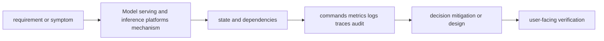
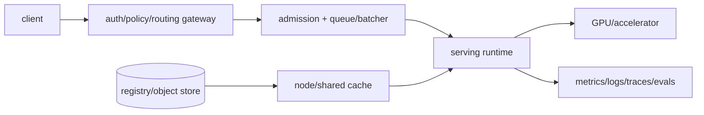

# Model serving and inference platforms

<!-- chapter-guide:start -->
> **Step 245 of 373 — 11.04**
>
> **Builds on:** [GPU-compute architecture](../03-gpu-compute-architecture/README.md)
>
> **Now:** Learn **Model serving and inference platforms** from its mental model through production ownership.
>
> **Then:** Rehearse the linked questions and continue to [Serving-platform choices](01-serving-platform-choices/README.md).
<!-- chapter-guide:end -->

> [Interview questions and answers](questions-and-answers.md) · [Master curriculum](../../curriculum/master-curriculum.txt) · Official starting point: <https://kserve.github.io/website/docs/>

## Easy mode: mental model

Integrate every part of Model serving and inference platforms into one secure, reliable, observable, supportable and cost-aware production capability.

Learn this topic in layers: name the object or mechanism, trace its lifecycle/data path, configure it safely, observe a healthy and failed state, recover it, and then design it across failure domains and team boundaries.



## Deeper topic folders

- [38.1 Serving-platform choices](01-serving-platform-choices/README.md) — [Q&A](01-serving-platform-choices/questions-and-answers.md)
- [38.2 Serving runtimes](02-serving-runtimes/README.md) — [Q&A](02-serving-runtimes/questions-and-answers.md)
- [38.3 KServe](03-kserve/README.md) — [Q&A](03-kserve/questions-and-answers.md)
- [38.4 vLLM](04-vllm/README.md) — [Q&A](04-vllm/questions-and-answers.md)
- [38.5 Triton](05-triton/README.md) — [Q&A](05-triton/questions-and-answers.md)
- [38.6 Inference performance](06-inference-performance/README.md) — [Q&A](06-inference-performance/questions-and-answers.md)
- [38.7 Model-loading lifecycle](07-model-loading-lifecycle/README.md) — [Q&A](07-model-loading-lifecycle/questions-and-answers.md)
- [38.8 Scaling inference](08-scaling-inference/README.md) — [Q&A](08-scaling-inference/questions-and-answers.md)
- [38.9 Multi-model serving](09-multi-model-serving/README.md) — [Q&A](09-multi-model-serving/questions-and-answers.md)
- [38.10 Model release strategies](10-model-release-strategies/README.md) — [Q&A](10-model-release-strategies/questions-and-answers.md)
- [38.11 Serving failure modes](11-serving-failure-modes/README.md) — [Q&A](11-serving-failure-modes/questions-and-answers.md)

## Complete curriculum checklist

| # | Topic | What you must understand and demonstrate |
|---:|---|---|
| 1 | **KServe provides Kubernetes-native predictive and generative serving, while vLLM supports optimized LLM inference, continuous batching and distributed tensor/piturn676270search47** | is part of Model serving and inference platforms; learn its precise definition, mechanism and lifecycle, nearest alternatives, configuration interface, failure/limit, security boundary, observable evidence and production trade-off. |
| 2 | **Managed model APIs** | is part of Model serving and inference platforms; learn its precise definition, mechanism and lifecycle, nearest alternatives, configuration interface, failure/limit, security boundary, observable evidence and production trade-off. |
| 3 | **Managed cloud endpoints** | is part of Model serving and inference platforms; learn its precise definition, mechanism and lifecycle, nearest alternatives, configuration interface, failure/limit, security boundary, observable evidence and production trade-off. |
| 4 | **Self-hosted endpoints** | is part of Model serving and inference platforms; learn its precise definition, mechanism and lifecycle, nearest alternatives, configuration interface, failure/limit, security boundary, observable evidence and production trade-off. |
| 5 | **Kubernetes-based serving** | is part of Model serving and inference platforms; learn its precise definition, mechanism and lifecycle, nearest alternatives, configuration interface, failure/limit, security boundary, observable evidence and production trade-off. |
| 6 | **Serverless inference** | is part of Model serving and inference platforms; learn its precise definition, mechanism and lifecycle, nearest alternatives, configuration interface, failure/limit, security boundary, observable evidence and production trade-off. |
| 7 | **Dedicated endpoints** | is part of Model serving and inference platforms; learn its precise definition, mechanism and lifecycle, nearest alternatives, configuration interface, failure/limit, security boundary, observable evidence and production trade-off. |
| 8 | **Multi-model endpoints** | is part of Model serving and inference platforms; learn its precise definition, mechanism and lifecycle, nearest alternatives, configuration interface, failure/limit, security boundary, observable evidence and production trade-off. |
| 9 | **vLLM** | is part of Model serving and inference platforms; learn its precise definition, mechanism and lifecycle, nearest alternatives, configuration interface, failure/limit, security boundary, observable evidence and production trade-off. |
| 10 | **NVIDIA Triton Inference Server** | is part of Model serving and inference platforms; learn its precise definition, mechanism and lifecycle, nearest alternatives, configuration interface, failure/limit, security boundary, observable evidence and production trade-off. |
| 11 | **Hugging Face TGI** | is part of Model serving and inference platforms; learn its precise definition, mechanism and lifecycle, nearest alternatives, configuration interface, failure/limit, security boundary, observable evidence and production trade-off. |
| 12 | **KServe** | is part of Model serving and inference platforms; learn its precise definition, mechanism and lifecycle, nearest alternatives, configuration interface, failure/limit, security boundary, observable evidence and production trade-off. |
| 13 | **Ray Serve** | is part of Model serving and inference platforms; learn its precise definition, mechanism and lifecycle, nearest alternatives, configuration interface, failure/limit, security boundary, observable evidence and production trade-off. |
| 14 | **TorchServe** | is part of Model serving and inference platforms; learn its precise definition, mechanism and lifecycle, nearest alternatives, configuration interface, failure/limit, security boundary, observable evidence and production trade-off. |
| 15 | **TensorFlow Serving** | is part of Model serving and inference platforms; learn its precise definition, mechanism and lifecycle, nearest alternatives, configuration interface, failure/limit, security boundary, observable evidence and production trade-off. |
| 16 | **ONNX Runtime** | is part of Model serving and inference platforms; learn its precise definition, mechanism and lifecycle, nearest alternatives, configuration interface, failure/limit, security boundary, observable evidence and production trade-off. |
| 17 | **SageMaker endpoints** | is part of Model serving and inference platforms; learn its precise definition, mechanism and lifecycle, nearest alternatives, configuration interface, failure/limit, security boundary, observable evidence and production trade-off. |
| 18 | **Vertex AI endpoints** | is part of Model serving and inference platforms; learn its precise definition, mechanism and lifecycle, nearest alternatives, configuration interface, failure/limit, security boundary, observable evidence and production trade-off. |
| 19 | **InferenceService** | is part of Model serving and inference platforms; learn its precise definition, mechanism and lifecycle, nearest alternatives, configuration interface, failure/limit, security boundary, observable evidence and production trade-off. |
| 20 | **ServingRuntime** | is part of Model serving and inference platforms; learn its precise definition, mechanism and lifecycle, nearest alternatives, configuration interface, failure/limit, security boundary, observable evidence and production trade-off. |
| 21 | **ClusterServingRuntime** | is part of Model serving and inference platforms; learn its precise definition, mechanism and lifecycle, nearest alternatives, configuration interface, failure/limit, security boundary, observable evidence and production trade-off. |
| 22 | **Predictor** | is part of Model serving and inference platforms; learn its precise definition, mechanism and lifecycle, nearest alternatives, configuration interface, failure/limit, security boundary, observable evidence and production trade-off. |
| 23 | **Transformer** | is part of Model serving and inference platforms; learn its precise definition, mechanism and lifecycle, nearest alternatives, configuration interface, failure/limit, security boundary, observable evidence and production trade-off. |
| 24 | **Explainer** | is part of Model serving and inference platforms; learn its precise definition, mechanism and lifecycle, nearest alternatives, configuration interface, failure/limit, security boundary, observable evidence and production trade-off. |
| 25 | **Storage initializer** | is part of Model serving and inference platforms; learn its precise definition, mechanism and lifecycle, nearest alternatives, configuration interface, failure/limit, security boundary, observable evidence and production trade-off. |
| 26 | **Raw deployment** | is part of Model serving and inference platforms; learn its precise definition, mechanism and lifecycle, nearest alternatives, configuration interface, failure/limit, security boundary, observable evidence and production trade-off. |
| 27 | **Serverless deployment** | is part of Model serving and inference platforms; learn its precise definition, mechanism and lifecycle, nearest alternatives, configuration interface, failure/limit, security boundary, observable evidence and production trade-off. |
| 28 | **Generative inference** | is part of Model serving and inference platforms; learn its precise definition, mechanism and lifecycle, nearest alternatives, configuration interface, failure/limit, security boundary, observable evidence and production trade-off. |
| 29 | **Gateway integration** | is part of Model serving and inference platforms; learn its precise definition, mechanism and lifecycle, nearest alternatives, configuration interface, failure/limit, security boundary, observable evidence and production trade-off. |
| 30 | **Autoscaling** | must connect demand and work units to latency, errors, saturation, queueing, provisioning delay, headroom, failure domains and unit cost using measured distributions. |
| 31 | **Canary traffic** | is part of Model serving and inference platforms; learn its precise definition, mechanism and lifecycle, nearest alternatives, configuration interface, failure/limit, security boundary, observable evidence and production trade-off. |
| 32 | **Paged attention** | is part of Model serving and inference platforms; learn its precise definition, mechanism and lifecycle, nearest alternatives, configuration interface, failure/limit, security boundary, observable evidence and production trade-off. |
| 33 | **Continuous batching** | is part of Model serving and inference platforms; learn its precise definition, mechanism and lifecycle, nearest alternatives, configuration interface, failure/limit, security boundary, observable evidence and production trade-off. |
| 34 | **KV-cache management** | is part of Model serving and inference platforms; learn its precise definition, mechanism and lifecycle, nearest alternatives, configuration interface, failure/limit, security boundary, observable evidence and production trade-off. |
| 35 | **OpenAI-compatible API** | is part of Model serving and inference platforms; learn its precise definition, mechanism and lifecycle, nearest alternatives, configuration interface, failure/limit, security boundary, observable evidence and production trade-off. |
| 36 | **Tensor parallelism** | is part of Model serving and inference platforms; learn its precise definition, mechanism and lifecycle, nearest alternatives, configuration interface, failure/limit, security boundary, observable evidence and production trade-off. |
| 37 | **Pipeline parallelism** | is part of Model serving and inference platforms; learn its precise definition, mechanism and lifecycle, nearest alternatives, configuration interface, failure/limit, security boundary, observable evidence and production trade-off. |
| 38 | **Distributed serving** | is part of Model serving and inference platforms; learn its precise definition, mechanism and lifecycle, nearest alternatives, configuration interface, failure/limit, security boundary, observable evidence and production trade-off. |
| 39 | **Prefix caching** | is part of Model serving and inference platforms; learn its precise definition, mechanism and lifecycle, nearest alternatives, configuration interface, failure/limit, security boundary, observable evidence and production trade-off. |
| 40 | **Quantization** | is part of Model serving and inference platforms; learn its precise definition, mechanism and lifecycle, nearest alternatives, configuration interface, failure/limit, security boundary, observable evidence and production trade-off. |
| 41 | **LoRA serving** | is part of Model serving and inference platforms; learn its precise definition, mechanism and lifecycle, nearest alternatives, configuration interface, failure/limit, security boundary, observable evidence and production trade-off. |
| 42 | **Production metrics** | turns runtime state into evidence; define signal semantics, labels/context, retention/privacy/cost, healthy baseline, actionable threshold and a query that distinguishes competing hypotheses. |
| 43 | **Model repository** | is part of Model serving and inference platforms; learn its precise definition, mechanism and lifecycle, nearest alternatives, configuration interface, failure/limit, security boundary, observable evidence and production trade-off. |
| 44 | **Model configuration** | is part of Model serving and inference platforms; learn its precise definition, mechanism and lifecycle, nearest alternatives, configuration interface, failure/limit, security boundary, observable evidence and production trade-off. |
| 45 | **Dynamic batching** | is part of Model serving and inference platforms; learn its precise definition, mechanism and lifecycle, nearest alternatives, configuration interface, failure/limit, security boundary, observable evidence and production trade-off. |
| 46 | **Concurrent execution** | is part of Model serving and inference platforms; learn its precise definition, mechanism and lifecycle, nearest alternatives, configuration interface, failure/limit, security boundary, observable evidence and production trade-off. |
| 47 | **Model ensembles** | is part of Model serving and inference platforms; learn its precise definition, mechanism and lifecycle, nearest alternatives, configuration interface, failure/limit, security boundary, observable evidence and production trade-off. |
| 48 | **Instance groups** | is part of Model serving and inference platforms; learn its precise definition, mechanism and lifecycle, nearest alternatives, configuration interface, failure/limit, security boundary, observable evidence and production trade-off. |
| 49 | **Backend selection** | is part of Model serving and inference platforms; learn its precise definition, mechanism and lifecycle, nearest alternatives, configuration interface, failure/limit, security boundary, observable evidence and production trade-off. |
| 50 | **Metrics** | turns runtime state into evidence; define signal semantics, labels/context, retention/privacy/cost, healthy baseline, actionable threshold and a query that distinguishes competing hypotheses. |
| 51 | **Model control modes** | is part of Model serving and inference platforms; learn its precise definition, mechanism and lifecycle, nearest alternatives, configuration interface, failure/limit, security boundary, observable evidence and production trade-off. |
| 52 | **Time to first token** | is part of Model serving and inference platforms; learn its precise definition, mechanism and lifecycle, nearest alternatives, configuration interface, failure/limit, security boundary, observable evidence and production trade-off. |
| 53 | **Time per output token** | is part of Model serving and inference platforms; learn its precise definition, mechanism and lifecycle, nearest alternatives, configuration interface, failure/limit, security boundary, observable evidence and production trade-off. |
| 54 | **End-to-end latency** | is part of Model serving and inference platforms; learn its precise definition, mechanism and lifecycle, nearest alternatives, configuration interface, failure/limit, security boundary, observable evidence and production trade-off. |
| 55 | **Tokens per second** | is part of Model serving and inference platforms; learn its precise definition, mechanism and lifecycle, nearest alternatives, configuration interface, failure/limit, security boundary, observable evidence and production trade-off. |
| 56 | **Requests per second** | is part of Model serving and inference platforms; learn its precise definition, mechanism and lifecycle, nearest alternatives, configuration interface, failure/limit, security boundary, observable evidence and production trade-off. |
| 57 | **Concurrent requests** | is part of Model serving and inference platforms; learn its precise definition, mechanism and lifecycle, nearest alternatives, configuration interface, failure/limit, security boundary, observable evidence and production trade-off. |
| 58 | **Queue latency** | is part of Model serving and inference platforms; learn its precise definition, mechanism and lifecycle, nearest alternatives, configuration interface, failure/limit, security boundary, observable evidence and production trade-off. |
| 59 | **GPU utilization** | is part of Model serving and inference platforms; learn its precise definition, mechanism and lifecycle, nearest alternatives, configuration interface, failure/limit, security boundary, observable evidence and production trade-off. |
| 60 | **Memory utilization** | is part of Model serving and inference platforms; learn its precise definition, mechanism and lifecycle, nearest alternatives, configuration interface, failure/limit, security boundary, observable evidence and production trade-off. |
| 61 | **Batch efficiency** | is part of Model serving and inference platforms; learn its precise definition, mechanism and lifecycle, nearest alternatives, configuration interface, failure/limit, security boundary, observable evidence and production trade-off. |
| 62 | **Artifact download** | is part of Model serving and inference platforms; learn its precise definition, mechanism and lifecycle, nearest alternatives, configuration interface, failure/limit, security boundary, observable evidence and production trade-off. |
| 63 | **Validation** | is part of Model serving and inference platforms; learn its precise definition, mechanism and lifecycle, nearest alternatives, configuration interface, failure/limit, security boundary, observable evidence and production trade-off. |
| 64 | **Weight loading** | is part of Model serving and inference platforms; learn its precise definition, mechanism and lifecycle, nearest alternatives, configuration interface, failure/limit, security boundary, observable evidence and production trade-off. |
| 65 | **GPU allocation** | is part of Model serving and inference platforms; learn its precise definition, mechanism and lifecycle, nearest alternatives, configuration interface, failure/limit, security boundary, observable evidence and production trade-off. |
| 66 | **Warm-up** | is part of Model serving and inference platforms; learn its precise definition, mechanism and lifecycle, nearest alternatives, configuration interface, failure/limit, security boundary, observable evidence and production trade-off. |
| 67 | **Readiness** | is part of Model serving and inference platforms; learn its precise definition, mechanism and lifecycle, nearest alternatives, configuration interface, failure/limit, security boundary, observable evidence and production trade-off. |
| 68 | **Traffic admission** | is part of Model serving and inference platforms; learn its precise definition, mechanism and lifecycle, nearest alternatives, configuration interface, failure/limit, security boundary, observable evidence and production trade-off. |
| 69 | **Graceful shutdown** | is part of Model serving and inference platforms; learn its precise definition, mechanism and lifecycle, nearest alternatives, configuration interface, failure/limit, security boundary, observable evidence and production trade-off. |
| 70 | **Cache cleanup** | is part of Model serving and inference platforms; learn its precise definition, mechanism and lifecycle, nearest alternatives, configuration interface, failure/limit, security boundary, observable evidence and production trade-off. |
| 71 | **Replica scaling** | must connect demand and work units to latency, errors, saturation, queueing, provisioning delay, headroom, failure domains and unit cost using measured distributions. |
| 72 | **GPU-node scaling** | must connect demand and work units to latency, errors, saturation, queueing, provisioning delay, headroom, failure domains and unit cost using measured distributions. |
| 73 | **Queue-based scaling** | must connect demand and work units to latency, errors, saturation, queueing, provisioning delay, headroom, failure domains and unit cost using measured distributions. |
| 74 | **Token-based scaling** | must connect demand and work units to latency, errors, saturation, queueing, provisioning delay, headroom, failure domains and unit cost using measured distributions. |
| 75 | **Concurrency-based scaling** | must connect demand and work units to latency, errors, saturation, queueing, provisioning delay, headroom, failure domains and unit cost using measured distributions. |
| 76 | **Scale-to-zero** | is part of Model serving and inference platforms; learn its precise definition, mechanism and lifecycle, nearest alternatives, configuration interface, failure/limit, security boundary, observable evidence and production trade-off. |
| 77 | **Cold-start management** | is part of Model serving and inference platforms; learn its precise definition, mechanism and lifecycle, nearest alternatives, configuration interface, failure/limit, security boundary, observable evidence and production trade-off. |
| 78 | **Predictive scaling** | must connect demand and work units to latency, errors, saturation, queueing, provisioning delay, headroom, failure domains and unit cost using measured distributions. |
| 79 | **Capacity buffers** | must connect demand and work units to latency, errors, saturation, queueing, provisioning delay, headroom, failure domains and unit cost using measured distributions. |
| 80 | **Dedicated deployment per model** | is part of Model serving and inference platforms; learn its precise definition, mechanism and lifecycle, nearest alternatives, configuration interface, failure/limit, security boundary, observable evidence and production trade-off. |
| 81 | **Shared runtime** | is part of Model serving and inference platforms; learn its precise definition, mechanism and lifecycle, nearest alternatives, configuration interface, failure/limit, security boundary, observable evidence and production trade-off. |
| 82 | **Dynamic loading** | is part of Model serving and inference platforms; learn its precise definition, mechanism and lifecycle, nearest alternatives, configuration interface, failure/limit, security boundary, observable evidence and production trade-off. |
| 83 | **Model caching** | is part of Model serving and inference platforms; learn its precise definition, mechanism and lifecycle, nearest alternatives, configuration interface, failure/limit, security boundary, observable evidence and production trade-off. |
| 84 | **Eviction** | is part of Model serving and inference platforms; learn its precise definition, mechanism and lifecycle, nearest alternatives, configuration interface, failure/limit, security boundary, observable evidence and production trade-off. |
| 85 | **Tenant isolation** | is part of Model serving and inference platforms; learn its precise definition, mechanism and lifecycle, nearest alternatives, configuration interface, failure/limit, security boundary, observable evidence and production trade-off. |
| 86 | **GPU-memory fragmentation** | is part of Model serving and inference platforms; learn its precise definition, mechanism and lifecycle, nearest alternatives, configuration interface, failure/limit, security boundary, observable evidence and production trade-off. |
| 87 | **Failure isolation** | requires a layer-by-layer, evidence-first path from user impact and recent change through identity, configuration, runtime, dependency and resource saturation, followed by reversible mitigation and verified repair. |
| 88 | **Model versioning** | is part of Model serving and inference platforms; learn its precise definition, mechanism and lifecycle, nearest alternatives, configuration interface, failure/limit, security boundary, observable evidence and production trade-off. |
| 89 | **Blue-green** | is part of Model serving and inference platforms; learn its precise definition, mechanism and lifecycle, nearest alternatives, configuration interface, failure/limit, security boundary, observable evidence and production trade-off. |
| 90 | **Canary** | is part of Model serving and inference platforms; learn its precise definition, mechanism and lifecycle, nearest alternatives, configuration interface, failure/limit, security boundary, observable evidence and production trade-off. |
| 91 | **Shadow deployment** | is part of Model serving and inference platforms; learn its precise definition, mechanism and lifecycle, nearest alternatives, configuration interface, failure/limit, security boundary, observable evidence and production trade-off. |
| 92 | **A/B testing** | is part of Model serving and inference platforms; learn its precise definition, mechanism and lifecycle, nearest alternatives, configuration interface, failure/limit, security boundary, observable evidence and production trade-off. |
| 93 | **Champion/challenger** | is part of Model serving and inference platforms; learn its precise definition, mechanism and lifecycle, nearest alternatives, configuration interface, failure/limit, security boundary, observable evidence and production trade-off. |
| 94 | **Automated rollback** | is part of Model serving and inference platforms; learn its precise definition, mechanism and lifecycle, nearest alternatives, configuration interface, failure/limit, security boundary, observable evidence and production trade-off. |
| 95 | **Quality gates** | is part of Model serving and inference platforms; learn its precise definition, mechanism and lifecycle, nearest alternatives, configuration interface, failure/limit, security boundary, observable evidence and production trade-off. |
| 96 | **Latency gates** | is part of Model serving and inference platforms; learn its precise definition, mechanism and lifecycle, nearest alternatives, configuration interface, failure/limit, security boundary, observable evidence and production trade-off. |
| 97 | **Cost gates** | is part of Model serving and inference platforms; learn its precise definition, mechanism and lifecycle, nearest alternatives, configuration interface, failure/limit, security boundary, observable evidence and production trade-off. |
| 98 | **Out-of-memory errors** | is part of Model serving and inference platforms; learn its precise definition, mechanism and lifecycle, nearest alternatives, configuration interface, failure/limit, security boundary, observable evidence and production trade-off. |
| 99 | **Model-loading failure** | requires a layer-by-layer, evidence-first path from user impact and recent change through identity, configuration, runtime, dependency and resource saturation, followed by reversible mitigation and verified repair. |
| 100 | **CUDA errors** | is part of Model serving and inference platforms; learn its precise definition, mechanism and lifecycle, nearest alternatives, configuration interface, failure/limit, security boundary, observable evidence and production trade-off. |
| 101 | **Tokenizer mismatch** | is part of Model serving and inference platforms; learn its precise definition, mechanism and lifecycle, nearest alternatives, configuration interface, failure/limit, security boundary, observable evidence and production trade-off. |
| 102 | **Slow first token** | is part of Model serving and inference platforms; learn its precise definition, mechanism and lifecycle, nearest alternatives, configuration interface, failure/limit, security boundary, observable evidence and production trade-off. |
| 103 | **Queue growth** | is part of Model serving and inference platforms; learn its precise definition, mechanism and lifecycle, nearest alternatives, configuration interface, failure/limit, security boundary, observable evidence and production trade-off. |
| 104 | **Autoscaling lag** | must connect demand and work units to latency, errors, saturation, queueing, provisioning delay, headroom, failure domains and unit cost using measured distributions. |
| 105 | **Stuck streams** | is part of Model serving and inference platforms; learn its precise definition, mechanism and lifecycle, nearest alternatives, configuration interface, failure/limit, security boundary, observable evidence and production trade-off. |
| 106 | **Failed distributed workers** | is part of Model serving and inference platforms; learn its precise definition, mechanism and lifecycle, nearest alternatives, configuration interface, failure/limit, security boundary, observable evidence and production trade-off. |
| 107 | **Provider timeout** | is part of Model serving and inference platforms; learn its precise definition, mechanism and lifecycle, nearest alternatives, configuration interface, failure/limit, security boundary, observable evidence and production trade-off. |
| 108 | **Incorrect model version** | is part of Model serving and inference platforms; learn its precise definition, mechanism and lifecycle, nearest alternatives, configuration interface, failure/limit, security boundary, observable evidence and production trade-off. |
| 109 | **Silent quality regression** | is part of Model serving and inference platforms; learn its precise definition, mechanism and lifecycle, nearest alternatives, configuration interface, failure/limit, security boundary, observable evidence and production trade-off. |

## Beginner → mid-level → senior learning path

1. **Beginner:** define every term; identify the relevant file, object, protocol, API, or command; explain one normal use.
2. **Mid-level:** configure it from source control, inspect effective runtime state, diagnose two failure modes, automate a safe change, and explain one trade-off.
3. **Senior:** clarify ambiguous requirements, map trust and failure domains, quantify capacity/SLO/RPO/RTO/cost, compare alternatives, plan migration/rollback, and assign ownership.

## Command and configuration lab

Run read-only checks first in a sandbox. For each command, predict healthy output, one failing result, the next discriminating check, and the safe rollback for any later mutation.

```bash
nvidia-smi
kubectl get pods -A -o wide
curl -s http://MODEL/metrics
python -m pytest -q
```

## Hands-on practice: setup → failure → verification → cleanup

Use a tiny local model or approved sandbox endpoint and a versioned JSONL dataset. Record model/tokenizer/prompt/runtime/hardware and baseline latency, token and quality metrics; change one bounded variable; rerun; compare; then simulate an unavailable route or rejected request and verify safe fallback/denial. Cleanup artifacts, endpoint and cached test data according to their classification and retention policy.

Expected result: you can show the healthy evidence, reproduce a safe failure, explain why each command distinguishes one layer from another, restore the baseline, and prove cleanup. Hard extension: automate the lab from source control, add a test or alert for the injected failure, and write a five-step runbook another engineer can execute.

For code/configuration, be ready to review an intentionally unsafe diff and improve idempotency, secret handling, timeouts, validation, logging, tests, and rollback.

## Senior design checklist

State assumptions for tenants, traffic/work units, latency and availability targets, data classification/residency, recovery, team skills and budget. Draw control/data planes and synchronous/asynchronous dependencies. Cover identity, policy, encryption/key lifecycle, delivery provenance, observability, capacity, unit cost, operational ownership, migration and exit criteria. Name the evidence that would cause you to revise the design.

## Revision and practice

Complete the separate [checkbox interview bank](questions-and-answers.md). Do not memorize wording: speak in the order **definition → mechanism → evidence/configuration → failure/trade-off → production example**. For procedures use **stabilize → scope → inspect → hypothesize → test → mitigate → verify → prevent**.

<!-- merged-11-AI-PLATFORM-MODEL-SERVING-MD:start -->
## Practical deep dive

## Architecture and lifecycle



Lifecycle: approved manifest → artifact download/cache → signature/checksum → allocate device → load weights/tokenizer/adapters → compile/warm → readiness → traffic → drain/cancel → unload. Make each phase observable and timeout bounded. Readiness means able to serve the intended model, not merely process alive.

Options: provider API, managed cloud endpoint, Kubernetes/self-hosted, serverless/dedicated/multi-model. vLLM specializes high-throughput LLM inference (PagedAttention, continuous batching, prefix cache, parallelism/quantization/LoRA); Triton serves multiple frameworks with model repositories, dynamic batching/ensembles/instance groups; KServe provides Kubernetes CRDs/control plane and runtimes; TGI/Ray Serve/SGLang/NIM/TensorRT-LLM are comparison points. Verify model/hardware/feature maturity.

## vLLM example

```bash
vllm serve /models/llama \
  --served-model-name summarizer \
  --host 0.0.0.0 --port 8000 \
  --tensor-parallel-size 2 \
  --max-model-len 8192 \
  --gpu-memory-utilization 0.90 \
  --enable-prefix-caching \
  --disable-log-requests

curl -s http://localhost:8000/v1/chat/completions \
  -H 'Content-Type: application/json' \
  -d '{"model":"summarizer","messages":[{"role":"user","content":"Summarize..."}],"max_tokens":128,"temperature":0}' | jq
curl -s http://localhost:8000/metrics | head
```

Do not copy flags blindly: model/runtime versions constrain them. `gpu-memory-utilization` reserves room for model/KV but high values can make startup/fragmentation fragile. Set concurrency/admission outside or in runtime; enforce prompt/output limits; cancellation must free work.

Kubernetes Deployment excerpt:

```yaml
containers:
  - name: vllm
    image: registry.example/vllm@sha256:DIGEST
    args:
      - serve
      - /models/summarizer-v7
      - --served-model-name=summarizer
      - --max-model-len=8192
      - --enable-prefix-caching
    ports: [{name: http, containerPort: 8000}]
    startupProbe:
      httpGet: {path: /health, port: http}
      periodSeconds: 10
      failureThreshold: 60
    readinessProbe:
      httpGet: {path: /health, port: http}
      periodSeconds: 5
    resources:
      requests: {cpu: "8", memory: 32Gi}
      limits: {memory: 32Gi, nvidia.com/gpu: 1}
```

## KServe example

```yaml
apiVersion: serving.kserve.io/v1beta1
kind: InferenceService
metadata: {name: summarizer, namespace: inference}
spec:
  predictor:
    model:
      modelFormat: {name: huggingface}
      storageUri: hf://ORG/MODEL
      args:
        - --model_name=summarizer
        - --backend=vllm
        - --max_model_len=8192
      resources:
        requests: {cpu: "4", memory: 24Gi, nvidia.com/gpu: "1"}
        limits: {memory: 24Gi, nvidia.com/gpu: "1"}
```

```bash
kubectl get inferenceservice,servingruntime,clusterservingruntime -A
kubectl describe inferenceservice summarizer -n inference
kubectl get inferenceservice summarizer -n inference -o jsonpath='{.status.conditions}' | jq
kubectl logs -n inference -l serving.kserve.io/inferenceservice=summarizer --all-containers
```

Storage initializer/security/runtime behavior depends on KServe version/mode. Prefer exact approved revision over floating Hugging Face IDs, restrict remote code/network and bind model signature.

## Triton example

```text
models/
└── reranker/
    ├── config.pbtxt
    └── 1/model.onnx
```

```protobuf
name: "reranker"
platform: "onnxruntime_onnx"
max_batch_size: 32
input [{ name: "input_ids" data_type: TYPE_INT64 dims: [-1] }]
output [{ name: "scores" data_type: TYPE_FP32 dims: [-1] }]
dynamic_batching {
  preferred_batch_size: [8, 16, 32]
  max_queue_delay_microseconds: 2000
}
instance_group [{ kind: KIND_GPU count: 2 }]
```

```bash
tritonserver --model-repository=/models --model-control-mode=explicit --load-model=reranker
curl -s localhost:8000/v2/health/ready
curl -s localhost:8000/v2/models/reranker/config | jq
curl -s localhost:8002/metrics | head
```

Dynamic batching increases throughput but queues requests; tune from latency SLO and shape compatibility. Ensembles compose models/pre/postprocessing but create correlated failure and debugging paths.

## Performance and scaling

Prefill processes input in parallel; decode is sequential per token. Continuous batching admits/removes sequences dynamically. Prefix caching reuses shared prompt prefix KV with isolation/invalidation implications. Speculative decoding uses draft/verification to reduce decode latency under compatible conditions. Disaggregated prefill/decode separates resource pools but adds KV transfer/routing/failure.

Scale replicas from queue age/depth, predicted input+output tokens, concurrency/KV pressure and SLO; scale nodes from Pending. Maintain warm replicas/nodes/caches for cold-start SLO. Goodput counts tokens/requests meeting latency/quality, not total work. Apply admission limits per tenant/model before overload.

## Rollout and failure

Release manifest binds model/tokenizer/template/adapters/runtime/container/flags/hardware/evaluator. Shadow avoids user output but doubles cost and may cause side effects/privacy exposure. Canary gates HTTP error, TTFT/ITL/goodput, GPU memory, cost and offline/online quality. Rollback must keep previous artifacts/cache/schema and provider routes.

Failure diagnosis:

```bash
kubectl get pod -n inference -o wide
kubectl describe pod POD -n inference
kubectl logs POD -n inference --all-containers --previous
kubectl exec POD -n inference -- nvidia-smi
curl -s http://POD:PORT/metrics | rg 'queue|token|cache|request|error'
```

Model load: storage/auth/digest/disk → format/tokenizer/config → driver/CUDA/framework → VRAM/parallel topology → warmup. Latency: gateway/retrieval/network → queue/admission → prefill length → decode/batch/KV → GPU throttling/CPU → downstream streaming. Stop retry storms and shed/route approved fallback before adding unstable replicas.

## Labs and revision

Serve a small model in vLLM, KServe and Triton-compatible runtime; benchmark cold/warm, context/concurrency/batching; cause OOM and tokenizer mismatch; canary a model with quality gate; implement cancellation; scale from queue; compare dedicated vs multi-model cache eviction.

- Serving is an observable artifact-to-ready lifecycle and queueing system.
- Runtime choice follows model/API/performance/operations needs.
- Batching/cache/parallelism trade memory, TTFT, throughput and isolation.
- Release exact lineage with quality/latency/cost rollback gates.
- Debug by separating load, queue, prefill, decode, stream and dependency phases.


<!-- merged-11-AI-PLATFORM-MODEL-SERVING-MD:end -->

<!-- reading-navigation:start -->
---

**Reading path:** [← Back: GPU-compute architecture](../03-gpu-compute-architecture/README.md) · [Questions](questions-and-answers.md) · [Next: Serving-platform choices →](01-serving-platform-choices/README.md)

<!-- reading-navigation:end -->
