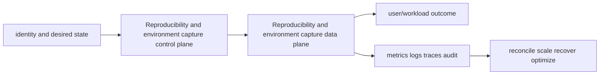

# Reproducibility and environment capture

<!-- chapter-guide:start -->
> **Step 303 of 373 — 11.08.09**
>
> **Builds on:** [Hyperparameter tuning and experiment search](../08-hyperparameter-tuning/README.md)
>
> **Now:** Learn **Reproducibility and environment capture** from its mental model through production ownership.
>
> **Then:** Rehearse the linked questions and continue to [Model registry, artifacts and lineage](../10-model-registry-artifact-lineage/README.md).
<!-- chapter-guide:end -->

> Interview bank: [questions-and-answers.md](questions-and-answers.md) · Official documentation: <https://reproducible-builds.org/docs/>

## Easy mode: purpose and mental model

Reconstruct data, code, dependencies, hardware and configuration well enough to explain or rerun a release.



## Detailed learning notes

| # | Concept | What you must be able to explain |
|---:|---|---|
| 1 | **Code revision** | clean commit plus reviewed patch/submodule identity is stronger than an uncommitted notebook snapshot. |
| 2 | **Dependency lock** | resolved package names/versions/hashes and index source prevent floating environments. |
| 3 | **Container digest** | captures userspace bytes but not host kernel, driver, devices, external services or mutable downloads. |
| 4 | **Dataset manifest** | immutable snapshot/transform/split identity is required in addition to a storage URI. |
| 5 | **Randomness** | seeds and RNG states across libraries/workers are recorded while nondeterminism is measured. |
| 6 | **Hardware/software fingerprint** | accelerator, driver, CUDA/ROCm, library and topology can change numerics/performance. |
| 7 | **Configuration** | effective validated config is stored after defaults/overrides without secrets. |
| 8 | **External dependency** | foundation APIs, base models, feature services and remote code need version/contract evidence. |
| 9 | **Reproduction tolerance** | bitwise, numerical or metric-range criteria depend on workload and kernel behavior. |
| 10 | **Hermetic rebuild** | isolated build with pinned sources proves more than retaining an old mutable worker. |

## Architecture and lifecycle

Trace this service from request/authentication and desired configuration through provisioning, steady-state data path, scaling, change, failure, recovery and retirement. Bind every production resource to an owner, environment, data classification, source-of-truth revision, SLO, runbook, cost center and deletion/retention policy.

For Reproducibility and environment capture, draw a real request/resource path and label where these mechanisms act: Code revision, Dependency lock, Container digest, Dataset manifest, Randomness, Hardware/software fingerprint, Configuration, External dependency, Reproduction tolerance, Hermetic rebuild. State which parts are control plane versus data plane, regional versus zonal/global, synchronous versus asynchronous, and customer versus provider responsibility.

## Security model

Start with the caller/workload identity and evaluate every applicable identity, resource, organization, network-endpoint, encryption-key and admission policy. Minimize public paths, long-lived credentials, wildcard actions/resources and unreviewed cross-account/tenant trust. Encrypt in transit/at rest where applicable, but include key/certificate rotation and recovery. Protect audit evidence and prevent secrets/customer content from entering command history, logs, traces or metric labels.

## Availability and failure modes

List dependencies and failure domains before claiming high availability. Test quota/capacity, identity/control-plane, DNS/network/TLS, configuration drift, downstream saturation, zonal/Regional/node failure and recovery from protected state. Use bounded timeout, retry budget, jitter, idempotency, backpressure, load shedding and graceful drain according to protocol. A green resource status is not a user-facing recovery check.

## Performance, scaling and cost

Measure workload distribution and SLI before sizing. Track rate/work units, latency distribution, errors, saturation/queue and service-specific limits. Separate replica/task scaling from infrastructure/capacity scaling and include cold-start/provisioning delay. Cost includes idle/provisioned capacity, requests/work units, storage/retention, cross-AZ/Region/egress/NAT, observability, licenses/support and failure headroom. Optimize cost per successful SLO/quality-controlled task.

## Observability

Correlate a request/change across user, route/resource, dependency and underlying compute/storage/network. Use stable owner/environment/region/service dimensions; put high-cardinality request/object IDs in sampled logs/traces rather than metric labels. Alert on actionable SLO burn and leading exhaustion. Monitor the telemetry path and keep a read-only diagnostic role.

## Command lab

Run in a sandbox with the correct account/context/Region. Read and explain output before mutation.

```bash
git status --short; git rev-parse HEAD
python -m pip freeze; python -m pip check
docker image inspect IMAGE --format '{{json .RepoDigests}}'
nvidia-smi --query-gpu=name,driver_version --format=csv
```

For each command, record: identity/context, exact resource, expected healthy fields, one failing output, the next command/query, and which mutation would be reversible. Never paste secrets/tokens into committed notes or shared terminal history.

## Real-world exercise: easy → hard

1. **Easy:** inventory one healthy Reproducibility and environment capture resource and draw identity/control/data/dependency paths.
2. **Intermediate:** reproduce a safe configuration change with IaC, preview/diff, apply to a sandbox, verify and roll back.
3. **Hard:** inject one policy/network/quota/capacity/dependency failure, diagnose from user symptom to root mechanism, mitigate without widening access, then add an alert/test/runbook.
4. **Senior:** design the service for two tenants, multi-zone/Region failure, RPO/RTO, regulated data, 10× demand and a 30% cost reduction; quantify trade-offs.

## Common interview traps

- Naming a feature without explaining request/resource lifecycle or failure semantics.
- Treating an allow, encryption checkbox, replica count or managed-service label as a complete security/reliability design.
- Mutating production before capturing identity, status, events, metrics, logs, audit and recent changes.
- Scaling the wrong layer or retrying overload/permanent errors.
- Omitting quotas, cold start, deletion/restore, observability cost or customer/tenant boundaries.

## Revision summary

Explain Reproducibility and environment capture in five passes: purpose/selection, mechanism/lifecycle, security/failure, operation/commands, and architecture/economics. Then complete the separate [answered question bank](questions-and-answers.md) without looking at these notes.


## Hands-on proof: easy → hard

Use a disposable local environment, sandbox project/account or isolated Kubernetes namespace. Define all uppercase placeholders before running commands and confirm identity/context, data classification and cost boundary.

1. **Inventory:** run the read-only commands above, capture exact versions/IDs and explain which desired or observed state each proves.
2. **Build:** implement the smallest version-controlled example with an immutable input/artifact manifest and one automated test.
3. **Failure:** inject one bounded invalid input, dependency outage, incompatible revision, quota or stale-state condition; preserve the error and distinguish its layer without restarting blindly.
4. **Release:** generate evidence, compare a candidate with a baseline, make an explicit pass/fail decision and prove the deployed/run revision.
5. **Recover:** roll back or resume from a protected artifact/checkpoint, re-run the original quality and operational verification, and reconcile the source of truth.
6. **Cleanup:** delete only named lab resources and confirm no job, endpoint, volume, artifact, credential or billable accelerator remains. Retain only non-sensitive learning evidence allowed by policy.

Hard extension: put the lab in CI with short-lived identity, policy/evaluation gates, bounded concurrency/cost, an artifact digest, a failure-path test and a five-step runbook.

<!-- reading-navigation:start -->
---

**Reading path:** [← Back: Hyperparameter tuning and experiment search](../08-hyperparameter-tuning/README.md) · [Questions](questions-and-answers.md) · [Next: Model registry, artifacts and lineage →](../10-model-registry-artifact-lineage/README.md)

<!-- reading-navigation:end -->
