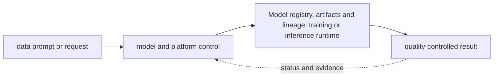

# Model registry, artifacts and lineage

<!-- chapter-guide:start -->
> **Step 304 of 373 — 11.08.10**
>
> **Builds on:** [Reproducibility and environment capture](../09-reproducibility-environments/README.md)
>
> **Now:** Learn **Model registry, artifacts and lineage** from its mental model through production ownership.
>
> **Then:** Rehearse the linked questions and continue to [LLM release manifests and compatibility](../11-llm-release-manifest/README.md).
<!-- chapter-guide:end -->

> Interview bank: [questions-and-answers.md](questions-and-answers.md) · Official documentation: <https://www.kubeflow.org/docs/components/hub/overview/>

## Explanation

### What it is and why it exists

**Model registry, artifacts and lineage** is easiest to understand as one part of a larger path. The subject links data, model and runtime state. A versioned input becomes an artifact, a serving system turns requests into token or prediction work, and evaluation decides whether quality, safety, latency and cost are acceptable.

The chapter focuses on Registered model, Model version, Alias, Artifact format. These are connected mechanisms, not vocabulary to memorize. Bind immutable model bytes to formats, dependencies, evidence, ownership, approvals and deployments The explanations below first build the simple model, then add the exact system behavior and production consequences.

### History and evolution

Machine-learning systems evolved from offline statistical jobs into GPU-intensive training and always-on inference platforms. Foundation models added token-based capacity, very large artifacts, probabilistic quality and new safety concerns, so model, data, prompt, runtime and evaluation revisions now have to travel as one governed release.

In this chapter, **Model registry, artifacts and lineage** is the next layer of that evolution. Its modern purpose is to bind immutable model bytes to formats, dependencies, evidence, ownership, approvals and deployments. The exact product surface may change by version, but the underlying state, request path and failure boundaries remain the durable ideas to learn.

### How it works: the end-to-end path



The diagram is a feedback loop rather than a one-way provisioning sequence. A caller supplies identity and intent; the control plane validates and records that intent; asynchronous controllers, runtimes or managed infrastructure create the effective data plane; and status and telemetry feed the next decision. A successful API response can therefore mean only "the request was accepted," not "the workload outcome is healthy."

For **Model registry, artifacts and lineage**, the mechanisms participating in that loop are Registered model, Model version, Alias, Artifact format, Signature/schema, Lineage, Model card, Storage, Access, Deployment binding. Some run synchronously on the caller's request, while others converge later. This timing distinction explains many production surprises: the desired object can exist before capacity is ready, a data path can continue while its control plane is impaired, and a timeout can leave the final side effect unknown.

### Core concepts explained in detail

#### Registered model

**What it is.** Logical product/capability groups versions without conflating mutable alias with byte identity.

**Junior mental model.** An AI result is produced by a release made of several moving parts—not only model weights. Data, tokenizer, prompt/template, adapter, retrieval index, runtime, hardware and evaluator can each change behavior.

**How it works.** Inputs are validated and transformed, a versioned model or pipeline performs work, and post-processing and policy produce the exposed result. Offline evaluation compares a candidate with a baseline; shadow or canary traffic supplies production evidence; lineage connects the decision back to exact artifacts and data.

**What it looks like in production.** Healthy evidence combines task quality and safety with latency, token or accelerator work, failure rate and unit cost. Training-serving skew, stale or unauthorized retrieval, incompatible runtime/hardware, biased evaluators, prompt injection and silent provider/model changes are core production risks.

#### Model version

**What it is.** Immutable digest plus source run/data/code/config defines one candidate.

**Junior mental model.** An AI result is produced by a release made of several moving parts—not only model weights. Data, tokenizer, prompt/template, adapter, retrieval index, runtime, hardware and evaluator can each change behavior.

**How it works.** Inputs are validated and transformed, a versioned model or pipeline performs work, and post-processing and policy produce the exposed result. Offline evaluation compares a candidate with a baseline; shadow or canary traffic supplies production evidence; lineage connects the decision back to exact artifacts and data.

**What it looks like in production.** Healthy evidence combines task quality and safety with latency, token or accelerator work, failure rate and unit cost. Training-serving skew, stale or unauthorized retrieval, incompatible runtime/hardware, biased evaluators, prompt injection and silent provider/model changes are core production risks.

#### Alias

**What it is.** Champion/Challenger/production is a mutable pointer changed through authorized auditable promotion.

**Junior mental model.** An AI result is produced by a release made of several moving parts—not only model weights. Data, tokenizer, prompt/template, adapter, retrieval index, runtime, hardware and evaluator can each change behavior.

**How it works.** Inputs are validated and transformed, a versioned model or pipeline performs work, and post-processing and policy produce the exposed result. Offline evaluation compares a candidate with a baseline; shadow or canary traffic supplies production evidence; lineage connects the decision back to exact artifacts and data.

**What it looks like in production.** Healthy evidence combines task quality and safety with latency, token or accelerator work, failure rate and unit cost. Training-serving skew, stale or unauthorized retrieval, incompatible runtime/hardware, biased evaluators, prompt injection and silent provider/model changes are core production risks.

#### Artifact format

**What it is.** Framework-native, safetensors, ONNX or MLflow flavor determines loader/runtime compatibility and attack surface.

**Junior mental model.** Think of this as a library catalog plus shelves: metadata says what should exist and where, while physical or remote storage holds the bytes. A successful write is not necessarily durable, replicated, backed up or restorable under the same contract.

**How it works.** A write normally passes validation and authorization, enters a buffer or transaction, reaches a durable medium, and may then replicate or become visible to readers. Caches and indexes accelerate access but introduce freshness and eviction behavior; snapshots preserve a point-in-time representation but application consistency depends on write ordering.

**What it looks like in production.** Healthy evidence combines capacity, latency, error, replication and integrity signals with a tested read or restore. Typical failures include exhausted bytes or inodes, throttling, stale replicas, corrupt metadata, topology mismatch, lost encryption keys and backups that exist but cannot reconstruct the application within RPO/RTO.

#### Signature/schema

**What it is.** Input/output names/types/shapes and preprocessing contract prevent silent integration mismatch.

**Junior mental model.** A useful analogy is a parcel journey: the name identifies the destination, routing selects each next hop, policy decides whether the parcel may pass, transport tracks delivery, and the application decides what the contents mean.

**How it works.** A real request crosses several independent states: name resolution returns an address, the source selects a route and source address, link or overlay forwarding reaches the next hop, stateful or stateless policy evaluates the flow, transport establishes communication, and TLS/application protocols negotiate their own contract. The return path must also work.

**What it looks like in production.** Healthy evidence progresses layer by layer: correct name/address, expected route, permitted flow, listening endpoint, successful handshake and valid application response. Timeouts, refusals, resets and protocol errors mean different layers; packet loss, MTU, asymmetric paths, connection-state exhaustion and proxy timeout mismatch are common production failures.

#### Lineage

**What it is.** Dataset/run/checkpoint/evaluation/license/approval links support reproduction and impact analysis.

**Junior mental model.** An AI result is produced by a release made of several moving parts—not only model weights. Data, tokenizer, prompt/template, adapter, retrieval index, runtime, hardware and evaluator can each change behavior.

**How it works.** Inputs are validated and transformed, a versioned model or pipeline performs work, and post-processing and policy produce the exposed result. Offline evaluation compares a candidate with a baseline; shadow or canary traffic supplies production evidence; lineage connects the decision back to exact artifacts and data.

**What it looks like in production.** Healthy evidence combines task quality and safety with latency, token or accelerator work, failure rate and unit cost. Training-serving skew, stale or unauthorized retrieval, incompatible runtime/hardware, biased evaluators, prompt injection and silent provider/model changes are core production risks.

#### Model card

**What it is.** Intended use, limitations, training/evaluation data summary and risk evidence inform consumers.

**Junior mental model.** An AI result is produced by a release made of several moving parts—not only model weights. Data, tokenizer, prompt/template, adapter, retrieval index, runtime, hardware and evaluator can each change behavior.

**How it works.** Inputs are validated and transformed, a versioned model or pipeline performs work, and post-processing and policy produce the exposed result. Offline evaluation compares a candidate with a baseline; shadow or canary traffic supplies production evidence; lineage connects the decision back to exact artifacts and data.

**What it looks like in production.** Healthy evidence combines task quality and safety with latency, token or accelerator work, failure rate and unit cost. Training-serving skew, stale or unauthorized retrieval, incompatible runtime/hardware, biased evaluators, prompt injection and silent provider/model changes are core production risks.

#### Storage

**What it is.** Encryption, immutable retention, replication, malware/unsafe-deserialization controls and restore tests protect artifacts.

**Junior mental model.** An AI result is produced by a release made of several moving parts—not only model weights. Data, tokenizer, prompt/template, adapter, retrieval index, runtime, hardware and evaluator can each change behavior.

**How it works.** Inputs are validated and transformed, a versioned model or pipeline performs work, and post-processing and policy produce the exposed result. Offline evaluation compares a candidate with a baseline; shadow or canary traffic supplies production evidence; lineage connects the decision back to exact artifacts and data.

**What it looks like in production.** Healthy evidence combines task quality and safety with latency, token or accelerator work, failure rate and unit cost. Training-serving skew, stale or unauthorized retrieval, incompatible runtime/hardware, biased evaluators, prompt injection and silent provider/model changes are core production risks.

#### Access

**What it is.** Separate discover/download/promote/delete privileges and audit sensitive model exfiltration.

**Junior mental model.** An AI result is produced by a release made of several moving parts—not only model weights. Data, tokenizer, prompt/template, adapter, retrieval index, runtime, hardware and evaluator can each change behavior.

**How it works.** Inputs are validated and transformed, a versioned model or pipeline performs work, and post-processing and policy produce the exposed result. Offline evaluation compares a candidate with a baseline; shadow or canary traffic supplies production evidence; lineage connects the decision back to exact artifacts and data.

**What it looks like in production.** Healthy evidence combines task quality and safety with latency, token or accelerator work, failure rate and unit cost. Training-serving skew, stale or unauthorized retrieval, incompatible runtime/hardware, biased evaluators, prompt injection and silent provider/model changes are core production risks.

#### Deployment binding

**What it is.** Deployed endpoint records exact model/runtime/prompt/index/policy revision rather than only an alias.

**Junior mental model.** Treat delivery like a controlled assembly line: reviewed source becomes an immutable artifact, the artifact is promoted without being rebuilt, and each environment records exactly which revision is effective.

**How it works.** The lifecycle begins with versioned intent, validates syntax and policy, resolves dependencies, builds or selects immutable inputs, produces a diff or release plan, changes the target in bounded waves, and records status. Reconciliation keeps desired and observed state aligned; rollback is another tested state transition, not merely a command name.

**What it looks like in production.** Healthy evidence links source revision, review, test, artifact digest, signer/provenance, deployment target and user-facing verification. Mutable tags, environment-specific rebuilds, unpinned dependencies, non-idempotent migrations and controllers fighting emergency changes are recurring failure modes.

### Worked command and configuration example

The following is a diagnostic example, not an unexplained command dump. Define every uppercase placeholder first—for example `NAME`, `RESOURCE`, `PROJECT`, `REGION`, `NAMESPACE`, `URL`, `IMAGE` or `CONTAINER`—and use a sandbox or read-only production role.

```bash
mlflow models search -f 'name = MODEL_NAME'
mlflow artifacts download --run-id RUN_ID --artifact-path model
sha256sum MODEL_ARTIFACT
oras manifest fetch REGISTRY/REPOSITORY@sha256:DIGEST
```

What the example demonstrates:

- `mlflow models search -f 'name = MODEL_NAME'` captures a read-oriented state snapshot that must be interpreted against a healthy baseline, the exact target and the next adjacent dependency.
- `mlflow artifacts download --run-id RUN_ID --artifact-path model` captures a read-oriented state snapshot that must be interpreted against a healthy baseline, the exact target and the next adjacent dependency.
- `sha256sum MODEL_ARTIFACT` captures a read-oriented state snapshot that must be interpreted against a healthy baseline, the exact target and the next adjacent dependency.
- `oras manifest fetch REGISTRY/REPOSITORY@sha256:DIGEST` tests one part of the end-to-end request path and preserves protocol-level evidence such as resolution, connection, handshake, status or packet direction.

A healthy run returns the intended identity/context, exits successfully and shows the expected object or response without a new warning, retry loop or saturation signal. A failure is useful evidence: preserve the exact exit code, status/reason, timestamp and target, then inspect the immediately adjacent layer before changing anything. This makes the example part of the explanation of **Model registry, artifacts and lineage**, not merely a list to copy.

### Security and trust boundaries

Security begins with the actor and the exact operation, not with a network location. Human, workload, CI and service identities have different lifecycles; every hop must authenticate the relevant identity and authorize the action against the resource and current conditions. Network controls reduce reachable paths, while resource policy and application authorization decide what an already-reachable caller may do. Encryption protects data in transit or at rest, but key access, rotation, revocation and recovery are part of the same system.

The safe design minimizes public paths, long-lived credentials, wildcard permissions and implicit cross-tenant trust. It also protects the evidence plane: audit logs, traces and command history must not become a second copy of secrets or customer content. A production review should be able to identify the enforcement point, default behavior, bypass path, break-glass owner and proof that revoked access actually stops working.

### Reliability and failure behavior

Availability is an end-to-end property. The service depends on identity, quota, API/control-plane health, DNS and network paths, capacity, downstream services and any durable state required to recover. Replicas improve availability only when they occupy independent failure domains and clients can reach a healthy replica; a managed-service label does not remove customer responsibility for configuration, load, data correctness or recovery testing.

Timeouts, bounded retry budgets with jitter, idempotency, backpressure, load shedding and graceful drain control how failures spread. They must match the protocol and side-effect model. A timeout is ambiguous because the remote operation may have completed; blind retry is unsafe when the operation is not idempotent. Recovery is complete only when the original user action works and data, latency, error rate and backlog have returned to acceptable bounds.

### Performance, scaling and cost

Capacity planning starts with a work unit and a distribution, not an average utilization percentage. Relevant signals include request or job arrival rate, work size, latency percentiles, errors, queue age, saturation and service-specific limits. Scaling application replicas and provisioning underlying nodes, storage or provider quota are separate feedback loops with different delays. Cold starts and warm-up determine whether newly allocated capacity helps before the burst is over.

Total cost includes idle headroom, request or token work, storage and retention, cross-zone or cross-Region transfer, NAT/egress, observability, licenses and recovery capacity. The useful optimization target is cost per successful SLO- or quality-controlled outcome. A cheaper configuration that increases retries, operator toil, data risk or missed objectives can raise total cost.

### Observability and troubleshooting

Diagnosis follows the same path as the request. First establish time, user impact, identity and exact target; then compare desired configuration with observed status and recent changes. Continue through control-plane reconciliation, network and protocol evidence, runtime state, dependencies and resource saturation. Metrics show trends, logs explain discrete events, traces connect boundaries, profiles attribute resource use and audit logs explain security decisions.

The most useful next check is the one that distinguishes competing causes. A permission denial calls for policy-evaluation evidence, not a restart; a connection refusal means something different from a timeout; a pending resource with a scheduling reason differs from a running resource whose application is unready. Reversible mitigation stabilizes impact, while the durable repair updates Git, IaC, policy or the owning service and adds a regression test or alert.

### What you should be able to explain

Use this table only after reading the explanations above. It is a revision checklist, not a substitute for the lesson.

| # | Concept | What you must be able to explain |
|---:|---|---|
| 1 | **Registered model** | logical product/capability groups versions without conflating mutable alias with byte identity |
| 2 | **Model version** | immutable digest plus source run/data/code/config defines one candidate |
| 3 | **Alias** | Champion/Challenger/production is a mutable pointer changed through authorized auditable promotion |
| 4 | **Artifact format** | framework-native, safetensors, ONNX or MLflow flavor determines loader/runtime compatibility and attack surface |
| 5 | **Signature/schema** | input/output names/types/shapes and preprocessing contract prevent silent integration mismatch |
| 6 | **Lineage** | dataset/run/checkpoint/evaluation/license/approval links support reproduction and impact analysis |
| 7 | **Model card** | intended use, limitations, training/evaluation data summary and risk evidence inform consumers |
| 8 | **Storage** | encryption, immutable retention, replication, malware/unsafe-deserialization controls and restore tests protect artifacts |
| 9 | **Access** | separate discover/download/promote/delete privileges and audit sensitive model exfiltration |
| 10 | **Deployment binding** | deployed endpoint records exact model/runtime/prompt/index/policy revision rather than only an alias |

### Common interview traps

- Naming a feature without explaining request/resource lifecycle or failure semantics.
- Treating an allow, encryption checkbox, replica count or managed-service label as a complete security/reliability design.
- Mutating production before capturing identity, status, events, metrics, logs, audit and recent changes.
- Scaling the wrong layer or retrying overload/permanent errors.
- Omitting quotas, cold start, deletion/restore, observability cost or customer/tenant boundaries.

## Practice

### Practice objective

Build a small, safe proof of **Model registry, artifacts and lineage** and explain the result in your own words. The goal is not command completion; it is to connect input, internal mechanism, observable state and user outcome.

### Prerequisites and setup

Use a disposable local environment, sandbox account/project or isolated namespace. Confirm the effective identity and target, record the start time, and set a cost limit before creating anything.

Record tool and platform versions because flags, APIs and defaults can change. Define every uppercase placeholder before use and keep secrets out of shell history and committed files.

### Activity 1: establish a healthy baseline

Run the read-oriented example first:

```bash
mlflow models search -f 'name = MODEL_NAME'
mlflow artifacts download --run-id RUN_ID --artifact-path model
sha256sum MODEL_ARTIFACT
oras manifest fetch REGISTRY/REPOSITORY@sha256:DIGEST
```

For each line, write down the layer it inspects, the expected healthy field or response, and one thing it cannot prove. The expected result is an attributable request against the intended target plus enough state to draw the path from input to outcome.

### Activity 2: create or review the smallest working example

Put the smallest relevant command, configuration, manifest or code sample in source control. Validate or lint it, produce a preview/diff where the tool supports one, and apply only inside the disposable boundary. Record the exact revision and resulting resource or process ID. If the topic is observational rather than configurable, save a sanitized baseline and an automated assertion instead of mutating the system.

### Activity 3: controlled failure and troubleshooting

Introduce one bounded failure: use a definitely nonexistent resource name, an invalid sandbox-only value, a denied test identity, a closed test port or a stopped disposable dependency. Capture the exact error and classify it as identity/policy, input/configuration, control-plane reconciliation, network/protocol, dependency or capacity. Test one discriminating hypothesis at a time; do not widen access or restart unrelated components.

Expected failure evidence is a specific non-zero exit, status/reason, event or protocol response that disappears when the controlled fault is removed. If healthy and failing runs look identical, the chosen signal does not explain the phenomenon and the exercise is not complete.

### Verification

Repeat the original client or user-facing check, not only an administrative status command. Confirm the desired revision, data correctness where applicable, error and latency recovery, and absence of a continuing retry/backlog/saturation condition. Explain why this evidence proves recovery and what uncertainty remains.

### Cleanup and rollback

Revert the configuration in its source of truth and review the rollback diff before applying it. Delete only the named sandbox resources, stop disposable processes, remove temporary credentials and verify that no billable resource, volume, artifact, queue item or background job remains. Read-only activities require no infrastructure rollback, but sanitized captures must still follow retention policy.

### Harder extension

Automate the healthy and failing paths in CI, use short-lived identity, add one SLI/alert or policy assertion, and write a five-step runbook another engineer can execute without hidden context. Then explain how the design changes for two tenants, a zonal or dependency failure, 10× load and a strict cost or recovery target.


## Hands-on proof: easy → hard

Use a disposable local environment, sandbox project/account or isolated Kubernetes namespace. Define all uppercase placeholders before running commands and confirm identity/context, data classification and cost boundary.

1. **Inventory:** run the read-only commands above, capture exact versions/IDs and explain which desired or observed state each proves.
2. **Build:** implement the smallest version-controlled example with an immutable input/artifact manifest and one automated test.
3. **Failure:** inject one bounded invalid input, dependency outage, incompatible revision, quota or stale-state condition; preserve the error and distinguish its layer without restarting blindly.
4. **Release:** generate evidence, compare a candidate with a baseline, make an explicit pass/fail decision and prove the deployed/run revision.
5. **Recover:** roll back or resume from a protected artifact/checkpoint, re-run the original quality and operational verification, and reconcile the source of truth.
6. **Cleanup:** delete only named lab resources and confirm no job, endpoint, volume, artifact, credential or billable accelerator remains. Retain only non-sensitive learning evidence allowed by policy.

Hard extension: put the lab in CI with short-lived identity, policy/evaluation gates, bounded concurrency/cost, an artifact digest, a failure-path test and a five-step runbook.

<!-- reading-navigation:start -->
---

**Reading path:** [← Back: Reproducibility and environment capture](../09-reproducibility-environments/README.md) · [Questions](questions-and-answers.md) · [Next: LLM release manifests and compatibility →](../11-llm-release-manifest/README.md)

<!-- reading-navigation:end -->
