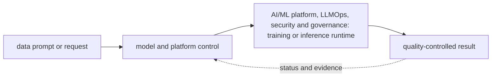
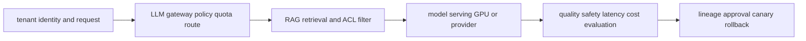

# AI/ML platform, LLMOps, security and governance

<!-- chapter-guide:start -->
> **Step 236 of 373 — 11**
>
> **Builds on:** [Compliance evidence](../10-operations/03-platform-and-cloud-security/07-compliance-evidence/README.md)
>
> **Now:** Learn **AI/ML platform, LLMOps, security and governance** from its mental model through production ownership.
>
> **Then:** Rehearse the linked questions and continue to [Machine-learning fundamentals for platform engineers](01-machine-learning-fundamentals-for-platform-engineers/README.md).
<!-- chapter-guide:end -->

<!-- explanation-practice-normalizer:v1 -->


## Explanation

### What this chapter is and why it exists

**AI/ML platform, LLMOps, security and governance** is easiest to understand as one part of a larger path. The subject links data, model and runtime state. A versioned input becomes an artifact, a serving system turns requests into token or prediction work, and evaluation decides whether quality, safety, latency and cost are acceptable.

The chapter focuses on AI/ML platform, LLMOps, security and governance. These are connected mechanisms, not vocabulary to memorize. The AI platform branch connects data, training, model artifacts, GPU capacity, serving, evaluation, gateways, retrieval, safety and governance into one release lifecycle The explanations below first build the simple model, then add the exact system behavior and production consequences.

### History and evolution

Machine-learning systems evolved from offline statistical jobs into GPU-intensive training and always-on inference platforms. Foundation models added token-based capacity, very large artifacts, probabilistic quality and new safety concerns, so model, data, prompt, runtime and evaluation revisions now have to travel as one governed release.

In this chapter, **AI/ML platform, LLMOps, security and governance** is the next layer of that evolution. Its modern purpose is to the AI platform branch connects data, training, model artifacts, GPU capacity, serving, evaluation, gateways, retrieval, safety and governance into one release lifecycle. The exact product surface may change by version, but the underlying state, request path and failure boundaries remain the durable ideas to learn.

### How the complete branch works



A branch overview connects child mechanisms into one lifecycle. The input crosses identity and policy, a control or decision plane, the runtime data path and its dependencies before producing a user-visible result. Status and telemetry travel back through the loop so operators and controllers can correct drift or failure. Reading the child chapters adds precision, but this overview explains why those chapters depend on one another.

A useful test of understanding is to trace one concrete request or change from origin to outcome and name the authoritative state at each boundary. That trace reveals where work is synchronous or asynchronous, which failure domains are independent, what a timeout can prove, and which evidence distinguishes accepted intent from healthy behavior.

### Integrated AI platform mental model

Treat model, tokenizer, prompt/template, adapters, runtime image and flags, hardware/driver, retrieval index, dataset/evaluator and policy as one versioned release. The platform must convert tenant demand into governed GPU/provider work while protecting data and tool authority, measuring quality/safety and latency, and controlling unit cost. Infrastructure health alone is never a sufficient model-release gate.



## Practice

### Practical starting exercise

Use a small approved local model or sandbox endpoint and a versioned JSONL evaluation set. Record the exact release manifest, measure time to first token, inter-token latency, token counts, errors, cost and two task-quality checks, then change one prompt or runtime variable and compare. Add one rejected unauthorized retrieval and one provider/runtime failure, verify policy/fallback behavior, revert, and remove test artifacts according to data classification. The child notes provide deeper commands, manifests, evaluation methods and question banks.

Reliability and observability span both system behavior and model quality: correlate release lineage, queue/runtime signals, traces and evaluation results before declaring the model path healthy.

Authoritative starting points: [KServe](https://kserve.github.io/website/docs/), [OpenTelemetry GenAI conventions](https://opentelemetry.io/docs/specs/semconv/gen-ai/), [OWASP GenAI Security](https://genai.owasp.org/), and [NIST AI RMF](https://www.nist.gov/itl/ai-risk-management-framework).

### Practice objective

Build a small, safe proof of **AI/ML platform, LLMOps, security and governance** and explain the result in your own words. The goal is not command completion; it is to connect input, internal mechanism, observable state and user outcome.

### Prerequisites and setup

Use a disposable local environment, sandbox account/project or isolated namespace. Confirm the effective identity and target, record the start time, and set a cost limit before creating anything.

Record tool and platform versions because flags, APIs and defaults can change. Define every uppercase placeholder before use and keep secrets out of shell history and committed files.

### Activity 1: establish a healthy baseline

Run the read-oriented example first:

```bash
nvidia-smi
curl -sS MODEL_URL/metrics
python -m pytest -q
```

For each line, write down the layer it inspects, the expected healthy field or response, and one thing it cannot prove. The expected result is an attributable request against the intended target plus enough state to draw the path from input to outcome.

### Activity 2: create or review the smallest working example

Put the smallest relevant command, configuration, manifest or code sample in source control. Validate or lint it, produce a preview/diff where the tool supports one, and apply only inside the disposable boundary. Record the exact revision and resulting resource or process ID. If the topic is observational rather than configurable, save a sanitized baseline and an automated assertion instead of mutating the system.

### Activity 3: controlled failure and troubleshooting

Introduce one bounded failure: use a definitely nonexistent resource name, an invalid sandbox-only value, a denied test identity, a closed test port or a stopped disposable dependency. Capture the exact error and classify it as identity/policy, input/configuration, control-plane reconciliation, network/protocol, dependency or capacity. Test one discriminating hypothesis at a time; do not widen access or restart unrelated components.

Expected failure evidence is a specific non-zero exit, status/reason, event or protocol response that disappears when the controlled fault is removed. If healthy and failing runs look identical, the chosen signal does not explain the phenomenon and the exercise is not complete.

### Verification

Repeat the original client or user-facing check, not only an administrative status command. Confirm the desired revision, data correctness where applicable, error and latency recovery, and absence of a continuing retry/backlog/saturation condition. Explain why this evidence proves recovery and what uncertainty remains.

### Cleanup and rollback

Revert the configuration in its source of truth and review the rollback diff before applying it. Delete only the named sandbox resources, stop disposable processes, remove temporary credentials and verify that no billable resource, volume, artifact, queue item or background job remains. Read-only activities require no infrastructure rollback, but sanitized captures must still follow retention policy.

### Harder extension

Automate the healthy and failing paths in CI, use short-lived identity, add one SLI/alert or policy assertion, and write a five-step runbook another engineer can execute without hidden context. Then explain how the design changes for two tenants, a zonal or dependency failure, 10× load and a strict cost or recovery target.

<!-- reading-navigation:start -->
---

**Reading path:** [← Back: Compliance evidence](../10-operations/03-platform-and-cloud-security/07-compliance-evidence/README.md) · [Questions](questions-and-answers.md) · [Next: Machine-learning fundamentals for platform engineers →](01-machine-learning-fundamentals-for-platform-engineers/README.md)

<!-- reading-navigation:end -->
