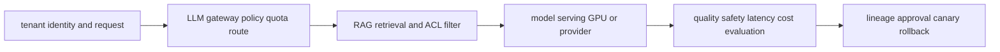

# AI/ML platform, LLMOps, security and governance

<!-- chapter-guide:start -->
> **Step 236 of 373 — 11**
>
> **Builds on:** [Compliance evidence](../10-operations/03-platform-and-cloud-security/07-compliance-evidence/README.md)
>
> **Now:** Learn **AI/ML platform, LLMOps, security and governance** from its mental model through production ownership.
>
> **Then:** Rehearse the linked questions and continue to [Machine-learning fundamentals for platform engineers](01-machine-learning-fundamentals-for-platform-engineers/README.md).
<!-- chapter-guide:end -->

## Integrated AI platform mental model

Treat model, tokenizer, prompt/template, adapters, runtime image and flags, hardware/driver, retrieval index, dataset/evaluator and policy as one versioned release. The platform must convert tenant demand into governed GPU/provider work while protecting data and tool authority, measuring quality/safety and latency, and controlling unit cost. Infrastructure health alone is never a sufficient model-release gate.

## Practical starting exercise

Use a small approved local model or sandbox endpoint and a versioned JSONL evaluation set. Record the exact release manifest, measure time to first token, inter-token latency, token counts, errors, cost and two task-quality checks, then change one prompt or runtime variable and compare. Add one rejected unauthorized retrieval and one provider/runtime failure, verify policy/fallback behavior, revert, and remove test artifacts according to data classification. The child notes provide deeper commands, manifests, evaluation methods and question banks.

Reliability and observability span both system behavior and model quality: correlate release lineage, queue/runtime signals, traces and evaluation results before declaring the model path healthy.

Authoritative starting points: [KServe](https://kserve.github.io/website/docs/), [OpenTelemetry GenAI conventions](https://opentelemetry.io/docs/specs/semconv/gen-ai/), [OWASP GenAI Security](https://genai.owasp.org/), and [NIST AI RMF](https://www.nist.gov/itl/ai-risk-management-framework).

<!-- reading-navigation:start -->
---

**Reading path:** [← Back: Compliance evidence](../10-operations/03-platform-and-cloud-security/07-compliance-evidence/README.md) · [Questions](questions-and-answers.md) · [Next: Machine-learning fundamentals for platform engineers →](01-machine-learning-fundamentals-for-platform-engineers/README.md)

<!-- reading-navigation:end -->
