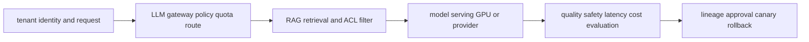

# AI/ML platform, LLMOps, security and governance

<!-- child-topic-toc:start -->
## Table of contents and deeper notes

This parent note explains how the child topics work together. Follow each child link for the deeper mechanism, real commands/configuration, hands-on practice, authoritative documentation, and its local interview bank.

- [Agents and tool-using AI](agents-and-tool-using-ai/README.md) — [questions and answers](agents-and-tool-using-ai/questions-and-answers.md)
- [AI and LLM security](ai-and-llm-security/README.md) — [questions and answers](ai-and-llm-security/questions-and-answers.md)
- [AI evaluation infrastructure](ai-evaluation-infrastructure/README.md) — [questions and answers](ai-evaluation-infrastructure/questions-and-answers.md)
- [AI governance](ai-governance/README.md) — [questions and answers](ai-governance/questions-and-answers.md)
- [European AI and privacy regulation](european-ai-and-privacy-regulation/README.md) — [questions and answers](european-ai-and-privacy-regulation/questions-and-answers.md)
- [GPU-compute architecture](gpu-compute-architecture/README.md) — [questions and answers](gpu-compute-architecture/questions-and-answers.md)
- [LLM and transformer fundamentals](llm-and-transformer-fundamentals/README.md) — [questions and answers](llm-and-transformer-fundamentals/questions-and-answers.md)
- [LLM gateway](llm-gateway/README.md) — [questions and answers](llm-gateway/questions-and-answers.md)
- [Machine-learning fundamentals for platform engineers](machine-learning-fundamentals-for-platform-engineers/README.md) — [questions and answers](machine-learning-fundamentals-for-platform-engineers/questions-and-answers.md)
- [MLOps and LLMOps lifecycle](mlops-and-llmops-lifecycle/README.md) — [questions and answers](mlops-and-llmops-lifecycle/questions-and-answers.md)
- [Model serving and inference platforms](model-serving-and-inference-platforms/README.md) — [questions and answers](model-serving-and-inference-platforms/questions-and-answers.md)
- [RAG engineering](rag-engineering/README.md) — [questions and answers](rag-engineering/questions-and-answers.md)
<!-- child-topic-toc:end -->
<!-- generated-topic-index:start -->
## Deep topic branches

- [Machine-learning fundamentals for platform engineers](machine-learning-fundamentals-for-platform-engineers/README.md) — [Q&A](machine-learning-fundamentals-for-platform-engineers/questions-and-answers.md)
- [LLM and transformer fundamentals](llm-and-transformer-fundamentals/README.md) — [Q&A](llm-and-transformer-fundamentals/questions-and-answers.md)
- [GPU-compute architecture](gpu-compute-architecture/README.md) — [Q&A](gpu-compute-architecture/questions-and-answers.md)
- [Model serving and inference platforms](model-serving-and-inference-platforms/README.md) — [Q&A](model-serving-and-inference-platforms/questions-and-answers.md)
- [LLM gateway](llm-gateway/README.md) — [Q&A](llm-gateway/questions-and-answers.md)
- [RAG engineering](rag-engineering/README.md) — [Q&A](rag-engineering/questions-and-answers.md)
- [AI evaluation infrastructure](ai-evaluation-infrastructure/README.md) — [Q&A](ai-evaluation-infrastructure/questions-and-answers.md)
- [MLOps and LLMOps lifecycle](mlops-and-llmops-lifecycle/README.md) — [Q&A](mlops-and-llmops-lifecycle/questions-and-answers.md)
- [Agents and tool-using AI](agents-and-tool-using-ai/README.md) — [Q&A](agents-and-tool-using-ai/questions-and-answers.md)
- [AI and LLM security](ai-and-llm-security/README.md) — [Q&A](ai-and-llm-security/questions-and-answers.md)
- [AI governance](ai-governance/README.md) — [Q&A](ai-governance/questions-and-answers.md)
- [European AI and privacy regulation](european-ai-and-privacy-regulation/README.md) — [Q&A](european-ai-and-privacy-regulation/questions-and-answers.md)
<!-- generated-topic-index:end -->

## Integrated AI platform mental model

Treat model, tokenizer, prompt/template, adapters, runtime image and flags, hardware/driver, retrieval index, dataset/evaluator and policy as one versioned release. The platform must convert tenant demand into governed GPU/provider work while protecting data and tool authority, measuring quality/safety and latency, and controlling unit cost. Infrastructure health alone is never a sufficient model-release gate.

## Practical starting exercise

Use a small approved local model or sandbox endpoint and a versioned JSONL evaluation set. Record the exact release manifest, measure time to first token, inter-token latency, token counts, errors, cost and two task-quality checks, then change one prompt or runtime variable and compare. Add one rejected unauthorized retrieval and one provider/runtime failure, verify policy/fallback behavior, revert, and remove test artifacts according to data classification. The child notes provide deeper commands, manifests, evaluation methods and question banks.

Authoritative starting points: [KServe](https://kserve.github.io/website/docs/), [OpenTelemetry GenAI conventions](https://opentelemetry.io/docs/specs/semconv/gen-ai/), [OWASP GenAI Security](https://genai.owasp.org/), and [NIST AI RMF](https://www.nist.gov/itl/ai-risk-management-framework).
