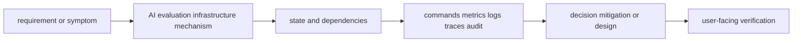

# AI evaluation infrastructure

<!-- child-topic-toc:start -->
## Table of contents and deeper notes

This parent note explains how the child topics work together. Follow each child link for the deeper mechanism, real commands/configuration, hands-on practice, authoritative documentation, and its local interview bank.

- [Evaluation datasets](evaluation-datasets/README.md) — [questions and answers](evaluation-datasets/questions-and-answers.md)
- [Evaluation pipelines](evaluation-pipelines/README.md) — [questions and answers](evaluation-pipelines/questions-and-answers.md)
- [Evaluation purposes](evaluation-purposes/README.md) — [questions and answers](evaluation-purposes/questions-and-answers.md)
- [Evaluation reliability](evaluation-reliability/README.md) — [questions and answers](evaluation-reliability/questions-and-answers.md)
- [Evaluation types](evaluation-types/README.md) — [questions and answers](evaluation-types/questions-and-answers.md)
- [LLM quality metrics](llm-quality-metrics/README.md) — [questions and answers](llm-quality-metrics/questions-and-answers.md)
- [Operational metrics](operational-metrics/README.md) — [questions and answers](operational-metrics/questions-and-answers.md)
- [RAG metrics](rag-metrics/README.md) — [questions and answers](rag-metrics/questions-and-answers.md)
- [Release gates](release-gates/README.md) — [questions and answers](release-gates/questions-and-answers.md)
- [Safety metrics](safety-metrics/README.md) — [questions and answers](safety-metrics/questions-and-answers.md)
<!-- child-topic-toc:end -->
> [Interview questions and answers](questions-and-answers.md) · [Master curriculum](../../curriculum/master-curriculum.txt) · Official starting point: <https://www.nist.gov/itl/ai-risk-management-framework>

## Easy mode: mental model

Integrate every part of AI evaluation infrastructure into one secure, reliable, observable, supportable and cost-aware production capability.

Learn this topic in layers: name the object or mechanism, trace its lifecycle/data path, configure it safely, observe a healthy and failed state, recover it, and then design it across failure domains and team boundaries.



## Deeper topic folders

- [41.1 Evaluation purposes](evaluation-purposes/README.md) — [Q&A](evaluation-purposes/questions-and-answers.md)
- [41.2 Evaluation datasets](evaluation-datasets/README.md) — [Q&A](evaluation-datasets/questions-and-answers.md)
- [41.3 Evaluation types](evaluation-types/README.md) — [Q&A](evaluation-types/questions-and-answers.md)
- [41.4 LLM quality metrics](llm-quality-metrics/README.md) — [Q&A](llm-quality-metrics/questions-and-answers.md)
- [41.5 RAG metrics](rag-metrics/README.md) — [Q&A](rag-metrics/questions-and-answers.md)
- [41.6 Safety metrics](safety-metrics/README.md) — [Q&A](safety-metrics/questions-and-answers.md)
- [41.7 Operational metrics](operational-metrics/README.md) — [Q&A](operational-metrics/questions-and-answers.md)
- [41.8 Evaluation pipelines](evaluation-pipelines/README.md) — [Q&A](evaluation-pipelines/questions-and-answers.md)
- [41.9 Release gates](release-gates/README.md) — [Q&A](release-gates/questions-and-answers.md)
- [41.10 Evaluation reliability](evaluation-reliability/README.md) — [Q&A](evaluation-reliability/questions-and-answers.md)

## Complete curriculum checklist

| # | Topic | What you must understand and demonstrate |
|---:|---|---|
| 1 | **Model selection** | is part of AI evaluation infrastructure; learn its precise definition, mechanism and lifecycle, nearest alternatives, configuration interface, failure/limit, security boundary, observable evidence and production trade-off. |
| 2 | **Prompt selection** | is part of AI evaluation infrastructure; learn its precise definition, mechanism and lifecycle, nearest alternatives, configuration interface, failure/limit, security boundary, observable evidence and production trade-off. |
| 3 | **RAG validation** | is part of AI evaluation infrastructure; learn its precise definition, mechanism and lifecycle, nearest alternatives, configuration interface, failure/limit, security boundary, observable evidence and production trade-off. |
| 4 | **Regression detection** | is part of AI evaluation infrastructure; learn its precise definition, mechanism and lifecycle, nearest alternatives, configuration interface, failure/limit, security boundary, observable evidence and production trade-off. |
| 5 | **Safety verification** | is part of AI evaluation infrastructure; learn its precise definition, mechanism and lifecycle, nearest alternatives, configuration interface, failure/limit, security boundary, observable evidence and production trade-off. |
| 6 | **Release gating** | is part of AI evaluation infrastructure; learn its precise definition, mechanism and lifecycle, nearest alternatives, configuration interface, failure/limit, security boundary, observable evidence and production trade-off. |
| 7 | **Production monitoring** | turns runtime state into evidence; define signal semantics, labels/context, retention/privacy/cost, healthy baseline, actionable threshold and a query that distinguishes competing hypotheses. |
| 8 | **Golden datasets** | is part of AI evaluation infrastructure; learn its precise definition, mechanism and lifecycle, nearest alternatives, configuration interface, failure/limit, security boundary, observable evidence and production trade-off. |
| 9 | **Synthetic datasets** | is part of AI evaluation infrastructure; learn its precise definition, mechanism and lifecycle, nearest alternatives, configuration interface, failure/limit, security boundary, observable evidence and production trade-off. |
| 10 | **Production samples** | is part of AI evaluation infrastructure; learn its precise definition, mechanism and lifecycle, nearest alternatives, configuration interface, failure/limit, security boundary, observable evidence and production trade-off. |
| 11 | **Adversarial datasets** | is part of AI evaluation infrastructure; learn its precise definition, mechanism and lifecycle, nearest alternatives, configuration interface, failure/limit, security boundary, observable evidence and production trade-off. |
| 12 | **Edge cases** | is part of AI evaluation infrastructure; learn its precise definition, mechanism and lifecycle, nearest alternatives, configuration interface, failure/limit, security boundary, observable evidence and production trade-off. |
| 13 | **Multilingual datasets** | is part of AI evaluation infrastructure; learn its precise definition, mechanism and lifecycle, nearest alternatives, configuration interface, failure/limit, security boundary, observable evidence and production trade-off. |
| 14 | **Versioning** | is part of AI evaluation infrastructure; learn its precise definition, mechanism and lifecycle, nearest alternatives, configuration interface, failure/limit, security boundary, observable evidence and production trade-off. |
| 15 | **Ownership** | is part of AI evaluation infrastructure; learn its precise definition, mechanism and lifecycle, nearest alternatives, configuration interface, failure/limit, security boundary, observable evidence and production trade-off. |
| 16 | **Data lineage** | is part of AI evaluation infrastructure; learn its precise definition, mechanism and lifecycle, nearest alternatives, configuration interface, failure/limit, security boundary, observable evidence and production trade-off. |
| 17 | **Offline evaluation** | is part of AI evaluation infrastructure; learn its precise definition, mechanism and lifecycle, nearest alternatives, configuration interface, failure/limit, security boundary, observable evidence and production trade-off. |
| 18 | **Online evaluation** | is part of AI evaluation infrastructure; learn its precise definition, mechanism and lifecycle, nearest alternatives, configuration interface, failure/limit, security boundary, observable evidence and production trade-off. |
| 19 | **Human evaluation** | is part of AI evaluation infrastructure; learn its precise definition, mechanism and lifecycle, nearest alternatives, configuration interface, failure/limit, security boundary, observable evidence and production trade-off. |
| 20 | **Automated evaluation** | is part of AI evaluation infrastructure; learn its precise definition, mechanism and lifecycle, nearest alternatives, configuration interface, failure/limit, security boundary, observable evidence and production trade-off. |
| 21 | **Model-as-judge** | is part of AI evaluation infrastructure; learn its precise definition, mechanism and lifecycle, nearest alternatives, configuration interface, failure/limit, security boundary, observable evidence and production trade-off. |
| 22 | **Pairwise comparison** | is part of AI evaluation infrastructure; learn its precise definition, mechanism and lifecycle, nearest alternatives, configuration interface, failure/limit, security boundary, observable evidence and production trade-off. |
| 23 | **A/B testing** | is part of AI evaluation infrastructure; learn its precise definition, mechanism and lifecycle, nearest alternatives, configuration interface, failure/limit, security boundary, observable evidence and production trade-off. |
| 24 | **Shadow evaluation** | is part of AI evaluation infrastructure; learn its precise definition, mechanism and lifecycle, nearest alternatives, configuration interface, failure/limit, security boundary, observable evidence and production trade-off. |
| 25 | **Red-team evaluation** | is part of AI evaluation infrastructure; learn its precise definition, mechanism and lifecycle, nearest alternatives, configuration interface, failure/limit, security boundary, observable evidence and production trade-off. |
| 26 | **Correctness** | is part of AI evaluation infrastructure; learn its precise definition, mechanism and lifecycle, nearest alternatives, configuration interface, failure/limit, security boundary, observable evidence and production trade-off. |
| 27 | **Relevance** | is part of AI evaluation infrastructure; learn its precise definition, mechanism and lifecycle, nearest alternatives, configuration interface, failure/limit, security boundary, observable evidence and production trade-off. |
| 28 | **Completeness** | is part of AI evaluation infrastructure; learn its precise definition, mechanism and lifecycle, nearest alternatives, configuration interface, failure/limit, security boundary, observable evidence and production trade-off. |
| 29 | **Faithfulness** | is part of AI evaluation infrastructure; learn its precise definition, mechanism and lifecycle, nearest alternatives, configuration interface, failure/limit, security boundary, observable evidence and production trade-off. |
| 30 | **Groundedness** | is part of AI evaluation infrastructure; learn its precise definition, mechanism and lifecycle, nearest alternatives, configuration interface, failure/limit, security boundary, observable evidence and production trade-off. |
| 31 | **Citation correctness** | is part of AI evaluation infrastructure; learn its precise definition, mechanism and lifecycle, nearest alternatives, configuration interface, failure/limit, security boundary, observable evidence and production trade-off. |
| 32 | **Coherence** | is part of AI evaluation infrastructure; learn its precise definition, mechanism and lifecycle, nearest alternatives, configuration interface, failure/limit, security boundary, observable evidence and production trade-off. |
| 33 | **Style** | is part of AI evaluation infrastructure; learn its precise definition, mechanism and lifecycle, nearest alternatives, configuration interface, failure/limit, security boundary, observable evidence and production trade-off. |
| 34 | **Instruction adherence** | is part of AI evaluation infrastructure; learn its precise definition, mechanism and lifecycle, nearest alternatives, configuration interface, failure/limit, security boundary, observable evidence and production trade-off. |
| 35 | **Tool-call accuracy** | is part of AI evaluation infrastructure; learn its precise definition, mechanism and lifecycle, nearest alternatives, configuration interface, failure/limit, security boundary, observable evidence and production trade-off. |
| 36 | **Retrieval precision** | is part of AI evaluation infrastructure; learn its precise definition, mechanism and lifecycle, nearest alternatives, configuration interface, failure/limit, security boundary, observable evidence and production trade-off. |
| 37 | **Retrieval recall** | is part of AI evaluation infrastructure; learn its precise definition, mechanism and lifecycle, nearest alternatives, configuration interface, failure/limit, security boundary, observable evidence and production trade-off. |
| 38 | **Hit rate** | is part of AI evaluation infrastructure; learn its precise definition, mechanism and lifecycle, nearest alternatives, configuration interface, failure/limit, security boundary, observable evidence and production trade-off. |
| 39 | **Mean reciprocal rank** | is part of AI evaluation infrastructure; learn its precise definition, mechanism and lifecycle, nearest alternatives, configuration interface, failure/limit, security boundary, observable evidence and production trade-off. |
| 40 | **NDCG** | is part of AI evaluation infrastructure; learn its precise definition, mechanism and lifecycle, nearest alternatives, configuration interface, failure/limit, security boundary, observable evidence and production trade-off. |
| 41 | **Context relevance** | is part of AI evaluation infrastructure; learn its precise definition, mechanism and lifecycle, nearest alternatives, configuration interface, failure/limit, security boundary, observable evidence and production trade-off. |
| 42 | **Context recall** | is part of AI evaluation infrastructure; learn its precise definition, mechanism and lifecycle, nearest alternatives, configuration interface, failure/limit, security boundary, observable evidence and production trade-off. |
| 43 | **Answer faithfulness** | is part of AI evaluation infrastructure; learn its precise definition, mechanism and lifecycle, nearest alternatives, configuration interface, failure/limit, security boundary, observable evidence and production trade-off. |
| 44 | **Citation accuracy** | is part of AI evaluation infrastructure; learn its precise definition, mechanism and lifecycle, nearest alternatives, configuration interface, failure/limit, security boundary, observable evidence and production trade-off. |
| 45 | **Toxicity** | is part of AI evaluation infrastructure; learn its precise definition, mechanism and lifecycle, nearest alternatives, configuration interface, failure/limit, security boundary, observable evidence and production trade-off. |
| 46 | **Bias** | is part of AI evaluation infrastructure; learn its precise definition, mechanism and lifecycle, nearest alternatives, configuration interface, failure/limit, security boundary, observable evidence and production trade-off. |
| 47 | **Prompt-injection resistance** | is part of AI evaluation infrastructure; learn its precise definition, mechanism and lifecycle, nearest alternatives, configuration interface, failure/limit, security boundary, observable evidence and production trade-off. |
| 48 | **Data leakage** | is part of AI evaluation infrastructure; learn its precise definition, mechanism and lifecycle, nearest alternatives, configuration interface, failure/limit, security boundary, observable evidence and production trade-off. |
| 49 | **Policy violation** | defines a trust/control boundary: identify actor, protected asset, decision/enforcement point, least privilege, bypass path, audit evidence, rotation/revocation and recovery. |
| 50 | **Harmful-content generation** | is part of AI evaluation infrastructure; learn its precise definition, mechanism and lifecycle, nearest alternatives, configuration interface, failure/limit, security boundary, observable evidence and production trade-off. |
| 51 | **Jailbreak resistance** | is part of AI evaluation infrastructure; learn its precise definition, mechanism and lifecycle, nearest alternatives, configuration interface, failure/limit, security boundary, observable evidence and production trade-off. |
| 52 | **Tool misuse** | is part of AI evaluation infrastructure; learn its precise definition, mechanism and lifecycle, nearest alternatives, configuration interface, failure/limit, security boundary, observable evidence and production trade-off. |
| 53 | **Latency** | is part of AI evaluation infrastructure; learn its precise definition, mechanism and lifecycle, nearest alternatives, configuration interface, failure/limit, security boundary, observable evidence and production trade-off. |
| 54 | **Time to first token** | is part of AI evaluation infrastructure; learn its precise definition, mechanism and lifecycle, nearest alternatives, configuration interface, failure/limit, security boundary, observable evidence and production trade-off. |
| 55 | **Token throughput** | is part of AI evaluation infrastructure; learn its precise definition, mechanism and lifecycle, nearest alternatives, configuration interface, failure/limit, security boundary, observable evidence and production trade-off. |
| 56 | **Error rate** | is part of AI evaluation infrastructure; learn its precise definition, mechanism and lifecycle, nearest alternatives, configuration interface, failure/limit, security boundary, observable evidence and production trade-off. |
| 57 | **Cost per request** | is part of AI evaluation infrastructure; learn its precise definition, mechanism and lifecycle, nearest alternatives, configuration interface, failure/limit, security boundary, observable evidence and production trade-off. |
| 58 | **GPU utilization** | is part of AI evaluation infrastructure; learn its precise definition, mechanism and lifecycle, nearest alternatives, configuration interface, failure/limit, security boundary, observable evidence and production trade-off. |
| 59 | **Provider reliability** | is part of AI evaluation infrastructure; learn its precise definition, mechanism and lifecycle, nearest alternatives, configuration interface, failure/limit, security boundary, observable evidence and production trade-off. |
| 60 | **Rate-limit failures** | requires a layer-by-layer, evidence-first path from user impact and recent change through identity, configuration, runtime, dependency and resource saturation, followed by reversible mitigation and verified repair. |
| 61 | **Dataset loading** | is part of AI evaluation infrastructure; learn its precise definition, mechanism and lifecycle, nearest alternatives, configuration interface, failure/limit, security boundary, observable evidence and production trade-off. |
| 62 | **Test execution** | is part of AI evaluation infrastructure; learn its precise definition, mechanism and lifecycle, nearest alternatives, configuration interface, failure/limit, security boundary, observable evidence and production trade-off. |
| 63 | **Parallelization** | is part of AI evaluation infrastructure; learn its precise definition, mechanism and lifecycle, nearest alternatives, configuration interface, failure/limit, security boundary, observable evidence and production trade-off. |
| 64 | **Result persistence** | is part of AI evaluation infrastructure; learn its precise definition, mechanism and lifecycle, nearest alternatives, configuration interface, failure/limit, security boundary, observable evidence and production trade-off. |
| 65 | **Comparison to baseline** | is part of AI evaluation infrastructure; learn its precise definition, mechanism and lifecycle, nearest alternatives, configuration interface, failure/limit, security boundary, observable evidence and production trade-off. |
| 66 | **Threshold evaluation** | is part of AI evaluation infrastructure; learn its precise definition, mechanism and lifecycle, nearest alternatives, configuration interface, failure/limit, security boundary, observable evidence and production trade-off. |
| 67 | **Approval** | is part of AI evaluation infrastructure; learn its precise definition, mechanism and lifecycle, nearest alternatives, configuration interface, failure/limit, security boundary, observable evidence and production trade-off. |
| 68 | **Release** | is part of AI evaluation infrastructure; learn its precise definition, mechanism and lifecycle, nearest alternatives, configuration interface, failure/limit, security boundary, observable evidence and production trade-off. |
| 69 | **Rollback** | is part of AI evaluation infrastructure; learn its precise definition, mechanism and lifecycle, nearest alternatives, configuration interface, failure/limit, security boundary, observable evidence and production trade-off. |
| 70 | **Required metrics** | turns runtime state into evidence; define signal semantics, labels/context, retention/privacy/cost, healthy baseline, actionable threshold and a query that distinguishes competing hypotheses. |
| 71 | **Regression thresholds** | is part of AI evaluation infrastructure; learn its precise definition, mechanism and lifecycle, nearest alternatives, configuration interface, failure/limit, security boundary, observable evidence and production trade-off. |
| 72 | **Statistical significance** | is part of AI evaluation infrastructure; learn its precise definition, mechanism and lifecycle, nearest alternatives, configuration interface, failure/limit, security boundary, observable evidence and production trade-off. |
| 73 | **Manual approval** | is part of AI evaluation infrastructure; learn its precise definition, mechanism and lifecycle, nearest alternatives, configuration interface, failure/limit, security boundary, observable evidence and production trade-off. |
| 74 | **Exception workflows** | is part of AI evaluation infrastructure; learn its precise definition, mechanism and lifecycle, nearest alternatives, configuration interface, failure/limit, security boundary, observable evidence and production trade-off. |
| 75 | **Audit trails** | is part of AI evaluation infrastructure; learn its precise definition, mechanism and lifecycle, nearest alternatives, configuration interface, failure/limit, security boundary, observable evidence and production trade-off. |
| 76 | **Automatic rollback** | is part of AI evaluation infrastructure; learn its precise definition, mechanism and lifecycle, nearest alternatives, configuration interface, failure/limit, security boundary, observable evidence and production trade-off. |
| 77 | **Environment promotion** | is part of AI evaluation infrastructure; learn its precise definition, mechanism and lifecycle, nearest alternatives, configuration interface, failure/limit, security boundary, observable evidence and production trade-off. |
| 78 | **Judge-model bias** | is part of AI evaluation infrastructure; learn its precise definition, mechanism and lifecycle, nearest alternatives, configuration interface, failure/limit, security boundary, observable evidence and production trade-off. |
| 79 | **Non-determinism** | is part of AI evaluation infrastructure; learn its precise definition, mechanism and lifecycle, nearest alternatives, configuration interface, failure/limit, security boundary, observable evidence and production trade-off. |
| 80 | **Reproducibility** | is part of AI evaluation infrastructure; learn its precise definition, mechanism and lifecycle, nearest alternatives, configuration interface, failure/limit, security boundary, observable evidence and production trade-off. |
| 81 | **Temperature control** | is part of AI evaluation infrastructure; learn its precise definition, mechanism and lifecycle, nearest alternatives, configuration interface, failure/limit, security boundary, observable evidence and production trade-off. |
| 82 | **Prompt versioning** | is part of AI evaluation infrastructure; learn its precise definition, mechanism and lifecycle, nearest alternatives, configuration interface, failure/limit, security boundary, observable evidence and production trade-off. |
| 83 | **Evaluator versioning** | is part of AI evaluation infrastructure; learn its precise definition, mechanism and lifecycle, nearest alternatives, configuration interface, failure/limit, security boundary, observable evidence and production trade-off. |
| 84 | **Calibration** | is part of AI evaluation infrastructure; learn its precise definition, mechanism and lifecycle, nearest alternatives, configuration interface, failure/limit, security boundary, observable evidence and production trade-off. |
| 85 | **Human agreement** | is part of AI evaluation infrastructure; learn its precise definition, mechanism and lifecycle, nearest alternatives, configuration interface, failure/limit, security boundary, observable evidence and production trade-off. |
| 86 | **Evaluation contamination** | is part of AI evaluation infrastructure; learn its precise definition, mechanism and lifecycle, nearest alternatives, configuration interface, failure/limit, security boundary, observable evidence and production trade-off. |

## Beginner → mid-level → senior learning path

1. **Beginner:** define every term; identify the relevant file, object, protocol, API, or command; explain one normal use.
2. **Mid-level:** configure it from source control, inspect effective runtime state, diagnose two failure modes, automate a safe change, and explain one trade-off.
3. **Senior:** clarify ambiguous requirements, map trust and failure domains, quantify capacity/SLO/RPO/RTO/cost, compare alternatives, plan migration/rollback, and assign ownership.

## Command and configuration lab

Run read-only checks first in a sandbox. For each command, predict healthy output, one failing result, the next discriminating check, and the safe rollback for any later mutation.

```bash
nvidia-smi
kubectl get pods -A -o wide
curl -s http://MODEL/metrics
python -m pytest -q
```

## Hands-on practice: setup → failure → verification → cleanup

Use a tiny local model or approved sandbox endpoint and a versioned JSONL dataset. Record model/tokenizer/prompt/runtime/hardware and baseline latency, token and quality metrics; change one bounded variable; rerun; compare; then simulate an unavailable route or rejected request and verify safe fallback/denial. Cleanup artifacts, endpoint and cached test data according to their classification and retention policy.

Expected result: you can show the healthy evidence, reproduce a safe failure, explain why each command distinguishes one layer from another, restore the baseline, and prove cleanup. Hard extension: automate the lab from source control, add a test or alert for the injected failure, and write a five-step runbook another engineer can execute.

For code/configuration, be ready to review an intentionally unsafe diff and improve idempotency, secret handling, timeouts, validation, logging, tests, and rollback.

## Senior design checklist

State assumptions for tenants, traffic/work units, latency and availability targets, data classification/residency, recovery, team skills and budget. Draw control/data planes and synchronous/asynchronous dependencies. Cover identity, policy, encryption/key lifecycle, delivery provenance, observability, capacity, unit cost, operational ownership, migration and exit criteria. Name the evidence that would cause you to revise the design.

## Revision and practice

Complete the separate [checkbox interview bank](questions-and-answers.md). Do not memorize wording: speak in the order **definition → mechanism → evidence/configuration → failure/trade-off → production example**. For procedures use **stabilize → scope → inspect → hypothesize → test → mitigate → verify → prevent**.
