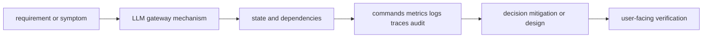
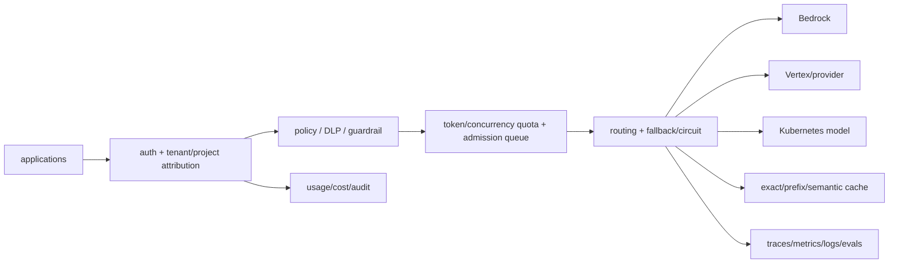

# LLM gateway

<!-- child-topic-toc:start -->
## Table of contents and deeper notes

This parent note explains how the child topics work together. Follow each child link for the deeper mechanism, real commands/configuration, hands-on practice, authoritative documentation, and its local interview bank.

- [API normalization](api-normalization/README.md) — [questions and answers](api-normalization/questions-and-answers.md)
- [Caching](caching/README.md) — [questions and answers](caching/questions-and-answers.md)
- [Cost management](cost-management/README.md) — [questions and answers](cost-management/questions-and-answers.md)
- [Gateway architecture](gateway-architecture/README.md) — [questions and answers](gateway-architecture/questions-and-answers.md)
- [Gateway observability](gateway-observability/README.md) — [questions and answers](gateway-observability/questions-and-answers.md)
- [Gateway technologies](gateway-technologies/README.md) — [questions and answers](gateway-technologies/questions-and-answers.md)
- [Identity and tenancy](identity-and-tenancy/README.md) — [questions and answers](identity-and-tenancy/questions-and-answers.md)
- [Reliability](reliability/README.md) — [questions and answers](reliability/questions-and-answers.md)
- [Routing](routing/README.md) — [questions and answers](routing/questions-and-answers.md)
- [Security policies](security-policies/README.md) — [questions and answers](security-policies/questions-and-answers.md)
- [Traffic control](traffic-control/README.md) — [questions and answers](traffic-control/questions-and-answers.md)
<!-- child-topic-toc:end -->
> [Interview questions and answers](questions-and-answers.md) · [Master curriculum](../../curriculum/master-curriculum.txt) · Official starting point: <https://opentelemetry.io/docs/specs/semconv/gen-ai/>

## Easy mode: mental model

Integrate every part of LLM gateway into one secure, reliable, observable, supportable and cost-aware production capability.

Learn this topic in layers: name the object or mechanism, trace its lifecycle/data path, configure it safely, observe a healthy and failed state, recover it, and then design it across failure domains and team boundaries.



## Deeper topic folders

- [39.1 Gateway architecture](gateway-architecture/README.md) — [Q&A](gateway-architecture/questions-and-answers.md)
- [39.2 API normalization](api-normalization/README.md) — [Q&A](api-normalization/questions-and-answers.md)
- [39.3 Identity and tenancy](identity-and-tenancy/README.md) — [Q&A](identity-and-tenancy/questions-and-answers.md)
- [39.4 Routing](routing/README.md) — [Q&A](routing/questions-and-answers.md)
- [39.5 Reliability](reliability/README.md) — [Q&A](reliability/questions-and-answers.md)
- [39.6 Traffic control](traffic-control/README.md) — [Q&A](traffic-control/questions-and-answers.md)
- [39.7 Security policies](security-policies/README.md) — [Q&A](security-policies/questions-and-answers.md)
- [39.8 Caching](caching/README.md) — [Q&A](caching/questions-and-answers.md)
- [39.9 Cost management](cost-management/README.md) — [Q&A](cost-management/questions-and-answers.md)
- [39.10 Gateway observability](gateway-observability/README.md) — [Q&A](gateway-observability/questions-and-answers.md)
- [39.11 Gateway technologies](gateway-technologies/README.md) — [Q&A](gateway-technologies/questions-and-answers.md)

## Complete curriculum checklist

| # | Topic | What you must understand and demonstrate |
|---:|---|---|
| 1 | **Northbound application API** | is part of LLM gateway; learn its precise definition, mechanism and lifecycle, nearest alternatives, configuration interface, failure/limit, security boundary, observable evidence and production trade-off. |
| 2 | **Southbound provider and model APIs** | is part of LLM gateway; learn its precise definition, mechanism and lifecycle, nearest alternatives, configuration interface, failure/limit, security boundary, observable evidence and production trade-off. |
| 3 | **Control plane** | is part of LLM gateway; learn its precise definition, mechanism and lifecycle, nearest alternatives, configuration interface, failure/limit, security boundary, observable evidence and production trade-off. |
| 4 | **Data plane** | is part of LLM gateway; learn its precise definition, mechanism and lifecycle, nearest alternatives, configuration interface, failure/limit, security boundary, observable evidence and production trade-off. |
| 5 | **Provider adapters** | is part of LLM gateway; learn its precise definition, mechanism and lifecycle, nearest alternatives, configuration interface, failure/limit, security boundary, observable evidence and production trade-off. |
| 6 | **Model registry** | is part of LLM gateway; learn its precise definition, mechanism and lifecycle, nearest alternatives, configuration interface, failure/limit, security boundary, observable evidence and production trade-off. |
| 7 | **Routing policy** | defines a trust/control boundary: identify actor, protected asset, decision/enforcement point, least privilege, bypass path, audit evidence, rotation/revocation and recovery. |
| 8 | **Gateway configuration** | is part of LLM gateway; learn its precise definition, mechanism and lifecycle, nearest alternatives, configuration interface, failure/limit, security boundary, observable evidence and production trade-off. |
| 9 | **OpenAI-compatible interfaces** | is part of LLM gateway; learn its precise definition, mechanism and lifecycle, nearest alternatives, configuration interface, failure/limit, security boundary, observable evidence and production trade-off. |
| 10 | **Chat-completion APIs** | is part of LLM gateway; learn its precise definition, mechanism and lifecycle, nearest alternatives, configuration interface, failure/limit, security boundary, observable evidence and production trade-off. |
| 11 | **Response APIs** | is part of LLM gateway; learn its precise definition, mechanism and lifecycle, nearest alternatives, configuration interface, failure/limit, security boundary, observable evidence and production trade-off. |
| 12 | **Streaming** | is part of LLM gateway; learn its precise definition, mechanism and lifecycle, nearest alternatives, configuration interface, failure/limit, security boundary, observable evidence and production trade-off. |
| 13 | **Embeddings** | is part of LLM gateway; learn its precise definition, mechanism and lifecycle, nearest alternatives, configuration interface, failure/limit, security boundary, observable evidence and production trade-off. |
| 14 | **Reranking** | is part of LLM gateway; learn its precise definition, mechanism and lifecycle, nearest alternatives, configuration interface, failure/limit, security boundary, observable evidence and production trade-off. |
| 15 | **Tool calls** | is part of LLM gateway; learn its precise definition, mechanism and lifecycle, nearest alternatives, configuration interface, failure/limit, security boundary, observable evidence and production trade-off. |
| 16 | **Error normalization** | is part of LLM gateway; learn its precise definition, mechanism and lifecycle, nearest alternatives, configuration interface, failure/limit, security boundary, observable evidence and production trade-off. |
| 17 | **API keys** | is part of LLM gateway; learn its precise definition, mechanism and lifecycle, nearest alternatives, configuration interface, failure/limit, security boundary, observable evidence and production trade-off. |
| 18 | **OAuth/OIDC** | is part of LLM gateway; learn its precise definition, mechanism and lifecycle, nearest alternatives, configuration interface, failure/limit, security boundary, observable evidence and production trade-off. |
| 19 | **Workload identity** | is part of LLM gateway; learn its precise definition, mechanism and lifecycle, nearest alternatives, configuration interface, failure/limit, security boundary, observable evidence and production trade-off. |
| 20 | **Tenant identification** | is part of LLM gateway; learn its precise definition, mechanism and lifecycle, nearest alternatives, configuration interface, failure/limit, security boundary, observable evidence and production trade-off. |
| 21 | **Project identification** | is part of LLM gateway; learn its precise definition, mechanism and lifecycle, nearest alternatives, configuration interface, failure/limit, security boundary, observable evidence and production trade-off. |
| 22 | **User attribution** | is part of LLM gateway; learn its precise definition, mechanism and lifecycle, nearest alternatives, configuration interface, failure/limit, security boundary, observable evidence and production trade-off. |
| 23 | **Service attribution** | is part of LLM gateway; learn its precise definition, mechanism and lifecycle, nearest alternatives, configuration interface, failure/limit, security boundary, observable evidence and production trade-off. |
| 24 | **Tenant isolation** | is part of LLM gateway; learn its precise definition, mechanism and lifecycle, nearest alternatives, configuration interface, failure/limit, security boundary, observable evidence and production trade-off. |
| 25 | **Model aliases** | is part of LLM gateway; learn its precise definition, mechanism and lifecycle, nearest alternatives, configuration interface, failure/limit, security boundary, observable evidence and production trade-off. |
| 26 | **Provider selection** | is part of LLM gateway; learn its precise definition, mechanism and lifecycle, nearest alternatives, configuration interface, failure/limit, security boundary, observable evidence and production trade-off. |
| 27 | **Weighted routing** | is part of LLM gateway; learn its precise definition, mechanism and lifecycle, nearest alternatives, configuration interface, failure/limit, security boundary, observable evidence and production trade-off. |
| 28 | **Latency-aware routing** | is part of LLM gateway; learn its precise definition, mechanism and lifecycle, nearest alternatives, configuration interface, failure/limit, security boundary, observable evidence and production trade-off. |
| 29 | **Cost-aware routing** | is part of LLM gateway; learn its precise definition, mechanism and lifecycle, nearest alternatives, configuration interface, failure/limit, security boundary, observable evidence and production trade-off. |
| 30 | **Region-aware routing** | is part of LLM gateway; learn its precise definition, mechanism and lifecycle, nearest alternatives, configuration interface, failure/limit, security boundary, observable evidence and production trade-off. |
| 31 | **Data-residency routing** | is part of LLM gateway; learn its precise definition, mechanism and lifecycle, nearest alternatives, configuration interface, failure/limit, security boundary, observable evidence and production trade-off. |
| 32 | **Capability-based routing** | is part of LLM gateway; learn its precise definition, mechanism and lifecycle, nearest alternatives, configuration interface, failure/limit, security boundary, observable evidence and production trade-off. |
| 33 | **Fallback routing** | is part of LLM gateway; learn its precise definition, mechanism and lifecycle, nearest alternatives, configuration interface, failure/limit, security boundary, observable evidence and production trade-off. |
| 34 | **Timeouts** | is part of LLM gateway; learn its precise definition, mechanism and lifecycle, nearest alternatives, configuration interface, failure/limit, security boundary, observable evidence and production trade-off. |
| 35 | **Retries** | repeat attempts for transient faults but require bounded budgets, deadlines, idempotency and jitter to avoid duplicate effects and retry storms. |
| 36 | **Backoff and jitter** | is part of LLM gateway; learn its precise definition, mechanism and lifecycle, nearest alternatives, configuration interface, failure/limit, security boundary, observable evidence and production trade-off. |
| 37 | **Circuit breakers** | stop calls to a failing dependency after a threshold and probe recovery, preventing resource exhaustion while requiring fallback semantics. |
| 38 | **Health checking** | is part of LLM gateway; learn its precise definition, mechanism and lifecycle, nearest alternatives, configuration interface, failure/limit, security boundary, observable evidence and production trade-off. |
| 39 | **Provider failover** | is part of LLM gateway; learn its precise definition, mechanism and lifecycle, nearest alternatives, configuration interface, failure/limit, security boundary, observable evidence and production trade-off. |
| 40 | **Model failover** | is part of LLM gateway; learn its precise definition, mechanism and lifecycle, nearest alternatives, configuration interface, failure/limit, security boundary, observable evidence and production trade-off. |
| 41 | **Request hedging** | is part of LLM gateway; learn its precise definition, mechanism and lifecycle, nearest alternatives, configuration interface, failure/limit, security boundary, observable evidence and production trade-off. |
| 42 | **Graceful degradation** | is part of LLM gateway; learn its precise definition, mechanism and lifecycle, nearest alternatives, configuration interface, failure/limit, security boundary, observable evidence and production trade-off. |
| 43 | **Rate limits** | is part of LLM gateway; learn its precise definition, mechanism and lifecycle, nearest alternatives, configuration interface, failure/limit, security boundary, observable evidence and production trade-off. |
| 44 | **Token-rate limits** | is part of LLM gateway; learn its precise definition, mechanism and lifecycle, nearest alternatives, configuration interface, failure/limit, security boundary, observable evidence and production trade-off. |
| 45 | **Concurrency limits** | is part of LLM gateway; learn its precise definition, mechanism and lifecycle, nearest alternatives, configuration interface, failure/limit, security boundary, observable evidence and production trade-off. |
| 46 | **Tenant quotas** | is part of LLM gateway; learn its precise definition, mechanism and lifecycle, nearest alternatives, configuration interface, failure/limit, security boundary, observable evidence and production trade-off. |
| 47 | **Provider quotas** | is part of LLM gateway; learn its precise definition, mechanism and lifecycle, nearest alternatives, configuration interface, failure/limit, security boundary, observable evidence and production trade-off. |
| 48 | **Load shedding** | is part of LLM gateway; learn its precise definition, mechanism and lifecycle, nearest alternatives, configuration interface, failure/limit, security boundary, observable evidence and production trade-off. |
| 49 | **Queueing** | is part of LLM gateway; learn its precise definition, mechanism and lifecycle, nearest alternatives, configuration interface, failure/limit, security boundary, observable evidence and production trade-off. |
| 50 | **Priority classes** | is part of LLM gateway; learn its precise definition, mechanism and lifecycle, nearest alternatives, configuration interface, failure/limit, security boundary, observable evidence and production trade-off. |
| 51 | **Prompt filtering** | is part of LLM gateway; learn its precise definition, mechanism and lifecycle, nearest alternatives, configuration interface, failure/limit, security boundary, observable evidence and production trade-off. |
| 52 | **Output filtering** | is part of LLM gateway; learn its precise definition, mechanism and lifecycle, nearest alternatives, configuration interface, failure/limit, security boundary, observable evidence and production trade-off. |
| 53 | **PII detection** | is part of LLM gateway; learn its precise definition, mechanism and lifecycle, nearest alternatives, configuration interface, failure/limit, security boundary, observable evidence and production trade-off. |
| 54 | **Redaction** | is part of LLM gateway; learn its precise definition, mechanism and lifecycle, nearest alternatives, configuration interface, failure/limit, security boundary, observable evidence and production trade-off. |
| 55 | **Data-loss prevention** | is part of LLM gateway; learn its precise definition, mechanism and lifecycle, nearest alternatives, configuration interface, failure/limit, security boundary, observable evidence and production trade-off. |
| 56 | **Provider allowlists** | is part of LLM gateway; learn its precise definition, mechanism and lifecycle, nearest alternatives, configuration interface, failure/limit, security boundary, observable evidence and production trade-off. |
| 57 | **Model allowlists** | is part of LLM gateway; learn its precise definition, mechanism and lifecycle, nearest alternatives, configuration interface, failure/limit, security boundary, observable evidence and production trade-off. |
| 58 | **Tool allowlists** | is part of LLM gateway; learn its precise definition, mechanism and lifecycle, nearest alternatives, configuration interface, failure/limit, security boundary, observable evidence and production trade-off. |
| 59 | **Egress restrictions** | is part of LLM gateway; learn its precise definition, mechanism and lifecycle, nearest alternatives, configuration interface, failure/limit, security boundary, observable evidence and production trade-off. |
| 60 | **Exact-match caching** | is part of LLM gateway; learn its precise definition, mechanism and lifecycle, nearest alternatives, configuration interface, failure/limit, security boundary, observable evidence and production trade-off. |
| 61 | **Semantic caching** | is part of LLM gateway; learn its precise definition, mechanism and lifecycle, nearest alternatives, configuration interface, failure/limit, security boundary, observable evidence and production trade-off. |
| 62 | **Prompt-prefix caching** | is part of LLM gateway; learn its precise definition, mechanism and lifecycle, nearest alternatives, configuration interface, failure/limit, security boundary, observable evidence and production trade-off. |
| 63 | **Provider caching** | is part of LLM gateway; learn its precise definition, mechanism and lifecycle, nearest alternatives, configuration interface, failure/limit, security boundary, observable evidence and production trade-off. |
| 64 | **Cache keys** | is part of LLM gateway; learn its precise definition, mechanism and lifecycle, nearest alternatives, configuration interface, failure/limit, security boundary, observable evidence and production trade-off. |
| 65 | **Tenant isolation** | is part of LLM gateway; learn its precise definition, mechanism and lifecycle, nearest alternatives, configuration interface, failure/limit, security boundary, observable evidence and production trade-off. |
| 66 | **Invalidations** | is part of LLM gateway; learn its precise definition, mechanism and lifecycle, nearest alternatives, configuration interface, failure/limit, security boundary, observable evidence and production trade-off. |
| 67 | **Privacy risks** | is part of LLM gateway; learn its precise definition, mechanism and lifecycle, nearest alternatives, configuration interface, failure/limit, security boundary, observable evidence and production trade-off. |
| 68 | **Token metering** | is part of LLM gateway; learn its precise definition, mechanism and lifecycle, nearest alternatives, configuration interface, failure/limit, security boundary, observable evidence and production trade-off. |
| 69 | **Cost calculation** | is part of LLM gateway; learn its precise definition, mechanism and lifecycle, nearest alternatives, configuration interface, failure/limit, security boundary, observable evidence and production trade-off. |
| 70 | **Budget limits** | is part of LLM gateway; learn its precise definition, mechanism and lifecycle, nearest alternatives, configuration interface, failure/limit, security boundary, observable evidence and production trade-off. |
| 71 | **Tenant chargeback** | is part of LLM gateway; learn its precise definition, mechanism and lifecycle, nearest alternatives, configuration interface, failure/limit, security boundary, observable evidence and production trade-off. |
| 72 | **Model substitution** | is part of LLM gateway; learn its precise definition, mechanism and lifecycle, nearest alternatives, configuration interface, failure/limit, security boundary, observable evidence and production trade-off. |
| 73 | **Cost-aware fallback** | is part of LLM gateway; learn its precise definition, mechanism and lifecycle, nearest alternatives, configuration interface, failure/limit, security boundary, observable evidence and production trade-off. |
| 74 | **Spending alerts** | turns runtime state into evidence; define signal semantics, labels/context, retention/privacy/cost, healthy baseline, actionable threshold and a query that distinguishes competing hypotheses. |
| 75 | **Anomaly detection** | is part of LLM gateway; learn its precise definition, mechanism and lifecycle, nearest alternatives, configuration interface, failure/limit, security boundary, observable evidence and production trade-off. |
| 76 | **Request count** | is part of LLM gateway; learn its precise definition, mechanism and lifecycle, nearest alternatives, configuration interface, failure/limit, security boundary, observable evidence and production trade-off. |
| 77 | **Provider** | is part of LLM gateway; learn its precise definition, mechanism and lifecycle, nearest alternatives, configuration interface, failure/limit, security boundary, observable evidence and production trade-off. |
| 78 | **Model** | is part of LLM gateway; learn its precise definition, mechanism and lifecycle, nearest alternatives, configuration interface, failure/limit, security boundary, observable evidence and production trade-off. |
| 79 | **Tokens** | is part of LLM gateway; learn its precise definition, mechanism and lifecycle, nearest alternatives, configuration interface, failure/limit, security boundary, observable evidence and production trade-off. |
| 80 | **Latency** | is part of LLM gateway; learn its precise definition, mechanism and lifecycle, nearest alternatives, configuration interface, failure/limit, security boundary, observable evidence and production trade-off. |
| 81 | **Time to first token** | is part of LLM gateway; learn its precise definition, mechanism and lifecycle, nearest alternatives, configuration interface, failure/limit, security boundary, observable evidence and production trade-off. |
| 82 | **Errors** | is part of LLM gateway; learn its precise definition, mechanism and lifecycle, nearest alternatives, configuration interface, failure/limit, security boundary, observable evidence and production trade-off. |
| 83 | **Retries** | repeat attempts for transient faults but require bounded budgets, deadlines, idempotency and jitter to avoid duplicate effects and retry storms. |
| 84 | **Fallbacks** | is part of LLM gateway; learn its precise definition, mechanism and lifecycle, nearest alternatives, configuration interface, failure/limit, security boundary, observable evidence and production trade-off. |
| 85 | **Cache hits** | is part of LLM gateway; learn its precise definition, mechanism and lifecycle, nearest alternatives, configuration interface, failure/limit, security boundary, observable evidence and production trade-off. |
| 86 | **Policy decisions** | defines a trust/control boundary: identify actor, protected asset, decision/enforcement point, least privilege, bypass path, audit evidence, rotation/revocation and recovery. |
| 87 | **Cost** | is part of LLM gateway; learn its precise definition, mechanism and lifecycle, nearest alternatives, configuration interface, failure/limit, security boundary, observable evidence and production trade-off. |
| 88 | **Envoy AI Gateway** | is part of LLM gateway; learn its precise definition, mechanism and lifecycle, nearest alternatives, configuration interface, failure/limit, security boundary, observable evidence and production trade-off. |
| 89 | **Kong AI Gateway** | is part of LLM gateway; learn its precise definition, mechanism and lifecycle, nearest alternatives, configuration interface, failure/limit, security boundary, observable evidence and production trade-off. |
| 90 | **Cloud-provider gateways** | is part of LLM gateway; learn its precise definition, mechanism and lifecycle, nearest alternatives, configuration interface, failure/limit, security boundary, observable evidence and production trade-off. |
| 91 | **LiteLLM-style gateways** | is part of LLM gateway; learn its precise definition, mechanism and lifecycle, nearest alternatives, configuration interface, failure/limit, security boundary, observable evidence and production trade-off. |
| 92 | **Custom gateways** | is part of LLM gateway; learn its precise definition, mechanism and lifecycle, nearest alternatives, configuration interface, failure/limit, security boundary, observable evidence and production trade-off. |
| 93 | **Service-mesh integration** | is part of LLM gateway; learn its precise definition, mechanism and lifecycle, nearest alternatives, configuration interface, failure/limit, security boundary, observable evidence and production trade-off. |

## Beginner → mid-level → senior learning path

1. **Beginner:** define every term; identify the relevant file, object, protocol, API, or command; explain one normal use.
2. **Mid-level:** configure it from source control, inspect effective runtime state, diagnose two failure modes, automate a safe change, and explain one trade-off.
3. **Senior:** clarify ambiguous requirements, map trust and failure domains, quantify capacity/SLO/RPO/RTO/cost, compare alternatives, plan migration/rollback, and assign ownership.

## Command and configuration lab

Run read-only checks first in a sandbox. For each command, predict healthy output, one failing result, the next discriminating check, and the safe rollback for any later mutation.

```bash
nvidia-smi
kubectl get pods -A -o wide
curl -s http://MODEL/metrics
python -m pytest -q
```

## Hands-on practice: setup → failure → verification → cleanup

Use a tiny local model or approved sandbox endpoint and a versioned JSONL dataset. Record model/tokenizer/prompt/runtime/hardware and baseline latency, token and quality metrics; change one bounded variable; rerun; compare; then simulate an unavailable route or rejected request and verify safe fallback/denial. Cleanup artifacts, endpoint and cached test data according to their classification and retention policy.

Expected result: you can show the healthy evidence, reproduce a safe failure, explain why each command distinguishes one layer from another, restore the baseline, and prove cleanup. Hard extension: automate the lab from source control, add a test or alert for the injected failure, and write a five-step runbook another engineer can execute.

For code/configuration, be ready to review an intentionally unsafe diff and improve idempotency, secret handling, timeouts, validation, logging, tests, and rollback.

## Senior design checklist

State assumptions for tenants, traffic/work units, latency and availability targets, data classification/residency, recovery, team skills and budget. Draw control/data planes and synchronous/asynchronous dependencies. Cover identity, policy, encryption/key lifecycle, delivery provenance, observability, capacity, unit cost, operational ownership, migration and exit criteria. Name the evidence that would cause you to revise the design.

## Revision and practice

Complete the separate [checkbox interview bank](questions-and-answers.md). Do not memorize wording: speak in the order **definition → mechanism → evidence/configuration → failure/trade-off → production example**. For procedures use **stabilize → scope → inspect → hypothesize → test → mitigate → verify → prevent**.

<!-- merged-11-AI-PLATFORM-LLM-GATEWAY-MD:start -->
## Practical deep dive

## Architecture

The gateway provides a stable northbound API and southbound adapters to providers/self-hosted models. Control plane manages registry/routes/policy/budgets; data plane authenticates, normalizes, authorizes, meters, routes, streams and observes requests. Keep control-plane failure from unnecessarily stopping known-good data-plane config; sign/version/cache config and define stale behavior.



## API and policy contract

Normalize chat/completions/responses, embeddings, reranking, streaming, tool calls, usage and errors without pretending providers are identical. Capability registry records context/output limits, modalities/tools/structured output, regions, data use/retention, quality/eval, price and health. Model aliases let applications request a governed capability rather than vendor ID.

Request context: authenticated workload/user, tenant/project, purpose, data class/residency, allowed model/tool/provider, budget/priority, idempotency and trace. Never trust tenant/model from an unverified header. Authorize every tool/retrieval path separately.

Envoy-style conceptual route policy:

```yaml
models:
  summarizer:
    candidates:
      - provider: self-hosted-eu
        model: summarizer-v7
        weight: 90
      - provider: bedrock-eu
        model: approved-fallback
        weight: 10
    constraints:
      allowedRegions: [eu-central-1, europe-west4]
      maxInputTokens: 16000
      maxOutputTokens: 512
      tools: []
      requireGuardrail: customer-text-v4
      retainPrompts: false
```

OpenAI-compatible request example:

```bash
curl -N https://llm.example/v1/chat/completions \
  -H "Authorization: Bearer $SHORT_LIVED_TOKEN" \
  -H 'Content-Type: application/json' \
  -H 'Idempotency-Key: 0b704d8a-...' \
  -H 'traceparent: 00-TRACE-SPAN-01' \
  -d '{"model":"summarizer","stream":true,"messages":[{"role":"user","content":"..."}],"max_tokens":256}'
```

## Reliability and traffic control

Set client deadline then allocate smaller per-attempt budgets. Retry only transient, safe/idempotent, pre-stream failures; after bytes stream, replay can duplicate visible output/billing. Backoff+jitter, honor rate-limit headers, cap attempts and system-wide retry budget. Circuit-break by provider/model/region/error class; fallback only to policy/quality/residency/tool-compatible candidates. Hedging reduces tail but increases cost/load and needs cancellation.

Rate limit requests, input/output/total tokens, concurrent streams and queued token work per tenant/project/model/provider. Use fair queueing and priority with starvation prevention. Estimate token work before admission then reconcile actual usage. Load shed low priority before queues exceed deadline.

## Caching

Exact cache keys include normalized provider/model/version, system/prompt/messages, generation parameters, tool/schema, policy/tenant scope and relevant context. Prefix cache is runtime/KV optimization. Semantic cache risks incorrect near-match, staleness, cross-tenant leakage and evaluation drift. Encrypt/partition, do not cache sensitive/random/user-specific output by default, bound TTL, record cache provenance and invalidate with model/prompt/policy/RAG changes.

## Observability and cost

Per request: tenant/project/service, alias→actual provider/model/region, policy/route version, safe token counts, queue/TTFT/stream/end latency, status/error taxonomy, retries/fallback/circuit, cache, tool/retrieval, guardrail decision and calculated cost. Do not use IDs/prompts as metric labels. Audit “who used what model/prompt/docs/tools under which policy” with privacy/retention.

Unit cost includes provider token/endpoint/GPU, cache, retrieval/tool, egress and telemetry. Budget controls can warn, soft-throttle, hard-reject or route cheaper approved model; state user experience and quality consequences. Detect sudden token/context/fallback/cache-miss/provider-price anomalies.

## Failure runbook

1. Scope tenant/alias/provider/region and connect vs TTFT vs mid-stream vs quality.
2. Stop retry amplification; enforce queue/deadline and shed/reroute approved traffic.
3. Compare route/policy/config version and recent changes.
4. Inspect provider quota/rate/health, model queue/capacity, network/TLS and gateway saturation.
5. Validate fallback compatibility and residency before enabling.
6. Verify success, latency, quality, billing and audit; reconcile config source.

## Labs and revision

Implement a small FastAPI gateway with JWT verification, model registry, token quota, retries/circuit/fallback, SSE cancellation and usage meter; add OpenTelemetry; inject provider 429/timeout/mid-stream failure; test cache tenant isolation and cost anomaly.

- Normalize transport while preserving capability differences.
- Identity/policy/tenancy are resolved before routing.
- Token work/concurrency/queue/deadline controls prevent overload.
- Retries/fallback/cache are correctness, residency and cost decisions.
- Audit and meter the actual provider/model/policy path.


<!-- merged-11-AI-PLATFORM-LLM-GATEWAY-MD:end -->
