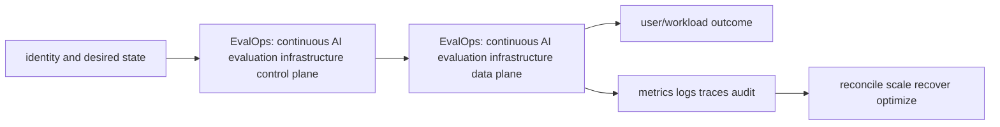

# EvalOps: continuous AI evaluation infrastructure

> Interview bank: [questions-and-answers.md](questions-and-answers.md) · Official documentation: <https://mlflow.org/docs/latest/ml/evaluation/>

## Easy mode: purpose and mental model

Operate versioned datasets, evaluators and release/production evaluation with calibrated uncertainty and actionable ownership.



## Detailed learning notes

| # | Concept | What you must be able to explain |
|---:|---|---|
| 1 | **Evaluation contract** | task, population, dataset, metric, evaluator, threshold and decision owner define what a score means. |
| 2 | **Golden dataset** | versioned representative, edge, adversarial and previously failed cases have provenance and maintenance owners. |
| 3 | **Deterministic checks** | schema, exact facts, executable tests, citations and policy assertions are preferred where possible. |
| 4 | **Model-as-judge** | prompt/model/temperature/rubric/order bias and nondeterminism require calibration against human labels. |
| 5 | **Human evaluation** | rubric, blinded/randomized assignment, agreement, adjudication and reviewer safety create evidence. |
| 6 | **RAG decomposition** | retrieval relevance/recall and answer faithfulness/quality are measured separately. |
| 7 | **Statistical comparison** | uncertainty, paired tests, multiple slices and minimum practical effect prevent leaderboard overreaction. |
| 8 | **Release gate** | exact candidate/baseline evidence produces pass/fail/exception bound to immutable release. |
| 9 | **Production sampling** | privacy-safe stratified traces and delayed outcomes detect realism gaps without uncontrolled retention. |
| 10 | **Evaluator monitoring** | drift, judge/provider changes, cost/latency and disagreement are themselves observed. |

## Architecture and lifecycle

Trace this service from request/authentication and desired configuration through provisioning, steady-state data path, scaling, change, failure, recovery and retirement. Bind every production resource to an owner, environment, data classification, source-of-truth revision, SLO, runbook, cost center and deletion/retention policy.

For EvalOps: continuous AI evaluation infrastructure, draw a real request/resource path and label where these mechanisms act: Evaluation contract, Golden dataset, Deterministic checks, Model-as-judge, Human evaluation, RAG decomposition, Statistical comparison, Release gate, Production sampling, Evaluator monitoring. State which parts are control plane versus data plane, regional versus zonal/global, synchronous versus asynchronous, and customer versus provider responsibility.

## Security model

Start with the caller/workload identity and evaluate every applicable identity, resource, organization, network-endpoint, encryption-key and admission policy. Minimize public paths, long-lived credentials, wildcard actions/resources and unreviewed cross-account/tenant trust. Encrypt in transit/at rest where applicable, but include key/certificate rotation and recovery. Protect audit evidence and prevent secrets/customer content from entering command history, logs, traces or metric labels.

## Availability and failure modes

List dependencies and failure domains before claiming high availability. Test quota/capacity, identity/control-plane, DNS/network/TLS, configuration drift, downstream saturation, zonal/Regional/node failure and recovery from protected state. Use bounded timeout, retry budget, jitter, idempotency, backpressure, load shedding and graceful drain according to protocol. A green resource status is not a user-facing recovery check.

## Performance, scaling and cost

Measure workload distribution and SLI before sizing. Track rate/work units, latency distribution, errors, saturation/queue and service-specific limits. Separate replica/task scaling from infrastructure/capacity scaling and include cold-start/provisioning delay. Cost includes idle/provisioned capacity, requests/work units, storage/retention, cross-AZ/Region/egress/NAT, observability, licenses/support and failure headroom. Optimize cost per successful SLO/quality-controlled task.

## Observability

Correlate a request/change across user, route/resource, dependency and underlying compute/storage/network. Use stable owner/environment/region/service dimensions; put high-cardinality request/object IDs in sampled logs/traces rather than metric labels. Alert on actionable SLO burn and leading exhaustion. Monitor the telemetry path and keep a read-only diagnostic role.

## Command lab

Run in a sandbox with the correct account/context/Region. Read and explain output before mutation.

```bash
python -m evals.run --manifest release.yaml --dataset golden-v12.jsonl
python -m pytest tests/evaluators -q
python scripts/calibrate_judge.py --human labels.jsonl --judge results.jsonl
python scripts/compare_releases.py baseline.json candidate.json --paired
```

For each command, record: identity/context, exact resource, expected healthy fields, one failing output, the next command/query, and which mutation would be reversible. Never paste secrets/tokens into committed notes or shared terminal history.

## Real-world exercise: easy → hard

1. **Easy:** inventory one healthy EvalOps: continuous AI evaluation infrastructure resource and draw identity/control/data/dependency paths.
2. **Intermediate:** reproduce a safe configuration change with IaC, preview/diff, apply to a sandbox, verify and roll back.
3. **Hard:** inject one policy/network/quota/capacity/dependency failure, diagnose from user symptom to root mechanism, mitigate without widening access, then add an alert/test/runbook.
4. **Senior:** design the service for two tenants, multi-zone/Region failure, RPO/RTO, regulated data, 10× demand and a 30% cost reduction; quantify trade-offs.

## Common interview traps

- Naming a feature without explaining request/resource lifecycle or failure semantics.
- Treating an allow, encryption checkbox, replica count or managed-service label as a complete security/reliability design.
- Mutating production before capturing identity, status, events, metrics, logs, audit and recent changes.
- Scaling the wrong layer or retrying overload/permanent errors.
- Omitting quotas, cold start, deletion/restore, observability cost or customer/tenant boundaries.

## Revision summary

Explain EvalOps: continuous AI evaluation infrastructure in five passes: purpose/selection, mechanism/lifecycle, security/failure, operation/commands, and architecture/economics. Then complete the separate [answered question bank](questions-and-answers.md) without looking at these notes.


## Hands-on proof: easy → hard

Use a disposable local environment, sandbox project/account or isolated Kubernetes namespace. Define all uppercase placeholders before running commands and confirm identity/context, data classification and cost boundary.

1. **Inventory:** run the read-only commands above, capture exact versions/IDs and explain which desired or observed state each proves.
2. **Build:** implement the smallest version-controlled example with an immutable input/artifact manifest and one automated test.
3. **Failure:** inject one bounded invalid input, dependency outage, incompatible revision, quota or stale-state condition; preserve the error and distinguish its layer without restarting blindly.
4. **Release:** generate evidence, compare a candidate with a baseline, make an explicit pass/fail decision and prove the deployed/run revision.
5. **Recover:** roll back or resume from a protected artifact/checkpoint, re-run the original quality and operational verification, and reconcile the source of truth.
6. **Cleanup:** delete only named lab resources and confirm no job, endpoint, volume, artifact, credential or billable accelerator remains. Retain only non-sensitive learning evidence allowed by policy.

Hard extension: put the lab in CI with short-lived identity, policy/evaluation gates, bounded concurrency/cost, an artifact digest, a failure-path test and a five-step runbook.
