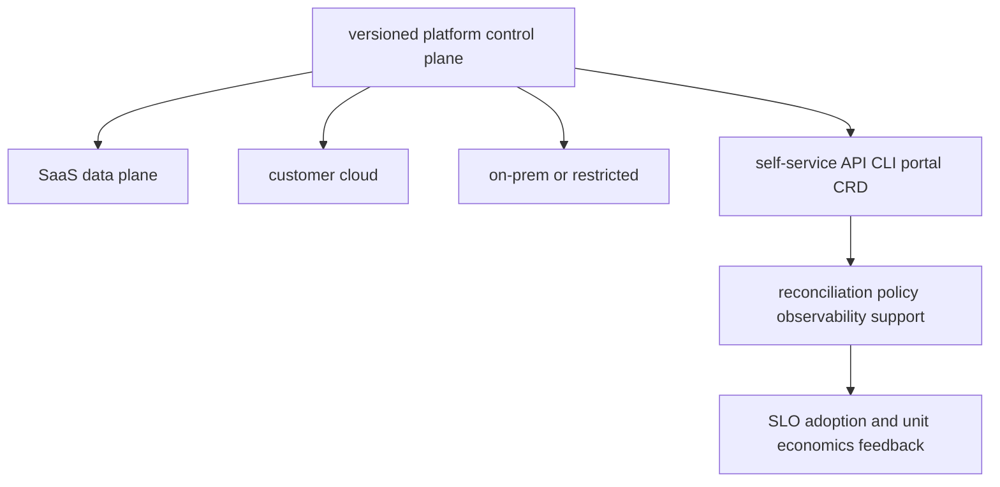

# Platform engineering, deployment models, FinOps and coding

<!-- child-topic-toc:start -->
## Table of contents and deeper notes

This parent note explains how the child topics work together. Follow each child link for the deeper mechanism, real commands/configuration, hands-on practice, authoritative documentation, and its local interview bank.

- [AI FinOps and cost control](ai-finops-and-cost-control/README.md) — [questions and answers](ai-finops-and-cost-control/questions-and-answers.md)
- [Air-gapped and restricted environments](air-gapped-and-restricted-environments/README.md) — [questions and answers](air-gapped-and-restricted-environments/questions-and-answers.md)
- [Configuration and feature management](configuration-and-feature-management/README.md) — [questions and answers](configuration-and-feature-management/questions-and-answers.md)
- [Customer private-cloud deployment](customer-private-cloud-deployment/README.md) — [questions and answers](customer-private-cloud-deployment/questions-and-answers.md)
- [Database, cache and messaging support for AI platforms](database-cache-and-messaging-support-for-ai-platforms/README.md) — [questions and answers](database-cache-and-messaging-support-for-ai-platforms/questions-and-answers.md)
- [Go fundamentals](go-fundamentals/README.md) — [questions and answers](go-fundamentals/questions-and-answers.md)
- [Hybrid-cloud deployment](hybrid-cloud-deployment/README.md) — [questions and answers](hybrid-cloud-deployment/questions-and-answers.md)
- [Internal developer platform for AI](internal-developer-platform-for-ai/README.md) — [questions and answers](internal-developer-platform-for-ai/questions-and-answers.md)
- [Multi-cloud architecture](multi-cloud-architecture/README.md) — [questions and answers](multi-cloud-architecture/questions-and-answers.md)
- [On-premises deployment](on-premises-deployment/README.md) — [questions and answers](on-premises-deployment/questions-and-answers.md)
- [Python for platform engineering](python-for-platform-engineering/README.md) — [questions and answers](python-for-platform-engineering/questions-and-answers.md)
- [SaaS deployment](saas-deployment/README.md) — [questions and answers](saas-deployment/questions-and-answers.md)
- [Shell scripting](shell-scripting/README.md) — [questions and answers](shell-scripting/questions-and-answers.md)
- [SQL and data querying](sql-and-data-querying/README.md) — [questions and answers](sql-and-data-querying/questions-and-answers.md)
<!-- child-topic-toc:end -->
<!-- generated-topic-index:start -->
## Deep topic branches

- [AI FinOps and cost control](ai-finops-and-cost-control/README.md) — [Q&A](ai-finops-and-cost-control/questions-and-answers.md)
- [Multi-cloud architecture](multi-cloud-architecture/README.md) — [Q&A](multi-cloud-architecture/questions-and-answers.md)
- [SaaS deployment](saas-deployment/README.md) — [Q&A](saas-deployment/questions-and-answers.md)
- [Customer private-cloud deployment](customer-private-cloud-deployment/README.md) — [Q&A](customer-private-cloud-deployment/questions-and-answers.md)
- [On-premises deployment](on-premises-deployment/README.md) — [Q&A](on-premises-deployment/questions-and-answers.md)
- [Hybrid-cloud deployment](hybrid-cloud-deployment/README.md) — [Q&A](hybrid-cloud-deployment/questions-and-answers.md)
- [Air-gapped and restricted environments](air-gapped-and-restricted-environments/README.md) — [Q&A](air-gapped-and-restricted-environments/questions-and-answers.md)
- [Internal developer platform for AI](internal-developer-platform-for-ai/README.md) — [Q&A](internal-developer-platform-for-ai/questions-and-answers.md)
- [Configuration and feature management](configuration-and-feature-management/README.md) — [Q&A](configuration-and-feature-management/questions-and-answers.md)
- [Database, cache and messaging support for AI platforms](database-cache-and-messaging-support-for-ai-platforms/README.md) — [Q&A](database-cache-and-messaging-support-for-ai-platforms/questions-and-answers.md)
- [Python for platform engineering](python-for-platform-engineering/README.md) — [Q&A](python-for-platform-engineering/questions-and-answers.md)
- [Go fundamentals](go-fundamentals/README.md) — [Q&A](go-fundamentals/questions-and-answers.md)
- [Shell scripting](shell-scripting/README.md) — [Q&A](shell-scripting/questions-and-answers.md)
- [SQL and data querying](sql-and-data-querying/README.md) — [Q&A](sql-and-data-querying/questions-and-answers.md)
<!-- generated-topic-index:end -->

## Integrated platform-product mental model

The platform is a product whose users need safe golden paths for deploying, evaluating, observing and operating AI workloads. A control plane may manage SaaS, customer-cloud, on-premises, hybrid and air-gapped data planes only when identity, connectivity, tenancy, upgrades, compatibility, support, audit, recovery and exit contracts are explicit. Optimize cost per successful quality-controlled task, not merely GPU-hour or token price.

## Practical starting exercise

Define one golden path as a typed interface plus reconciler: inputs, defaults, policy, status, ownership, SLO and cost tags. Implement a tiny Python/Go or IaC prototype, validate bad input, make retries idempotent, emit a status and audit record, and test rollback. Then write a deployment contract comparing SaaS, customer-cloud and offline installation: prerequisites, artifacts/digests, secrets, upgrade/rollback, telemetry, backup/restore, compatibility and support boundaries.

Authoritative starting points: [FinOps Framework](https://www.finops.org/framework/), [OpenFeature](https://openfeature.dev/docs/reference/intro/), and [Kubernetes multi-tenancy](https://kubernetes.io/docs/concepts/security/multi-tenancy/).
