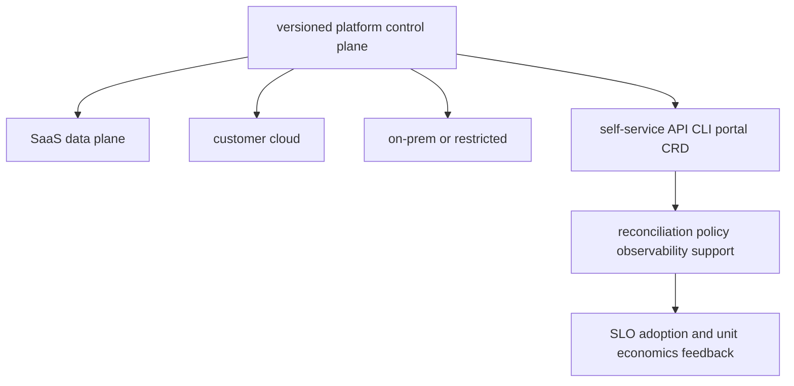

# Platform engineering, deployment models, FinOps and coding

<!-- chapter-guide:start -->
> **Step 340 of 373 — 12**
>
> **Builds on:** [European AI and privacy regulation](../11-ai-platform/12-european-ai-and-privacy-regulation/README.md)
>
> **Now:** Learn **Platform engineering, deployment models, FinOps and coding** from its mental model through production ownership.
>
> **Then:** Rehearse the linked questions and continue to [AI FinOps and cost control](01-ai-finops-and-cost-control/README.md).
<!-- chapter-guide:end -->

## Integrated platform-product mental model

The platform is a product whose users need safe golden paths for deploying, evaluating, observing and operating AI workloads. A control plane may manage SaaS, customer-cloud, on-premises, hybrid and air-gapped data planes only when identity, connectivity, tenancy, upgrades, compatibility, support, audit, recovery and exit contracts are explicit. Optimize cost per successful quality-controlled task, not merely GPU-hour or token price.

## Practical starting exercise

Define one golden path as a typed interface plus reconciler: inputs, defaults, policy, status, ownership, SLO and cost tags. Implement a tiny Python/Go or IaC prototype, validate bad input, make retries idempotent, emit a status and audit record, and test rollback. Then write a deployment contract comparing SaaS, customer-cloud and offline installation: prerequisites, artifacts/digests, secrets, upgrade/rollback, telemetry, backup/restore, compatibility and support boundaries.

Reliability is a platform-product property: prove reconciliation, rollback, restore and support behavior across each promised deployment model, not only in the platform team's preferred environment.

Authoritative starting points: [FinOps Framework](https://www.finops.org/framework/), [OpenFeature](https://openfeature.dev/docs/reference/intro/), and [Kubernetes multi-tenancy](https://kubernetes.io/docs/concepts/security/multi-tenancy/).

<!-- reading-navigation:start -->
---

**Reading path:** [← Back: European AI and privacy regulation](../11-ai-platform/12-european-ai-and-privacy-regulation/README.md) · [Questions](questions-and-answers.md) · [Next: AI FinOps and cost control →](01-ai-finops-and-cost-control/README.md)

<!-- reading-navigation:end -->
