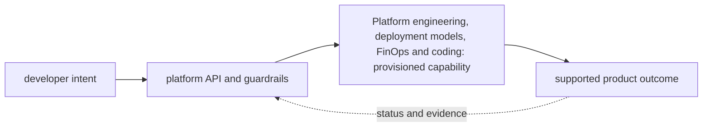
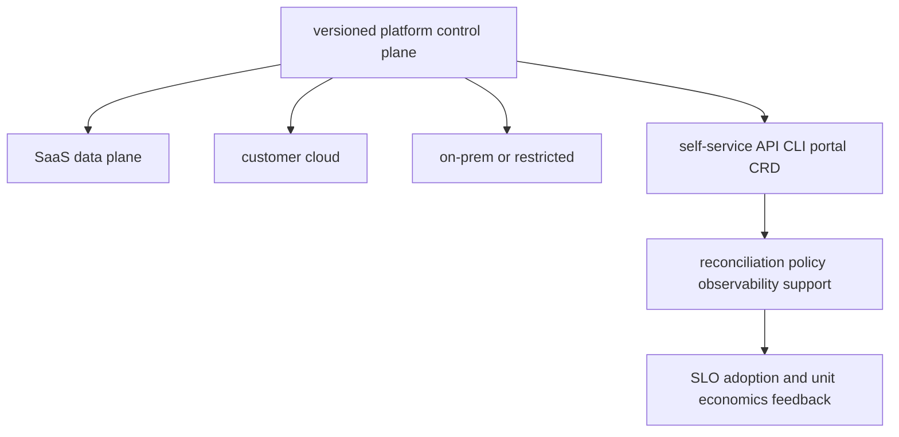

# Platform engineering, deployment models, FinOps and coding

<!-- chapter-guide:start -->
> **Step 340 of 373 — 12**
>
> **Builds on:** [European AI and privacy regulation](../11-ai-platform/12-european-ai-and-privacy-regulation/README.md)
>
> **Now:** Learn **Platform engineering, deployment models, FinOps and coding** from its mental model through production ownership.
>
> **Then:** Rehearse the linked questions and continue to [AI FinOps and cost control](01-ai-finops-and-cost-control/README.md).
<!-- chapter-guide:end -->

<!-- explanation-practice-normalizer:v1 -->


## Explanation

### What this chapter is and why it exists

**Platform engineering, deployment models, FinOps and coding** is easiest to understand as one part of a larger path. The subject is a product and control plane for engineering teams. Users request a capability through a supported interface, automation provisions it with guardrails, and the platform reports ownership, health, cost and lifecycle state.

The chapter focuses on Platform engineering, deployment models, FinOps and coding. These are connected mechanisms, not vocabulary to memorize. The platform-engineering branch explains how an internal product converts developer intent into governed self-service capabilities with lifecycle ownership and feedback The explanations below first build the simple model, then add the exact system behavior and production consequences.

### History and evolution

Platform engineering grew from the DevOps goal of shared ownership and the need to reduce repeated infrastructure work across many teams. Internal platforms package secure defaults and operational knowledge into self-service products, while keeping application teams responsible for the behavior of what they deploy.

In this chapter, **Platform engineering, deployment models, FinOps and coding** is the next layer of that evolution. Its modern purpose is to the platform-engineering branch explains how an internal product converts developer intent into governed self-service capabilities with lifecycle ownership and feedback. The exact product surface may change by version, but the underlying state, request path and failure boundaries remain the durable ideas to learn.

### How the complete branch works



A branch overview connects child mechanisms into one lifecycle. The input crosses identity and policy, a control or decision plane, the runtime data path and its dependencies before producing a user-visible result. Status and telemetry travel back through the loop so operators and controllers can correct drift or failure. Reading the child chapters adds precision, but this overview explains why those chapters depend on one another.

A useful test of understanding is to trace one concrete request or change from origin to outcome and name the authoritative state at each boundary. That trace reveals where work is synchronous or asynchronous, which failure domains are independent, what a timeout can prove, and which evidence distinguishes accepted intent from healthy behavior.

### Integrated platform-product mental model

The platform is a product whose users need safe golden paths for deploying, evaluating, observing and operating AI workloads. A control plane may manage SaaS, customer-cloud, on-premises, hybrid and air-gapped data planes only when identity, connectivity, tenancy, upgrades, compatibility, support, audit, recovery and exit contracts are explicit. Optimize cost per successful quality-controlled task, not merely GPU-hour or token price.



## Practice

### Practical starting exercise

Define one golden path as a typed interface plus reconciler: inputs, defaults, policy, status, ownership, SLO and cost tags. Implement a tiny Python/Go or IaC prototype, validate bad input, make retries idempotent, emit a status and audit record, and test rollback. Then write a deployment contract comparing SaaS, customer-cloud and offline installation: prerequisites, artifacts/digests, secrets, upgrade/rollback, telemetry, backup/restore, compatibility and support boundaries.

Reliability is a platform-product property: prove reconciliation, rollback, restore and support behavior across each promised deployment model, not only in the platform team's preferred environment.

Authoritative starting points: [FinOps Framework](https://www.finops.org/framework/), [OpenFeature](https://openfeature.dev/docs/reference/intro/), and [Kubernetes multi-tenancy](https://kubernetes.io/docs/concepts/security/multi-tenancy/).

### Practice objective

Build a small, safe proof of **Platform engineering, deployment models, FinOps and coding** and explain the result in your own words. The goal is not command completion; it is to connect input, internal mechanism, observable state and user outcome.

### Prerequisites and setup

Use a disposable local environment, sandbox account/project or isolated namespace. Confirm the effective identity and target, record the start time, and set a cost limit before creating anything.

Record tool and platform versions because flags, APIs and defaults can change. Define every uppercase placeholder before use and keep secrets out of shell history and committed files.

### Activity 1: establish a healthy baseline

Run the read-oriented example first:

```bash
git diff --check
python -m pytest -q
go test ./...
```

For each line, write down the layer it inspects, the expected healthy field or response, and one thing it cannot prove. The expected result is an attributable request against the intended target plus enough state to draw the path from input to outcome.

### Activity 2: create or review the smallest working example

Put the smallest relevant command, configuration, manifest or code sample in source control. Validate or lint it, produce a preview/diff where the tool supports one, and apply only inside the disposable boundary. Record the exact revision and resulting resource or process ID. If the topic is observational rather than configurable, save a sanitized baseline and an automated assertion instead of mutating the system.

### Activity 3: controlled failure and troubleshooting

Introduce one bounded failure: use a definitely nonexistent resource name, an invalid sandbox-only value, a denied test identity, a closed test port or a stopped disposable dependency. Capture the exact error and classify it as identity/policy, input/configuration, control-plane reconciliation, network/protocol, dependency or capacity. Test one discriminating hypothesis at a time; do not widen access or restart unrelated components.

Expected failure evidence is a specific non-zero exit, status/reason, event or protocol response that disappears when the controlled fault is removed. If healthy and failing runs look identical, the chosen signal does not explain the phenomenon and the exercise is not complete.

### Verification

Repeat the original client or user-facing check, not only an administrative status command. Confirm the desired revision, data correctness where applicable, error and latency recovery, and absence of a continuing retry/backlog/saturation condition. Explain why this evidence proves recovery and what uncertainty remains.

### Cleanup and rollback

Revert the configuration in its source of truth and review the rollback diff before applying it. Delete only the named sandbox resources, stop disposable processes, remove temporary credentials and verify that no billable resource, volume, artifact, queue item or background job remains. Read-only activities require no infrastructure rollback, but sanitized captures must still follow retention policy.

### Harder extension

Automate the healthy and failing paths in CI, use short-lived identity, add one SLI/alert or policy assertion, and write a five-step runbook another engineer can execute without hidden context. Then explain how the design changes for two tenants, a zonal or dependency failure, 10× load and a strict cost or recovery target.

<!-- reading-navigation:start -->
---

**Reading path:** [← Back: European AI and privacy regulation](../11-ai-platform/12-european-ai-and-privacy-regulation/README.md) · [Questions](questions-and-answers.md) · [Next: AI FinOps and cost control →](01-ai-finops-and-cost-control/README.md)

<!-- reading-navigation:end -->
