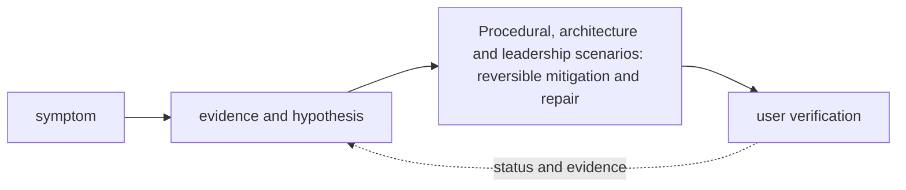

# Procedural, architecture and leadership scenarios

<!-- chapter-guide:start -->
> **Step 367 of 373 — 13**
>
> **Builds on:** [SQL and data querying](../12-platform-engineering/14-sql-and-data-querying/README.md)
>
> **Now:** Learn **Procedural, architecture and leadership scenarios** from its mental model through production ownership.
>
> **Then:** Rehearse the linked questions and continue to [Architecture exercises](01-architecture-exercises/README.md).
<!-- chapter-guide:end -->

<!-- explanation-practice-normalizer:v1 -->


## Explanation

### What this chapter is and why it exists

**Procedural, architecture and leadership scenarios** is easiest to understand as one part of a larger path. The subject is an evidence-driven decision path. Start with a user-visible symptom, separate the system into layers, test the cheapest discriminating hypothesis and keep mitigation distinct from the durable repair.

The chapter focuses on Procedural, architecture and leadership scenarios. These are connected mechanisms, not vocabulary to memorize. The scenarios branch combines mechanisms from the handbook into realistic diagnosis, migration and design cases where evidence is incomplete and trade-offs matter The explanations below first build the simple model, then add the exact system behavior and production consequences.

### History and evolution

Case-based technical learning mirrors incident drills, game days and design reviews used by production teams. A scenario is valuable because it forces several mechanisms to interact under incomplete evidence, which is closer to real operations than recalling an isolated definition.

In this chapter, **Procedural, architecture and leadership scenarios** is the next layer of that evolution. Its modern purpose is to the scenarios branch combines mechanisms from the handbook into realistic diagnosis, migration and design cases where evidence is incomplete and trade-offs matter. The exact product surface may change by version, but the underlying state, request path and failure boundaries remain the durable ideas to learn.

### How the complete branch works



A branch overview connects child mechanisms into one lifecycle. The input crosses identity and policy, a control or decision plane, the runtime data path and its dependencies before producing a user-visible result. Status and telemetry travel back through the loop so operators and controllers can correct drift or failure. Reading the child chapters adds precision, but this overview explains why those chapters depend on one another.

A useful test of understanding is to trace one concrete request or change from origin to outcome and name the authoritative state at each boundary. That trace reveals where work is synchronous or asynchronous, which failure domains are independent, what a timeout can prove, and which evidence distinguishes accepted intent from healthy behavior.

### Read further

- [Google SRE Workbook: Incident Response](https://sre.google/workbook/incident-response/) — primary operational guidance for incident command, roles, communication and structured response practice.

## Practice

### How to practise

Answer aloud before reading the model answer. Use **stabilize → scope → inspect → hypothesize → test → mitigate → verify → prevent**. Begin with impact, safety and decision rights; confirm identity/context and recent changes; preserve evidence; trace one request/resource path; separate reversible containment from durable source repair; verify the original user outcome, data/security boundary and billing; then assign prevention with an owner and proof.

For architecture exercises, clarify tenants, scale/work units, latency/quality/availability SLOs, data classification/residency, RPO/RTO, deployment modes, team and budget before drawing. Compare at least two viable options and include migration, rollback, observability, capacity, unit economics and exit criteria.

The [150-question cross-domain procedural bank](120-cross-domain-scenarios.md) combines Linux, networking, containers, Kubernetes, cloud, IaC, SRE/security, GPUs, model serving, gateways, RAG/evaluation/governance and platform ownership.

Scenario answers should make cost visible alongside safety and reliability: identify the expensive failure amplifier, quantify the mitigation when possible, and verify that temporary capacity or logging does not remain billable after recovery.

### Practice objective

Build a small, safe proof of **Procedural, architecture and leadership scenarios** and explain the result in your own words. The goal is not command completion; it is to connect input, internal mechanism, observable state and user outcome.

### Prerequisites and setup

Use a disposable local environment, sandbox account/project or isolated namespace. Confirm the effective identity and target, record the start time, and set a cost limit before creating anything.

Record tool and platform versions because flags, APIs and defaults can change. Define every uppercase placeholder before use and keep secrets out of shell history and committed files.

### Activity 1: establish a healthy baseline

Run the read-oriented example first:

```bash
date -u
whoami
git log --since='2 hours ago' --oneline
```

For each line, write down the layer it inspects, the expected healthy field or response, and one thing it cannot prove. The expected result is an attributable request against the intended target plus enough state to draw the path from input to outcome.

### Activity 2: create or review the smallest working example

Put the smallest relevant command, configuration, manifest or code sample in source control. Validate or lint it, produce a preview/diff where the tool supports one, and apply only inside the disposable boundary. Record the exact revision and resulting resource or process ID. If the topic is observational rather than configurable, save a sanitized baseline and an automated assertion instead of mutating the system.

### Activity 3: controlled failure and troubleshooting

Introduce one bounded failure: use a definitely nonexistent resource name, an invalid sandbox-only value, a denied test identity, a closed test port or a stopped disposable dependency. Capture the exact error and classify it as identity/policy, input/configuration, control-plane reconciliation, network/protocol, dependency or capacity. Test one discriminating hypothesis at a time; do not widen access or restart unrelated components.

Expected failure evidence is a specific non-zero exit, status/reason, event or protocol response that disappears when the controlled fault is removed. If healthy and failing runs look identical, the chosen signal does not explain the phenomenon and the exercise is not complete.

### Verification

Repeat the original client or user-facing check, not only an administrative status command. Confirm the desired revision, data correctness where applicable, error and latency recovery, and absence of a continuing retry/backlog/saturation condition. Explain why this evidence proves recovery and what uncertainty remains.

### Cleanup and rollback

Revert the configuration in its source of truth and review the rollback diff before applying it. Delete only the named sandbox resources, stop disposable processes, remove temporary credentials and verify that no billable resource, volume, artifact, queue item or background job remains. Read-only activities require no infrastructure rollback, but sanitized captures must still follow retention policy.

### Harder extension

Automate the healthy and failing paths in CI, use short-lived identity, add one SLI/alert or policy assertion, and write a five-step runbook another engineer can execute without hidden context. Then explain how the design changes for two tenants, a zonal or dependency failure, 10× load and a strict cost or recovery target.

<!-- reading-navigation:start -->
---

**Reading path:** [← Back: SQL and data querying](../12-platform-engineering/14-sql-and-data-querying/README.md) · [Questions](questions-and-answers.md) · [Next: Architecture exercises →](01-architecture-exercises/README.md)

<!-- reading-navigation:end -->
